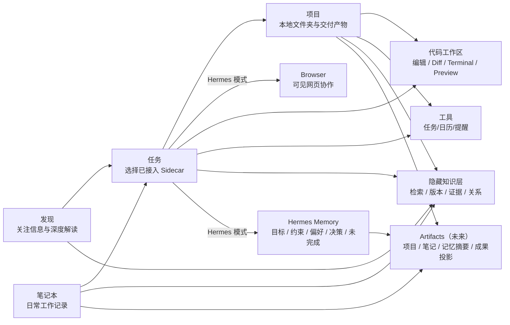
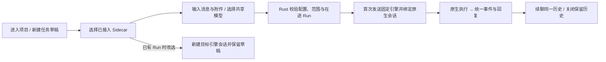
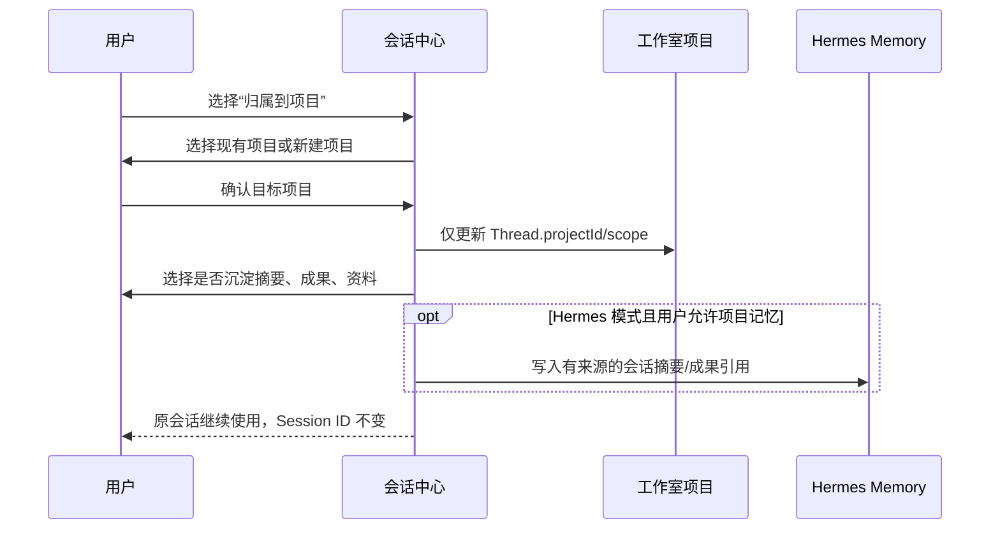
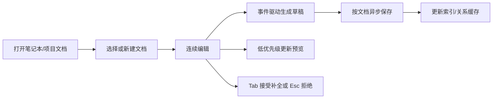
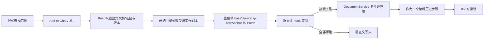

# SophoNote 产品需求文档（PRD）

> 文档状态：当前唯一产品真相源
>
> 基线日期：2026-09-15
>
> 适用项目：本仓库根目录
>
> 开源读者：本文是产品范围与验收的唯一真相源，不是营销页。正文为中文。社区入口成对维护：[README.md](../README.md)（English）与 [README.zh-CN.md](../README.zh-CN.md)（简体中文）。状态口径：`已实现` 仅表示代码存在；`自动验证` 表示测试通过；`已验收` 必须有真实 macOS/Tauri 宿主走查证据。

## 1. 背景与问题定义

SophoNote 是一款面向知识工作者的 macOS 本地优先 AI 工作环境，**Hermes、Pi、Claude Code、OpenCode 是按会话选择的智能体执行引擎，SophoNote 是承载信息、知识、文档与行动的产品外壳**。目标用户包括白领、学生、研究员、独立开发者和其他需要持续处理信息、积累资料、生产文档的人。产品已经具备多源信息采集、证据化 AI 解读、Markdown 笔记、任务、语义搜索、AI 工作室、Agent、Skill 和 MCP 等能力，当前已提供一级会话入口与三引擎切换；跨产品域 ContextHandoff、会话归属项目和通用作用域持久化仍需继续实现。

当前一级导航展示：**发现、项目、笔记本、计划任务、工具**（工作室隐藏）。收件箱保留在原来的**设置 → 收件箱**位置，不提升为一级导航；旧“知识库”页面停止展示，其现有信息条目处理、关键词/语义检索和索引能力合并到原收件箱。收件箱是严格保留 7 天的短期信息池。知识与记忆从此分层：**知识层隐藏在项目、笔记、资料和会话下面，当前提供检索，语义版本、证据与关系治理按后续阶段实现；记忆层属于 Hermes Agent，只保存被记住的目标、约束、偏好、决策与未完成状态。**未来可增加 `Artifacts` 展示项目、笔记、记忆摘要与成果的积累，但它只是来源对象的投影，不恢复旧知识库。其中：

- **发现**是可视化信息工作站，深度解读属于发现内部模块。
- **项目**是 Agent 工作主入口：左栏项目替代收藏夹，每个项目必须选择一个本地文件夹作为上下文空间与任务交付目录。项目下可创建多个任务，每次新建对话代表一项任务，任务内可多轮补充直到完成；可选择任一已接入 Sidecar 执行。目录内文件按需浏览、读取与显式加入任务，不复制成私有项目文档。
- **工作室**从导航隐藏，已有项目、文件绑定和任务历史保留并由项目页访问。
- **笔记本**负责低摩擦的日常工作记录。
- **收件箱**作为设置内的辅助页面，负责承接数据源同步的原始条目，以及原旧知识库已有的收藏、归档、关键词/语义检索和向量索引能力。每条数据从首次成功拉取时刻起按 UTC 计算 168 小时 TTL；重复抓取、手动刷新、阅读、收藏或归档均不得续期。
- **隐藏知识层**当前提供检索，后续围绕项目、笔记、资料和会话扩展 Git 版本、证据与关系，不拥有独立内容列表或正文真相源。
- **Agent 记忆**由 Hermes 按作用域维护，只展示或沉淀经确认的目标、约束、偏好、决策和未完成状态，不等同于资料、PDF chunk 或会话原文。
- **Artifacts（未来）**把已存在的项目、笔记、Agent 记忆摘要和成果按时间/项目聚合展示；不复制正文、不接管记忆、不重建“全部知识条目”页面。
- **工具**承载任务、日历、提醒、闹钟及未来受控 AGUI 工具；其中“任务”专指带状态/日期的待办，不能与 Agent 会话混称。工具域采用**注册式组件库**（DEC-041）：每个工具（今日视图、任务、番茄钟等）以独立组件注册，落地页为工具库画廊，点击进入该工具的独立整页，工具间不合并展示；番茄钟必须关联任务并持久化专注会话（DEC-034）；不引入与行动无关的通用小工具。规划中，带 `desktopWidget` 描述符的工具组件可「添加到桌面」，投影为桌面小组件与 Tahoe 控制中心/菜单栏控件（DEC-042，见 §7.12）。

新版需要解决的产品问题是：

1. 引擎选择、模型配置和回复必须在同一会话入口内完成，避免把三种引擎做成三套设置与聊天体验。
2. 发现、深度解读、知识库、笔记本、项目和任务各自形成页面孤岛，跨域工作依赖用户手工搬运上下文。
3. “一次 Agent 工作”和“待办任务”使用相近语言，若不明确区分会造成对象、状态和历史管理混乱。
4. 会话页、工作室和笔记本若分别实现独立聊天逻辑，会形成多套 Thread、Session、历史和权限状态。
5. 全局 Agent 若没有透明作用域、最小工具集和审批边界，会导致跨项目资料泄漏或误写文档/任务。

现有保存队列、事务式 AI 写回、懒加载和受控保活已经落地，仍须收口以下验证问题：

1. 在笔记本、AI 工作室、发现、原知识库/收件箱、文章、任务和设置之间切换时存在明显卡顿。
2. 长文输入、编辑/预览切换、分屏预览和文档切换存在可感知延迟。
3. 自动保存、预览刷新、关系扫描和全局状态更新可能争用主线程，削弱“专注书写”的核心体验。
4. AI 写回已使用编辑器事务、隐藏内部版本号和旧独立撤销入口；复杂 Markdown、跨模式及多 hunk 的完整宿主撤销回归仍待完成。
5. 旧文档曾把资讯覆盖率、笔记增强、Agent Runtime、宿主验收和发布工作同时标为最高优先级，导致当前产品目标与完成度口径分散。

长期产品方向因此收敛为：**可选择执行引擎的知识工作闭环 + 极致书写体验 + 可控、可审计的副作用 + 可追溯的知识演进**。完整闭环是“发现信息 → 快捷会话理解/处理 → 知识资产沉淀 → 工作室生产成果 → 工具推动行动 → 新证据触发复核”。资讯与资料是输入，Markdown 文档是知识正文真相源，所选引擎负责任务执行、模型调用与工具调度；SophoNote 继续拥有产品状态、权限、审批、文件、版本证据和审计。产品不演进为云协作文档或通用 Git 客户端，但需要让正式知识能够定位到确定内容版本、变更原因和产生它的会话/资料。

资讯侧保留最初且仍有效的结果定义：用户每天打开 SophoNote 后，应在 **5 分钟内知道最值得关注的 3～8 件事、它们为什么与自己有关、下一步应该做什么**。完整链路是“多源发现 → 正文与证据 → 聚类去重 → 相关性与行动价值判断 → 用户反馈 → 长期沉淀”，抓取数量和热度只能作为输入质量，不是产品结果。

关于版本功能的结论：不做飞书式逐次自动保存历史，也不把 `articles.version` 或 `document_revisions` 包装为用户版本。`articles.version` 仍是并发覆盖闸门，`document_revisions` 仍是 AI 修改的短期安全 checkpoint；另建 Git Version & Provenance Layer，只在用户保存版本、AI Patch 获批、成果发布、任务里程碑或合并后的空闲快照等有知识意义的时机形成语义版本。该版本层服务于项目/笔记版本比较、受控恢复、Claim/Decision 证据和长期记忆失效判断，不得进入每次按键或每次自动保存热路径。

### 1.1 当前交付基线与阅读规则

截至 2026-09-15，已公开的 macOS 版本为 **v0.1.0-preview.8 社区预览**。文档中的目标与当前状态分开：下表用于快速定位，具体证据保留在项目台账；优先级 P0/P1/P2 不代表已实现。后文标注“规划/冻结”的流程是验收目标，不是现有功能说明。

| 能力 | 当前事实 | 仍未完成 |
|---|---|---|
| 会话与三引擎 | Hermes/Pi/Claude Code 共用界面、模型配置和回复；首次 Run 固定，切换新建；Pi/Claude 两轮真实 DeepSeek 已验收 | 通用 ContextHandoff、跨项目归属与持久 ScopeSnapshot |
| 项目与任务列表 | 项目入口、目录绑定创建、任务搜索/置顶/归属、历史恢复及文件阅读已编码（2026-09-18） | 真实 Tauri 创建/切换/阅读与跨入口生命周期验收，见 NEXT-032 |
| 笔记与项目文件 | 笔记用 Markdown 工作台；工作室入口隐藏，项目页按需浏览/阅读本地文件 | 完整 CodeChangeSession/逐 hunk 代码审查与 PreviewSupervisor |
| 文档改写 | 三引擎当前文档/选区工作副本接入待审阅 Diff 与 DocumentService | 跨笔记独立 Thread/Memory scope、更多真实改写/撤销场景 |
| Browser / 电脑 | Hermes 可见 Browser 基础已实现；电脑组件身份和控制入口已验收 | Browser 自动化/接管整场、电脑系统授权后的完整闭环；Pi/Claude 未接入 |
| 发现 / 计划任务 | 五断面、日报归档、主题、OpenRouter 模型榜、Hermes Cron 及显式范例已实现 | 模型榜部分视觉回归、个性化决策卡与反馈排序 |
| 工具 | 今日/任务/番茄钟注册式工具库已编码 | 部分宿主验收；日历、提醒、WidgetKit/控制中心仍属规划 |
| 模型 / 更新 | 一套 AI 配置；Agent 配置更新页三卡，按引擎独立策略 | 全引擎用量聚合；Claude 实际升级和 Hermes 按钮/重启启用复验 |
| OpenViking | 已切换新云端库；四引擎配置、公共/专属记忆访问与召回、会话提交、异步提取和页面编辑已实测 | 真实模型对话端到端验收需重新授权 DeepSeek 钥匙串凭据 |
| 隐藏知识与轻量预算 | 当前笔记/条目搜索和向量索引；版本功能只有关闭态 schema 与只读基线 | Managed Git、Claim/Decision、ResourceBudgetManager 与 1 GiB 预算执行器 |
| 性能与发布 | 已有真实宿主性能基线；macOS 已打包、安装和发布 | 性能目标未全部达标；Apple 公证/独立干净 VM；Windows hash mismatch 阻止 NSIS 产出 |

### 1.2 轻量客户端与 Rust 的职责

客户端采用 **Tauri 2 + 系统 WebView + React/TypeScript**；macOS 使用 WKWebView，应用前端不捆绑 Chromium 或 Node 服务。Rust 是本机宿主，负责数据、文件、凭据、引擎进程、权限、审批和可恢复事件；三种 Agent 引擎负责各自模型回合与工具调度。用户只维护一套配置、会话界面和文档审阅流程。

轻量措施已有：页面懒加载/空闲预取；仅笔记本和工作室最多两个重型页面受控保活；历史消息窗口化；编辑器按变更保存；Pi/Claude 按 Run 启动并回收。Hermes Gateway 有常驻生命周期，后台抓取/Cron 状态检测仍有必要轮询，不能宣称整个应用“零轮询”或三引擎全部按需启动。

“轻量”是避免重复客户端和无界加载的设计约束，**不等于整 App 已低于 1 GiB**。知识/记忆 1 GiB 是尚待实现的子系统预算；整机占用须另计 Rust、WebView、Hermes/CPython、Pi/Claude、Browser/电脑驱动与可选本地模型。整 App 的 RSS、空闲 CPU、启动时间和并行运行峰值仍需按真实宿主测量，不能用安装包大小替代。

## 2. 用户与使用场景

### 2.1 目标用户

- **白领与文档工作者**：处理会议、方案、汇报、资料和待办，希望用 Agent 快速完成一次工作，并把成果归入长期项目。
- **学生**：关注课程与研究主题，收集本地/外部资料，完成阅读、笔记、作业和复习任务。
- **研究员与分析人员**：持续跟踪领域信息、验证证据、管理资料、形成可引用的研究文档。
- **独立开发者、技术负责人、AI/产品研究者**：每天处理技术资讯，并持续形成自己的判断、项目和文档。
- **本地优先用户**：需要本地保存敏感材料，但愿意在明确范围内按需调用外部模型；偏好 Markdown、快捷键和低干扰界面。

### 2.2 核心场景

1. **快捷任务**：从“项目”点击新建任务，先创建本地草稿，首次发送时再创建 Thread 并绑定所选引擎的原生会话；添加文字、图片、文件、文件夹或 URL，观察真实执行过程并获得结果。
2. **任务归属项目**：临时调研变成持续工作后，把原任务归属到某个本地项目；不复制历史、不重建所选引擎 Session，并由用户决定是否把摘要或成果写入项目记忆/文档。
3. **按场景调用 Agent**：项目页承载完整任务；笔记本提供嵌入式 Agent 面板；发现、收件箱和工具通过“在会话中处理”把选中对象显式交接到会话页。每轮明确显示页面、选区、资料范围和可用工具；隐藏知识层只按这些显式作用域提供检索/证据，不产生独立交接入口。
4. **信息判断**：在发现的信息流中查看关注主题、多源证据、速览与深度解读；材料不足时系统明确拒绝脑补。
5. **知识沉淀**：把本地文件、外部资料、发现内容、笔记和正式成果组织成可搜索、可引用的知识资产。
6. **项目研究与成果生产**：在项目中组织多个任务与本地文件（知识引用和待办聚合为规划），使用所选引擎形成可审计结果；Hermes 会话还可使用原生 Skill 与已授权 MCP。
7. **边聊边浏览（Hermes）**：在会话、工作室和笔记本的 AI 区域切换到可见 Browser，让 Agent 检查网页、DOM、控制台或截图；用户可随时接管，并把带来源结果保存为笔记或项目材料。
8. **边聊边改代码**：在会话中临时绑定本地文件夹/仓库，或在工作室项目中持久关联授权仓库；完成“读代码 → 提议修改 → 审查 Diff → 运行命令 → 打开 Preview → Agent 验证”的闭环。
9. **快速记录**：打开笔记本即进入今天或最近文档，连续输入、切换文档、预览和保存，不被卡顿打断。
10. **AI 续写与局部修改**：输入半句后用 ghost text 续写；在文档中选区交给 Agent 调研或改写，在原文逐区域接受/拒绝，冲突时停止而非覆盖。
11. **行动管理**：把会话结果转成工具域中的待办、日历或提醒；待办与 Agent 会话保持独立对象和状态。
12. **迁移与备份**：导出标准 Markdown 与资产，可在 Obsidian 等工具中继续使用。

## 3. 产品目标与成功标准

### 3.1 当前阶段目标

| 目标 | 成功标准 | 当前状态 |
|---|---|---|
| Agent 快速开工 | 会话无需先选项目；在 Hermes、Pi、Claude Code 中选择引擎，共用已配置模型与回复页面 | 三引擎已实现；Pi/Claude 使用现有 DeepSeek 各两轮真实宿主验收通过，见 NEXT-075 |
| 会话跨入口一致 | 一级会话页、工作室/笔记本嵌入面板共用会话组件与 Thread/Run/Session；交接不复制历史 | 共享 ProjectChatPanel、agentStore 和事件适配已实现；完整跨域交接按对应需求单独验收 |
| 作用域透明与隔离 | 当前文档/选区、附件、目录和权限在发送前复核；跨页面不扩大已发送 Run 范围 | Run 内有界上下文与 Pi/Claude Scope 已实现；跨域 AgentScopeProvider 与持久 ScopeSnapshot 待 NEXT-031/035 |
| 书写流畅 | 50 KB 长文 keydown-to-paint p95 ≤32ms，目标 ≤16ms；无 >50ms 同步 Long Task | 2026-08-27 基线 P95=36ms、Long Task=0，尚未达 32ms；后续完整输入复测待补，见 NEXT-001/004 |
| 切换即时反馈 | 暖页签点击 50ms 内出现反馈，150ms 内可交互；重型页首次 300ms 内可交互 | 已有宿主数据：改前页签 P95=519ms；最新混合 P95=304ms、A/B P95=280ms，仍未达标，见 NEXT-004 |
| 空闲零轮询 | 无正文变化时 60 秒内编辑器 `getMarkdown()` 调用为 0 | 轮询已拆除；性能探针宿主复验待完成（P0） |
| 数据可靠 | 自动保存失败不假成功；连续快速切换 20 次文档不丢草稿；同文档写入不乱序 | 保存失败和每文档队列自动测试通过；快速切换宿主待验收（P0） |
| 撤销一致 | 人工输入和一次 AI operation 都可按一次 `⌘Z` 撤销；不向用户展示内部版本号 | 模式保活、AI 单事务和 UI 收口已编码；宿主快捷键待验收（P0） |
| AI 修改安全 | 只改显式范围；审批前复检版本与锚点；冲突、超时、取消可见；无文档写入旁路 | 代码与自动验证完成；宿主验收待完成（P1） |
| AI 结果可信 | `quality_level < 2` 不生成解读；关键判断关联证据 `[Ex]`；未披露就明确说明 | 已实现，持续回归 |
| 知识可追溯 | 正式 Claim/Decision 可定位到可读 commit/path/anchor；变更依据可打开；证据改变可生成待复核影响 | P1C/P2 目标；当前方案完成、待实现 |
| 可见 Browser | Hermes 模式下共用可见 Browser，网页、动作与控制权如实展示 | 原生 WebView/导航/文件打开已实现；自动化、接管、引用和审批整场待 NEXT-057 |
| 代码工作闭环 | 会话可临时绑定目录，工作室项目可持久绑定仓库；文件树、代码编辑、Diff、Terminal 与 Browser 围绕同一 Thread/Run 协作 | P1 基础已实现；Agent Diff/验证待完成；coding 域仍按 DEC-046 冻结 |
| Hermes Desktop 基础会话完整 | 官方桌面端的基础聊天能力在 SophoNote 会话面可用：`/` 命令与 `@` 引用、审批/澄清、附件拖放、模型选择、过程轨、取消；另补上下文占用、Composer 历史、会话内查找、`/undo`、本轮审批开关。不复制 Bot Mode / HUD / 语音 / Memory Graph / worktree / 消息通道 | 代码已接 Gateway；会话面拖放改为 Tauri 原生路径；宿主对照见 NEXT-069 |
| 可开源对外 | MIT 许可证；无密钥和个人运行数据入库；Hermes/Pi/CPython 声明完整；贡献者可从源码构建；独立 GitHub remote | LICENSE/NOTICE/CONTRIBUTING/SECURITY、独立 GitHub remote 与 `scripts/oss-hygiene.sh` 已有；发布包和宿主门禁仍见 NEXT-068/070 |
| 发布可用 | 社区预览与正式 RC 分开；三引擎按能力分别验收，发布不夸大平台范围 | preview.8 macOS 已发布；Apple 公证/干净 VM 和 Windows NSIS 未完成，见 NEXT-009/072/075 |

### 3.2 指标解释

- 性能指标必须用固定的 5 KB、50 KB 文档和 200 篇文档库夹具做改前/改后对比，不以“感觉变快”代替。
- “自动测试通过”不等于真实 WebView 交互达标；页面挂载、焦点、滚动、快捷键和长文输入必须在 Tauri 宿主验证。
- 资讯价值不再以未读数量或抓取数量为核心成功指标，而以证据覆盖、推荐解释性和用户完成判断所需时间衡量。

## 4. 核心价值与产品原则

1. **统一产品、多种执行引擎**：Hermes、Pi、Claude Code 共用会话界面、模型配置、运行审计和文档审批。协议差异由 Rust 适配；能力按引擎如实展示，不为每个页面或引擎另造一套聊天逻辑。
2. **能力全局、入口分层、会话统一**：会话页是完整主入口，工作室/笔记本使用同一会话内核的嵌入视图，发现/收件箱/工具使用上下文交接；不同入口不复制 Thread、历史和状态。
3. **作用域透明**：用户始终能知道 Agent 当前看到了什么、使用了什么工具、准备修改什么；导航变化不得静默改变已发送 Run 的上下文。
4. **书写优先**：输入、点击和切换的响应优先级高于保存、预览、关系分析、索引和后台抓取；Agent 流式事件不得拖慢重型文档页。
5. **本地真相源**：笔记正文以 `.md` 文件为真相源，SQLite 保存元数据、索引、关系和 Run 审计；用户可导出、可迁移。
6. **AI 可控**：AI 建议不自动覆盖原文；文档修改必须有明确范围、diff、用户决策和冲突检查；任务/日历等副作用也必须按风险分级。
7. **证据优先**：AI 只能基于实际取得的原始材料回答；证据不足时拒绝推测。
8. **概念克制**：面向用户只保留必要心智。“会话”是一次 Agent 工作；“任务”只指待办。`⌘Z` 是撤销，内部 version 是并发闸门，checkpoint 是事故恢复。
9. **默认最小权限、按引擎暴露能力**：Hermes 的原生 Skill/Tool/MCP 目录、连接和授权以 Hermes Runtime 为真相源；SophoNote 不维护第二套外部 MCP 管理器，只透传用户操作并渲染 Hermes 状态。每轮只暴露当前作用域所需工具。
10. **失败可见且可恢复**：不吞保存失败、运行失败、工具失败或降级状态；失败不得破坏最后一次成功数据。

## 5. 需求范围

### 5.1 In Scope

- macOS 本地优先的单用户桌面应用；完整体验与宿主验收以 macOS 为准。当前一级导航为发现、会话、工作室、笔记本、计划任务、工具；收件箱保留在设置内，知识层不设入口，Agent 记忆按作用域展示；`Artifacts` 作为后续积累界面规划。
- 桌面打包矩阵（DEC-049）：macOS 主发布目标为 Apple Silicon（`aarch64-apple-darwin`，DMG）；Windows 目标为 x64 NSIS 安装包（preview.8 尚未产出）（`x86_64-pc-windows-msvc`）。打包不等于功能对等：WidgetKit / Tahoe 控制中心、Overlay 标题栏、Spotlight 隔离、Keychain ACL 与 Apple 公证仍是 macOS 专属。Intel Mac 仅在 x86_64 宿主上作为第二架构构建，不从 Apple Silicon 交叉编译。
- 会话中心：新建/搜索/历史/置顶/关闭/归档、运行状态、附件、模型、真实执行过程、结果、工具卡和审批。
- 场景化 Agent 入口：工作室/笔记本提供可折叠嵌入面板；发现/收件箱/工具提供对象级“在会话中处理”；会话页提供完整工作区；后台状态回到会话列表和对应消息展示，不在 AppShell 叠加全局执行徽标。
- 会话后续归属项目；一个项目关联多个会话，一个会话同时最多归属一个项目；归属操作不复制 Thread/Session。
- Markdown 笔记/文章的创建、编辑、预览、分屏、自动保存、搜索、双链、标题/块引用、任务、模板、资产、导出与存储治理。
- 编辑器原生 undo/redo；AI 修改合并为一个编辑历史步骤。
- 有界的 AI operation checkpoint、内部 version、操作审计和冲突保护。
- 独立 Inline Completion：低延迟、可取消、ghost text、聚合指标。
- 工作室（现 AI 工作室）的项目、本地文件树、项目会话、Git 变更、终端、Browser 与 AI 协作；本地 `.md` 与代码文件使用同一 WorkspaceBinding 读写边界。
- 会话、工作室和笔记本右侧 AI 区域的可见 Browser：地址/导航、网页状态、Agent 操作轨迹、截图/DOM/控制台能力、用户接管、来源引用与保存到笔记。
- 会话临时目录绑定与工作室项目持久 `WorkspaceBinding`；代码/Markdown 文件树、搜索、编辑、Git Diff 审查、受控 Terminal、Browser 与 Agent 验证。权限模式只能从会话窗口调整，文件工具只消费当前模式。
- 旧知识库条目视图停止提供独立入口；其已有检索和索引能力全部并入收件箱，后台知识能力服务项目/笔记/资料/会话。
- SophoNote 管理的笔记版本仓库；工作室项目可关联一个或多个用户授权的本地 Git 仓库。正式依据采用 `repository + commit + path + heading/symbol/block + content hash`，未提交 Working Tree 必须明确标记为临时上下文。
- Rust 原生 Agent Host 统一管理 Hermes、Pi、Claude Code 的运行、模型凭据、权限、审批和事件。Hermes 与 Pi 钉扎随包，Claude Code 使用已安装的官方 CLI；各自保留原生历史。运行失败明确反馈，不跨引擎或回退 Rig；DocumentService 与产品控制面继续属于 SophoNote。

- 多源发现、关注信息流、正文/证据获取、证据化速览与深度解读、日报候选、语义搜索；深度解读作为发现内部模块。
- 收件箱作为外部同步条目的统一处理与检索视图；隐藏知识层负责跨对象检索、版本、证据和关系，Hermes Memory 负责 Agent 记忆，两者不得合并成第二套正文库。
- 本地轻量知识执行面：默认使用 SQLite FTS5/sqlite-vec、分页文件与有界缓存；只为当前内容、用户固定资料和近期活跃项目保持热/温索引，原始资料、旧版本和会话全文按需从 SSD/Hermes 读取。
- 工具一级域采用注册式组件库（DEC-041）：落地页为工具库画廊，今日视图、任务、番茄钟各自注册为独立整页工具；日历、提醒、闹钟与通用 AGUI 组件仍分阶段注册进入。
- 桌面化投影（DEC-042，规划未实现）：工具组件可添加到桌面，生成 WidgetKit 桌面小组件与 macOS Tahoe 控制中心/菜单栏控件，与应用内同一状态源；规则见 §7.12。
- 本地设置、macOS Keychain（含旧明文一次性迁移）、日志与自动测试。
- 统一 SophoNote 数据根目录：SQLite、受控 Markdown、Agent 可操作工作空间、Hermes/Pi/Claude 私有状态与日志均在同一 Application Support 域内分区存放。设置「存储」页（分区展示、容量、孤儿清理、自定义根迁移）为低优先级，当前隐藏，不作为本期迭代。
- Release 将钉扎的 Hermes Runtime 与 CPython 作为受控 sidecar 随 macOS `.app` / Windows NSIS 安装包分发；正式包不读取 PATH、`~/.hermes` 或开发 checkout，不允许外置 Runtime 回退。Debug 才允许显式附着本机 Hermes。
- 设置提供统一的「Agent 配置更新」：Hermes 私有待启用槽、Pi 私有版本下一轮生效、Claude 本机官方更新器；各自版本、来源、进度、失败与生效时间见 AG-26/28。

### 5.2 Out of Scope

- 飞书式每次自动保存历史、无限版本留存、把整个应用数据库提交 Git、直接 checkout 覆盖实时 `notes/`、未经预览的任意时间点破坏性回滚。知识语义版本、比较和经 DocumentService 生成恢复 Patch 属于 In Scope。
- 云同步、多人协作、共享空间、评论、文档锁和在线冲突合并。
- 移动端、Web 端、Linux 安装包和跨设备实时同步。
- Windows 与 macOS 功能对等：Windows 目标覆盖桌面壳、笔记、会话与随包引擎；当前未产出可验收 NSIS，不保证已可安装启动；不承诺 WidgetKit、公证、Spotlight 或其它 macOS 专属系统集成。
- Obsidian 式任意插件市场、Graph View、Outliner、Flashcards。
- 模型价格/科技新闻等无明确用户闭环的自由组合看板；AGUI 首期只支持经 allowlist 的任务/审批/结果组件，不开放任意 HTML/JS。
- 自动下载远程 Skill 市场、远程 MCP、模型自行安装或启动 MCP。
- 多 Agent 编排和无人值守的任意后台自治；跨重启 Run 按所选引擎能力恢复：Hermes 原生对账，Pi/Claude 孤儿轮次中断并续用历史，不承诺通用作业调度器。长期记忆由 Hermes 按显式作用域维护，SophoNote 不建立第二套记忆库。
- 以 PostgreSQL/OpenSearch/独立 Knowledge Service 或 OpenViking 作为 V1 前置依赖。首版沿用本地 SQLite FTS5 必选路径、有界 Warm sqlite-vec 与 Hermes；未来 Context Database 只能通过 Adapter 接入，不能接管 SophoNote 领域状态、权限或版本证据。
- 把全库 L1/L2、全部历史版本、PDF 全文或每轮会话常驻内存/全量向量化；在任何整机档位默认启动第二个 Python 知识进程或本地 Embedding 模型，或因设备内存更大而放宽知识/记忆层 1 GiB 硬上限。
- 展示或持久化模型隐藏思维链。
- 把 SophoNote 首版做成完整 IDE、通用 Git 客户端或 Claude Code 的全部功能复刻；多 worktree 并行、分支/PR 管理、远程 push、调试器与插件生态后置。
- 为笔记本提供任意代码工作区或直接用代码写入路径修改 Markdown；笔记仍通过 DocumentService 编辑，只有会话和工作室可绑定通用代码目录。

## 6. 核心用户流程与任务链路

### 6.0 产品地图与对象关系（实线为产品关系，不代表所有规划已交付）



核心对象关系：

```text
已执行 Thread 1 ── 1 所选引擎原生会话；未发送草稿不预建原生 Session
Agent 任务 Thread N ── 0..1 项目
项目 1 ── N 任务 + 1 当前本地目录；旧无目录项目须补选，知识引用/待办聚合为规划
任务 1 ── N Run；同一 Thread 同时最多一个非终态 Run
独立任务 0..1 ── 1 临时 WorkspaceBinding；项目 1 ── 1 当前持久目录绑定；多仓库为规划
会话 0..1 ── 1 活跃 BrowserSession；BrowserSession 与 PreviewSession 语义独立
工具任务 N ── 0..1 来源会话 / 0..1 来源文档 / 0..1 项目
```

产品界面统一称“项目 / 任务”：一个项目组织一个本地目录与多项 Agent 任务，一项任务沿用一个 Thread 和所选 Sidecar 的原生 Session，可包含多轮 Run。新建任务不自动执行，终态按真实运行结果展示，不把失败或取消当完成。内部 Thread/Run 字段保留兼容；工具域的 Task 是独立待办，不与 Agent 任务合并。

### 6.1.0 项目与任务入口（2026-09-18，优先于下文旧会话/工作室入口描述）

1. 项目入口首先展示中文项目首页：项目卡片、搜索、按最近更新/名称排序和“创建项目”，不直接落入空白任务。没有项目或会话时不展示空态引导卡、占位图标与空分组标题；保留创建入口、输入框，以及必要的加载/搜索无结果反馈。创建弹窗先选择“新建文件夹”或“使用已有文件夹”，再填写项目名称并通过系统选择器确定目录；新建文件夹使用系统原生新建能力。取消不创建项目记录，用户已在系统窗口创建的文件夹保留。项目和目录绑定一起持久化，重开后恢复。
2. 进入项目后，左侧为当前项目的任务会话目录（包含置顶与历史），顶部仅展示当前项目名称，不提供切换下拉框；可通过“全部项目”返回首页选择其他项目；不同项目会话不混排。不提供“未归属任务”入口；历史归档记录保留。项目内新建任务，选择 Sidecar 后发送；项目目录持续作为每轮上下文与产物位置。项目文件可按需阅读、刷新并显式加入当前任务。
3. 已执行任务的引擎与原生历史不改绑，改选 Sidecar 按现有契约开启同项目新任务并保留未发送输入。未归属旧任务继续可用。
4. 每个任务的操作菜单只保留“置顶任务”（已置顶时为“取消置顶”）与“归档任务”，移除与顶部项目名重复的“所属项目”选择器，不在此提供跨项目移动。运行中的任务禁止归档。底层历史归属/移动契约保留，移动须等待 Run 终态并保留 Thread/Run/Session 历史，只改变后续范围，不写长期记忆。
5. 旧项目无目录时提供“选择文件夹”，绑定前不使用其它项目目录。工作室隐藏不删除原项目、目录、文档或历史。

### 6.1 快捷会话主链路



1. 项目内新建只创建本地草稿 Thread，不预建原生 Session；必须先选择有效项目。未发送空会话关闭后清理。
2. 当前左侧有搜索、置顶任务、项目与最近任务；支持显式移动项目，非终态 Run 禁止移动，旧收藏夹任务不丢失。
3. 正文、原生思考/工具事件与终态经过统一适配；没有事件时只展示真实等待状态。
4. 窗口重挂载从 RunStore replay/snapshot 恢复。Hermes 通过 Gateway 对账；Pi/Claude 宿主丢失的在途 Run 标记 interrupted，下一轮续用原生历史，不能声称继续同一个活跃回合。
5. 当前遗留限制：`agent_thread_create` 仍检查 Hermes Gateway 环境；Pi/Claude 的 Run 分派虽独立，部分“新建”入口尚未彻底解除 Hermes 前置依赖。此项登记 NEXT-075，不能把三引擎接入写成完全独立启动已验收。

### 6.2 任务归属项目链路（关系移动已编码，记忆沉淀仍规划，NEXT-033）



归属项目不复制消息、不建立新 Session，也不默认把整段历史写进项目长期记忆。跨项目移动必须重新确认可见资料、工具权限与记忆摘要；一个会话同一时间最多归属一个项目。

### 6.3 场景化 Agent 入口链路

Agent 能力全局可达，但不在所有页面重复放置第二套会话面板。入口按工作是否需要“边看对象、边持续协作”分为三层：

1. **完整工作区**：会话页使用左侧历史 + 中央完整会话，不再叠加右侧面板。附件、模型、执行过程、结果、审批和产物都在主工作区完成。
2. **嵌入式面板**：工作室和笔记本在统一 Header 最右侧提供展开/折叠按钮。面板当前复用同一 `ProjectChatPanel`（进一步拆分 `ConversationCore` 待实现），不是页面专属 Chat；工作室首次默认展开，笔记本首次默认收起，之后分别记忆用户选择。Hermes 模式的三处 AI 工作区可在 `Chat / Browser` 间切换；工作室承载文件树、CodeMirror 编辑器、Git 变更和 Terminal，会话页只提供目录任务入口；完整 Agent 代码 Diff 与 Preview 闭环仍待实现，笔记本不提供通用代码工作区。
3. **上下文交接**：发现、收件箱和工具不提供常驻折叠面板。条目、任务或选区提供“在会话中解读/查找/处理”，生成可审计的 `ContextHandoff`，由用户选择新建会话或加入已有会话后进入会话页。
4. **后台状态归位**：运行中、待审批、失败等状态显示在会话历史项和对应消息内；AppShell 顶部不再显示“正在执行”徽标，避免与页面标题、面板开关形成重复状态层。
5. 嵌入面板顶部必须显示作用域，例如“工作室 · 当前项目”“笔记本 · 当前笔记”；每轮发送时固定显式范围；持久化 `ScopeSnapshot` 是后续统一契约。切换项目/笔记只改变下一轮候选作用域，不能改变在途 Run。
6. 嵌入面板折叠、页面导航与打开完整会话不得取消 Run。常规窗口宽度为 380～480px；主内容安全宽度不足时改为右侧覆盖层，低于 900px 时优先“在会话中打开”，不得持续挤压编辑器。
7. 上下文交接只传稳定对象引用、选区快照、来源和用户意图，不复制正文或隐式授予全库权限；Rust 在真正发送前重新解析并展示范围。
8. Browser、代码目录与 Preview 都是显式作用域。切换页面不扩大现有 Run 权限；访问新域名、写文件、执行命令、提交表单、下载文件或启动本地服务按风险重新确认。

### 6.4 写作主链路



### 6.5 AI 局部修改链路



### 6.6 发现到沉淀链路

```text
多源抓取 → 正文与证据获取 → 聚类去重 → 质量门禁与可解释排序
        → 今日聚焦/速览/深度解读 → 一键沉淀为 Markdown 知识资产
        → 双链/任务/语义索引 → 会话/工作室再利用 → 反馈影响后续排序
```

## 7. 功能需求与交互规则

### 7.0 IA：新版信息架构与页面设计

#### 7.0.1 一级导航

| 一级导航 | 定位 | 默认页面/关键模块 | Agent 作用域 |
|---|---|---|---|
| 发现 | 可视化信息工作站 | 为你关注、主题信息流、来源、稍后阅读、深度解读 | 当前信息流、筛选、选中条目及证据；可发起解读/沉淀 |
| 项目 | 本地目录与 Agent 任务中心 | 创建项目、项目任务、最近任务、文件阅读、模型、执行过程和结果 | 每个项目任务必须关联有效项目，项目选定目录用于上下文和交付 |
| 笔记本 | 日常工作记录 | 今日、最近、笔记列表、编辑/预览/分屏 | 当前笔记/选区和用户显式加入的相关笔记 |
| 设置 → 收件箱 | 7 天短期外部信息处理与检索 | 原始条目、未读/收藏/归档、关键词/语义检索和向量索引 | 保留原位置；首次拉取起 168 小时过期，任何后续行为不续期 |
| 计划任务 | Hermes 定时任务状态面 | 任务名称、计划、启停、下次/上次执行和最近结果 | 独立一级页面；只读投影 Hermes Cron，不维护第二份任务 |
| 隐藏知识层 | 后台知识基础设施 | 项目、笔记、资料和会话的检索、版本、证据与关系 | 不提供独立页面或导航；只在来源对象和引用详情中显露依据 |
| Agent 记忆 | Hermes 的长期工作状态 | 目标、约束、偏好、决策、未完成状态 | 归属 Agent；按 global/project/thread 作用域展示，不吸收全文 |
| Artifacts（未来） | 积累成果投影 | 项目、笔记、记忆摘要、代码/文档成果 | 规划中的积累界面；引用原对象，不复制正文、不恢复知识库 |
| 工具 | 行动与可复用工具 | 注册式组件库画廊；今日视图、任务、番茄钟为独立整页工具；后续日历、提醒、闹钟、AGUI 工具注册进入 | 当前工具及对象；按风险提供创建/更新/执行能力 |

设置仍作为全局辅助入口放在侧栏底部，不占用核心工作流的一级导航序列。现“深度解读”一级页迁入发现；现“任务”一级页迁入工具；现“AI 工作室”在用户界面更名为“工作室”，历史数据和项目语义不变。

#### 7.0.2 应用壳与响应规则

```text
┌──────────┬──────────────────────────────────────────┬──────────────────┐
│ 一级导航   │ 页面主区域 / 会话完整工作区                 │ 嵌入 Agent（仅工作室/笔记本）│
└──────────┴──────────────────────────────────────────┴──────────────────┘
```

- 所有核心页面使用统一 40px Header，但最右侧动作随产品域变化：工作室/笔记本是“展开 Agent”，发现/收件箱/工具使用对象级“在会话中处理”，会话页不显示重复入口。
- 会话一级页以左侧会话历史 + 中央 Agent 任务流为主；目录、权限与审批都在会话窗口控制。绑定代码目录后，Agent 可读取、修改、运行和验证，但页面不再并排嵌入第二套 IDE 或第二个会话导航。
- 工作室/笔记本面板的展开状态、宽度和上次会话分别持久化；页面 `ScopeSnapshot` 不得持久化为隐式权限。工作室默认展开体现项目协作，笔记本默认收起保护专注书写。
- 主页面与嵌入面板之间使用可键盘操作的 splitter；按钮具备 `aria-label`、`aria-expanded`，状态变更可被辅助技术感知。
- 后台会话状态只在会话历史和对应消息内出现；AppShell Header 不重复显示执行状态。

#### 7.0.3 各产品域 Agent 布局矩阵

| 产品域 | Agent 形态 | 默认布局 | 主要动作 | 原因 |
|---|---|---|---|---|
| 发现 | 上下文交接 | 无右侧面板，信息流占满主区 | 条目/深度解读“在会话中解读” | 浏览与筛选需要宽视野，Agent 属于后续处理而非持续陪伴 |
| 会话 | Agent 任务窗口 | 左侧历史 240～280px + 中央 Agent 对话/过程/审查 | 新建、继续、临时绑定目录、权限控制、审查与验证、归属项目 | 对齐 Cursor Agent/Codex/Claude Code 的任务闭环，不再套第二个 IDE 或会话导航 |
| 工作室 | IDE 工作空间 | 项目/真实会话 220～260px + 本地文件/Git/Terminal 主区 + AI 侧栏 380～480px；首次默认展开 | 本地代码与 Markdown 编辑、持久仓库绑定、Git 变更、Terminal、Browser | 参考 Cursor IDE；项目文档直接使用仓库内 Markdown，不保留 SophoNote 私有文档树 |
| 笔记本 | 嵌入式面板 | 笔记列表 220～260px + 编辑器主区 + 可切换 Chat/Browser；Agent 首次默认收起 | 当前笔记/选区提问、改写、浏览与带来源摘录 | Hermes 提供 Browser；Pi/Claude 不显示该入口；笔记写入不得绕过 DocumentService |
| 收件箱 | 上下文交接 | 条目与检索结果占满主区 | 单选后“在会话中处理” | 原始信息处理与推理分离；不承担隐藏知识治理或 Agent 记忆职责 |
| 工具 | 上下文交接 | 任务/日历等确定性 UI 占满主区 | “让 Agent 创建/调整”并进入会话 | 副作用需要明确意图、审批与结果回看，不宜藏在抽屉中 |

布局规则：主窗口可用宽度 ≥1280px 时工作室/笔记本可并排；900～1279px 使用覆盖式面板；<900px 不保留分栏，点击入口直接进入完整会话并保留返回来源。面板不得把编辑器主区压缩到 640px 以下。

### 7.1 SES：会话中心与全局 Agent

| ID | 需求与规则 | 当前状态 / 后续门禁 |
|---|---|---|
| SES-01 | “项目”为一级入口，使用文件夹类图标；隐藏工作室；首页展示项目卡片/创建，进入后左侧仅当前项目会话目录、顶部当前项目名称，中央统一任务流 | 本轮实现与验证见 NEXT-032 |
| SES-02 | 新建本地草稿 Thread；首次 Run 创建并绑定所选引擎原生会话；项目任务必须先选择有效项目；关闭空会话即清理 | 草稿/首发语义已实现；新建入口残留 Hermes 环境检查见 NEXT-075 |
| SES-03 | 项目首页提供搜索/排序/创建，创建先选新建文件夹或已有目录；进入后提供项目内新建任务与会话搜索；移除“未归属任务”入口，新建和移动任务必须关联一个有效项目；历史归档记录保留 | 本轮实现与验证见 NEXT-032 |
| SES-04 | 共用文字、图片、文件、文件夹、粘贴图片、URL 和模型选择；按引擎与模型能力适配，不能以相同入口承诺相同多模态支持 | 三引擎模型/文本真实验收通过；更多附件/多模态宿主场景待验收 |
| SES-05 | Thinking/Thought/Explored/工具/答案按真实 RunStore 事件渐进展示；最终答案与执行过程分轨 | 统一过程/回复组件已实现；Hermes Desktop 对照及 Pi/Claude DeepSeek 两轮宿主验收见 NEXT-075 |
| SES-06 | 项目任务必须归属一个有效项目；归属/移动不复制 Thread、Run、消息或所选引擎原生历史 | 规划，NEXT-033；删除项目解除现有关系并保留会话已实现 |
| SES-07 | 归属项目时单独询问是否将摘要、成果、外部资料写入项目记忆/文档；默认不把整段历史写入长期记忆 | 新版目标，待 Hermes 记忆协议设计 |
| SES-08 | 工作室/笔记本复用 ProjectChatPanel；发现/收件箱/工具的通用 ContextHandoff 后续统一进入会话 | 共享面板与当前文档/选区工作副本已实现；独立 document scope/通用交接待 NEXT-031/035/037 |
| SES-09 | Run 内固定用户选择的文档、附件、目录与权限；目标为可持久审计的通用 ScopeSnapshot | 已有 Run 内检查和 Pi/Claude 不可变 Scope；scope_type/scope_id/scope_snapshot_json 尚未落地 |
| SES-10 | 面板折叠、页面切换、窗口关闭重开均不取消 Run；会话历史可返回非终态会话；恢复完成前禁止下一轮 | 恢复门禁已自动验证，跨视图待验收 |
| SES-11 | 同一 Thread 同时最多一个非终态 Run；跨 Thread/引擎的总并发与资源预算需单独治理 | SQLite Run claim 已拒绝同 Thread 重叠；不能把 Hermes 的旧全局并发 1 配置当作三引擎统一限额 |
| SES-12 | Hermes 模式共享 Browser 工作面；切换观察面不创建新 Thread；其他引擎不展示不支持的 Browser 能力 | 可见工作面已实现；自动化/接管/恢复整场待 NEXT-057 |
| SES-13 | 会话与工作室可选择并保存一个当前目录绑定，展示路径、Git 状态与权限；多目录、security-scoped access 和完整撤权审计为后续底座 | 基础 WorkspaceBinding 已实现；BC-0 完整门禁仍未完成 |
| SES-14 | Browser、代码文件、Terminal 和 Preview 事件统一关联 Thread/Run，但各自保留独立状态机；用户接管 Browser 或手动编辑文件后，Agent 必须重新读取状态再继续 | P1 目标 |
| SES-15 | 用户界面将 Agent 会话称为任务；内部保留 Thread/Run，与工具域待办 Task 分开 | 2026-09-18 产品文案基线 |
| SES-16 | SophoNote Thread 与 Hermes Session 共享稳定 ID 映射；SophoNote 发起的消息/附件/模型/指令进入该 Session，Hermes 事件和终态回写 RunStore。若允许 Hermes Desktop 独立续写同一 Session，SophoNote 必须通过 Session message API 增量导入，按 Hermes messageId 去重；完成该链路前不得宣称双向会话同步 | SophoNote→Hermes 与本 Run 结果回流已实现；Hermes Desktop→SophoNote 的离线增量导入待实现 |

### 7.2 SURF：各产品域设计

| ID | 产品域要求 | 当前状态 / 后续门禁 |
|---|---|---|
| SURF-01 | 发现使用精选、全部 AI 动态、AI 日报、主题、模型榜五断面；深度解读属于条目与报告，不占一级导航 | 五断面与生成链已实现；通用 ContextHandoff 仍待完成 |
| SURF-02 | 旧知识库页面停止展示；原有条目收藏、归档、关键词/语义检索和向量索引能力并入设置内收件箱。收件箱按首次拉取时刻严格保留 168 小时，重复拉取与用户操作不续期；隐藏知识层服务来源对象，Hermes Memory 独立承担 Agent 记忆 | 导航/收件箱 TTL 已实现；隐藏知识版本治理仍为规划 |
| SURF-03 | 工作室以真实本地代码/Markdown 文件和项目会话为主，旧 project_documents 仅兼容；不再维护独立项目 Article 树 | 本地 IDE 工作面已实现，CodeMirror 6 已宿主验收；知识引用/待办聚合为规划 |
| SURF-04 | 笔记本始终提供嵌入 Agent 入口但首次默认收起；读取当前笔记/选区需清晰提示，面板不得让编辑器小于安全宽度 | 嵌入面板、当前文档/选区工作副本已实现；独立 document Thread/Memory scope 待补 |
| SURF-05 | 工具首期接收现有任务模块；任务可记录 sourceThreadId/sourceDocumentId/projectId，但正文/任务不互相复制；Agent 操作从对象级入口进入完整会话并按风险审批 | 工具库、今日/任务/番茄钟已编码；来源关系与通用 Agent 工具交接仍待实现 |
| SURF-06 | 日历、提醒、闹钟和通用 AGUI 按独立工作包进入；在 Policy/Approval 前不得开放任意副作用组件 | 后续规划 |
| SURF-07 | 左侧主导航提供独立的“计划任务”页面，并以 Hermes Cron 为唯一任务真相源。列表只展示检索、添加入口、任务名称、可选所属项目、中文触发规则、有效状态/下次执行和必要的异常状态，不展示内部任务 ID 或原始 cron 表达式；详情对标 Claude Code Desktop 的本地计划任务信息架构：常用频率优先提供每小时、每天、工作日、每周，再收纳按间隔、单次与高级计划，全部按本地时区解释；运行设置集中选择可选项目和 Hermes 模型。任务定义与历史随本地 Hermes Home 保留；MindBox → SophoNote 品牌迁移若发现新 Hermes Home 尚无 `jobs.json`，必须从相同 Runtime 版本的旧私有 Home 一次性补拷任务定义、执行历史与本地输出，已有新任务时绝不覆盖。公开仓库只保存从旧任务意图重新整理的脱敏范例，不提交私有 `jobs.json`、任务 ID、执行历史、供应商/模型、时间戳或结果；范例只在用户显式选取并保存后创建，且无论是否同时选择模型都默认暂停。未配置或已失效模型的任务必须原位暂停，选择可执行模型后才允许启用或立即运行，不得静默继承全局默认模型；已配置模型的暂停任务允许用户点击“立即运行”单次触发而不自动恢复周期。支持新建、编辑、启停、删除、立即触发，并查看运行历史与结果。所有任务固定本地交付，不接微信、飞书等外部推送 | Cron CRUD、模型门禁和范例已实现；旧任务/暂停范例已有宿主证据，见 NEXT-046 |
| SURF-08 | `Artifacts` 是未来的积累界面，按项目、时间和类型投影现有项目、笔记、Hermes 记忆摘要与成果；打开项目/笔记回到原业务页，打开记忆回到所属 Agent/会话依据。不得复制正文、建立新正文格式或恢复旧知识库列表 | P2 设计；未进入当前导航 |
| SURF-09 | 设置页不展示“日报推送时间”“夜间解读时间”等平行调度项；日报、解读及其他 Agent 定时任务的时间、启停与运行结果只在计划任务中管理。正文预热和启动补抓作为自动数据维护能力运行，“正文覆盖率/补抓存量正文”不作为普通用户操作面展示；不可获取正文的来源不得以未达 100% 制造故障感。数据源页不展示顶部操作说明或“联通/异常/未抓取”汇总徽标，单源状态只在各数据源卡片内反馈 | 调度入口收口与后台数据维护已实现；持续回归 |
| SURF-10 | 常规 UI 只呈现动作、当前状态和完成任务所需的最少标签，不在菜单、卡片或空态中堆叠教程、原理、内部实现和免责声明。使用方法集中到随包 `sophonote-help` 手册，由智能体按需回答；错误恢复和高风险确认仍在发生位置提供完成决策所必需的信息 | 当前交互准则；手册 Skill 为 Hermes 专属，局部旧文案仍需收口 |

### 7.3 WR：书写与文档工作区

| ID | 需求与规则 | 状态 |
|---|---|---|
| WR-01 | 支持编辑、预览和分屏；模式切换保留文档、选区、滚动与撤销现场。若保活编辑器，隐藏态必须暂停快捷键、定时器和扫描 | 代码完成：编辑后保活、readonly+inert、隐藏态补全暂停；宿主待验收 |
| WR-02 | `docChanged` 只标记 dirty 和调度保存；800ms trailing debounce、5s max-wait 为默认建议，空闲时不得轮询序列化 | 代码完成：transaction 事件调度，空闲轮询已移除；宿主探针待验收 |
| WR-03 | 切文档时同步抓取 A 的草稿并绑定 `documentId=A`，立即显示 B；A 的保存队列异步完成且不得污染 B | 自动验证：按文档队列已实现；快速 A/B 宿主待验收 |
| WR-04 | 同文档保存串行、不同文档状态隔离；失败保留草稿、dirty 与错误，恢复后可重试 | 自动验证：在途合并、跨文档隔离和失败重试已有单测 |
| WR-05 | 分屏预览只消费变更后的快照，300–500ms 低优先级更新；同内容、同 Mermaid source hash 不重复解析 | 代码完成：400ms 变更快照、同内容不更新；长文宿主待验收 |
| WR-06 | 支持 `⌘S`、`⌘E`、任务快捷键、搜索和导航；快捷键冲突必须有确定优先级 | 已实现，持续回归 |
| WR-07 | 支持 Markdown、GFM、代码高亮、KaTeX、Mermaid、双链、别名、标题/块链接及嵌入 | 已实现并有自动/人工覆盖 |
| WR-08 | 文档重命名同步改写相关双链；任务勾选写回原 `.md`；批量删除和孤儿资产清理必须两步确认 | 已实现 |
| WR-09 | 导出保持 Markdown、资产、链接与同名文件安全，不覆盖既有文件 | 已验收 |
| WR-10 | “今日痕迹”不得默认插入或占据正文阅读区；入口收纳在文档顶栏 `⋯` 菜单，点击后进入独立痕迹视图，可一键返回原文，并从痕迹项跳转对应笔记、AI 解读或发现条目 | 已实现并通过真实 Tauri 宿主入口、返回与笔记跳转验收 |
| WR-11 | 笔记本左栏首区提供按月切换的活动热力日历，热度统计当天新建或编辑的笔记与 AI 解读；选择日期后只展示并打开该日笔记，可回到今天或解除筛选。左栏固定顺序为“热力日历 → 新建笔记 → 搜索”，标签与列表随后 | 已实现并通过真实 Tauri 切月、选日筛选、显示全部与回到今天验收 |
| WR-12 | 进入笔记本、切换日期或“回到今天”只读取并选择已有笔记；没有已有笔记时保持空态，不得自动创建 Journal 或普通笔记。只有用户点击“新建笔记”、显式模板入口或“导入功能范例”时才创建文档。随包范例是只读产品资源，用于介绍 Markdown、大纲、任务、双链/反链/嵌入、搜索与模板；不得首启播种、覆盖同名笔记或绕过统一文档保存路径 | 代码完成；真实打包宿主点击空日期前后 articles 均为 1，空态与 6 篇显式导入入口已验收 |

### 7.4 UNDO：撤销、内部版本与 checkpoint

| ID | 需求与规则 | 状态 |
|---|---|---|
| UNDO-01 | `⌘Z / ⇧⌘Z` 负责当前编辑会话的撤销/重做，不因正常 AI 写回或模式切换被静默清空 | 代码完成：编辑/预览不重建 EditorState；宿主待验收 |
| UNDO-02 | 一次 AI operation 的全部 hunks 作为一个 ProseMirror 历史事务应用；即时“撤销”与一次 `⌘Z` 等价 | 代码完成：批准结果以单个隔离 history transaction 写入；宿主待验收 |
| UNDO-03 | 不展示 `v39/v46` 等内部版本号；“已应用”仅短暂提示，首次后续人工编辑后旧独立撤销入口消失 | 代码完成：版本号和独立撤销按钮已移除，结果提示 2.5 秒后隐藏 |
| UNDO-04 | `articles.version` 每次成功正文落盘递增，供 Patch CAS/冲突检查，禁止删除或用户化 | 已实现 |
| UNDO-05 | 每篇文档最多一个有效 AI checkpoint，建议 TTL 24h；后续人工写入、过期、文档删除或新 checkpoint 产生时清理旧记录 | 待 P0 Rust 收口 |
| UNDO-06 | `document_operations` 保存操作审计与重启恢复信息，不作为正文版本历史 | 已实现；需补孤儿清理 |

### 7.5 CMP：Inline Completion

| ID | 需求与规则 | 状态 |
|---|---|---|
| CMP-01 | 用户停顿后显示 Decoration ghost text；不写 Markdown、不标 dirty、不进历史 | 已实现 |
| CMP-02 | `Tab` 接受并作为普通输入进入历史；`Esc`、继续输入、移动光标、切文档或新请求取消旧建议 | 已实现并验收 |
| CMP-03 | 补全走独立 CompletionService 和 ModelGateway，不创建 Thread/Run，不由前端直连模型 | 已实现 |
| CMP-04 | 只记录延迟、接受/拒绝等聚合指标，不持久化正文上下文和建议全文 | 已实现 |
| CMP-05 | 默认目标 p50≤1.2s、p95≤2s；超时/断网不得在错误位置插入建议 | 代码已实现；长期样本待补 |

### 7.6 AG：工作室与文档 Agent（当前实现基线）

| ID | 需求与规则 | 状态 |
|---|---|---|
| AG-01 | 工作室项目组织本地目录与多轮会话；关闭空会话清理，有消息的会话保留历史；归档可选 TTL，默认永久 | 当前 IDE/会话实现；旧 Article 文档树不是工作室主界面 |
| AG-02 | 支持取消、replay/snapshot 与恢复门禁；Hermes 原生对账，Pi/Claude 孤儿 Run 中断后续用历史；只有权威终态才能继续同一 Thread | 共用事件/门禁已实现；Hermes 完整断线整场仍待补 |
| AG-03 | 显式选区优先；无选区时可明确加入当前文档。Host 校验 ID/版本并生成受限工作副本，由所选引擎处理，最终只形成待审阅 Diff；不自动扩大到其他文档 | 三引擎当前文档/选区工作副本已实现；整篇修改须用户明确目标，仍逐 hunk 审阅 |
| AG-04 | Patch 必须携带 documentId、baseVersion、scope、TextAnchor/hash 和 hunks；0/多锚点或版本冲突时停止 | 已实现并自动验证 |
| AG-05 | Chat 按消息状态机分流：**Area A**（推理+工具，`thinking` 强制展开，`answering/done` 默认折叠）与 **Area B**（结果 Markdown，`thinking` 仅骨架、首条正文后按≤100ms 的语义批次渐进渲染，定稿不重建气泡）；流式增量必须逐字保留空格、换行、标点与短词，不得为了节流产生可感知的逐字停顿。答案渲染采用“已闭合稳定 Markdown 块 + 活跃纯文本尾部”：稳定块不因后续 token 重解析，终态再执行一次完整 Markdown 渲染；`thinking_end` 由首条 `message_delta` 或 `reasoning_completed` 合成；`diff` 富卡独立时间线；审批入口只在原文。四引擎共用的审批/澄清卡片、提交结果和错误提示必须显示当前任务绑定的引擎名称，不得写死 Hermes；多项建议必须按事件顺序使用整行纵向列表，完整文案可换行，推荐项和持久高风险项可辨识，自定义回答置于列表底部；“始终允许”等持久授权必须二次确认。自动贴底只允许由**当前可见 Thread** 的事件驱动；用户上滑离开底部后必须暂停跟随，并显示“回到最新”入口，回到底部才恢复；后台其他会话运行不得改变当前历史阅读位置。长会话初始只挂载最近窗口，用户滚动到顶部时透明加载更早内容并保持原阅读锚点，不得因历史增长重排当前视口 | 代码与自动验证通过；待同模型同问题宿主对照 |
| AG-06 | 单/多 hunk 可逐处接受/拒绝；多 hunk 审阅条提供仅图标的“接受全部剩余项”与“拒绝全部剩余项”；审阅条只显示剩余未确认数并只在未确认项间导航。逐处决定后该区域立即退出红/绿色待审阅样式：拒绝项回到原文普通态，接受项以正文普通样式展示；全部拒绝不 flush、不写正文；接受子集在最终应用前保存草稿并复检 | 已实现并自动验证；批量决策与已决定样式收口待宿主走查 |
| AG-07 | 同文档最多恢复一个最新 pending；继续追问复用原范围，新提案替换旧提案 | 已实现并自动验证 |
| AG-08 | Hermes 模式的 Skill 以 Hermes Runtime 为唯一真相源：`commands.catalog` 发现、`command.dispatch` 执行、`skills.manage` 浏览/搜索/安装、`skills.reload` 热重载；SophoNote 不在会话请求中复制 Skill 正文或维护第二份启用清单。SophoNote 随产品维护的 Skill 以版本化目录随包/开发脚本安装到 Hermes Home，再由 Runtime 发现执行 | 原生发现/执行、`sophonote-markdown-writing`、开发同步与 Release 首次 seed 已实现；升级冲突/卸载 UI 待补 |
| AG-09 | Hermes 模式的 Tool/MCP 以 Hermes Runtime 为唯一真相源：`tools.list/show/configure` 展示与切换 Toolset；新增 MCP 支持远程 HTTP、本地 stdio、Bearer/OAuth，复用 Hermes `/api/mcp/*` 保存、测试、启停、移除并经 `reload.mcp` 热更新；密钥只提交 Hermes，不进入 SophoNote DB/localStorage；模型不能执行管理命令，SophoNote 旧本地 MCP 管理器不得冒充 Agent 能力 | 新增/认证/探测/启停/移除与 Nous Catalog 安装已实现；已有配置全文编辑、运行日志和逐工具 include/exclude UI 后续补齐 |
| AG-10 | Hermes 原生 Browser 能力与 SophoNote 可见 WebView 分开；前者反映工具就绪，后者提供导航/页面/文件查看。工具自动化与用户接管需单独验收 | 管理面和可见工作面已实现；完整 Agent 控制链待 NEXT-057；Pi/Claude 不接入 |
| AG-10A | 信息订阅由随包 `sophonote-ai-radar` Skill 统一编排 GitHub Trending、arXiv、HackerNews、ProductHunt、HuggingFace 与 AIHOT；单次 Chat 和 Hermes Cron 使用同一分层管线。紧凑候选先在一趟中完成 0～10 评分、五类 aspect 与 38 个受控主题标注，并必须先经 `save_discovery_scores` 落库，才允许读取入选者完整证据并生成 quick/deep。AIHOT 不支持二次正文获取时，以其已抓取的候选描述作为 `[E1]`，不得补造或绕行抓取。低于 7 分不进入发现；**进入精选、全部 AI 动态及主题时间线的任一条目均须已有成功保存的 deep**：精选另加近 7 日、aspect 非空、≥8.5，全部另加 ≥7。每日 Hermes Cron 在同一 Run 开头先读取并补齐历史缺失 deep，再刷新、评分和生成本轮内容；不再创建独立高频补全任务，避免空转和并发冲突。日报/周报/月报只读取已存 deep-ready feed。所有生成只通过计划任务或会话自然语言触发，发现界面不提供生成/重新生成按钮。Hermes Cron 是任务定义、模型、运行与结果的唯一真相源，SophoNote 不建立第二套调度表 | 合并管线、评分/报告/正文索引已实现并有真实产物；持续回归 |
| AG-11 | 工作室使用本地文件 IDE、Git/Terminal 和项目 Chat；笔记本继续使用 Article/Markdown 文档域，旧项目成员关系仅作兼容 | DEC-036/037 已实现；CodeMirror 6 已宿主验收 |
| AG-12 | 删除项目只删除元数据和旧成员关系，解除 Thread/Run 的 project_id；保留本地目录、Article/Markdown 和会话历史。删除笔记是独立明确动作 | 已实现：projects.rs 非级联删除；旧 DEC-010 级联语义已废弃 |
| AG-13 | Hermes 兼容文档/项目工作副本的文档、选区与权限属于 SophoNote Surface/Host；不得把项目清单、正文或选择拼入 system prompt。左侧项目或具体文档提供显式“加入会话”：文档进入本轮有界 Session 工作副本；项目进入本轮只读层级清单 + 受限 project-actions 工作副本，可新建笔记/目录但不自动读取成员正文。Host 只接受当前 Run 绑定范围内的正文、标题和项目 actions；项目其它文档的通用读写仍须等待 Hermes 支持可由 Host 验证的 Session-bound capability channel | 当前文档/项目工作副本与 Host 回收已实现；通用项目文档读取仍 fail-closed |
| AG-14 | 按会话选择 Hermes、Pi、Claude Code、OpenCode，由 Rust 使用各自原生协议执行并记录实际引擎；运行时不可用时明确失败，不切到其他引擎或 Rig。OpenCode 使用随包钉扎官方二进制，共用模型设置、权限和文档审阅，原生会话独立 | OpenCode 接入与宿主回归进行中；原三引擎证据见 AG-28 / NEXT-075 |
| AG-15 | Hermes 文档/项目工作副本适配中，SophoNote 不把 `leaseId`、MCP URL 或领域工具说明交给模型。当前文档正文/标题和项目树 actions 由 Host 以 Run 绑定、工作副本边界、项目成员、baseVersion 与幂等键验证；正文仍经 DocumentService 与用户审批，标题经改名审批。超出当前显式文档范围的能力只有在 Hermes 提供正式 Session-bound capability 后才开放 | 旧模型可见 Lease 路径已退出产品运行；受限工作副本能力已开放，通用 capability channel 待 Hermes 协议扩展 |
| AG-16 | Thread 绑定所选引擎的独立原生会话，后续 Run 复用该历史；切换引擎新建 Thread，不搬运原生历史。RunStore 是统一 UI/事件恢复真相源；Hermes Memory 与 Pi/Claude 原生会话历史分开，不建立共享长期记忆的假象 | 三引擎历史隔离与续聊已实现；Pi/Claude 两轮真实宿主验收通过；云端共享记忆未接入 |
| AG-17 | Hermes 会话是其原生 Client Surface（Pi/Claude 见 AG-28）：图片/文件通过原生 attach RPC；粘贴或本地路径图片统一以 `image.attach_bytes(content_base64, filename)` 上传到当前 Session，下一次 `prompt.submit` 由 Hermes 按当前 Provider/模型的多模态能力路由，不拼图片占位提示、不伪造 `vision_analyze`。URL 与显式文件夹引用随用户输入提交；模型目录读取 Hermes `model.options(include_unconfigured=true)` 并只展示 Runtime 标记为已认证且有模型的 Provider，Provider/模型成对写入 Session。DeepSeek、Kimi/K3 等不硬编码，最近选择按 Runtime slug/model 持久保留 | 原生图片/文件附件与模型切换已进入 Gateway 路径；文件夹原生上传协议仍待 Hermes 提供，真实多模态模型宿主待复测 |
| AG-18 | 三引擎 Chat 的执行过程必须与所选引擎真实状态对齐：模型推理增量显示为实时 `Thinking`，完成后的相邻推理块显示为可折叠 `Thought for …`；连续只读/检索工具按 Hermes Desktop 口径聚合为 `Explored …`，单步可展开查看名称、目标、耗时与失败状态。过程顺序必须由 RunStore 事件重建，不得用循环文案伪造工具或思维链；无可见事件时只显示连接/等待状态，首条答案到达后自动折叠过程区 | Hermes 已有 Desktop 对照；Pi/Claude 各两轮真实 DeepSeek 的增量与单一终态已验收，见 NEXT-075 |
| AG-19 | Hermes 模式下，笔记本/工作室提供 `sophonote-markdown-writing` 与 `sophonote-note-persistence` 两个互补 Skill：前者负责已有目标内的 `format/proofread/structure/outline/rewrite/continue/template/actions`，后者负责从当前会话成果确定保存目标、创建笔记并持久化。发送时必须实际解析可见文档 chip（含空白笔记），读取失败不得降级为无上下文发送；每条已完成回答提供“写入当前笔记”：由 Host 读取该 Run 的已保存答案，空笔记填入、有正文则追加，生成左侧待审阅 Diff，无需再调用模型。用户已表达“需要/写入/保存”等强意图且当前文档或项目 chip 唯一时直接生成左侧提案或项目新文档，不再要求用户手工新建、重复 Add to Chat、再发一句话；只有目标或内容形态确实存在多个合理选项时才问一次短确认。`format` 严禁改字，`proofread` 默认先列问题，模板不得编造事实。正文、标题和项目 actions 分别限制在 editable、title、project-actions 边界；右侧不得重复输出完整替换稿。CLI 仍可处理普通文件，但项目/标题/左侧写回仅属于 SophoNote Surface | 两套 Skill、文档/项目 Add to Chat、项目级持久化工作副本和 Host 回收已实现；真实 Hermes 模型整场宿主验收待完成 |
| AG-21 | Hermes 模式的 Chat Composer 必须复用 Hermes Gateway 的命令与上下文引用协议：`commands.catalog` 是 `/` 命令和 Skill 的唯一目录，`slash.exec` / `command.dispatch` 是执行入口，`complete.path` 是 `@` 引用入口。SophoNote 不维护静态 Skill/命令副本，不把每个 Tool 伪装成 `/tool-name`；`@file:`、`@folder:`、`@url:` 仅通过用户显式选择形成原生附件。Hermes 能力面必须对标 Desktop 的运行时控制面：Skills/Tools 使用可检索主从视图并展示启停、来源、使用量与 Tool 详情；Terminal Toolset 展示 Hermes 探测出的 Local/Docker/Singularity/Modal/Daytona/SSH 后端健康度；MCP 提供 Servers/Catalog、探测、认证和安全配置预览，任何 Token/环境变量值不得回传到前端；Browse Hub 展示连接来源、预览和安装。所有写操作仍透传 Hermes 正式管理 API，不建立 SophoNote 配置副本 | 原生命令与能力面已编码；完整宿主对照待 NEXT-069 |
| AG-21A | 能力配置提供顶部统一搜索、“全部 / Pi / Claude Code / OpenCode / Hermes”引擎筛选和“全部 / 技能 / 工具 / MCP / 资源广场”分类。引擎表示实际适用范围，详情独立展示来源；目录由 Rust 按引擎读取，独立加载、超时及失败隔离，搜索和 Tab 切换保留关键词。Hermes 保留原生管理操作；Pi/Claude/OpenCode 首阶段只展示当前 Host 工具及明确的未接入状态，不扫描个人全局配置、不自动启用技能/MCP。资源广场明确安装目标，Browser 控制与资源广场分开表达。计划任务仍由 Hermes Cron 唯一调度，四引擎定时执行待独立调度迁移设计 | 目录、搜索与错误/重试已自动验证及宿主验收；Hub 远程检索实际超时，未宣称搜索成功或跨引擎安装，见 NEXT-069 |
| AG-22 | 首版 Browser 对齐 Claude Code 的核心闭环：在会话、工作室和笔记本显示真实页面、地址、后退/前进/刷新、加载/错误状态、Agent 当前动作和用户接管；支持 DOM/可访问树、控制台、截图和当前页引用，但不承诺浏览器扩展或完整 DevTools | Hermes 可见 Browser 基础已实现；DOM/控制/接管/引用的完整宿主闭环待完成 |
| AG-23 | 目标提供代码 CodeChangeSession 与逐文件/逐 hunk 审查；当前 Pi/Claude 经 Rust 权限复核及批准后原子写授权文件。笔记工作副本仍单独产生 DocumentService Diff | 代码文件工具已实现；通用代码变更会话/逐 hunk 审查仍冻结，不能与笔记 Diff 混称 |
| AG-24 | 代码闭环必须包含受控 Terminal 与 Browser。Browser 同时承担普通网页、localhost 和项目产物查看；PDF、图片和文本文件通过项目文件点击或拖入打开，不设置按文件类型拆分的独立入口。Agent 验证状态仍与普通人工浏览状态分开 | P1 基础已实现；Agent 验证待完成 |
| AG-25 | 会话提供 `Plan / Ask before changes / Accept edits` 三种权限模式：Plan 禁止写入与命令；Ask 对写文件、命令和有副作用 Browser 操作逐次确认；Accept edits 仅放宽当前 WorkspaceBinding 内代码编辑，Terminal、跨目录、凭据、表单提交、下载与高风险 Browser 行为继续确认 | 三种模式入口与 Pi/Claude 文件/命令约束已验证；完整 Browser/BC-0 门禁仍未完成 |
| AG-26 | 设置的 Agent 配置更新页中 Hermes 卡片必须展示当前运行版本、待启用版本和官方更新源；“拉取更新”只能写应用私有的版本化槽位，完整校验后原子写入 pending 指针。更新期间必须持续展示当前阶段、总进度；下载阶段展示已下载字节与可得的百分比，依赖安装、导入校验、签名和哈希等长阶段也必须可见，禁止只显示无界转圈。当前会话不中断、不覆盖 `.app`/NSIS 内签名资源；成功明示“重启后生效”，失败保留最后阶段、显示可操作的网络/构建原因并保留旧版 | 代码/官方归档门禁完成；三卡页面已验收，Hermes 按钮/pending/重启生效复验仍见 NEXT-071 |

#### 7.6.0 多执行引擎（AG-28 / DEC-053）

用户在同一 Composer 选择 **Hermes、Pi 或 Claude Code**。菜单按文字紧凑排布，只显示名称与选中勾。首次 Run 前直接改变草稿引擎；首次执行后绑定固定，选择其他引擎时新建会话并保留未发送文字、附件，原会话和历史不变。运行中或恢复中的旧会话也不能被改绑；新建失败保留原选择。旧数据缺省 Hermes，不提供 Rig 入口或故障回退。

**模型只配一次，回复只用一套组件。** 三引擎消费设置中的同一供应商、API Key 和模型白名单，共享最近模型选择。切换时保留目标引擎支持的模型；不兼容时明确显示原因。正文、思考、工具、审批、错误与最终答案由中间适配层转成统一事件后渲染；不承诺三个引擎生成相同措辞或具备相同工具。运行时检查与模型列表独立加载，失败/超时可重试，不能把检查中或未知凭据状态误报为未配置模型。

| 维度 | Hermes | Pi | Claude Code |
|---|---|---|---|
| 运行来源 | 随包 Hermes + CPython，或已验证私有更新版本 | 随包官方 Pi 独立程序，不要求全局 Node/Pi | 本机官方 CLI，最低 2.1.233；不随包、不静默安装 |
| 模型配置 | 共享设置并同步原生模型目录 | 共享设置中的 OpenAI / Anthropic 协议供应商 | 共享设置中的 Anthropic 协议供应商，以及官方 DeepSeek 兼容入口 |
| DeepSeek | 使用已配置的模型与凭据 | 使用同一 OpenAI 协议配置 | 仅将官方 HTTPS 根地址或 `/v1` 在本轮快照内适配为 `/anthropic`；不修改保存配置或猜测第三方代理 |
| 历史与恢复 | 独立原生 Session；Host 对账 Gateway 状态 | 独立私有 Session；宿主丢失的在途轮次标记中断，下一轮续用历史 | 独立私有原生历史；同样中断孤儿 Run，下一轮续用历史 |
| 文档修改 | 当前文档/选区工作副本 → 待审阅 Diff → DocumentService | 同一文档审批链；不执行 Hermes 项目 actions | 同 Pi，工具效果回到 Rust |
| 专属能力 | 原生 Skill/MCP 管理、Browser、电脑控制、Cron、Memory | 当前不接入这些 Hermes 能力 | 当前不接入这些 Hermes 能力；不复用个人订阅登录、插件或项目 hooks |

Pi/Claude 的工作区文件工具由 Rust 复核权限。macOS 命令逐次审批并受沙箱和超时约束；Pi Windows 首版不注册 bash。笔记正文不授权给原生工具直接写入，仍按版本、锚点与 hunk 审阅。三引擎的会话历史不等于共享长期记忆；现有用量页仍展示 Hermes analytics，不宣称已汇总 Pi/Claude 用量。

**设置 → Agent 配置更新** 同页展示三张卡片，各自显示版本、来源、进度、失败原因与重试：

| 引擎 | 更新策略 | 生效与失败规则 |
|---|---|---|
| Hermes | 从官方 stable Release 构建、校验私有待启用槽 | 下次启动健康检查后启用；失败回退随包版本，不中断当前会话 |
| Pi | 显式拉取官方 stable 分发，验证 SHA-256、平台、路径、权限扩展、签名与离线 RPC，再原子切换私有版本指针 | 下一轮使用新槽；在途 Run 保留旧路径；损坏槽回退随包 |
| Claude Code | 识别本机官方 native、npm/pnpm 或 Homebrew cask，调用对应官方更新器 | 明示影响本机 CLI；与 Claude Run 互斥，完成后复核版本；未知安装方式提供手动指引 |

更新不删除模型配置、产品会话或原生历史。Claude 官方更新器的实际升级尚未执行验收，不能以版本检测成功替代升级成功。

**OpenViking：** 四引擎共用火山托管配置，Hermes 使用原生 Memory Provider，Pi、Claude Code、OpenCode 由 Host 实施轮前召回与成功轮次同步；不运行本地 OpenViking。共享须显式授权会话外发及身份范围，连接检查、云端提取/召回和真实模型对话分别验收，详见 §7.6.1。

验收覆盖：旧会话缺省 Hermes、三引擎新建/切换与草稿保留；同一配置下真实模型流式与两轮历史；同一回复组件的中文、列表、代码、思考与单一终态；并发 Run 拒绝、取消、审批、Plan 拒写、文档冲突；更新生效时机与损坏回退。已完成的真实宿主证据与 Windows/云端阶段缺口统一见 NEXT-075，不把合同测试或打包成功等同于全部平台验收。

#### 7.6.1 云端记忆（AG-27）

设置入口统一为「AI 配置 → 记忆」，位于「向量嵌入」右侧，移除侧栏独立 OpenViking 入口。记忆页内展示 OpenViking（火山引擎云）配置，只需 API Key；使用官方北京区固定 HTTPS 服务地址，不提供本地服务/账户覆盖配置，不启动本地 OpenViking。API Key 由 Host 凭据存储保存，页面只返回已配置状态。保存时关闭 Hermes 内置 MEMORY/USER 记忆读写；停用云端后仍关闭内置记忆，保留已有本地与远端数据。Native Lite 知识检索及本地会话历史不属于长期记忆，不受此设置替代。

记忆页直接展示当前密钥身份的公共用户 memories 及 Hermes、Pi、Claude Code、OpenCode 各自 peer memories 目录，支持逐层浏览、分页、读取全文、显式编辑和保存。正文只在页面草稿中暂存，不建立本地记忆库；切换条目须处理未保存修改。写入前重新读取并核对读取时版本，已变化则停止并保留草稿；服务未提供原子条件写入时不能宣称已消除跨客户端并发竞争。页面编辑只允许公共用户和四个固定引擎 peer 的 memories 范围，不向 privacy、sessions、skills 等受管目录写入。

启用前展示会话外发与同身份共享范围，用户勾选后保存；Hermes 插件将后续会话同步至云端并提取/召回记忆，不承诺项目隔离。Pi、Claude Code、OpenCode 由 Rust Host 在每轮开始前查询公共及本引擎记忆，作为不可信参考上下文注入；成功结束后仅同步用户原始消息与助手最终回复并提交异步提取。取消/失败不提交，不发送工具输出、系统提示或附件正文。新增引擎需保存四引擎外发确认后启用，旧配置不自动扩大范围；停用或更换凭据后，在途轮次停止后续同步。记忆不可用不阻断主任务，显示独立诊断。配置保存、连接验证、Runtime 生效分别反馈；保存不打断在途 Run，用户在空闲时显式重启 Hermes 生效。停用不删除或 reset 任何记忆。

云端请求只在 Rust 执行，固定 HTTPS 端点、拒绝重定向、超时和响应大小有界，错误保留 HTTP 状态且不回显响应正文/密钥。连接检查使用已鉴权只读目录接口，不依赖托管服务不提供的匿名健康端点。真实服务浏览/读写与自动提取/跨会话召回分别验收。

### 7.7 KNOW：知识组织与任务

笔记与项目列表的视觉规则（2026-09-18）：沿用中文系统字体、现有主题与导航；统一列表选中态、键盘焦点和标题/辅助信息层级。项目卡片采用紧凑布局，宽度最多 320px，少量项目不拉伸铺满，分别呈现名称、目录、任务数量与更新时间；笔记列表保留日历、新建、搜索的顺序，标题优先，类型、标签与日期弱化呈现。不得恢复已移除的项目空态引导或项目切换下拉框。

项目执行区与笔记本正文工作区采用居中的阅读列：在扣除项目/笔记侧栏及大纲后的可用区域内水平居中，正文最大宽度 800px，窄窗自适应。项目消息、执行进度、审批和输入框共用列宽；用户消息右对齐，助手内容左对齐。笔记编辑/预览使用相同正文宽度、字号与行距，分屏时分别居中；代码与宽表格内部滚动，不撑宽工作区。正文 14px、行高 1.85，保留中文系统字体、主题、滚动跟随和选区/保存语义。

会话执行进度只表达已收到的事实：工具结束后的间隙显示“等待模型回复”，累计操作按真实调用次数计数；超过 60 秒无新事件提示距上次进展的时间，不自动判断失败、完成或取消任务。完成/错误终态停止计时；未知工具显示中文通用名称，原始工具标识仅供详情查看。

| ID | 需求与规则 | 状态 |
|---|---|---|
| KNOW-01 | 手工笔记、Journal、AI 文章共用 Markdown 文档域，按空间展示但不复制正文 | 已实现 |
| KNOW-02 | 支持双链、反链、未链接提及、别名、标题/块引用、嵌入与悬停预览 | 已实现并走查 |
| KNOW-03 | 支持标题/正文搜索、全局 `⌘K`、条目与笔记统一语义搜索 | 已实现 |
| KNOW-04 | Markdown checkbox 派生为任务并可回写；独立任务保存在 SQLite | 已实现 |
| KNOW-05 | 支持模板、今日工作台、一键沉淀；存储统计与孤儿资产清理后端已实现，设置「存储」入口暂隐藏（低优先级） | 模板/沉淀已实现；存储页 UI 暂不迭代 |
| KNOW-06 | 按日期选择已有笔记；无笔记保持空态，Journal 只在显式创建时产生。已沉淀 Article 与手工笔记可检索，来源关系保留 | 已实现；禁止打开笔记本或切日期自动建文档，见 WR-12 |
| KNOW-07 | 支持大纲、搜索命中上下文/高亮、双链悬停预览、别名、标题/块链接与嵌入；重命名应同步维护相关引用 | 已实现并走查 |
| KNOW-08 | 支持 Finder 式多选/批量删除、右键重命名/移动/导出、单篇与全库 Markdown 导出；删除和孤儿资产清理需要明确确认 | 已实现；持续回归 |
| KNOW-09 | 任务聚合必须覆盖 Markdown checkbox 与独立任务；循环字段当前只作为数据，不代表已有调度提醒 | 聚合已实现；循环提醒待规划 |
| KNOW-10 | 旧 Library 页面及“收藏列表即知识库”的产品定义废弃；现有信息条目能力并入设置内收件箱。隐藏知识层服务项目、笔记、资料与会话的检索/版本/证据/关系；Hermes Memory 独立承担 Agent 记忆，二者都不恢复旧入口 | 旧入口已下线，信息条目能力并入收件箱；版本/Claim/Artifacts 为后续规划 |
| KNOW-10A | 收件箱条目以首次成功拉取时刻为不可变起点，`expires_at = first_fetched_at + 168h`；重复抓取、手动刷新、阅读、收藏和归档只可更新业务状态或 `last_seen_at`，不得改变首次拉取时刻与过期时刻。所有查询即时排除过期数据，启动和每轮抓取后清理原始缓存/索引；已沉淀的 Markdown 文档与长期记忆不得随收件箱过期删除 | TTL 查询过滤与清理已实现；沉淀 Markdown 不随原始条目过期删除 |
| KNOW-11 | 笔记与项目资产支持 Git 语义版本；正式引用可定位 `repository/commit/path/anchor/hash`，Working Tree 内容必须标为未提交 | KB-0 部分 schema 与关闭态只读基线已实现；Managed Git/版本列表/比较/恢复未完成，见 NEXT-053 |
| KNOW-12 | 支持 Claim、Decision、Artifact 和 EvidenceAnchor；Published Claim 必须有至少一个可读取证据，事实、推断和用户观点必须区分 | P1/P2 目标 |
| KNOW-13 | 文档版本变化后增量解析受影响结构块，复用未变化 embedding，并生成 Claim/Memory 影响候选；高影响项进入待复核，不自动覆盖正式结论 | P2 目标 |
| KNOW-14 | 检索支持 FTS/BM25、向量、结构化过滤和版本过滤的混合召回；回答引用必须指向当前可读取原文，旧版本不得冒充当前事实 | P1/P2 目标 |
| KNOW-15 | Version-grounded Memory 仍由 Hermes 保存，SophoNote 只维护它与 Claim/Evidence 的引用绑定、有效性和复核状态，不复制为第二套记忆正文库 | P2 目标 |
| KNOW-16 | 知识库主动能力按 Observe/Recommend/Assist/Governed Act 分级；正式 Claim 替换、版本恢复、删除证据和 Git 写操作必须受策略/审批控制 | P2 目标；依赖 ToolContext/Policy |
| KNOW-16A | 公开功能范例不得首启自动播种或覆盖用户笔记；笔记本无论当前是否已有内容、是否处于按日筛选，都必须提供稳定可发现的范例入口。未导入时只补齐缺失项，已导入时一键定位既有范例 | 已实现／宿主已验收 |
| KNOW-17 | 本地知识库采用 Hot/Warm/Cold 三层：Hot 只保留目录/标题/当前 Claim/小型 FTS 元数据，Warm 是固定或活跃资料的 chunk/向量，Cold 是 PDF/原文/历史版本，按需从 SSD 读取 | P1C 目标 |
| KNOW-18 | 索引范围必须可见、可暂停和可清理；内存压力时按 rerank→vector→FTS 有序降级，永不影响 Markdown 编辑、精确引用和 Git 版本读取 | P1C 目标 |
| KNOW-19 | PDF/外部资料不按页转换为 Memory；会话不默认逐轮写长期记忆。只在用户确认里程碑后，从稳定偏好、项目目标/约束、已确认 Decision 和未完成状态中生成少量 Memory 候选 | P1/P2 目标 |
| KNOW-20 | 设置中的存储管理必须展示原文、版本、提取文本、向量和可清理缓存的分区占用；磁盘低水位时停止后台导入/向量化，不删原文或证据。长期记忆本身不新增展现层 | P1C 目标 |
| KNOW-21 | 知识/记忆子系统的增量内存占用必须始终低于 1 GiB：稳态/P95 目标≤768 MiB，达到 768 MiB 暂停后台重任务，达到 896 MiB 切换 FTS-only 并停用可选进程；任何 Adapter、本地 Embedding 或索引实现都必须计入同一预算 | P1C 硬门禁 |

#### 7.7.1 冻结说明：旧知识库方案非当前实施需求

本节后续保存的 Git 版本证据、Claim/Decision、Hot/Warm/Cold 等内容仅作为隐藏知识层的技术设计输入，**不得据此恢复旧 Library 页面或把记忆重新定义为知识条目**。当前边界是：知识层负责检索、版本、证据和关系；Agent 记忆由 Hermes 持有目标、约束、偏好、决策和未完成状态；未来 `Artifacts` 只投影现有项目、笔记、记忆摘要和成果。

知识库不是“收藏列表 + Embedding”，而是把资料、工作过程和成果持续转化为可维护、可验证、可复用知识的本地系统：

```text
资料/笔记/代码/会话成果
  → 采集与解析
  → 检索与任务使用
  → Artifact / Claim / Decision 候选
  → 用户确认发布
  → Hermes 按作用域复用
  → 新版本/新证据触发影响分析与复核
```

对象语义必须分开：

| 对象 | 回答的问题 | 真相源 |
|---|---|---|
| Resource | 系统实际持有哪些资料 | Markdown、外部 item/content、用户授权项目仓库 |
| Artifact | 用户或 Agent 产出了什么 | Markdown/项目文件及其确定版本 |
| Claim | 当前确认了什么可复用结论 | SQLite 领域对象 + EvidenceAnchor |
| Decision | 为什么选择当前方案、替代了什么 | Claim 的受控子类型 + 来源会话/任务/版本 |
| Memory | Hermes 长期需要记住什么 | Hermes Memory；SophoNote 仅保存证据绑定 |
| Behavior | 用户实际阅读、引用、接受或拒绝了什么 | 本地聚合事件；不是知识正文 |
| Version Evidence | 上述内容基于哪个确定版本 | Git 对象 + SQLite 可查询投影 |

`Memory ≠ Knowledge`、`Behavior ≠ Memory`、`Artifact ≠ Published Claim`。外部采集内容默认是 Information；只有具备明确作用域、来源、版本、审核状态和未来复用价值时才可升级为正式知识。

#### 7.7.2 目标用户任务

知识库必须支持以下黄金任务：

1. 搜索一个主题，同时找到当前笔记、项目代码/文档、已沉淀解读和外部证据，并知道每项内容的新鲜度与版本。
2. 选择一组资产“在会话中比较”，由所选引擎使用可见的最小上下文回答并给出逐条引用。
3. 完成调研或项目里程碑后，生成 Artifact、Claim、Decision、Open Question 和 Memory 候选，用户逐项确认，不把整个 Chat 自动塞进长期记忆。
4. 查看“为什么采用当前方案”，能够打开产生结论的会话、任务、Commit、文件锚点和 before/after Diff。
5. 笔记或项目文件发生语义变化后，系统只重算受影响结构块，并提示哪些 Claim、Decision、Artifact 或 Memory 可能过期。
6. 查看指定版本当时已知的内容，或比较两个版本的知识变化；旧版本只服务复盘/审计，不参与默认最新事实回答。
7. 从历史版本恢复内容时，先生成与当前正文的 Patch，经过预览、冲突检查和确认后形成新版本，不改写既有历史。

#### 7.7.3 Artifacts 积累界面（未来）

`Artifacts` 回答“我和 Agent 已经积累了什么”，而不是“知识库里存了多少条”。它采用来源对象投影，不新建第三份内容：

```text
Artifacts
├─ 概览：最近项目、笔记、记忆变化、成果
├─ 项目：工作室项目与代码/文档成果
├─ 笔记：已沉淀笔记与正式文档
├─ 记忆：Agent 已记住的目标/约束/偏好/决策/未完成状态
└─ 成果：报告、代码、预览、导出物和已发布 Artifact
```

- 默认按项目与时间组织，支持类型、来源、状态和标签过滤；不展示向量分数、chunk、索引队列、内部 ID 或“全部知识条目”。
- 项目和笔记卡片打开原业务对象；记忆卡片显示“记住了什么、为何记住、属于哪个作用域、最后依据”，并提供纠正/忘记；成果卡片打开对应文件、Preview、Commit 或产生它的会话。
- Artifacts 只保存投影关系与展示偏好。正文仍在 Markdown/项目文件，版本事实仍在 Git，Agent 记忆正文仍在 Hermes，检索/证据/关系仍由隐藏知识层提供。
- 证据过期或版本变化以来源对象上的“待复核”状态呈现，不建立独立知识治理后台；用户可在原项目、笔记或会话里确认、替代或纠正。
- 首版 Artifacts 只读聚合；批量删除、移动和“转为记忆”不进入首期，避免跨真相源的含糊副作用。

#### 7.7.4 版本与变更依据

版本层采用两种仓库模式：

1. **Managed Notes Repository**：SophoNote 在数据根维护裸 Git 仓库保存笔记语义版本；实时 `notes/` 不成为可供外部 checkout 的工作树，仍只由 DocumentService 写。
2. **Linked Project Repository**：工作室项目可关联一个或多个用户明确授权的现有 Git 仓库；项目与仓库是 `N:M` 引用关系，一个 Artifact 只有一个主版本来源。

语义版本触发条件：

- 用户显式“保存版本”；
- 一次 AI Patch 被接受并成功落盘；
- 会话成果发布为 Artifact/Decision；
- 项目里程碑或任务关闭；
- 合并窗口后的空闲快照，且存在实质性正文变化。

普通自动保存、光标移动、格式化缓存和索引更新不创建用户版本。Commit 原因优先取用户输入或已确认 Decision；模型生成的摘要必须标为 `inferred`，不得冒充用户陈述。

正式本地引用至少包含：

```text
repositoryId + commitSha + path + blobSha/contentHash
+ heading/symbol/block anchor + anchorTextHash
```

行号只作展示辅助。未提交内容可以被用户显式加入当前会话，但引用状态必须显示 `working_tree`，不得发布为正式 Claim 的唯一证据。

#### 7.7.5 知识生命周期

```text
Collected → Selected → Working → Synthesized → Published
                                ↓              ↓
                              Rejected      NeedsReview
                                               ↓
                                   Superseded / Deprecated
```

- `Collected`：已接入，未判断价值。
- `Selected`：被收藏、引用或加入任务。
- `Working`：正在被会话/项目使用。
- `Synthesized`：已形成 Artifact、Claim 或 Decision 候选。
- `Published`：用户确认，证据可读取，可进入默认检索与记忆候选。
- `NeedsReview`：证据版本、来源新鲜度或冲突发生变化。
- `Superseded/Deprecated`：被新结论替代或不再适用；保留历史与替代关系，但降低默认召回。

正式 Claim 最少需要一个 EvidenceAnchor 或外部 Evidence。重大架构/权限/安全 Decision 必须由用户确认；低风险标签、摘要和关系只能作为候选自动生成。

#### 7.7.6 检索、引用与版本语义

默认检索链为：

```text
意图/作用域解析
→ 项目、集合、类型、权限、版本等结构化过滤
→ FTS/BM25 必选召回 + Warm sqlite-vec 就绪时并行召回
→ 去重与融合排序
→ 可选轻量 rerank
→ 证据组装与 token 预算
→ 所选引擎基于授权上下文回答
```

支持四种版本模式：

| 模式 | 用途 |
|---|---|
| `latest_valid` | 默认 Chat/搜索，只使用最新且未失效的正式版本 |
| `as_of_commit` | 复盘某个 Commit 当时的知识 |
| `as_of_time` | 查某个时间点最近可用的正式版本 |
| `compare` | 比较两个版本的正文、Claim 和 Decision 变化 |

引用展示必须区分：当前事实、历史事实、用户观点、模型推断和冲突证据。动态外部事实仍需按来源新鲜度验证；Git Commit 只能证明“当时记录了什么”，不能证明价格、版本、Star 等当前仍正确。

Lite 模式或 embedding 不可用时，检索直接跳过 vector/rerank，不显示为错误或启动重型本地模型兜底。用户可看到当前是“全文”还是“全文+语义”模式。

#### 7.7.7 变更影响与长期记忆

变更影响采用“规则优先、模型补充”：

```text
Commit/Diff
→ rename/path/heading/symbol 精确映射
→ anchor hash 与 chunk hash 比较
→ 展开 Claim/Decision/Artifact/Memory 依赖
→ 规则判定 Low/Medium/High/Critical
→ 仅模糊或高影响项调用模型生成候选解释
→ 待复核队列
```

- 格式、空白、拼写等无语义变化默认 Low，不触发记忆复核。
- 参数、范围、说明改变为 Medium；可能影响 Claim 时标 `needs_review`。
- 正式结论、接口、权限、架构 Decision 被替换为 High；必须人工确认替代关系。
- 安全、隐私或跨作用域边界变化为 Critical；除人工复核外不得自动恢复召回。
- Version-grounded Memory 由 Hermes 保存；SophoNote 在写入时传递稳定 Claim/Evidence 引用，在证据变化时通过 Hermes 正式 Memory API 标记/更新或停止使用。Hermes 不支持该元数据前，功能保持候选/待复核，不用本地第二套 Memory 正文兜底。

#### 7.7.8 Git 操作与审批

- 只读 `status/diff/log/show/blame` 可在用户授权仓库范围内默认执行，并记录来源版本。
- `commit`、新建分支和受控恢复需展示目标、Diff、原因和生成者后确认。
- `checkout/pull/merge/rebase/stash` 属高影响项目操作，必须进入 ToolContext/Policy/Approval；V1 可只读不写。
- `reset --hard`、force-push、改写已发布证据历史、删除远端分支默认禁用。
- SophoNote 不自动 push；未来远端同步需要仓库级单独授权、凭据只写 Keychain/外部凭据管理器。
- 密钥、证书、Token、`.env` 和常见敏感内容在提交/上传前扫描；命中时阻断并说明具体文件，不把秘密写入日志或模型上下文。

#### 7.7.9 非功能与隐私要求

- 50 KB 文档编辑时 Git/索引/影响分析不得进入按键主线程；版本写入只在正文成功落盘后异步执行。
- 普通本地 FTS 搜索 P95 目标小于 2 秒；Warm 向量就绪时混合搜索同样以 2 秒为目标。用户操作后 60 秒内进入增量索引队列，索引失败不回滚正文或 Git 版本。
- 相同 `repositoryId + commitSha` 幂等；相同 chunk hash 复用 embedding。
- 默认只索引用户明确授权的目录和已提交版本；Working Tree、敏感目录和排除规则可见、可修改、可停止。
- 行为事件仅在本地聚合；用户可以查看、关闭和删除衍生偏好。单次阅读不得直接形成长期偏好。
- 删除来源后，派生 Claim 进入证据缺失/待复核，不静默保留为确定事实。

#### 7.7.10 分期与成功指标

| 阶段 | 范围 | 优先级 |
|---|---|---|
| KB-P1A | ResourceBudgetManager、Hot/Warm/Cold、1 GiB Memory Envelope/FTS-only、统一对象、Managed Notes Repo、DocumentVersion/EvidenceAnchor、语义 checkpoint | P1 |
| KB-P1B | 当前/固定/活跃工作集 FTS+Vector 融合、版本过滤、可定位引用、资产视图、ContextHandoff、受控恢复 | P1 |
| KB-P2A | Claim/Decision/Artifact 发布、ChangeImpact、待复核队列、增量结构索引 | P2 |
| KB-P2B | Version-grounded Memory、知识过期/冲突提醒、任务结束沉淀 Skill | P2 |
| KB-P3 | 远端同步、多人审批、复杂分支/合并、通过资源/打包门禁的可替换 Context Database Adapter | P3 |

核心指标：正式 Claim 版本证据覆盖率、可打开引用率、Commit 后索引新鲜度、受影响 Claim 识别准确率、过期 Memory 阻断率、未变化 embedding 复用率、从 Working 到 Artifact/Published 的转化率。存储条目数量不是知识库成功指标。

#### 7.7.11 本地轻量分层与记忆职责

容量口径区分原始资料页、chunk、检索 entry 与长期 Memory；它们没有固定换算关系。火山托管 OpenViking 的服务端内存不计入客户端 RSS，客户端请求/缓存仍需有界。此节本地三层与预算执行器属于 NEXT-055 规划，不代表已经接入或测量通过。

本地知识库分三层：

| 层 | 本地负责 | 默认加载 | 清理语义 |
|---|---|---|---|
| Hot 目录层 | Resource 目录、标题/标签/权限、active Claim/Decision 摘要、FTS 定位元数据、EvidenceAnchor 和版本坐标 | 常驻 SQLite 页缓存，按需分页 | 不删领域真相；只收缩页缓存 |
| Warm 工作集 | 当前文档、固定资料、近期项目的提取文本、chunk、embedding 和短摘要 | 用到才读，LRU/TTL/字节配额 | 可删向量/提取缓存后重建；不删原文 |
| Cold 原始/历史层 | PDF、附件、外部原文、旧 Git blob/commit、历史会话引用 | 不常驻内存，精确命中时从 SSD/Hermes 读取 | 原文/证据只能用户删除；可清理派生缓存 |

记忆体系另行分层：

| 记忆类型 | 应保留的内容 | 不应保留的内容 | 真相源 |
|---|---|---|---|
| Session Working Memory | 当前对话目标、显式资料与临时计划 | 全库 PDF 正文、其他项目隐式资料 | 所选引擎独立原生会话，按各引擎协议维护 |
| Durable User Memory | 用户确认的稳定偏好、约束和工作方式 | 单次点击、临时问题、外部事实全文 | Hermes Memory |
| Durable Project Memory | 项目目标、已确认 Decision、当前约束、未完成事项和最新成果摘要 | 每轮会话原文、文档全文、已被替代的无标记结论 | Hermes Memory + SophoNote Evidence Link |
| Knowledge | Resource、Artifact、Claim、Decision、引用和版本 | 不为“让 Agent 记住”而复制一份 Memory 正文 | Markdown/Git/SQLite |

默认完成一次会话不写长期 Memory。只有用户点击“沉淀”、发布 Artifact/Decision 或关闭项目里程碑时，系统才最多生成少量候选，由用户确认对象、作用域、证据和有效期。PDF 页、chunk 和原始消息永远是可检索资料，不自动升格为 Memory。

内存上限不再随整机档位放宽。产品统一采用一个 **1 GiB Memory Envelope**，只统计知识/记忆功能给整机增加的占用：知识 SQLite/FTS 页缓存、目录与摘要索引、Warm chunk/vector 缓存、检索/上下文工作区、导入/OCR/Embedding 批缓冲、Memory 候选/压缩缓冲，以及可选 Context Adapter、本地 Embedding 进程和 Hermes 可单独观测的 Memory 专用缓存。WKWebView/UI 与 Hermes、Pi、Claude Code 的基础执行进程不计入该子系统口径，仍须在整 App 性能门禁中分账验证；因此“记忆层低于 1 GiB”不等于“整 App 低于 1 GiB”。

| 预算池 | 硬上限 | 规则 |
|---|---:|---|
| 固定池 | 320 MiB | SQLite/FTS≤128 MiB，L0 目录/短摘要向量≤96 MiB，Memory 元数据/候选≤64 MiB，其余控制结构≤32 MiB |
| 共享瞬时池 | 512 MiB | Warm 召回、查询组装、导入/OCR/Embedding、影响分析/压缩通过 lease 互斥或降并发；任何时刻只允许一个重阶段占主要预算 |
| 安全余量 | 192 MiB | 留给分配器碎片、进程采样滞后和不可精确归因的 Memory 专用开销，不得转为常态缓存 |
| 合计 | 1,024 MiB | 达到 960 MiB 前必须完成降级；不得用 swap 或更大物理内存掩盖越界 |

默认检索先在磁盘 SQLite 上做 scope/版本过滤与 FTS 粗召回，再按页读取少量候选摘要/向量，最后只加载最终命中的 L1 片段和 L2 原文；不建设全 chunk 常驻 HNSW。导入按页/小批流式处理，不把整份 PDF、全部 OCR 文本或整个 embedding 批次同时留在内存。默认使用远端 Embedding 或纯 FTS；本地 Embedding 模型和第二 Context Adapter 均默认关闭，只有其**完整进程 RSS 峰值**与 Native 路径合计仍低于门禁时才允许启用。

本地 Context Adapter 的打包/内存准入与火山托管记忆连接是两条路径。当前不启动本地 OpenViking；未来如引入本地 Adapter，必须用钉扎版本与真实语料验证完整进程峰值，不沿用未经验证的 entry→GB 估算。

### 7.8 INFO：发现与证据化 AI

| ID | 需求与规则 | 状态 |
|---|---|---|
| INFO-01 | 接入 GitHub、arXiv、HackerNews、HuggingFace Models/Papers 和 ProductHunt；按源调度、标准化、去重 | 已实现 |
| INFO-02 | 元数据与正文分离；正文状态为 pending/fetching/ready/partial/failed/unsupported，质量等级为 0–3 | 已实现 |
| INFO-03 | 抓取 upsert 只更新源字段，保留用户状态、AI 摘要、标签和笔记 | 已实现 |
| INFO-04 | `quality_level < 2` 或 unsupported 时禁止 AI 解读；关键判断引用 `[Ex]`，未知信息写“未披露” | 已实现 |
| INFO-05 | Product Hunt 无 token 或未取得 description/comments 时为 unsupported/partial；取得详情和评论、达到质量门禁后可进入证据化解读，不再一律排除 | 已实现详情证据；来源稳定性待验证 |
| INFO-06 | GitHub 使用 README/Release/仓库元数据，HN 使用可访问正文与评论，HF Models 使用 Model Card/元数据，arXiv/HF Papers 使用完整摘要，Product Hunt 使用详情/评论；每条 Evidence 保留来源与类型 | 已实现 |
| INFO-07 | 推荐从“热度排序”演进为 40% 目标相关、25% 信息增量、20% 可行动性、15% 来源/证据质量；热度与时间只校正，权重需用真实反馈校准 | P2 目标，待开发 |
| INFO-08 | 决策卡目标字段为 `relevanceReason`、`whatIsNew`、`recommendedAction`、`estimatedTime`、`attentionLevel`；“必须了解”≤3、“值得关注”≤5，并按 2～3 个主题聚合 | P2 目标，待开发 |
| INFO-09 | 用户反馈至少包含“重要、稍后跟进、已知、无关”，反馈影响后续排序；其正文和选择内容不进入远程遥测 | P2 目标，待开发 |
| INFO-10 | 来源分层遵循“官方发布/论文/Model Card > 聚合发现 > 评论观点 > 营销材料”；缓存、重试、正文长度和网络安全边界由架构文档统一规定 | 已实现基础规则；持续验证 |
| INFO-11 | 速览/深度解读只提交稳定 `itemId + mode` 给 Hermes `sophonote-ai-radar` Skill；Skill 必须先调用受限读取工具取得 metadata/evidence，遵守 INFO-04，再调用受限保存工具。速览落 `ai_summary/ai_enrich_json`，深度解读经统一 Markdown 文档写路径落为关联 Article；运行失败保留原内容。生成入口只允许 Hermes Cron 或会话自然语言，卡片和文章内部不提供生成/重新生成按钮 | 受限读取/保存与 Hermes Skill/Cron 链已实现；持续回归 |
| INFO-12 | 发现按五断面组织：精选、全部 AI 动态、AI 日报、主题、模型榜。主题固定为公司与模型 15、技术方向 14、内容形态 9；报告保留 lead/sections/flashes 与日/周/月归档。模型榜不再消费 AIHOT 或 SophoNote 自算共识分，改由独立 `sophonote-openrouter-rankings` Hermes Skill 维护 OpenRouter 官方模型、近 30 日使用、7 日任务分类、会话成本与基准快照；UI 原生展示热门模型、任务榜、会话成本、市场份额、基准与能力筛选，并标明 OpenRouter 来源和快照时间。精选、全部 AI 动态及主题时间线只展示已关联 `deep-dive` 的条目；打开条目和解读必须按 `itemId` 精确读取，不得受全局列表缓存条数影响。OpenRouter API Key 只在「设置 → 数据源」配置，配置卡遵循既有数据源卡片格式并位于列表最底部，发现模型榜不承载凭据输入。`action=refresh` 必须把受限刷新工具作为首个动作，禁止先做 Skill 引用读取或工具说明探测；运行超过 2 分钟仍无模型/工具完成记录时，计划任务详情必须明确提示启动异常 | 五断面与 OpenRouter 快照已实现；真实 Host 刷新通过，六断面视觉待 NEXT-052 |
| INFO-13 | 精选断面在当前 7 日没有 ≥8.5 且 deep-ready 的内容时，不展示无解释空白：可降级展示同一已存 feed 中 ≥7 且 deep-ready 的近期积累，并明确标注“非本周精选”；不得降低精选门槛、触发生成或写入演示数据。连近期积累也为空时，说明内容将由计划任务或会话自然语言生成 | 已实现／宿主已验收 |

### 7.9 BRW：会话内可见 Browser（当前仅 Hermes 模式）

| ID | 需求与规则 | 状态 |
|---|---|---|
| BRW-01 | 会话、工作室和笔记本的 AI 区域统一提供 `Chat / Browser` 切换；三处复用同一 `BrowserSurface` 和当前 Thread，不创建页面专属浏览器或第二会话 | Hermes 可见工作面已实现；其他引擎不开放该入口 |
| BRW-02 | `Web Search/WebFetch` 与 `Interactive Browser` 明确分开：前者可后台搜索/抓取，后者必须在原生 Browser Surface 展示普通网页、localhost、远程 PDF URL 和用户显式打开的本地文件，并提供 URL/文件路径、导航、加载/错误状态和 Agent 当前动作 | P1 基础已实现 |
| BRW-03 | 用户可随时接管鼠标/键盘；接管后 Agent 暂停页面动作，用户交还控制或发送新指令后，Agent 重新读取 DOM/页面状态再继续 | P1 目标 |
| BRW-04 | Agent 可在授权会话中读取 DOM/可访问树、查看控制台、点击/输入/滚动、截图和取得当前页引用；不暴露浏览器 Profile、Cookie、密码或完整 DevTools 远程接口给模型 | P1 目标 |
| BRW-05 | 地址栏直接导航、跨域、登录、提交表单、上传/下载、支付/发布/删除等动作按风险分级；高影响动作必须在可见页面上逐次确认，持久授权需二次确认且可撤销 | P1 目标 |
| BRW-06 | 页面引用至少保存 URL、标题、抓取时刻、选区/DOM 锚点和必要截图 hash；“保存到笔记/项目”只写有来源的摘录或引用，不自动把整页或浏览历史写入 Memory | P1 目标 |
| BRW-07 | Browser Session 的页面与执行真相源归 Hermes/Browser Runtime；SophoNote 只持有 Thread/Run 关联、UI 投影、权限决定和审计。断线后显示 detached/degraded，不伪造页面仍可控 | P1 目标 |
| BRW-08 | 首版不承诺浏览器扩展、完整 DevTools、跨设备 Profile 同步或自动继承系统浏览器登录态；需要登录的站点由用户在可见 Browser 中完成，并避免凭据进入日志/模型上下文 | 首版边界 |
| BRW-09 | 本地文件只通过拖入 Browser 或点击当前授权项目中的具体文件打开，不提供“打开 PDF”等类型专用按钮。PDF 使用原生阅读器；`jpg/png/gif/webp/svg` 作为图片打开；`txt/md/json/xml/csv` 可拖入按原文查看，项目树点击文本则进入可编辑源码 | P1 基础已实现 |

### 7.9.1 CU：电脑操作

仅 Hermes 模式复用 `computer_use` 与 cua-driver，在会话、工作室和笔记本的统一 AI 面板提供「电脑操作」入口。首版闭环为「明确目标应用/窗口 → 读取、按审批交互 → 整理结果 → 当前笔记 Diff」。网页任务继续使用 Browser。

| ID | 需求与规则 | 状态 |
|---|---|---|
| CU-01 | macOS 13+ 电脑控制组件随 SophoNote.app 分发，由 SophoNote 主进程管理并以 com.fei.sophonote 身份申请辅助功能和屏幕录制；不要求独立安装/授权 CuaDriver.app。未知、身份不符或失败不能显示可用；支持申请系统授权和重新检测 | 代码/自动验证与宿主身份/入口验收完成；系统授权后的完整操作闭环待 NEXT-073 |
| CU-02 | 工具启用复用 Hermes 配置，执行前核实当前 Session 的真实工具集；旧 Session 缺少能力时提示新建并保留原历史，进行中的 Run 不热切换工具。工具已启用与驱动已就绪分别展示 | 代码/自动验证与宿主身份/入口验收完成；系统授权后的完整操作闭环待 NEXT-073 |
| CU-03 | 用户在可编辑任务中明确应用/窗口和目的；过程与审批沿用真实 Run 事件。「停止并接管」取消当前 Run，等待终态后才能再次执行，不伪造暂停或恢复 | 代码/自动验证与宿主身份/入口验收完成；系统授权后的完整操作闭环待 NEXT-073 |
| CU-04 | 读取范围及截图可能发送给当前模型的提示可见；系统权限由用户手动批准。笔记结果使用当前文档工作副本与 DocumentService Diff，不通过模拟输入改写 SophoNote 正文；无目标笔记时只返回会话结果 | 代码/自动验证与宿主身份/入口验收完成；系统授权后的完整操作闭环待 NEXT-073 |
| CU-05 | 安装/授权动作有运行、完成和失败状态；只有打开面板且动作进行时按需查询，关闭后停止前端查询；失败保留可重试入口。真实宿主验证读取、交互、取消、撤权和笔记冲突 | 代码/自动验证与宿主身份/入口验收完成；系统授权后的完整操作闭环待 NEXT-073 |

### 7.10 CODE：会话与工作室代码工作区

| ID | 需求与规则 | 状态 |
|---|---|---|
| CODE-01 | 会话/项目可保存一个当前目录绑定及权限；系统目录选择与 Rust 路径复核已接入，多目录与完整 security-scoped access 仍为后续底座 | 基础已实现；完整 BC-0 门禁/撤权仍待完成 |
| CODE-02 | 会话采用 Agent-first 任务布局；工作室采用 VS Code 习惯的 IDE-first Workbench：项目会话切换、Activity Bar、Explorer/Search/Source Control 主侧栏、多标签编辑器、底部 Problems/Output/Terminal Panel、Status Bar 与右侧 AgentPane。Browser 位于 Activity Bar 的 Terminal 下方并作为编辑器标签打开；空项目不渲染会话占位，窄窗优先折叠项目栏而非无限压缩编辑器 | IDE Workbench 已实现；完整任务闭环验收仍待 BC-0～4 |
| CODE-03 | 文件区提供目录树、打开文件、文件名搜索、Git 状态和显式刷新；文本/代码点击进入 Editor，PDF/图片点击进入 Browser。Rust 校验 canonical path、symlink、ignore、文件大小和授权根，项目预览只动态授权已解析到绑定根内的普通文件 | P1 基础已实现；内容搜索待完成 |
| CODE-04 | Editor 首版支持文本代码的读取、编辑、保存、行列位置、Tab 缩进和磁盘 hash 冲突检测；编辑器内核升级为 CodeMirror 6（DEC-043），提供语法高亮、查找替换、多光标与折叠；诊断走 Agent 驱动路线，不引入 LSP。二进制/超大文件只读、转 Browser 或外部打开 | CodeMirror 6 已实现并完成真实宿主走查，见 NEXT-065；编辑器纵深封顶 |
| CODE-05 | Agent 每轮修改形成 `CodeChangeSession`，记录 workspace、base tree/hash、文件变更、actor、reason、threadId/runId；Diff 支持逐文件/逐 hunk 接受、拒绝和全部接受。接受只写授权工作树，不自动 commit/push | P1 目标 |
| CODE-06 | 笔记 notes 经 DocumentService；当前 Pi/Claude 授权文件经 Rust 工具批准/原子写入。CodeChangeService/CodeChangeSession 是后续代码审查目标，不是当前所有文件写入的入口 | 当前文件工具与笔记 Diff 分离；完整代码审查服务未实现 |
| CODE-07 | Terminal 由 Hermes Terminal Toolset/Host 受控启动，展示 cwd、shell、命令、输出、退出码、耗时、截断和运行状态；支持上下键历史、清屏和自动聚焦。命令执行、长驻进程、网络访问和危险参数按权限模式审批，Secret 不写前端状态或日志 | 基础交互已实现；长驻 PTY/审批待完成 |
| CODE-08 | Browser 统一承担当前产物查看：支持 localhost、远程 URL、项目内 PDF/图片以及拖入的 PDF/图片/文本；不再设置独立 Preview/PDF 按钮。Dev Server 的启动命令、端口、所有权和回收仍由后续 PreviewSupervisor 管理 | P1 基础已实现；Supervisor 待完成 |
| CODE-09 | Agent 可在 Preview 中检查 DOM、控制台、截图和交互结果，并把验证结论关联到对应 Run/CodeChangeSession；用户手工改代码或重启服务后必须重新验证，不能沿用旧结论 | P1 目标 |
| CODE-10 | 权限模式为 `Plan`、`Ask before changes`、`Accept edits`：Plan 只读且不执行命令；Ask 对每类副作用确认；Accept edits 仅允许当前绑定内的代码写入，Terminal、跨目录、高风险 Browser、Git commit/push 仍需确认 | Composer 三模式与 Pi/Claude 工具约束已实现/验证；完整 BC-0 审计仍未完成 |
| CODE-11 | 首版不做多 worktree 并行、分支/PR 管理、远程 push、调试器、插件市场或完整 IDE 配置迁移；编辑器体验封顶于 CodeMirror 6 的可读/可改/可审水位（DEC-044），不追加 minimap、重构工具、LSP 套件等编辑器纵深；代码执行当前可直接选择 Pi/Claude Code，或使用 Hermes（DEC-053）；DEC-045 的 OpenCode/Codex 工具委托仅保留为后续方案，控制面与表面归 SophoNote；coding 能力以 Agent 驱动的「意图 → 已验证变更」闭环衡量，不以编辑手感对标 VS Code。上述纵深项在核心闭环稳定后作为 P2 评估 | 首版边界 |

### 7.11 MODEL：模型配置与用量统计

| ID | 需求与规则 | 状态 |
|---|---|---|
| MODEL-01 | 模型供应商仍只在“设置 → AI 配置”配置一次，API Key 只写入 Host Keychain；Hermes/Pi/Claude Code/OpenCode、Hermes 计划任务和 Inline Completion 复用同一 `ai_config`，但各自按支持的协议筛选，不得出现任何引擎专属的第二套密钥或模型设置。选择 DeepSeek 时，四引擎均按同一供应商 ID 读取已保存的 DeepSeek API Key、地址和模型清单；切换引擎无需重复配置凭据。计划任务仍须显式绑定其中一个可执行模型；空模型表示暂停，不表示继承默认模型 | 已编码/自动验证；完整设置页宿主视觉仍待 NEXT-061，三引擎模型选择与 DeepSeek 验收见 NEXT-075 |
| MODEL-02 | 供应商预设覆盖随包 Hermes 已原生识别的 DeepSeek、Kimi、阿里千问（DashScope）、智谱 GLM、MiniMax、阶跃星辰与小米 MiMo。预设只提供名称、协议、Base URL 和首选模型；用户添加后才进入已配置列表，升级不得覆盖既有配置 | 已编码/自动验证；完整设置页宿主视觉仍待 NEXT-061，三引擎模型选择与 DeepSeek 验收见 NEXT-075 |
| MODEL-03 | OpenAI 兼容供应商可由 Host 使用已保存凭据请求配置地址的 `/models`（必要时兼容 `/v1/models`）并回填模型 ID；失败必须展示原因并保留手工添加，API Key 不得进入 WebView。Anthropic 原生供应商首版使用预置/手工模型清单 | 已编码/自动验证；完整设置页宿主视觉仍待 NEXT-061，三引擎模型选择与 DeepSeek 验收见 NEXT-075 |
| MODEL-04 | 供应商卡明确区分“已添加”“已配置 Key”“使用中”；启用只改变当前默认路由，不删除其他供应商及其模型。默认模型必须属于该供应商可选清单 | 已编码/自动验证；完整设置页宿主视觉仍待 NEXT-061，三引擎模型选择与 DeepSeek 验收见 NEXT-075 |
| MODEL-05 | 当前用量页仅覆盖 Hermes，不包含 Pi/Claude；以 Hermes Runtime 的真实 Session/模型调用账本为唯一真相源，不以字符数、本地消息数或价格表反推 Token。用户可按近 7/30/90 天查看会话数、模型调用数、输入/输出/缓存/推理 Token、总 Token、全部模型每日趋势与模型明细；选择单模型时使用 Runtime 的该模型汇总，不伪造缺失的逐日分布 | 已编码/自动验证；完整设置页宿主视觉仍待 NEXT-061，三引擎模型选择与 DeepSeek 验收见 NEXT-075 |
| MODEL-06 | 用量页只显示 Runtime 在调用发生时固化的费用结果并标注“预估”，不在普通界面展开汇率、来源与账单免责声明。无可用价格或无用量时显示未知/空态，不把零值冒充免费；统计读取失败不得影响会话和模型调用 | 已编码/自动验证；完整设置页宿主视觉仍待 NEXT-061，三引擎模型选择与 DeepSeek 验收见 NEXT-075 |
| MODEL-07 | SophoNote 不复制 Hermes 的逐 Token 用量为第二套 SQLite 账本；设置页通过 Rust Host 读取 loopback Dashboard API，WebView 不接触 Session Token，也不直接访问 Runtime | 已编码/自动验证；完整设置页宿主视觉仍待 NEXT-061，三引擎模型选择与 DeepSeek 验收见 NEXT-075 |
| MODEL-08 | “AI 配置”首屏必须先回答当前供应商、默认模型、凭据与协议状态，再展示已添加供应商；添加供应商使用可搜索预设选择，编辑使用单一侧边面板，按“凭据 → 地址/协议 → 默认模型 → 可选模型”组织。高级模型清单默认折叠，不把全部 provider 表单同时铺在页面上；启用未检查/未配置凭据的供应商时必须先引导完成配置 | 已编码/自动验证；完整设置页宿主视觉仍待 NEXT-061，三引擎模型选择与 DeepSeek 验收见 NEXT-075 |
| MODEL-09 | Hermes 维护统一价格目录，按“供应商实际扣费 → 用户合同价 → 官方结构化价格 → 经校验的官方价格快照”的优先级解析。价格规则必须支持币种、输入/输出/缓存、请求阶梯、计费模式、时段/时区与生效区间；启动后及后台定时检查官方来源，调用时选择最新有效规则并把价格版本固化到该次用量，历史费用不得因后续调价重算。没有稳定机器接口的来源不得在调用链路临时抓取网页，刷新失败继续使用最近一次有效快照并记录过期状态 | P1 目标 |
| MODEL-10 | 会话模型来自共享配置与所选引擎协议交集；列表不逐供应商读 Keychain，未知凭据状态不等于未配置，发送时才校验所选凭据。Hermes 原生发现目录显式加入配置后才可用；Cron 空/失效模型仍暂停 | 三引擎目录/发送校验已实现；DeepSeek 复用已宿主验收，见 NEXT-075 |
| MODEL-11 | 模型配置支持本地/私有化部署的免鉴权端点（Ollama、vLLM、LM Studio 等）：供应商可标记 `requiresKey=false`，免鉴权供应商无需填写 API Key 即可启用、验证、同步模型目录与发起请求，请求不携带 Authorization 头；预置「Ollama 本地」（localhost:11434/v1）与「私有化/本地部署」两个预设，自定义供应商可在设置抽屉切换免鉴权模式。同一供应商支持多实例并存（唯一实例 ID），鉴权与免鉴权配置互不影响。免鉴权 OpenAI 兼容实例由 Rust Host 同步进 Hermes home config.yaml 的 `providers:` 块（带 `sophonote_managed` 标记、占位凭据 env、模型 allowlist、关闭模型探测），使 Chat 模型选择器可直接选中并执行；同步只触碰托管条目，保存 ai_config 后仅在内容变化时重启 Runtime。免鉴权只改变凭据要求，不放宽其余安全边界 | 已编码/自动验证；完整设置页宿主视觉仍待 NEXT-061，三引擎模型选择与 DeepSeek 验收见 NEXT-075 |
| MODEL-12 | 设置保存凭据引发 Hermes 重启后，会话与计划任务必须在 Runtime 恢复连接时重新读取可执行模型目录；打开计划任务编辑器也要主动复核。不得把启动/重启窗口内的空目录长期缓存成“配置已不可用”；确实失效时显示原 provider/model，并提供重新检查或切换到当前可用模型的恢复动作 | 已实现／宿主已验收 |

### 7.12 DSK：桌面化投影（桌面小组件与控制中心控件）

定位（DEC-042，三引擎范围按 DEC-053）：轻量本地工作台与系统原生工具投影。以下 WidgetKit/控制中心内容仍是设计方案，未交付可安装扩展；不是当前客户端已经提供的界面。工具组件（首发番茄钟，DEC-041 注册式组件库）可「添加到桌面」，投影为两类系统原生面：WidgetKit 桌面小组件、macOS Tahoe（26）新版控制中心第三方控件（同一控件可由用户 pin 到菜单栏）。桌面投影是组件的看/动投影，不创建第二份完整页面；工程实现见 [architecture §23.11](./architecture.md)。

| ID | 需求与规则 | 状态 |
|---|---|---|
| DSK-01 | 工具整页与画廊按注册描述符（`desktopWidget`）显示「添加到桌面」；点击打开投影面板，列出桌面小组件 / 控制中心控件两个面，各面独立「启用同步」+ 一行放置引导，引导每面只出现一次 | 规划/未实现；先完成 .appex、App Group 与真实系统投影 Spike |
| DSK-02 | 平台硬约束：小组件与控件均不能程序化放置到桌面/控制中心，必须用户手动添加（右键桌面→添加小组件；控制中心→编辑添加；菜单栏自控制中心 pin）。应用内入口语义 = 启用数据同步 + 引导，不得承诺自动放置 | 规划/未实现；先完成 .appex、App Group 与真实系统投影 Spike |
| DSK-03 | 桌面小组件首发 systemSmall/systemMedium 两档：small = 倒计时 + 环形进度 + 主操作；medium = small + 关联任务 + 今日专注统计。倒计时为无进程参与、每秒自更新的活秒；暂停态切静态数字 | 规划/未实现；先完成 .appex、App Group 与真实系统投影 Spike |
| DSK-04 | 小组件交互 = 开始/暂停/继续/放弃四个 `Button(intent:)` + widgetURL 深链回工具整页；关联任务、统计查看等复杂操作回整页完成，小组件不是第二份完整页面 | 规划/未实现；先完成 .appex、App Group 与真实系统投影 Spike |
| DSK-05 | 控制中心控件 = 一个 Toggle「专注」（开=进行中、关=暂停/就绪）+ 一个 Button（放弃或打开整页）。控件不承载倒计时活秒，负责「动」不负责「看」；同一控件 pin 到菜单栏后带状态着色，单击启动/暂停 | 规划/未实现；先完成 .appex、App Group 与真实系统投影 Spike |
| DSK-06 | 版本策略：小组件交互需 macOS 14+；控件需 macOS 26（Tahoe）+。非 Tahoe 系统优雅降级为仅桌面小组件，投影面板隐藏控件面 | 规划/未实现；先完成 .appex、App Group 与真实系统投影 Spike |
| DSK-07 | 状态单一真相源：所有投影状态来自 SophoNote（番茄钟会话记录），任何投影不独立持有状态机；完成计数幂等写入，跨窗口/跨投影不重复计数 | 规划/未实现；先完成 .appex、App Group 与真实系统投影 Spike |
| DSK-08 | 美观 = 全系统原生：Liquid Glass 材质、SF Symbols、系统 tint、明暗自适应、圆体 monospacedDigit 数字、完成态绿色语义与应用内令牌一致；不自绘 chrome，目标是「像系统一等公民」 | 规划/未实现；先完成 .appex、App Group 与真实系统投影 Spike |
| DSK-09 | 应用退出后投影不得显示错误倒计时：小组件到期态显示完成/占位，控件回到就绪态；下次启动幂等对账补记过期会话并刷新全部投影 | 规划/未实现；先完成 .appex、App Group 与真实系统投影 Spike |
| DSK-10 | 验收（Tahoe 真机）：桌面小组件活秒与整页一致；小组件/控制中心/菜单栏三处启动暂停状态一致；杀进程重跑后过期会话自动补记完成；非 Tahoe 机器仅小组件面可用且入口面板正确降级 | 规划/未实现；先完成 .appex、App Group 与真实系统投影 Spike |

## 8. 业务规则与状态流转

### 8.1 文档与保存状态

```text
clean → docChanged → dirty → scheduled → saving → saved
                                      ↘ failed → dirty（保留草稿，可重试）
```

- 只有正文真实落盘成功才能推进保存基线和内部 version。
- 标题修改不作为正文 version 递增依据；正文、标题和文件名的失败必须分别可见。
- `.md` 是正文真相源；SQLite 中 `articles.content` 仅兼容/索引，不得成为第二正文副本。

### 8.2 Document operation 状态

```text
proposed → prepared → committed
    │          └────→ failed / rolled_back
    └───────────────→ rejected
committed ──────────→ rolled_back（operation 级撤销成功）
```

- `proposed` 只是 dry-run，不写文件。
- `prepared` 表示唯一临时文件已写，应用启动时必须恢复未完成操作。
- `committed` 后才能生成 checkpoint；有后续正文版本时不得覆盖式撤销。

### 8.3 Agent Run 状态

```text
queued → running → waiting_approval → running → completed
                   │                         ├→ failed
                   └→ rejected/continue      ├→ cancelled
                                             └→ interrupted
```

- 事件必须 RunStore-first：持久化成功后才广播给前端。
- 前端发现 seq 缺口时先 replay，再 Snapshot；仍无法恢复则显示 degraded，不猜测状态。

### 8.4 内容质量状态

- `quality_level=0`：仅标题；`1`：简介；`2`：摘要或正文；`3`：正文加多源证据。
- 只有等级 2/3 可进入 AI 解读；失败、partial 和 unsupported 必须明确展示原因。

### 8.5 Browser Session 目标状态（完整接管/审批链待实现）

```text
disconnected → connecting → ready ⇄ user_controlled
                    │          ├→ waiting_approval
                    │          └→ degraded → reconnecting
                    └────────────→ failed / closed
```

- `user_controlled` 时 Agent 不得继续点击或输入；恢复 Agent 控制前重新读取页面状态。
- 页面可见不等于动作已授权；跨域、提交、上传/下载和高影响操作仍进入 `waiting_approval`。
- Browser Runtime 断开时保留最后截图只作历史证据，必须标为静态且不可继续交互。

### 8.6 Code Change 与 Preview 目标状态（非当前所有文件工具的状态机）

```text
CodeChangeSession: proposed → reviewing → accepted/rejected → applied
                                      └→ conflicted / failed
PreviewSession: stopped → starting → ready → stale/restarting → stopped/failed
```

- 用户或外部程序改变 base hash 后，未应用的 CodeChangeSession 进入 `conflicted`，不得静默覆盖。
- 任一代码变更应用后，已有验证结果和 Preview 进入 `stale`，直到重新构建/刷新并完成验证。
- Terminal 长驻进程、Preview 服务和 Browser Session 分别管理；关闭一个面板不等于杀死另一个，关闭会话/解绑时按所有权回收 SophoNote 启动的进程。

## 9. 异常场景与边界条件

1. 保存失败：正文保留在当前文档的 DraftRecord，不显示已保存，不污染其它文档。
2. 快速 A→B→A：旧 in-flight 保存只能更新 A；不得覆盖 B 的正文、状态或错误。
3. 窗口关闭：尽早防抖落盘；不依赖无法保证完成的 `beforeunload` 异步 Promise。
4. Patch 等待期间用户修改同一区域：Apply 返回冲突，要求重新读取/生成。
5. 锚点 0 次或多次匹配：停止，不就近替换，不全局 replace。
6. 全部 hunk 拒绝：不触发保存、不创建 revision、不修改正文；“全部接受/拒绝”只处理剩余未确认项，不覆盖此前逐处决定。
7. 外部正文变化：若编辑器保活，必须通过标注历史语义的 transaction 同步；旧 EditorState 不得覆盖新文件。
8. 模型断网、429、超时或取消：有限重试且可取消；工具副作用不自动重放。
9. Channel 丢事件或生成中会话关闭后重开：从 RunStore 恢复；恢复/非终态期间输入与 `startRun` 双层门禁，禁止并发开启下一轮；未知 schema 进入降级提示。
10. MCP 未授权/断线/崩溃：工具对模型不可见或调用失败可见；不得自动扩大权限。
11. 抓取遇到限流、登录墙或 SPA：节流并标 partial/failed，不将标题伪装成正文。
12. Markdown 含代码围栏、公式、Mermaid、列表、嵌入时，编辑、预览、diff 与导出均不得破坏结构。
13. Product Hunt 没有 token、详情或评论时不得仅凭营销标题生成结论；取得证据后仍受统一质量门禁约束。
14. 删除项目只解除关系并移除元数据，保留 Article/Markdown、本地文件、Thread/Run；独立删除笔记才进入文档删除流程，见 AG-12 / DEC-036。

15. 循环任务、全局快速记录快捷键、项目级 RAG 或 notes 目录迁移在没有完整执行链前必须显示为未提供，不可因字段/原型存在而宣称可用。
16. `workspace/` 是可被显式授权给所选引擎的工作空间；`notes/` 是 SophoNote 文档真相源，只能以当前文档/选区工作副本交给所选引擎，并经 Change Session 与 DocumentService 审阅写回。统一目录不等于把整个数据根授权给 Agent。
17. SophoNote 自己维护 Thread 标题时，包内 Hermes 必须关闭重复的辅助标题生成，避免不支持结构化 `response_format` 的 Provider 把非主任务 HTTP 400 混入思考过程。
18. Browser 页面发生导航、弹窗、登录过期或用户接管：Agent 旧元素引用立即失效，重新读取 DOM 后再执行；找不到目标时停止，不按坐标盲点。
19. WorkspaceBinding 根目录被移动、权限撤销、符号链接逃逸或 Git 工作树被外部改写：立即降为只读/断开并提示重新授权，不搜索相邻目录猜测新路径。
20. Terminal 命令失败或 Preview 端口占用：保留输出与退出码，允许修改配置后重试；不得自动换高权限、随机杀进程或将失败说成验证通过。
21. Agent Diff 与用户手工编辑冲突：以当前磁盘内容为基线重新生成或人工合并；拒绝 Agent hunk 不得撤销用户同时进行的编辑。

## 10. 权限、安全与风控

- Rust 后端拥有 SQLite、文件、网络、模型和子进程副作用；React 仅渲染并通过 Tauri `invoke` 调用。
- WKWebView 不直接请求第三方 API，避免 CORS 和密钥暴露。
- 文档工具按项目成员关系校验；路径经过安全 ID 清洗，禁止目录穿越。
- Agent 修改 SophoNote 笔记只能提议 Document Patch，唯一落盘入口是用户侧 DocumentService apply；当前 Pi/Claude 修改授权代码文件经 Rust 工具复核/审批后原子写入；统一 CodeChangeSession/逐 hunk 审查为后续目标。两条路径不得互相旁路。
- Skill 不是脚本或权限系统；清单有大小、字段、命名和符号链接限制。
- MCP 管理命令不注册进 ToolRegistry；环境变量值不回传前端；工具默认拒绝。
- API Key 以 Keychain 为唯一真相源；旧 `settings.apikey:*` 仅作一次性迁移源，回读一致后删除。Key 不进入 localStorage/日志，Release 只向受 Host 监督的所选引擎短期注入必要凭据。
- 凭据授权只允许在用户保存 API Key 等密钥时由系统请求；启动、收件箱、数据源、用量统计和凭据状态检查不得弹出钥匙串密码框。状态检查只查询条目是否存在，不解密密钥；运行读取与旧值迁移默认静默，遇到锁定或授权失效时提示到对应配置重新保存，不把受保护凭据误报为未配置、不循环弹窗。正常已授权的签名应用重开后继续静默使用；不要求额外的 SophoNote 密码，不放宽钥匙串 ACL。
- 文档、选择内容和模型输出默认不进入遥测；只记录不含正文的聚合性能/使用指标。
- 删除文档、项目、MCP 或资产清理必须有明确目标和二次确认；清理同时处理可安全删除的孤儿索引/checkpoint。
- 用户目录必须经系统选择器授权并记录可撤销的 WorkspaceBinding；所有代码文件操作先 canonicalize，再校验仍位于授权根内，拒绝 symlink 逃逸、设备文件与超大文件隐式读取。
- Browser Cookie/Profile 由 Browser Runtime 隔离保存，SophoNote 不把 Cookie、密码、表单 Secret 或完整页面存储回传给模型；下载先落受控临时区，用户确认目标后再移动。
- `Accept edits` 不是“自动同意一切”：只覆盖当前 WorkspaceBinding 内普通代码文件写入；Terminal、跨目录、Git 发布、登录后提交与外部副作用继续走审批。

## 11. 数据埋点与指标体系

当前以本地聚合指标和开发性能探针为主，不建设远程行为分析平台。

| 类别 | 指标 | 采集约束 |
|---|---|---|
| 写作性能 | keydown-to-paint p50/p95、FPS、Long Task 数量/时长、React commit、`getMarkdown()` 次数 | 只记时长/计数/文档大小分桶，不记正文 |
| 导航性能 | 页签点击→选中态/骨架/可交互、文档点击→标题/正文首帧 | 区分冷/暖切换 |
| 保存可靠性 | 保存尝试/成功/失败、重试、队列等待、草稿恢复、跨文档污染=0 | 不记录内容 |
| 预览 | 变更→预览追平时长、缓存命中、Mermaid 重渲染次数 | source 只记 hash |
| Completion | 请求、取消、超时、过滤、接受/拒绝、延迟 p50/p95 | 已有聚合命令；不记上下文/建议全文 |
| Agent | Run 成功/失败/取消/中断、模型/工具调用数、replay/Snapshot/降级、Patch 冲突率 | RunStore 本地可审计 |
| 文档修改 | 提案、接受/拒绝 hunk、Apply 成功/冲突、`⌘Z` 撤销、checkpoint 数量/字节 | 不将 operation 当版本历史 |
| 内容质量 | 各源正文 ready/partial/failed/unsupported、quality 2+ 覆盖率、AI 解读拒绝原因 | 按来源分层 |
| 知识版本 | 语义版本数、checkpoint 原因、Commit/Anchor 可打开率、版本写入/失败/重试、Working Tree 使用 | 不记录未授权正文或远端凭据 |
| 知识可信度 | Published Claim 证据覆盖、needs_review/superseded、过期发现时长、引用当前性 | 模型影响判断只作候选 |
| 检索 | FTS/Vector 命中、融合排序、引用正确率、索引滞后、embedding 复用 | 本地聚合，不记录查询正文 |
| 知识资源 | 知识/记忆增量 Memory Envelope 的固定池/共享 lease/余量、稳态/P95/峰值；Rust Host、WKWebView、Hermes/CPython、Pi、Claude Code、Browser/电脑驱动、Adapter、Embedding 分进程 RSS；raw/Markdown/Git/extracted/vector/cache 分区字节；降级/暂停次数 | 默认仅本地展示，不上报路径或正文 |
| Browser | 连接/断线、页面加载、用户接管、Agent 动作成功/失败、审批、DOM/截图耗时、页面内存 | 只记域名 hash/计数/时长；不记 Cookie、表单值、网页正文或截图内容 |
| 代码工作区 | 绑定/解绑、打开文件、Diff 文件/hunk 数、接受/拒绝/冲突、Terminal 退出码、Preview 启动/验证耗时 | 不记路径、源码、命令参数、终端正文或 Secret |
| 产品结果 | 每日有效沉淀数、从条目到笔记转化、搜索后打开、任务完成 | 后续本地聚合，暂不作为 P0 门禁 |

## 12. 性能、SLA 与其他非功能需求

- 写作与切换门禁见 §3.1；性能整改不得绕过数据安全与 Patch 冲突检查。
- 分屏输入指标相对纯编辑态劣化不超过 20%；停止输入后 500ms 内预览追平。
- 空闲编辑态不轮询序列化；隐藏页面不得继续 FPS 采样、关系扫描、网络请求或全局快捷键监听。
- Agent/MCP 当前为本地单用户能力，不承诺云服务可用性；模型调用超时和外部服务 SLA 以供应商为上限，并向用户暴露失败。
- 同文档写入必须串行且幂等；文档文件通过唯一 tmp + 原子 rename，应用启动恢复 prepared 操作。
- MCP 与工具超时/输出上限以当前引擎适配器为准；不能把旧本地 McpManager 的 30 秒/50 KB 参数当作三引擎统一配置。Pi/Claude 文件当前 1 MiB 上限，命令 60 秒；外部 MCP 仍由 Hermes 管理。
- 正文、索引和操作数据量增长必须有边界：revision 每文档≤1 有效项，缓存有容量/失效策略，删除文档清理关联孤儿。
- Git 语义版本、结构解析、embedding 和 ChangeImpact 必须异步、幂等并可恢复；同一 Commit 不重复索引，未变化 chunk 不重复向量化，版本失败不影响最后成功正文。
- 规划中的知识/记忆增量 Memory Envelope（NEXT-055 未实现）在所有整机档位都必须小于 1 GiB，稳态/P95≤768 MiB；达到 768 MiB 停后台重任务并收缩 Warm，达到 896 MiB 停可选 Adapter/Embedding 并切 FTS-only，达到 960 MiB 拒绝新 lease/导入。不得依赖 swap 或系统 OOM 回收来满足门禁。
- 8GB 整机仍须可编辑、可 FTS 检索、可读精确引用；资源降级不停文档保存、Git 精确读取或导出，也不删除原文/证据。
- 导入前显示原始字节、预估提取/向量占用和剩余空间；可清理对象只限向量、提取文本和临时缓存，原文、引用中版本和 Evidence 必须由用户明确删除。
- 可访问性：隐藏编辑器退出 Tab 顺序；按钮有可读状态；错误不只用颜色表达。
- Browser 不常驻渲染不可见页面；后台 Tab 降低帧率/暂停截图和 DOM 采样，单 Thread 默认最多一个活跃 Browser 页面，超限时冻结旧页而非无界增加 WKWebView。
- 代码编辑器按文件懒加载，默认拒绝隐式读取超大/二进制文件；Terminal 输出使用有界环形缓冲并落盘审计摘要，Preview 子进程和端口在会话/绑定结束后可确定回收。

## 13. 依赖项与上下游影响

| 依赖 | 用途 | 影响/风险 |
|---|---|---|
| Milkdown/Crepe + ProseMirror | 编辑器、history、Decoration、selection | 升级影响序列化、撤销、插件 transaction 与性能 |
| React/Zustand | 页面与状态 | 粗粒度订阅会放大保存和切换成本 |
| Tauri/WKWebView | 桌面宿主与 IPC | 宿主行为不可由 jsdom 完全替代；第三方 HTTP 必须走 Rust |
| SQLite/sqlite-vec | 业务数据与语义索引 | 文件/DB 无跨介质事务；vec 查询有 `k` 约束 |
| Git Version Store | 笔记/项目语义版本、Diff、Commit 和版本证据 | 不跟踪 `sophonote.db`/RunStore；不得直接 checkout 覆盖实时 notes；写操作受审批 |
| Native Lite / 可选 Context Adapter | 默认磁盘优先的 SQLite FTS5 + 候选级 Warm sqlite-vec；未来可接 OpenViking 等检索 Adapter | Adapter 不是 V1 依赖，不接管 Claim/Memory/版本；完整 Adapter RSS 必须纳入同一 1 GiB Memory Envelope，钉版本后通过内存、磁盘、打包、安全和降级门禁才可打包 |
| Rig AgentRun（历史测试依赖） | 旧 Spike/双跑夹具，不注册为产品运行时 | 与生产命令隔离；后续物理删除依赖 |
| Hermes / Pi / Claude Code | 按会话选择的执行平面 | Hermes/Pi 随包并支持已验证私有更新；Claude 使用本机官方 CLI；共享模型/回复/审批，独立协议/历史，不进业务 DTO |
| Hermes Browser / Terminal API | 可见网页协作、DOM/控制台/截图、受控命令执行 | 版本能力需通过 capability discovery；缺失时功能明确降级，不用前端脚本伪造 |
| CodeMirror 6 / 文档 Diff | 当前代码编辑、查找替换；笔记逐 hunk 审阅 | CodeMirror 已完成宿主验证；通用代码逐 hunk 审查仍未交付 |
| Preview Supervisor | 启动/回收本地服务并把静态/localhost 产物投影到 Preview | 端口冲突、僵尸进程、任意命令与本地网络访问需要 Rust 所有权和审批 |
| MCP 适配 | Hermes 原生外部 MCP；Claude 逐 Run Host 工具桥 | 旧本地 rmcp manager 为兼容/测试资产，不是统一生产管理面 |
| 外部模型 Provider | 解读、Chat、补全、embedding | 成本、延迟、限流、可达性和隐私需用户配置 |
| GitHub/arXiv/HN/HF/PH | 资讯来源 | 限流、镜像、页面结构和正文可达性不稳定 |

P0 性能改造会影响 App 壳、store selector、编辑器保存/预览、DocWorkspace、ProjectMode、关系/任务缓存和 DocumentService GC；必须分工作包验证，不能一次性重写编辑器生命周期。

## 14. 版本规划与优先级

### P0：保持当前稳定性门禁

1. 固定性能夹具与改前基线。
2. App/页面/store 精确 selector，稳定 props 和 callback。
3. 编辑器事件驱动保存、预览低优先级调度、列表插件扫描收窄。
4. 每文档 DraftRecord 与保存队列，点击先响应且不丢草稿。
5. 关系/任务/标签增量缓存，页签预加载与必要的受控保活。
6. AI operation 作为一个编辑历史事务，移除用户可见内部版本号。
7. revision checkpoint 有界化、TTL 与删除清理。

### P1A：会话与跨域收口

项目入口替代会话、工作室隐藏；共享 ProjectChatPanel、搜索/置顶/项目分组、目录创建与阅读、任务归属已编码。真实窗口验收状态见 NEXT-032；当前文档/选区工作副本沿用既有流程。下一步：

1. 进一步拆分 ConversationCore，解除新建 Thread 的遗留 Hermes 前置检查与局部 Hermes 专属文案。
2. 实现 scope_type/scope_id 与持久 ScopeSnapshot，区分通用、项目、笔记等范围；保留现有 Run 内检查。
3. 实现 ContextHandoff 与跨入口同 Thread 单恢复控制器；不复制历史和消息。
4. 完成任务归属项目的宿主验收；摘要/成果沉淀另需显式授权，不随移动自动写入。
5. 补足跨视图、200% 缩放、焦点/滚动及 50 KB 编辑器与流式并行的宿主验收。

### P1B：宿主 Go、发布收口与多引擎验证

1. 完成原文单/多 hunk、连续追问、冲突、精确撤销、重启恢复的真实宿主验收。
2. 固定真实 Provider、`research-note` Skill、一个外部只读 MCP 和长文夹具，完成整场 E2E。
3. 补真实 token delta、Completion 长期延迟/质量采样和中文降噪。
4. 在 Developer ID 签名 RC 验证 Keychain 迁移、首次授权、完全退出重开、包体和真实环境回归。
5. **三引擎收口（DEC-053）**：Hermes/Pi 随包、Claude Code 本机官方 CLI、共享模型与回复已交付并完成 Pi/Claude 真实 DeepSeek 两轮验收；继续处理 Apple 公证、干净机、Windows 与历史 Rig 清债。各引擎独立失败，不跨引擎回退；更新策略见 AG-28。

### P1C：知识版本证据与可信检索基础

1. 冻结 Resource/Artifact/Claim/Decision/DocumentVersion/EvidenceAnchor/ChangeImpact 领域模型，不把 Memory、Behavior 与 Knowledge 混为一体。
2. 建立 SophoNote 管理的笔记裸仓库和项目仓库关联；普通自动保存不 commit，语义 checkpoint 不进入输入热路径。
3. 先建立 Lite 默认路径：DocumentVersion/EvidenceAnchor 投影、结构化 Markdown chunk、FTS5 和可打开引用；再对当前/固定/活跃工作集增量开启 sqlite-vec，不先全库向量化。
4. 从项目、笔记或会话中的知识引用/Memory 证据引用通过 ContextHandoff 进入同一会话；Rust 重新解析版本、作用域和权限，回答携带确定引用，不新增知识库选择页。
5. 历史恢复生成新 Patch 并走 DocumentService；不允许直接 checkout 覆盖实时 `notes/`，不把 `sophonote.db`、RunStore 或 Hermes 私有数据提交 Git。
6. 实现 ResourceBudgetManager、Hot/Warm/Cold 分层、固定池 + 共享瞬时 lease + 安全余量的 1 GiB Memory Envelope、磁盘预检、缓存可视化与 FTS-only 降级；门禁通过后才评估可选 Context Adapter。

### P1D：Browser 与代码工作闭环（对齐 Claude Code 首版）

1. **P1D-0 作用域与安全底座**：在现有目录绑定与 Pi/Claude 文件审批之上，补齐会话临时/项目持久 WorkspaceBinding、系统目录授权、canonical path/symlink 校验、权限模式与审计；当前已交付的受控文件/单次命令保留；新增通用能力不得绕过底座门禁。
2. **P1D-1 可见 Browser**：把现有 `browser.manage` 从能力管理扩展为会话工作面，在会话、工作室、笔记本复用 Chat/Browser 切换，完成用户接管、DOM/控制台/截图、来源引用与高风险动作审批。
3. **P1D-2 代码编辑与 Diff**：会话/工作室接入文件树、搜索、文本编辑、Git 状态和 CodeChangeSession；实现逐文件/逐 hunk 审查，严格分离代码写入与 DocumentService。
4. **P1D-3 Terminal 与 Preview**：接入 Hermes Terminal Toolset，建立 Preview Supervisor，支持静态/localhost/Markdown/PDF/图片预览和 Agent 重新验证，确保子进程/端口可回收。
5. 首版验收闭环固定为“选择目录 → Agent 读代码 → 提议修改 → 用户审 Diff → 运行命令 → 打开 Preview → Agent 验证”；多 worktree、并行会话、分支/PR 和 remote push 不阻塞首版。

### P2：产品域能力与跨域工作流

1. 发现：关注配置、可解释相关性排序、今日聚焦 3–8 条、决策卡、深度解读内聚与反馈闭环。
2. 隐藏知识治理与 Memory grounding：在 P1C 版本证据基础上完成 Claim/Decision/Artifact、ChangeImpact、ContextAssembler、token 预算、引用和隐私治理；待复核通过项目/笔记/会话的既有界面触达，不建设知识库页面、不复制 Hermes Memory。
3. 工作室：项目聚合会话、文档、知识引用、成果和任务；会话归属后的记忆摘要协议。
4. Artifacts：建立项目、笔记、Hermes 记忆摘要和成果的只读投影与来源跳转；不复制正文、不建设知识库管理页。
5. 工具：任务来源关系、受控创建/更新；随后分别评估日历、提醒、闹钟和确定性工作流。
6. 通用 ToolContext + Policy/Approval + risk/timeout/idempotency；这是开放工具域副作用和通用 AGUI 的前置门禁。
7. 在 P1D 核心闭环稳定后评估多 worktree、并行代码会话、分支/PR 辅助；remote push 始终单独审批。
8. notes 目录迁移、循环任务提醒和全局快速记录快捷键分别立项，不能用未完成字段代替产品能力。
9. 论文 PDF 解析、ModelScope、新来源指数退避和深色主题清理按价值/成本再排期。

### P3：冻结探索

- 自由组合看板、远程 MCP/Skill 市场、多 Agent、云同步与协作；重新进入规划前必须有明确用户问题、成本收益和安全设计。当前长期记忆仅接入 Hermes，Pi/Claude 原生历史不等于该记忆，不在 SophoNote 内另建记忆系统。
- Git 远端自动同步/推送、多人分支审批、服务端 Knowledge Service、Graph DB/OpenViking 强依赖；只在原生 Lite 检索不达黄金任务、且可选 Adapter 在各目标宿主上均通过统一 1 GiB Memory Envelope 与打包门禁后重评。

## 15. 验收标准（Acceptance Criteria）

### 15.1 P0 性能与可靠性

1. 50 KB 固定长文连续输入达到 §3.1 门禁，分屏劣化≤20%，无 SophoNote 同步工作造成的 >50ms Long Task。
2. 空闲编辑/分屏 60 秒内 `getMarkdown()` 为 0；停止输入 500ms 内预览追平。
3. 暖页签和文档点击 50ms 内有反馈；文档切换不等待文件/SQLite 完成。
4. 连续快速切换 20 次文档，所有草稿逐字保留；任一保存失败只影响对应文档并可重试。
5. 编辑→预览→编辑后 `⌘Z` 可撤销切换前输入；预览态外部修改不被旧编辑器覆盖。
6. 一次多 hunk AI 修改只占一个撤销步骤；内部版本号不再可见；旧独立撤销入口不长期驻留。
7. Patch 生成后人工改同一区域，Apply 必须冲突；性能优化不得削弱 version、TextAnchor、审批和 CAS。
8. 每篇文档有效 revision checkpoint≤1；TTL、后续人工编辑、删除文档和 GC 均能清理对应数据。
9. 相关 Vitest、TypeScript、Rust test/check、Clippy、生产构建通过，并完成真实 Tauri 宿主记录。

### 15.2 P1 Agent 与发布

1. 真实模型完成短文本单 hunk、长文多 hunk部分接受、全部拒绝、连续追问替换、冲突重试、撤销和重启恢复。
2. 未授权 MCP 工具不可见；授权后可调用；失败、超时、取消、截断和来源可见；MCP 无文档写入旁路。
3. Run 事件断流可 replay/Snapshot 恢复，无法恢复时明确降级，不重复消息或跨项目串话。
4. 发布构建的 API Key 不落 SQLite/localStorage/日志；旧 `apikey:*` 明文按“写入 Keychain→回读一致→删除 SQLite”迁移，完全退出重开后可从 Keychain 恢复。
5. 未安装 Hermes、没有源码 checkout、没有 `SOPHONOTE_HERMES_*` 环境变量的干净 macOS 用户/VM，可直接从公证并 staple 的 DMG 安装并完成真实 Session/Run；首次未更新时进程应来自应用资源；更新后允许已验证私有槽。Pi 同样验证随包独立启动；Claude 单独验证已安装官方 CLI 与缺失提示。
6. SophoNote 启动、Key 更新重启与完全退出都必须回收同一私有 Hermes 的 watchdog 和 Python 子进程；连续重启不得留下 `PPID=1` 的包内 Runtime，也不得因旧 Runtime 占用内存导致新实例退出 137。
7. 所有 macOS 版本的应用包名称固定为 `SophoNote.app`、Bundle ID 固定为 `com.fei.sophonote`；重复安装必须完整替换唯一的 `/Applications/SophoNote.app`，不得因 Debug/Release 构建目录不同形成多个用户安装实例。
8. 应用替换与卸载不得删除 `~/Library/Application Support/com.fei.sophonote/`。升级前后 `sophonote.db`、`notes/`、`workspace/` 与三引擎私有状态保持原位；卸载 `/Applications/SophoNote.app` 后，开发构建产物不得继续出现在 macOS“应用程序”搜索结果中。

### 15.3 新版会话与信息架构

1. 当前一级导航顺序、名称和目标页面与 §7.0 一致；设置保留辅助入口；旧知识库不展示，旧深度解读/任务数据不丢失。
2. 会话页左侧可新建、搜索和查看历史；新会话置顶；关闭空会话不进历史；历史标题和状态明确。
3. 新建只创建本地草稿 Thread；首次发送只绑定所选引擎的一份原生历史；嵌入面板、会话页、工作室项目视图切换后 ID 不变。
4. 未归属会话可分别完成三引擎真实 Run；归属项目后不复制历史或 Session，项目可筛选其所有会话。
5. 归属项目不得默认把整段历史写进长期记忆；摘要、成果和外部资料分别可选且有来源记录。
6. 工作室和笔记本右上角有同位置 Agent 按钮；工作室首次默认展开、笔记本首次默认收起，之后分别记忆。发现、收件箱、工具不显示常驻面板，仅在对象/批量操作处提供“在会话中处理”。
7. 从一个页面切换到另一个页面后，旧 Run 的 ScopeSnapshot 不变；新一轮必须显示新的作用域，不得跨项目或跨资料域静默串话。
8. Agent 流式事件只更新会话域状态；面板未展开时不挂载消息 Markdown/过程轨，运行状态仅在会话历史/消息显示，不增加 AppShell 全局指示器；50 KB 编辑器与重型页面不得因 token 更新发生整页重渲染。
9. 读操作、写建议和高影响操作具备不同授权行为；文档修改继续唯一经 DocumentService，任务等副作用有审批和审计。
10. 键盘可完成嵌入面板展开/折叠、切换会话、使用 splitter、上下文交接和返回来源；状态不只依赖颜色，200% 缩放下核心操作仍可达。

### 15.4 隐藏知识、版本证据与 Agent 记忆（后续实施验收，未整体交付）

1. 笔记正文仍以实时 `.md` 为真相源；创建语义版本失败不影响已成功保存的正文，重试不会产生重复 Commit。
2. 普通连续输入和每次自动保存不产生 Commit；显式保存版本、AI Patch 获批和 Artifact 发布各自产生可解释 checkpoint，并能关联 actor、reason、operationId/threadId/runId（存在时）。
3. 任一正式本地 Claim 能打开对应 Repository、Commit、文件和 Heading/Symbol/Block；Anchor 行号漂移后仍能通过 hash/语义锚点定位，定位失败时明确显示证据失效。
4. 项目仓库 Working Tree 内容只能作为明确标识的临时上下文；Published Claim 的唯一证据不得是未提交内容。
5. 修改一个 Markdown 章节并提交后，只重建受影响结构块；未变化 chunk 的 embedding 被复用，相同 Commit 重放不产生重复版本、索引或影响项。
6. 高影响 Decision 所在 Anchor 被修改后，对应 Claim/Memory 进入 `needs_review`，默认回答不得把它当无条件当前事实；用户确认替代后旧项保留 `superseded_by` 关系。
7. `latest_valid/as_of_commit/as_of_time/compare` 四种版本语义在固定夹具上返回正确内容；历史事实与当前事实在 UI 和回答中可区分。
8. 从历史版本恢复笔记时必须生成相对当前正文的 Patch，经版本/锚点/CAS/用户确认后形成新版本；不得改写旧 Commit 或直接 checkout 实时 notes。
9. 项目、笔记或会话交接知识引用/Memory 证据引用时只携带稳定引用；实体被删除、版本改变、跨项目或无权限时逐项拒绝/提示，不扩大为全库读取，也不新增知识库展现层。
10. Git 写操作、正式 Claim 替换、证据删除与 Critical ChangeImpact 经过 ToolContext/Policy/Approval；密钥、Token、证书和被 ignore 的内容不得进入版本、模型上下文或日志。
11. Hermes Memory 仍为长期记忆正文唯一真相源；SophoNote 只维护版本证据绑定和复核状态。若 Hermes 不支持证据元数据，功能降级为候选/人工复核，不创建第二份本地 Memory 正文。
12. 50 KB 编辑器开启后台版本/索引后仍满足 §15.1 输入门禁；普通本地 FTS 与 Warm 混合搜索各自 P95<2s，正文/Commit 变化 60 秒内进入可见索引队列。
13. 在 8GB 真实宿主和大库夹具上，不启动本地 Embedding/Context Adapter 也能完成编辑、FTS 搜索、精确引用和版本比较；知识/记忆增量占用稳态/P95≤768 MiB、实测峰值<1 GiB，达到阈值时按 768/896/960 MiB 正确暂停、降级和拒绝新重任务，不发生丢文、换页风暴或无界重启 sidecar。
14. 导入 PDF/会话后默认不产生逐页/逐轮 Memory；用户显式沉淀时只生成少量、有作用域和证据的候选。清理向量/提取缓存后原始 PDF、Git 证据和 Hermes Session 仍完整可读。
15. 导入大 PDF 时按页/小批流式处理，搜索时只分页加载粗召回候选和最终命中正文；导入、查询、影响分析与 Memory 压缩竞争同一共享 lease，不能叠加越过 1 GiB。故障注入杀停可选 worker 后，任务可续传且派生缓存可重建。

### 15.5 Browser 与代码工作区

以下是完整闭环的目标验收，不能视为全部通过：当前 Browser 仅 Hermes，工作室基础代码工具已实现，逐 hunk 代码审查、PreviewSupervisor 与自动化接管整场仍待 NEXT-057/058/059。

1. 会话、工作室、笔记本打开的是同一套 BrowserSurface；切换 Chat/Browser、折叠面板或切页不创建第二 Thread/Session、不取消 Run，重新打开能恢复或明确显示 detached。
2. Browser 可见展示 URL、加载/错误、Agent 当前动作和控制权；用户接管后 Agent 停止操作，交还后先重新读取 DOM；旧元素引用不会继续盲点。
3. Web Search/WebFetch 与 Interactive Browser 在事件和 UI 中可区分；Browser 的当前页/选区可保存为带 URL、时间和锚点的引用，但浏览历史、Cookie、表单值和整页正文不自动写入 Agent Memory。
4. `Plan / Ask before changes / Accept edits` 三种模式按 §7.9/§7.10 生效；Accept edits 不能自动批准 Terminal、跨目录、表单提交、下载、Git commit/push 或其它外部副作用。
5. 会话绑定目录只在该会话有效；项目绑定可跨会话恢复。目录移动、撤权、symlink 逃逸、超大/二进制文件和未授权相邻目录均被 Rust 拒绝并给出可理解提示。
6. 固定 Git 夹具完成读取文件、Agent 提议两文件修改、逐 hunk 接受/拒绝、外部修改导致冲突、重试后应用；拒绝 Agent hunk不改变用户同时进行的手工编辑，且不会自动 commit/push。
7. SophoNote 笔记仍唯一经 DocumentService Patch；代码工作区修改普通项目文件时不创建 `document_operations`，但产生 CodeChangeSession、Run 关联和本地审计。
8. Terminal 展示真实 cwd、命令、输出、退出码和取消；Preview 能启动静态页与 localhost 夹具，代码变化后标记旧验证 stale，Agent 重新检查 DOM/控制台/截图后才能标记通过。
9. 关闭/解绑时只回收由 SophoNote 启动的 Terminal/Preview 子进程，不杀用户既有进程；重复开启关闭 20 次无僵尸进程、端口泄漏或无界 WebView/输出缓冲增长。
10. 200% 缩放和键盘操作下可切换 Chat/Browser/Files/Editor/Diff/Terminal/Preview、接管 Browser、审查 Diff 和处理审批；状态、Diff 和错误不只依赖颜色。

### 15.6 持续回归

1. `quality_level < 2` 或 unsupported 的条目不调用 AI 解读。
2. 文档导出在 Obsidian 中保持链接、图片和同名文件安全。
3. 双链重命名、任务写回、搜索、语义索引和批量删除不破坏 Markdown 真相源。
4. 固定来源样本的正文覆盖门禁：GitHub README≥90%、可访问的 HN HTML≥70%、HF Model Card≥90%，论文条目应取得完整摘要；覆盖率不达标必须可定位到 source/status/error。
5. AI 关键结论必须能定位到 `[Ex]` Evidence；Product Hunt 无详情证据时拒绝生成，有详情/评论且 `quality_level≥2` 时允许生成并保留证据来源。
6. 删除项目后本地文件、Article/Markdown、Thread/Run 保留，仅项目元数据/成员关系解除；独立删除笔记才清理其正文与关联索引。测试不得继续期待旧级联行为。

### 15.7 模型配置与用量统计

1. 新用户可从七个供应商预设添加配置；旧用户已有 provider/Base URL/模型/Key 不被覆盖。
2. OpenAI 兼容供应商在 Key 有效时可自动同步模型目录；失败后仍可手工添加，且前端网络/日志中不出现明文 Key。
3. 按引擎协议测试同一配置投影与发送：DeepSeek 官方端点可复用于三引擎；Claude 不猜测转换第三方 OpenAI 代理。原生 Anthropic 不能被误报为 Inline Completion 已支持。列表不能因无关供应商 Keychain 授权而整体阻塞。
4. 用量页 7/30/90 天汇总与 Hermes `api/analytics/usage` 对同一窗口一致；模型筛选后的卡片与明细采用该模型汇总。逐日趋势明确标注为全部模型，以自然日柱状图展示总 Token，缺失日期补零且不在单模型筛选时展示；30/90 天允许横向滚动，不压缩到无法辨认。
5. 页面内总费用、逐日费用与模型明细费用统一使用 `¥` 标识与“预估费用”命名，不展示固定汇率、来源说明或账单免责声明；未知费用显示“—”，不得把零值解释为免费。
6. Hermes 未连接、统计为空、字段缺失或费用未知均有明确空态/错误态，不阻断 AI 配置和会话主链路。
7. AI 配置首屏在不滚动时可识别当前供应商/模型并进入切换；供应商列表每项可识别协议、默认模型和凭据状态。添加预设、打开配置、保存 Key、测试、同步模型、切换默认模型与启用供应商均有明确反馈；窄窗下侧边面板不遮挡自身主操作。
8. 待 MODEL-09 实施后，价格同步夹具覆盖静态价格、阶梯价格、缓存价格、时段价格、订阅包含和用户合同价；同一调用只绑定一个带版本的有效规则。官方来源不可达或结构变化时不得阻断模型调用、不得清空最近有效目录、不得静默按零价计算；调价后的新调用采用新版本，历史记录保持原值。

## 16. 风险、假设与待决策项

### 16.1 风险

- 前端性能热点已由静态代码确认存在，但真实耗时排序必须以统一夹具测量；贸然保活或 Worker 化可能增加同步复杂度。
- 保存已采用按文档队列；后续改动仍必须保持 documentId、在途合并与失败草稿隔离，不能退回无约束 fire-and-forget。
- 会话从项目局部提升到全局后，若继续用 `projectId=null` 表示所有非项目会话，会导致发现、笔记本、隐藏知识上下文和工具串成同一作用域。
- 同一 Thread 在嵌入面板、一级会话页和工作室分别挂载时，若存在多套订阅/恢复逻辑，可能重复消费 Channel、重复创建 Run 或错误解锁下一轮。
- 会话归属项目会改变可见资料与长期记忆边界；若没有显式摘要/授权，会产生历史泄漏和用户无法理解的记忆变化。
- 通用 AGUI 或工具副作用若早于 ToolContext/Policy 落地，会扩大误写、重入和越权风险。
- AI 写回已使用事务式应用；复杂 Markdown、多 hunk 与模式切换仍需宿主回归，禁止无提示全量替换清空 history。
- 文件与 SQLite 不共享事务，崩溃恢复和孤儿清理必须持续测试。
- 现有 revision 无 GC，长期会增长；但当前体量不是卡顿主因，不能用删安全机制代替性能治理。
- 旧版本可能遗留 settings 明文 Key；若迁移写入/回读 Keychain 或删除旧值失败，必须 fail-closed 并保留可诊断状态，不得静默继续。
- 外部 Provider、GitHub、HF 镜像和 MCP 服务器均可能限流或不可用。
- 历史设计曾把项目级 RAG、通用 Tool Policy/Approval、循环任务和 notes 目录迁移写成目标形态；当前仅有部分基础结构，若不标注完成度会形成能力误判。
- 若把每次自动保存都提交 Git，会产生历史噪声、索引风暴和输入性能回归；版本必须按语义 checkpoint 合并，并与普通保存解耦。
- Git 只能证明内容变化，不能自动证明“为什么变化”；缺少用户/会话/任务/来源关联时，模型生成的 Commit 摘要只能标为推断。
- 外部 checkout/force-push 可能使已发布 EvidenceAnchor 失去来源；Managed Notes Repository 禁止外部工作树，项目仓库历史改写必须产生 lineage 告警而非静默重写知识。
- Claim/Decision/ChangeImpact 若一次性全部落地，可能形成新的复杂领域系统；P1 先完成版本坐标、可定位引用和检索闭环，主动治理与 Memory 失效后置 P2。
- 如果把 PDF chunk、每轮会话和旧版本等同为 Memory 并全量常驻/向量化，客户端会同时遭遇内存、磁盘和索引作业膨胀；必须以知识/记忆分离、工作集索引和字节配额阻断。
- 火山 OpenViking 是远端服务，风险是会话外发、身份范围、超时和凭据；本地 Context Adapter 是另一项冻结方案，内存/磁盘必须实测，不能混用服务端与客户端占用。
- 只限制进程内 cache 参数而不计 SQLite mmap/page cache、解析/OCR 批缓冲、Embedding 模型、检索上下文和分配器碎片，会产生“配置未超限、整层已超限”的假安全；必须由 Host 按统一 Memory Envelope 观测与发放 lease。
- 把 `browser.manage` 的“已连接”误判为可见 Browser 已完成，会遗漏页面生命周期、用户接管、DOM/控制台、登录态、下载和高风险动作审批；管理面与工作面必须分别验收。
- 直接把任意本地目录作为任一引擎 cwd 会扩大到目录穿越、symlink 逃逸、Secret 读取和破坏性命令；WorkspaceBinding 与权限模式必须先于代码编辑/Terminal 落地。
- 如果代码 Diff 复用 DocumentService 的存储语义，会把外部工作树和受控 Markdown 混成同一正文域；只能复用审查 UI，不能复用写入真相源。
- Browser、代码编辑器、Terminal 与 Preview 同时常驻可能抵消本地轻量目标；隐藏面必须暂停昂贵渲染/采样，输出和页面数量有界，并纳入整 App 宿主基准。

### 16.2 假设

- 当前阶段是 macOS 单用户、本地优先，文档规模以 50 KB 常用长文、200 篇库为基准夹具。
- 容量评估分别计量原文/页/chunk、Claim/Decision、原生会话与 Memory；不使用固定页数↔entry↔内存换算，客户端与远端服务分账。
- 用户接受 AI 调用发送完成任务所需的最小上下文，但不接受远程持久化正文遥测。
- 标准 Markdown 可迁移性优先于专有块数据库和协同模型。
- Git 语义版本承担工程与知识依据追溯；当前文档只维护现行产品和架构，不保存逐轮流水账。版本原因优先来自用户确认的会话/任务/Decision，不由模型自行补造。

### 16.3 已决策

- 不做飞书式逐次自动保存历史；保留内部 version、operation 审计和有界 checkpoint，并新增服务知识溯源的 Git 语义版本。两者的用户语义、生命周期和恢复路径严格分开。
- 产品第一优先级是极致书写体验，其次是 AI Agent 宿主 Go，再次是资讯价值闭环。
- 继续使用 Milkdown/Crepe，不在当前阶段切换编辑器框架。
- **DEC-001（历史）**：曾选定 Rust 外壳 + Rig 可替换内核，并排除 Python/LangGraph sidecar。
- **DEC-011（执行平面边界，现由 DEC-053 扩展）**：Hermes、Pi、Claude Code 承担可选择的 Agent 执行平面；SophoNote 拥有统一会话、模型配置、权限、审批、文档与 RunStore。Hermes/Pi 随包，Claude Code 使用本机官方 CLI；各自协议封装在 Rust 适配层，非 Agent Completion 仍走 ModelGateway。

- **DEC-012（模型只配一次）**：模型供应商与 API Key **只在 SophoNote 设置配置一次**（默认 DeepSeek）；Hermes / Pi / Claude Code / Completion 共用同一 `ai_config`；无第二套 Hermes 模型设置页；sidecar 不持久化用户密钥。
- **DEC-012 补充（保存与启动语义）**：保存 API Key 与重启 Hermes 是两个可区分结果。Key 已落地时，即使 Runtime 重启失败也不得误报“Key 保存失败”；应保留已配置状态并单独暴露 Hermes 启动错误。未签名 Debug 宿主因 Keychain ACL 无法写入时，允许使用明确标识、仅 Debug 编译可达的 `apikey:*` 本机开发回退；Release 必须继续以 Keychain 为唯一真相源并禁止该回退。首次没有 `ai_config` 持久化记录时，包内 Hermes 仍必须继承内置默认 DeepSeek 配置和对应凭据。
- **DEC-012 短期交互（2026-08-15）**：用户在设置页输入 API Key 后自动保存，成功后保留当前页面已输入的掩码值与“已保存”反馈，不主动清空输入框；设置页暂不提供“删除已保存 API Key”入口，避免把空输入或删除动作误解为保存失败。该明文只允许停留在当前 WebView 组件内存，刷新/重开后仍不得从 Host 回传。后续高安全设计另行评估，不阻塞当前配置体验。
- **DEC-013（原生会话与记忆分层，由 DEC-053 扩展）**：每个 Thread 绑定所选引擎的独立原生历史；RunStore 负责统一 UI/事件恢复。Hermes Memory 按其原生授权与作用域工作，Pi/Claude 私有历史不构成共享 Memory；不复制长期记忆正文到 SophoNote。

- **DEC-014（Hermes 原生能力透传；其他引擎见 DEC-053）**：SophoNote Composer 只承担用户选择、权限边界和展示；模型执行、多模态理解、网页访问与后续 Hermes 能力由 Hermes 执行。模型密钥与可选模型只在 SophoNote `ai_config` 配置一次；Composer 只显示当前激活供应商的已配置模型，Rust 校验后把所选模型逐 Run 透传给 Hermes。任何 Hermes 尚无稳定 API 的能力必须经显式适配层实现，不伪造已透传字段。
- **DEC-015（新版产品信息架构，已被 DEC-027 局部修订）**：发现、会话、工作室、笔记本和工具的职责保持；原“知识库”导航与页面按 DEC-027 下线。
- **DEC-016（会话统一与项目归属，按 DEC-027 修订入口名）**：一级会话页、工作室/笔记本嵌入面板、工作室项目会话是同一 Thread/Run/所选引擎 Session 的不同视图；发现/收件箱/工具只做上下文交接。会话创建时可无项目，后续最多归属一个项目；归属不复制 Session，也不默认写入整段历史到项目长期记忆。
- **DEC-017（全局 Agent 作用域）**：入口全局不代表权限全局。每轮发送冻结显式 ScopeSnapshot，工具集取页面/项目/用户授权交集；切页不改变在途 Run，有副作用能力进入 Policy/Approval/DocumentService。
- **DEC-018（Agent 入口分层，按 DEC-027 修订入口名）**：Agent 能力全局可达但不全局常驻面板。会话页承载完整工作；工作室和笔记本提供嵌入面板；发现、收件箱和工具通过 ContextHandoff 进入会话；运行状态归属会话历史与消息，AppShell 不另设全局执行徽标。
- **DEC-019（由 DEC-053 扩展为多引擎）**：历史 Hermes-only 决策由按会话固定 Hermes/Pi/Claude Code 取代；移除 `agent.engine` 设置、Rig 生产分支与运行时回退。Composer 的右下角只承担模型选择，来源为当前激活供应商的 `model + models` 去重清单；切换供应商后自动切换默认模型，任何请求模型必须由 Rust 在该清单中复核后再发送所选引擎。
- **DEC-020（Hermes Client Surface 专项约束）**：产品代码不得写死 Agent 人设、回答格式、工具使用步骤、Skill 正文、工作区正文或短租约凭据作为 system instructions。用户消息按原文提交；图片/文件使用 Hermes 原生附件 RPC；Skill 使用 Hermes 原生发现/调用；Session/Memory/模型/取消/审批/澄清通过 Gateway RPC；SophoNote 领域对象仅以稳定引用和 Host 校验后的 MCP 能力暴露。必须展示 Hermes 真实事件，不能用“等待模型”或本地假步骤替代。
- **DEC-021（统一数据根与双工作区边界）**：默认数据根固定为 `~/Library/Application Support/com.fei.sophonote/`。`sophonote.db`、`notes/`、`workspace/`、`hermes/<version>/`、`pi/`、`claude_code/`、`runtime/`、`logs/` 均从同一 Rust `StorageLayout` 解析。`workspace/` 内文件可由 Hermes 直接操作；`notes/` 仍由 DocumentService 独占写入。现有 DB/notes 已在该根目录，无需迁移；不得自动复制或移动机器级 `~/.hermes`，因为它可能属于 Hermes Desktop。自定义数据根只允许作为未来完整根目录 Tier-2 迁移，不再提供“仅迁 notes”的半迁移。
- **DEC-024（知识版本与证据层）**：SophoNote 建立 Git Version & Provenance Layer，但不演进为通用 Git 客户端或第二套文档真相源。实时 `notes/` 仍由 DocumentService 独占；SophoNote 以管理的裸仓库存储笔记语义版本，工作室项目可关联用户授权仓库。SQLite 保存 Repository/DocumentVersion/EvidenceAnchor/Claim/ChangeImpact 查询投影，Git 保存文本版本事实；Hermes 仍保存长期 Memory 正文。正式知识必须绑定确定版本，Working Tree 只能作为显式临时上下文，历史恢复必须形成新 Patch/Commit。
- **DEC-025（本地轻量知识与记忆）**：默认引擎是 Rust/SQLite 原生 Lite 路径，只为当前、固定和活跃工作集建温向量索引；PDF/附件/历史版本在 SSD 冷存储按需读取。PDF/chunk/会话原文不等于 Memory，长期记忆只保留用户确认的稳定偏好、项目目标/约束、Decision 和未完成状态，正文仍在 Hermes。OpenViking 只能是可选 Adapter，不绑进默认客户端，不突破内存/磁盘/打包门禁。
- **DEC-026（1 GiB Memory Envelope）**：知识/记忆子系统采用跨进程统一硬预算，固定池≤320 MiB、共享瞬时池≤512 MiB、安全余量192 MiB；稳态/P95≤768 MiB，768/896/960 MiB 分别触发暂停后台作业、FTS-only/停可选进程、拒绝新重任务。正文、向量和版本均磁盘优先；OpenViking 1,000-entry 的当前预估峰值已越界，不能进入严格客户端模式。
- **DEC-027（收件箱合并与知识库重设，已由 DEC-028 收紧）**：旧 Library 页面停止展示；其信息条目收藏、归档、关键词/语义检索和向量索引能力统一并入原“设置 → 收件箱”，收件箱不提升为一级导航。
- **DEC-028（收件箱 7 天 TTL 与无知识库入口，已由 DEC-030 澄清分层）**：收件箱是严格 7 天短期信息池，以首次成功拉取的 UTC 时刻计算 168 小时 TTL；重复拉取、手动刷新和任何用户状态变更均不续期。过期条目立即从查询中消失并清理原始缓存/向量索引，但不得删除已沉淀的 Markdown 文档或 Hermes Memory。旧知识库不恢复独立页面或导航。
- **DEC-029（调度与正文维护界面收口）**：Hermes Cron 是日报、解读等 Agent 定时任务的唯一真相源，设置页不再提供平行时间配置或本地“到点提醒生成”的第二调度链。正文预热、失败重试和启动补抓保持后台自动运行；覆盖率与手动存量补抓降为内部诊断能力，不在普通数据源设置中展示。
- **DEC-030（知识、记忆与 Artifacts 分层）**：知识层隐藏在项目、笔记、资料和会话下面，只负责检索、Git 版本、证据与关系；记忆层属于 Hermes Agent，只保存并展示目标、约束、偏好、决策和未完成状态。未来 `Artifacts` 以只读投影展示项目、笔记、记忆摘要和成果积累，不复制正文、不接管记忆、不恢复旧 Library。
- **DEC-031（全域 Browser 与会话/项目代码工作区）**：会话、工作室、笔记本共享可见 Browser；会话和工作室额外提供显式 WorkspaceBinding、代码编辑、Git Diff、Terminal 与 Preview。首版只对齐 Claude Code 的“读代码→改动→审 Diff→运行→预览→验证”核心闭环；笔记写入仍经 DocumentService，代码工作树经 WorkspaceService/CodeChangeService，Browser 与 Preview 独立，所有权限按 Plan/Ask/Accept edits 分级。
- **DEC-032（模型预设与 Runtime 用量真相源）**：模型设置吸收 CC Switch 的“供应商预设、Key 分离、模型目录同步、手工回退”交互，但只暴露随包 Hermes 可实际识别的供应商，不建设跨客户端配置代理。用量统计直接读取 Hermes Runtime 精确账本，SophoNote 不重复持久化 Token 明细；费用只作为 Runtime 返回的预估值展示。
- **DEC-033（版本化价格目录）**：价格不由 React 或一张无版本的全局手工表临时计算。Hermes 统一解析实际扣费、合同覆盖、官方结构化价格和官方快照，并在调用时固化规则版本；后台同步只更新未来调用可选规则，历史费用不重算。
- **DEC-035（已由 DEC-036 调整）**：曾采用 Codex 式中央 Agent 主画布；保留为演进口径，不再代表当前工作室布局。
- **DEC-036（会话 Agent-first、工作室 IDE-first）**：会话页承载任务驱动的 Agent 工作闭环，权限、目录和审批均在会话窗口内控制；工作室采用 Cursor 式 IDE 布局，本地代码/Markdown 文件为中央主工作面，项目 AI 会话位于右侧。项目左栏只展示实际存在的项目会话，空列表不渲染占位；`ProjectChatPanel` 自身不再重复会话历史。废弃 SophoNote 项目文档展现与新增能力，历史 `project_documents` 只作兼容关系并逐步解除，删除项目不得再级联删除 Article/Markdown。工作区“预览”改为“浏览器”；当前使用 Activity Bar 入口打开编辑器标签。
- **DEC-037（工作室 VS Code Workbench 交互）**：DEC-036 的 IDECanvas 采用研发者熟悉的 VS Code 区域模型，而不是平铺四个大标签。Activity Bar 切换 Explorer/Search/Source Control，文件进入可关闭的多编辑器标签并可直接修改，Problems/Output/Terminal 使用编辑器下方 Panel，项目/分支/权限/编码信息进入 Status Bar，Agent 使用右侧 Secondary Side Bar。项目会话栏默认折叠成工作区切换轨以保障代码宽度；Browser 以编辑器标签承载；当前入口已调整为 Activity Bar 的 Browser 项，详见 CODE-02。
- **DEC-038（统一会话 Composer 控制面）**：会话、工作室和笔记本复用同一个 `ProjectChatPanel` Composer。底部左侧顺序固定为“添加（+）→ 引擎 → 会话权限”，权限只在当前会话窗口内切换询问权限、自动编辑和计划模式；工作范围继续显示为输入框上方可移除的项目/文档芯片。Skill 不再占用独立底栏按钮，统一收进“+”菜单，与文件、文件夹、图片、粘贴图片和 URL 同属“添加到本轮”；选中后仅以输入框上方的 Skill 芯片反馈当前状态。
- **DEC-047（重型工作区受控保活）**：NEXT-001 暖页签 P95 未达 ≤150ms，因此对笔记本与 AI 工作室启用最多两个 LRU 受控保活。轻量页仍卸载。隐藏态必须同时 inert、退出焦序、暂停该页快捷键/补全，并停泊原生子 WebView；不得只靠 `display:none`。
- **DEC-048（开源准备 + Hermes Desktop 基础完整度）**：许可证、NOTICE 与独立 GitHub remote 已具备；对外发布前继续以无密钥/无个人运行数据、可从源码构建钉扎 Runtime 和双平台打包为门禁。会话面优先补齐 Hermes Desktop **基础** Agent 能力（命令/引用、审批、附件、上下文占用、Composer 历史、查找、`/undo`、本轮审批开关），不把 SophoNote 做成 Desktop 的完整克隆。coding 域冻结（DEC-046）仍有效；写作性能保持现有夹具数字，不再为开源去扩大保活。
- **DEC-049（双平台打包，非功能对等）**：发布流水线分别构建 Apple Silicon macOS 包与 Windows x64 NSIS 包；preview.8 仅 macOS 成功，Windows 在 Hermes hash 门禁失败，不能承诺同时产出。Apple Silicon 包必须在 Apple Silicon 宿主或 CI `macos-14+` 上构建；Windows 包必须在 Windows 宿主或 `windows-latest` 上构建，禁止从 macOS 交叉编译 WebView2/NSIS。无签名证书只允许 `pack:*` 产物，不得宣称可分发 RC；macOS Developer ID + 公证与 Windows Authenticode 同级 fail-closed。
- 当前工作室主工作面使用本地文件；笔记本使用 Article/Markdown；历史 project_documents 仅兼容，不再恢复旧项目文档树或级联删除。
- 数据源是否允许 AI 由实际 evidence 和质量等级决定，不按来源名称永久封禁；Product Hunt 同样执行该门禁。
- **DEC-010 已由 DEC-036 取代**：删除项目只删除项目元数据并解除历史成员关系；本地文件、历史 Article/Markdown 与会话历史保留，不得再随项目级联删除。

- **DEC-053（统一三引擎契约）**：按会话固定 Hermes/Pi/Claude Code；共享设置与渲染，Rust 适配原生协议、事件和权限，能力/历史/更新独立。AG-28 是当前产品边界；它取代 DEC-019 的 Hermes-only 限制，并限定 DEC-011/013/014/020/045 中的 Hermes 专属能力不自动推广到全部引擎。

### 16.4 待决策

1. ~~P0 基线完成后，是否需要对 Notes/AI Studio 启用“最多两个工作区”的受控保活~~ **已由 DEC-047 拍板启用**。
2. 事务式 AI 写回无法覆盖的 Markdown 边界，是否允许明确提示的全量替换兜底；不得静默清空历史。
3. checkpoint TTL 最终取 24h 还是更短；需要结合真实恢复使用率与空间指标决定。
4. 发布签名、Keychain entitlement 与迁移时机；必须在发布候选版前拍板并验证。
5. 是否开放自定义**完整数据根**的 Tier-2 迁移；若开放必须包含空间预检、DB/notes/workspace/三引擎私有状态复制、hash 校验、原子切换和失败回滚，当前默认根无需迁移且没有自定义迁移命令。
6. 项目级引用式 RAG 的检索范围、ContextAssembler token 预算、引用格式与隐私提示，需在进入 P2 开发前定稿。
7. 会话归属项目后，Hermes 项目记忆应采用“摘要写入”还是“Session 关联 + 召回时聚合”；进入 P1A 数据迁移前完成活体验证。
8. 左侧会话列表是否首版支持分支/fork；当前默认不支持，避免引入新的 Thread 拓扑与历史心智。
9. 语义版本的空闲快照默认频率、未引用 commit 的保留配额、大附件进 Git 的阈值与 Git Provider 最终选型，需在 KB-0 以真实库容量/性能/损坏恢复数据冻结；不影响“异步建版、不 checkout notes、恢复经 Patch”的已定边界。
