# SophoNote 技术架构设计

> 文档状态：当前唯一技术架构真相源
>
> 基线日期：2026-08-19
>
> 适用项目：本仓库根目录
>
> 开源读者：产品需求以 [PRD](./PRD.md) 为准；进展、问题与后续事项以[项目台账](./project-ledger.md)为准。正文为中文。历史草稿不在本仓库，不能覆盖本文。本文同时标注“当前实现”和“目标整改”，不得把目标写成已完成。社区入口成对维护：[README.md](../README.md)（English）与 [README.zh-CN.md](../README.zh-CN.md)（简体中文）。

## 1. 背景、目标与设计范围

SophoNote 是 Tauri v2 驱动、面向知识工作者的 macOS 本地优先 AI 工作环境。系统从资讯聚合器演进为包含发现、会话、项目工作室、Markdown 笔记、隐藏知识层、Agent 记忆、工具、Browser、代码工作区、Agent Runtime、Skill 和 MCP 的单体桌面应用；**Hermes 是统一 Agent 执行内核，SophoNote 保持产品控制面、数据真相源、权限与审批所有权**。当前架构既要完成现有性能/发布收口，也要支撑新版“会话一级入口 + 场景化 Agent 入口 + 会话后归属项目”的产品结构。核心挑战是：

1. 在不牺牲本地数据可靠性的前提下，让输入、预览、文档和页签切换达到写作工具应有的响应速度。
2. 让 Inline Completion 与完整 Agent Run 复用模型出口，但保持不同的延迟、状态和生命周期。
3. 让 Agent、Skill 和 MCP 可以读取项目材料、提出修改，但永远不能绕过用户审批和 DocumentService 直接覆盖 Markdown。
4. 在 `.md` 文件、SQLite、前端编辑器状态和异步运行事件之间建立清晰的真相源与恢复边界。
5. 收敛此前分散在多份设计、状态和审计文档中的架构口径。
6. 让一级会话页、工作室/笔记本嵌入面板和工作室项目会话共享同一 Thread/Run/Hermes Session，并让发现/收件箱/工具通过受控 ContextHandoff 交接上下文，同时保持页面、项目与资料作用域透明且隔离。
7. 允许会话先以无项目的快捷工作开始、后续归属项目，但不复制历史、不静默扩大长期记忆或工具权限。
8. 在不引入第二文档真相源或第二长期记忆库的前提下，为笔记、项目、Claim、Decision 和 Artifact 建立可定位到 Git Commit/Blob/语义锚点的版本证据，并在证据变化时触发增量索引和受控复核。
9. 把 Hermes 已有 Browser 管理能力提升为会话、工作室、笔记本共用的可见 Browser，同时处理用户接管、页面状态、登录/下载/表单等副作用和审计。
10. 让会话临时绑定目录、工作室持久绑定仓库，并提供代码编辑、Git Diff、Terminal 与 Preview；外部工作树不得与受控 Markdown 的 DocumentService 写入语义混用。

设计范围覆盖当前仓库的 React 前端、Tauri IPC、Rust 后端、SQLite/sqlite-vec、Markdown 文件与资产、模型调用、Agent/Skill/MCP、调度抓取、测试和发布流程。云端服务、多端同步和多人协同不在当前架构范围。

## 2. 功能与非功能需求

### 2.1 功能需求摘要

- 当前一级页面：Discover、Conversation、Studio、Notes、Scheduled Tasks、Tasks，Settings 为辅助入口；Inbox 保留为 Settings 子页面，旧 Library 页面停止挂载。收件箱接管旧 Library 的信息条目检索与索引能力，并作为首次拉取起严格保留 168 小时的短期池。知识层隐藏在项目/笔记/资料/会话之下提供检索、版本、证据和关系；Hermes Memory 独立保存 Agent 的目标、约束、偏好、决策和未完成状态；未来 Artifacts 只做来源对象投影。
- 多源抓取、正文与证据获取、证据化 AI 解读、日报候选和语义搜索。
- Markdown 文档创建/编辑/预览/分屏、双链、任务、模板、资源、导出。
- 独立 Inline Completion，支持取消、缓存、过滤和聚合指标。
- 项目文档树、多轮 Agent Chat、事件恢复、工具卡、Skill、stdio MCP。
- 新版目标：一级会话中心、工作室/笔记本嵌入 Agent、发现/收件箱/工具 ContextHandoff、会话内运行状态、显式 ScopeSnapshot、会话后归属项目和跨产品域的受控工具调用。
- 会话、工作室、笔记本共用可见 Browser；会话和工作室支持 WorkspaceBinding、代码文件树/编辑、Git Diff、Terminal、应用 Preview 和 Agent 验证。
- 选区快照、TextAnchor、Range Patch、逐 hunk 审阅、冲突保护、操作审计和撤销。
- 目标隐藏知识能力：笔记/项目 Git 语义版本、EvidenceAnchor、Claim/Decision/Artifact、版本感知检索、变更影响和 Hermes Memory 证据绑定；只由项目、笔记、资料、会话与未来 Artifacts 投影消费，不提供独立 Library UI。

### 2.2 非功能需求摘要

- 输入和导航响应指标、空闲零序列化、分屏预览追平指标以 PRD §3/§12 为准。
- Markdown 不丢字；保存失败不可假成功；同文档写入串行、Patch 幂等。
- Rust 拥有所有文件、数据库、网络、模型和子进程副作用。
- 文档修改采用最小权限、默认拒绝、用户审批和可审计事件。
- 本地数据可导出、可恢复；隐藏页面和后台任务不得拖慢写作主线程。
- Git 建版、索引和影响分析必须异步、幂等、可取消/重试；不得跟踪 DB/密钥/临时文件或扫描未授权路径。
- 真实宿主验证是发布门禁，自动测试不能替代 WKWebView 生命周期验证。
- Browser 页面、代码编辑器、Terminal 与 Preview 必须懒加载、有界缓存、可暂停/回收；不得以能力对齐为由引入无界 WebView 或子进程常驻。

## 3. 设计原则与技术约束

1. **单仓单体、模块化边界**：不拆微服务。允许**唯一一类**本地进程：受控、随应用签名分发、仅监听 `127.0.0.1`、随机端口 + Session Token 的 **Agent 执行 sidecar**（目标：Hermes Gateway）。禁止把产品控制面或 Markdown 真相源下沉到 sidecar；开发期可附着本机 Runtime，发布期不依赖用户全局安装。
2. **副作用后置于 Rust**：前端不得直连第三方 HTTP、模型或 Hermes；WKWebView 只 invoke SophoNote。避免 CORS、密钥泄露和多套网络策略。
3. **真相源唯一、职责分离**：文档当前正文以 `notes/<articleId>.md` 为准；目标 Git 对象是语义版本事实，SQLite 保存可重建版本投影。SQLite 同时是产品元数据、索引、任务、Run 事件和审计存储。Hermes Session DB 是 Chat 会话状态与长期记忆真相源；RunStore 是 SophoNote UI/重放/故障恢复真相源。SophoNote 只保存 `external_session_id` 映射和展示副本，不另建长期记忆库，也不依赖 Hermes Session DB 恢复 UI。
4. **框架类型不外泄**：Rig、Hermes HTTP/SSE/JSON-RPC、rmcp、Milkdown 内部类型只出现在 Adapter/Transport/ToolGateway/编辑器封装处；业务 DTO、SQLite 和前端 store 不绑定框架。
5. **按真相源设置唯一安全写入口**：对 SophoNote 文档，模型只能调用 `propose_document_patch` 与 `rename_article`，两者恒 dry-run，批准后的正文/标题唯一经 DocumentService 完整链路落盘。对显式 WorkspaceBinding 内的代码文件，模型只能形成 CodeChangeSession，批准或窄范围 `Accept edits` 后唯一经 CodeChangeService 落盘。两类入口都由 Rust 复核，不能互相代替或旁路。
6. **交互优先调度**：输入/点击为高优先级，序列化、预览、关系分析、embedding 和抓取为低优先级异步工作。
7. **恢复机制与知识版本分层**：内部 version、operation 和短期 checkpoint 只用于并发安全/事故恢复；Git 语义版本只在有知识意义的 checkpoint 形成，用于长期溯源、比较和受控恢复。两者不互相替代，普通自动保存不产生 Commit。
8. **渐进迁移**：SQLite 建表/补列、文件迁移和 operation 恢复必须幂等；升级失败不得破坏已有正文。Agent 执行平面迁移必须先 `AgentEngine` 抽象与双跑，再切默认、后删旧内核。
9. **会话视图单一内核**：完整会话页、工作室/笔记本嵌入面板与项目会话视图只共享/组合同一个无页面依赖的会话内核；发现/收件箱/工具只产生上下文交接，不渲染第二套 Chat。任何视图不得自行维护第二份 selectedThread、恢复轮询或 Channel 订阅。
10. **作用域在发送时冻结**：页面只提供 `AgentScopeDescriptor`；Rust 在 `agent_run_start` 重新校验并固化 `ScopeSnapshot`。导航状态不是授权，模型不能因用户切页自动获得新资料或工具。
11. **归属不等于复制或记忆授权**：会话归属项目只更新关系和后续默认作用域；Hermes Session ID 不变，历史摘要/成果/外部资料是否进入项目长期记忆分别由用户决定。
12. **知识、记忆、Artifacts 分离**：隐藏知识层只提供检索/版本/证据/关系；Hermes 是记忆正文真相源；Artifacts 只保存来源引用与展示投影，不复制正文或创建第三套知识对象。
13. **代码与笔记双写路径分离**：`notes/` 仍唯一经 DocumentService；用户授权代码目录经 WorkspaceService/CodeChangeService。Diff 审查组件可以共用，base、冲突、回滚和版本真相源不能共用。
14. **Browser 与 Preview 分离**：Browser 是通用网页协作、页面控制权归 Browser Runtime；Preview 是当前工作产物及本地服务验证、进程控制权归 Host。二者可共享渲染容器和 Agent 检查能力，但 Session、权限、生命周期和审计各自独立。

技术约束：桌面宿主为 Tauri v2（macOS 完整体验 + Windows 安装包），React 19、TypeScript、Tailwind 4、Zustand、Milkdown/Crepe、SQLite/sqlite-vec。迁移期仍锁 `rig-core`/`rig-agent = 0.41.0`、`rmcp = 3.1.2`；Hermes Gateway 是唯一产品 Agent 引擎。Release 已随应用分发 Hermes 0.20.0、钉扎源码/`uv.lock` 和自包含 CPython，启动前校验逐文件 SHA-256，不依赖用户全局安装或仓库环境变量。代码/本机隔离验证已完成；Developer ID 公证、Windows Authenticode 与独立干净机证据仍只能在具备对应凭据的发布环境完成。

## 4. 总体架构图

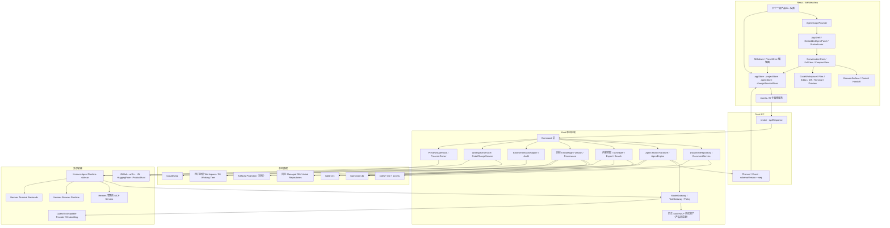

## 5. 核心组件与职责边界

### 5.1 前端组件

| 组件 | 职责 | 禁止事项 |
|---|---|---|
| `App.tsx` / `AppShell` / Sidebar | 初始化、一级导航与页面级 Agent 入口策略 | 不重复显示全局执行徽标；不常驻渲染完整 Chat；不订阅正文/任务等无关大状态；不承载会话恢复或业务写入 |
| 目标 `ConversationCore` | Thread/Run 选择、消息/过程/工具/Composer 的无页面内核 | 不读取 activePage 推断权限；不自行创建第二套 store/Channel |
| 目标 `ConversationPage` | 一级会话页：历史列表、完整工作区、搜索/分组/归属项目 | 不复制 `ConversationCore`；不把待办 Task 当 Thread |
| 目标 `EmbeddedAgentPanel` | 工作室/笔记本中的紧凑 AI 区域、展开/折叠/宽度/打开完整会话，并承载 Chat/Browser 切换 | 不挂载到发现/收件箱/工具；不因折叠或切页取消 Run；不静默复用不匹配作用域的会话 |
| 目标 `BrowserSurface` | 会话、工作室、笔记本复用的可见页面、导航、控制权、Agent 动作、截图/DOM/控制台与引用 UI | 不保存 Cookie/密码/表单 Secret；不把“已连接”冒充页面可控；不自行绕开 Hermes Browser API |
| 目标 `CodeWorkspace` | 会话/工作室的文件树、代码 Editor、Git Diff、Terminal、Preview 与布局协调 | 不挂载到笔记本；不直接读写文件/启动进程；不把代码文件伪装为 SophoNote Article |
| 目标 `CodeDiffReview` | CodeChangeSession 的逐文件/逐 hunk 审查，可复用文档 Diff 视觉 | 不复用 DocumentService 的 operation/baseVersion/落盘路径；不自动 commit/push |
| 目标 `PreviewSurface` | 静态/localhost/Markdown/PDF/图片产物展示和 Agent 验证状态 | 不等同 BrowserSession；不自行启动命令或拥有子进程生命周期 |
| 目标 `ContextHandoffAction` | 把发现条目、知识资产、任务或选区作为显式候选上下文交给新建/已有会话 | 不复制正文、不直接启动带副作用 Run、不把筛选结果偷换为全库授权 |
| 目标 `AgentScopeProvider` | 页面提供可显示的作用域描述、focus entity、selection、filters | 只提供候选上下文；不作为 Rust 授权依据，不直接读文件 |
| `NoteWorkbench` | 单文档编辑/预览/分屏、保存状态、大纲、反链 | 不把跨文档保存状态放共享 ref；目标改为每文档 DraftRecord |
| `DocWorkspace` | 文档列表、选择、批量操作、工作台组织 | 文档点击不得等待旧文档 I/O 后才响应 |
| `MarkdownEditor` | Crepe 生命周期、selection、completion、diff、view checkpoint | 正常 AI 写回不得用清空 history 的全量替换 |
| `ProjectMode` / 当前 `ProjectChatPanel` | 当前项目文档与 Chat 协作；目标迁移为工作室 + 共享 `ConversationCore` | 不维护第二套审批/会话状态；迁移后不得继续成为唯一 Agent 入口 |
| `MarkdownView` | GFM/KaTeX/highlight/Mermaid/双链/嵌入预览 | 预览刷新不得阻塞输入；相同内容不重复重解析 |

### 5.2 前端状态

| Store | 所有权 | 生命周期 |
|---|---|---|
| `appStore` | 来源、items、articles、tasks、settings、全局 UI、语义索引 | 应用级；当前体量大，组件必须 selector 订阅 |
| `projectStore` | 项目、成员关系、项目文档树 | 项目域；不得合入 appStore |
| `agentStore` | Thread/Run/Event/Message/ToolCard、恢复与降级 | 运行域；不得接收 completion 或编辑 dirty 状态 |
| 目标 `agentUiStore`（可独立小切片） | 工作室/笔记本面板展开与宽度、各作用域最近 Thread、完整视图定位、待消费 ContextHandoff | 只保存 UI 引用；不得复制消息、事件或权限；是否新增须以现有 store 边界评审为准 |
| 目标 `browserUiStore` | 当前 BrowserSurface、页面展示快照、控制权和面板状态 | 只保存 UI 投影；真实页面/导航/DOM/控制状态归 Hermes；Cookie/Profile 不进 Zustand/localStorage |
| 目标 `workspaceUiStore` | 当前 WorkspaceBinding 引用、打开文件、布局、选中 Diff/Terminal/Preview | 不保存源码全文、授权 token 或进程所有权；磁盘状态由 Rust 重读 |
| 目标 `codeChangeStore` | CodeChangeSession、文件/hunk 决策、base hash、冲突和验证状态 | 与 `changeSessionStore` 分开；只允许共享无状态 Diff 展示组件 |
| `changeSessionStore` | operationId、hunk 决策、active document operation、视图 checkpoint | 文档变更会话；Chat/编辑器/状态条唯一审批真相源 |
| 目标 `DraftRecord` 服务/切片 | 每文档 draft、sequence、dirty、lastSaved、error、inFlight queue | P0 待实现；替代组件级共享保存 ref |

### 5.3 Rust 组件

| 模块 | 职责 |
|---|---|
| `commands.rs` | 通用数据库、抓取、设置、AI、文章等 Tauri 命令门面 |
| `notes.rs` | Markdown/frontmatter/资产文件 I/O 与历史数据迁移 |
| `documents/repository.rs` | 文档读取、CAS version、原子写入、单文档锁的底层仓储 |
| `documents/service.rs` | Patch dry-run/apply/reject/undo、operation 状态机、revision checkpoint、启动恢复 |
| `agent/*` | Hermes-only 产品运行路径 + 随包钉扎 Sidecar/开发附着 Adapter/Session/Gateway/Bridge；Release 只解析包内 Runtime 并校验清单与逐文件 SHA-256，历史 Rig 代码只供显式 feature 的 Spike/对照测试，不能成为产品回退；RunStore 始终是 UI/恢复规范真相源 |
| `model/*` | Provider 配置、OpenAI-compatible 请求、ModelGateway、重试和 prompt 版本 |
| `tools/*` | 内置项目/文档工具、ToolGateway、结构化 ToolOutput、MCP 封装 |
| `skills/*` | bundled/user/workspace Skill 加载、校验、启用、预算与工具交集 |
| `content.rs` / `scheduler.rs` | 来源抓取、正文预热、质量/证据、定时调度 |
| `vector.rs` / `global_search.rs` | 条目/正文/笔记 chunk 索引和融合检索 |
| 目标 `knowledge/*` | Resource/Artifact/Claim/Decision/KnowledgeReference 生命周期、发布/复核和证据完整性；不保存 Hermes Memory 正文 |
| 目标 `versioning/*` | Managed Notes Repository、项目仓库关联、语义 checkpoint、Commit/Diff/Blob/Anchor 投影和受控恢复 |
| 目标 `retrieval/*` | 结构化过滤、FTS5/BM25、sqlite-vec、版本过滤、融合排序、ContextAssembler 和引用组装 |
| 目标 `resource_budget/*` | 检测物理内存/memory pressure/磁盘，分配 Hot/Warm 字节配额，暂停作业并驱动 FTS-only 降级 |
| 目标 `browser/*` | Hermes Browser capability discovery、BrowserSession 映射、控制权、动作审批、事件适配、引用/截图审计；页面真相不复制到 SQLite |
| 目标 `workspace/*` | WorkspaceBinding 授权/canonical path/symlink/ignore/大文件校验、目录树、文本读写、文件 watcher 与 Git 工作树状态 |
| 目标 `code_changes/*` | CodeChangeSession、base hash/tree、逐 hunk 决定、原子写入/冲突/补偿和 Run/Decision 关联；不处理 notes 文档 |
| 目标 `preview/*` | Preview launch spec、端口分配、子进程所有权、健康检查、stdout/stderr 有界缓冲、停止/重启和 stale 验证状态 |
| `projects.rs` / `project_tree.rs` | 项目、文档成员关系与项目内树结构 |
| `export.rs` / `storage_gc.rs` | Markdown 导出、存储统计和孤儿资产清理 |
| `storage_layout.rs` | 当前统一解析/创建 DB、notes、workspace、Hermes、runtime、logs 分区；目标增加 `version/` 与 `knowledge/blobs|cache` 分区。设置「存储」页需分开展示真相源和可清理派生数据，入口当前隐藏 |

## 6. 模块间调用关系

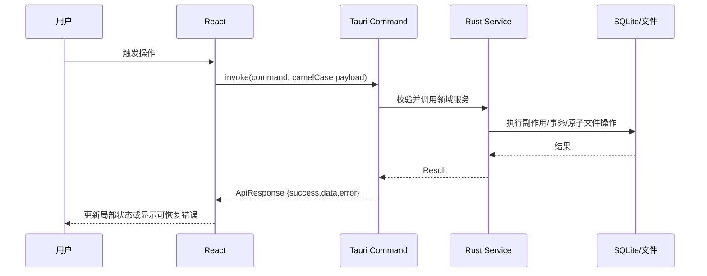

调用规则：

- React 页面只通过 `src/services/tauri.ts` 包装调用命令，不在组件散落裸 `invoke`。
- 通用 CRUD 命令可直接调用 repository；涉及 Patch、审批、恢复、幂等的写入必须经过 service。
- Agent 工具只调用 ToolGateway 注册的能力；Document tool 内部仍走 DocumentService，不直接操作 notes/DB。
- Completion 与 Agent 共享 ModelGateway，但 Completion 不进入 Thread/Run/Tool 循环。

## 7. 核心数据流与控制流

### 7.1 文档编辑与保存

当前实现已经改为事件驱动：ProseMirror `doc` transaction 只标记 dirty；800ms trailing 或 5s max-wait 到期时才序列化，分屏仅在变更后约 400ms 生成预览快照。切文档会先同步捕获旧文档草稿到全局 `DocumentDraftQueue`，随后立即显示目标文档，SQLite/Markdown 写入在后台按 `documentId` 完成。

当前保存链路：

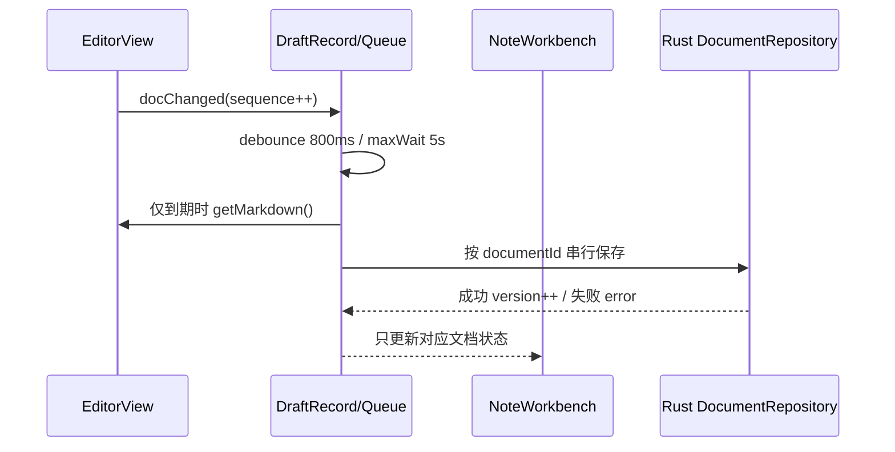

`DocumentDraftQueue` 位于 React 生命周期之外；同文档只运行一个保存循环，在途输入通过 generation 合并，不同文档的基线、错误和 Promise 完全隔离。编辑器销毁前还会同步交付最终 Markdown，旧保存结果只允许按原 `documentId` 回填。

### 7.2 抓取与证据化 AI

```text
手动刷新 / Scheduler 60s tick
  → fetch_source_data 按 source_type 分派
  → 标准化、去重、只更新源字段
  → items 元数据
  → Bridge 按近 7 日、近期入选、来源与紧凑元数据预筛
  → 每个来源最多 4 条候选进入 Hermes Skill 评分
  → 冻结本轮全部达标且不重复的最终名单（无每日数量配额）
  → 仅最终名单按条延迟准备 item_contents / evidence[]
  → quality_level 2+ 才允许生成速览/深度解读并发布
```

成本门禁位于内容生成之前：未通过元数据预筛或评分的条目不得读取完整正文、不得生成速览/深度解读。候选工具只返回压缩后的评分规则与元数据；来源级生成 Prompt 仅随最终入选条目的完整证据返回。

### 7.3 Inline Completion

```text
Editor docChanged/光标稳定
  → 前端构造短上下文与 requestId
  → completion_suggest
  → Rust CompletionService → ModelGateway
  → 过滤、超时、缓存、requestId 复检
  → Decoration ghost text
  → Tab 以普通 transaction 接受 / Esc 或变化取消
```

### 7.4 Agent Run 与恢复

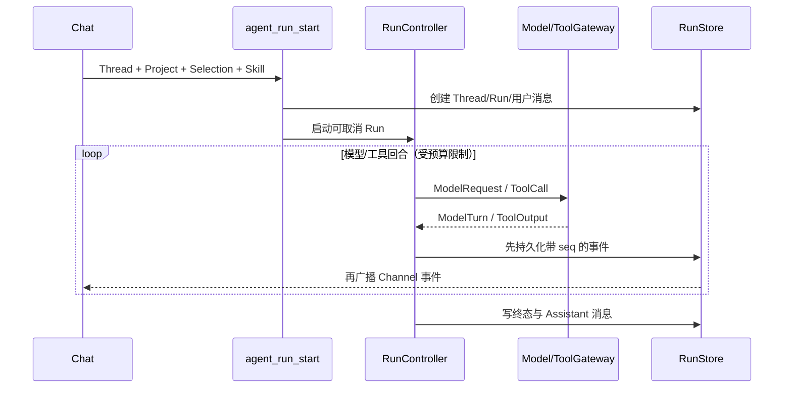

窗口重挂载或 seq 缺口：Thread history → replay(afterSeq) → Snapshot；仍缺失则记录 degraded。Thread history 从请求发起即进入恢复门禁；若历史中最后一个 Run 无终态，`agentStore` 恢复 `runningRunByThreadId`、标记 resuming，并按 750ms 从 RunStore 持续 replay/Snapshot。Composer 与 `startRun` 共用同一门禁，只有终态事件，或 `agent_runs` 权威 Snapshot 已是 completed/failed/cancelled/interrupted，才允许同一 Thread 开始下一轮；旧 Run 迟到终态不得清理新 Run 标记。

宿主进程重启后 CancellationToken 不存在，只能证明 SophoNote 本地 observer 丢失，不能证明 Hermes 回合已结束。`agent_run_reconcile` 必须先对 Thread 绑定的 Hermes Session 调用 `session.resume`：若 `running/streaming/auto_continue` 为真，则保留该 WebSocket、从 RunStore `latest_seq + 1` 重新发射并消费到 `message.complete`；若 Hermes 已空闲但 transcript 在对应用户消息之后存在 assistant 回答，则补齐 `message_completed/run_completed`；仅当 Hermes 明确空闲且没有对应回答时写 `interrupted`。Hermes 暂不可达或恢复连接中断时不生成假终态，输入继续锁定，由下一轮恢复探针重试。任意 Run 终态都是过程轨的硬边界：即便断连窗口漏收 `tool.complete`，历史工具活动也必须停止转圈并以终态时间收口。

**会话生命周期（AG-01）**：每项目可有多个活跃 Thread；顶栏 tab 切换。用户关闭（×）：**无任何用户对话则硬删，不进历史**；有对话则写入 `closed_at` 进入历史（须已有明确标题，可由首条 Query 与回复摘要生成；占位「新会话」等不得出现在历史）。历史中「归档」写入 `archived_at` 后对 UI 不可见。设置键 `agent.thread_history_ttl_days`（默认 **0=永久**）：仅当配置为正整数时，对**已归档**且超过该天数的 Thread 硬删除。列表按 `scope=active|history` 过滤。

**新版目标会话生命周期（DEC-016/027）**：上述当前实现保留为迁移输入，不再限定“每项目”。Thread 可在 `project_id IS NULL` 时创建为快捷会话，并在后续归属一个项目；项目视图只是 `projectId` 过滤入口。完整会话页、工作室/笔记本嵌入面板与工作室共享同一生命周期控制器；发现/收件箱/工具的 ContextHandoff 只向该生命周期提交候选上下文。归属项目不创建新 Thread/Session；若当前 Thread 已有非终态 Run，必须等待终态后再改变归属，避免一个 Run 中途切换工具/记忆边界。

### 7.5 新版会话、作用域与项目归属

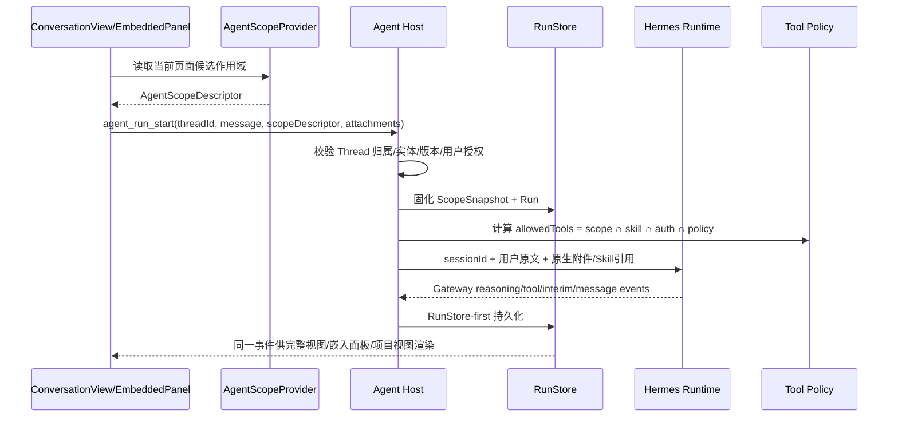

作用域 DTO 目标：

```text
AgentScopeDescriptor（前端候选）:
  surfaceType: discover | conversation | studio | notes | library | tools
  scopeId?: string
  focusEntity?: { type, id, title, version? }
  visibleEntityIds?: string[]       // 有界，仅作候选
  filters?: object                  // 有界、可审计
  selection?: SelectionSnapshot

ScopeSnapshot（Rust 校验后、随 Run 固化）:
  surfaceType, scopeId, projectId?, focusEntity?, selection?, filters?
  contextRefs[]                     // 实际注入的资料引用、版本与来源
  capabilityProfile
  createdAt
```

关键不变量：

1. `AgentScopeDescriptor` 不能授予权限；Rust 必须按 SQLite/文件/项目成员关系和用户授权重新解析 `ScopeSnapshot`。
2. `ScopeSnapshot` 属于 Run，不属于可变页面；用户发送后切页不修改它。
3. 默认快捷会话只得到显式附件、用户通用只读能力和基础网页能力；不得默认读取整个知识库或所有笔记。
4. 工作室会话默认使用项目作用域；知识库、笔记本、发现和工具作用域分别通过能力配置映射到最小工具集合。
5. 写工具必须经过统一 ToolContext/Policy/Approval；文档写仍唯一经 DocumentService。

项目归属事务目标：

```text
precondition: thread exists && no non-terminal run && target project exists
transaction:
  agent_threads.project_id = targetProjectId
  agent_threads.scope_type = 'project'
  agent_threads.scope_id = targetProjectId
post-commit:
  Hermes Session ID 不变
  依据用户选择创建 memory summary / document links / knowledge refs
  任一步失败不得复制或丢失 Thread 历史
```

### 7.6 Agent 文档修改

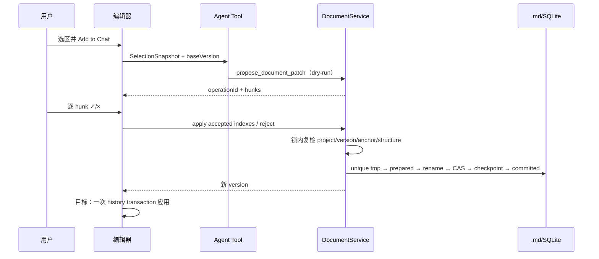

## 8. API、协议与数据模型

### 8.1 Tauri 命令协议

- 命令输入/输出使用 serde `camelCase` 对齐 TypeScript。
- 统一响应：`ApiResponse<T> = { success: boolean, data?: T, error?: string }`。
- 命令按域分为：数据库/设置、抓取/内容、文章/资产/导出、向量搜索、项目、Agent、Completion、Document、Skill、MCP。
- 修改命令签名时必须同时更新 Rust handler 注册、`src/services/tauri.ts`、TS 类型和契约测试，并重启 Tauri 宿主。

### 8.2 Agent 事件协议

- 每个事件包含稳定 `schemaVersion`、`eventId`、`runId`、单 Run 单调 `seq`、时间戳和类型化 payload。
- RunStore 是事件真相源；Channel 只是低延迟传输。
- 当前 schema v4 payload 包含 `run_started`、`model_started`、`reasoning_delta`、`reasoning_completed`、`message_delta`、`message_interim`、`message_completed`、`tool_started`、`tool_completed`、审批/澄清、终态与 `engine_degraded`；旧事件通过 serde 默认和 mapper 兼容。`message_interim` 会把当前助手说明封存为独立消息，后续最终答案不能覆盖。
- Snapshot 是独立查询/恢复路径，`interrupted` 是 Run 持久状态；二者不得伪装成已经落库的实时事件。附着 Hermes 已提供真实 reasoning/message delta；非 Agent 模型路径不保证同等级 token 流。
- 工具完成结果分为 `model_text`、`structured`、`ui_artifact`、`provenance`、`truncated`；`model_text` 不作为 UI 解析协议。
- Chat UI 映射：助手消息阶段 `thinking → answering → done|error`；`reasoning_delta`+同 run 工具 → **Area A**；`message_delta` → **Area B**；`message_interim` 封存当前说明并开启下一段。Hermes 常发送 1～3 字符 delta，Adapter 在不改变顺序与正文的前提下合并相邻同类增量，Surface 再按语义边界与约 48～96ms 视觉帧提交；换行、句末标点、代码围栏和累计字符阈值可提前落屏，稀疏流也不得等待 260ms 后才逐字出现，非流式/终态事件立即落屏。Gateway 的模型正文、路径、URL 与 Markdown 原样透传，不再经过 SophoNote 正则“脱敏/改写”；仅结构化工具参数可在字段级移除凭据。流式答案拆为已闭合稳定 Markdown 块与活跃纯文本尾部：稳定块由 memoized renderer 渲染且后续 token 不重解析，活跃尾部只做换行保真的轻量展示，终态执行一次完整 Markdown 渲染。
- `approval_required` / `clarify_required` 是阻塞当前 Hermes Session 的原生事件，不转换成新用户消息。Conversation Surface 将 `choices[]` 按事件顺序渲染为整行纵向决策列表；卡片保持可换行文案、序号、推荐/风险语义与底部自定义回答。一次/会话/拒绝可直接回传，`always` 等持久授权必须经过本地二次确认后才调用 `approval.respond`；提交中禁用重复操作，失败保留原卡片供重试。
- Hermes 过程事件兼容层以 Gateway 的 `reasoning.delta`、`message.interim`、`tool.start|complete`、`message.delta|complete` 为现行标准；前端按 RunStore `seq` 聚合 Thought/Explored/Used。`reasoning.available` 若只是已输出 reasoning 的回标必须去重，`thinking.delta` 属于 spinner 状态而非推理正文，与 Hermes Desktop 一致地忽略。
- 未知 schema/payload 不归约，进入显式降级；旧事件通过 serde default 保持兼容。

### 8.3 文档 Patch 协议

核心字段：

```text
SelectionSnapshot:
  articleId, baseVersion, scope, selectedText, selectedTextHash,
  contextBefore, contextAfter, startLine/endLine(best-effort)

PatchPreview:
  operationId, approvalId?, documentId, baseVersion, targetVersion,
  oldText, newText, hunks[], status, scope?, rebased

PatchHunk:
  startLine, contextBefore[], removed[], added[], contextAfter[]
```

TextAnchor 必须唯一匹配。安全 rebase 仅在版本变化但锚点仍唯一、hash 不变时重新基于当前正文出 diff；否则返回冲突。

### 8.4 数据表与文件模型

| 领域 | 表/文件 | 真相与用途 |
|---|---|---|
| 文档 | `notes/<id>.md`、`assets/` | 正文与附件真相源 |
| 文档元数据 | `articles` | 标题、类型、时间、内部 `version`；content 不作为正文真相 |
| 文档安全 | `document_operations`、`document_revisions` | operation 审计/恢复与短期旧正文 checkpoint |
| 项目 | `projects`、`project_documents` | 项目及文档单一归属/树关系 |
| Agent | `agent_threads`、`agent_runs`、`agent_messages`、`agent_tool_calls`、`agent_approvals`、`agent_run_events` | 多轮、运行、工具、审批和恢复 |
| 历史 Skill/MCP | `skill_state`、`mcp_servers`、`mcp_tool_auth` | 兼容旧库与测试资产；产品能力目录、连接和授权不再从这些表读取 |
| 资讯 | `sources`、`items`、`item_contents`、`stories`、`daily_picks` | 来源、元数据、正文证据、聚类/推荐 |
| 组织 | `collections`、`collection_items`、`daily_logs`、`tasks`、`settings` | 收藏、日志、独立任务、配置 |
| 语义索引 | `item_chunks`、`note_chunks`、`vec_items`、`vec_chunks`、`vec_note_chunks` | chunk 元数据和 sqlite-vec 向量 |
| 目标冷资料/派生缓存 | `knowledge/blobs/<sha256>`、`knowledge/cache/` | blobs 是内容寻址原始资料；cache 只含可重建提取文本/OCR/thumbnail/rerank 等，两者清理语义不同 |
| 目标版本证据 | `repositories`、`repository_projects`、`document_versions`、`evidence_anchors`、`version_jobs` | Git 仓库授权、确定文档版本、语义锚点和异步作业投影；Git 对象仍是版本事实 |
| 目标知识治理 | `knowledge_claims`、`knowledge_evidence`、`knowledge_relations`、`change_impacts`、`memory_evidence_links` | Claim/Decision/Artifact 证据、替代/冲突关系、待复核与 Hermes Memory 外部引用；不复制 Memory 正文 |
| 目标工作区 | `workspace_bindings` | 会话临时/项目持久的授权目录引用、访问模式、Git 类型和授权状态；不复制源码或 bookmark 明文给前端 |
| 目标代码改动 | `code_change_sessions`、`code_file_changes` + `runtime/code-changes/` | base tree/hash、逐文件/hunk 决定、Run/原因和受控临时 patch；不复用 document operation |
| 目标 Browser | `browser_session_refs`、Browser action/provenance audit | 只保存 Hermes 外部 Session 引用、控制权/状态投影和最小引用审计；页面/Profile/Cookie 不入库 |
| 目标 Preview | `preview_sessions` + `runtime/previews/` | launch spec hash、端口、进程所有权、generation/验证状态与有界日志；实际进程由 Host 所有 |

关键不变量：

- 正文成功写入才使 `articles.version + 1`；version 只增不减。
- operation 的 `idempotency_key` 唯一，重入不得产生第二次副作用。
- project tool 在读取/写提议前校验 `project_documents` 成员关系。
- `projects` 是扁平容器，`project_documents` 表达一篇文档的单一项目归属，项目内文档树由成员关系中的 `parent_id` 表达；移出项目只解除关系。`project_delete` **级联永久删除**成员 Article/索引/Markdown（事务内清 DB 行含 revision/operation，提交后删文件）；仅双链引用、未列入成员关系的笔记不在级联范围。
- 删除文章应同时清理文件、索引、项目关系和 revision/operation 孤儿；文章删除路径已在 `delete_article_rows` 同步清理 revision/operation。

新版会话迁移目标（新增列必须经 `ensure_columns` 幂等补齐，当前尚未实现）：

| 表 | 目标增量 | 用途与约束 |
|---|---|---|
| `agent_threads` | `scope_type TEXT NOT NULL DEFAULT 'project'`、`scope_id TEXT`、`pinned_at INTEGER` | 区分未归属会话/项目会话及列表置顶；现有 `project_id` 迁移为 `scope_type='project', scope_id=project_id` |
| `agent_runs` | `scope_snapshot_json TEXT` | 固化每轮实际上下文、能力 profile 和引用版本；不能只依赖 Thread 当前归属恢复旧 Run |
| `tasks` | `source_thread_id TEXT`、`source_article_id TEXT`、`project_id TEXT`（均可空） | 记录任务来源关系；任务正文/状态仍在 tasks，不复制会话或 Markdown |

约束：

- `scope_type='project'` 时 `scope_id` 与 `project_id` 必须一致；非项目作用域 `project_id` 为空。
- 一个 Thread 最多一个 `project_id`；归属操作只更新关系，`external_session_id` 不变。
- 迁移前的 `project_id IS NULL` 当前表示非项目桶，不能直接解释为新版所有页面共享作用域；上线前需按产品入口和历史来源做明确映射或保守归为 `conversation/default`。
- `scope_snapshot_json` 只存 ID、版本、筛选和能力元数据，不复制完整敏感正文；实际注入内容仍按 RunStore/工具来源审计。
- `workspace_bindings` 的 thread owner 关闭/解绑后撤权，project owner 仅保存可恢复授权引用；每轮 Run 只获得 ScopeSnapshot 中列出的 binding，不自动继承项目全部仓库。
- `browser_session_refs`、`preview_sessions` 和 `code_change_sessions` 只保存跨重启恢复/审计所需状态；页面正文、源码、Terminal 完整输出继续按各自真相源与有界临时存储处理。

## 9. 状态管理与生命周期

### 9.1 应用与页面

- 启动顺序：注册 sqlite-vec → 初始化 schema → Markdown 迁移 → 恢复 prepared document operations → 启动 scheduler → 异步论文转换/正文补抓 → 创建窗口/托盘。旧本地 `McpManager` 不注册到产品运行时。
- 前端 `initialize()` 依次加载 settings、sources、items、tasks、articles 和 stats；模块级 in-flight 防 StrictMode 双初始化。
- `activePage` 始终在前。轻量页（发现/会话/计划任务/工具/设置）切换即卸载。DEC-047：笔记本与 AI 工作室是重型工作区，访问后按 LRU 最多保活两个。隐藏态同时使用 `hidden`+`inert`+`aria-hidden`、退出焦序、暂停该页 window 快捷键与补全，并把 `NativeBrowserSurface` 子 WebView 停泊到屏外 1×1；不得只靠 `display:none` 而让原生子 WebView 留在上一帧矩形上盖住当前页。
- 窗口关闭当前隐藏到托盘，不立即退出；Hermes 自身负责其 MCP 生命周期与子进程清理。
- `AppShell` 只负责页面入口策略；完整 `ConversationCore` 仅在会话页或工作室/笔记本嵌入面板展开时挂载。运行状态由会话列表/消息呈现，不在 Header 重复放置徽标。发现、收件箱、Artifacts 和工具不因全局 Agent 能力常驻 token 流视图。
- 一级会话页与嵌入面板切换时只改变 view/selectedThread 引用，不销毁 Run 或重复调用 history/recovery；恢复控制器以 Thread 为键，整个前端只能有一个实例负责同一 Thread 的非终态追平。
- `ContextHandoff` 是短生命周期导航载荷；用户选择“新建会话/加入会话”后即转换为 Thread 的 pending context references，发送前由 Rust 解析，消费后清除 UI 草稿，不能被 Zustand persist 作为长期权限保存。

### 9.2 编辑器

- 当前 EditorView 在预览态可能销毁，模式切换存在 history/重建成本。
- 目标保活必须同时解决外部正文同步、history 标记、焦点、快捷键、ResizeObserver、滚动和可访问性；不得仅 `display:none`。
- Inline Completion、Document diff 和常规编辑 transaction 是独立插件状态；补全建议不进入正文，diff Decoration 不进入 Markdown。

### 9.3 Agent 与 operation

- `agentStore` 按 thread/run/seq 归约事件；终态注销运行中状态。
- `changeSessionStore` 按 operationId 归约 hunk 决策，按文档选择当前 pending 或仍可撤销的 committed operation。
- 重启时只恢复同一文档最新 pending；committed/rejected 保留审计，不恢复为待审批。
- `selectedThreadId` 需从当前单一全局选择演进为“当前完整视图 Thread + 每个作用域最近 Thread”的引用模型；消息与事件仍只存一份。不能以多个 store 复制线程数组解决页面切换。
- 会话归属项目、关闭、归档、切换作用域时，若存在非终态 Run 必须阻止改变执行边界；嵌入面板折叠和页面导航不属于生命周期操作。
- Browser/CodeWorkspace/Terminal/Preview 视图卸载只释放前端资源，不擅自改变外部 Session/进程；恢复控制器按 Thread/Binding 对账。关闭会话或解绑时，Host 按所有权关闭 Browser 引用和 SophoNote 启动的 Preview/Terminal，用户既有进程不受影响。

## 10. 存储、缓存与消息机制

### 10.1 存储

- 所有本地持久数据由 Rust `StorageLayout` 从操作系统应用数据目录统一解析：macOS 为 `~/Library/Application Support/com.fei.sophonote/`，Windows 为 `%APPDATA%\com.fei.sophonote\`。任何前端、Skill 或 sidecar 不得自行拼接另一个数据根。
- 当前目录布局：`sophonote.db` 为产品元数据/索引/RunStore；`notes/` 为 Markdown 真相源与 `assets/`；`workspace/` 为用户与 Hermes 可直接读写的普通文件工作区；`hermes/<version>/` 为包内 Runtime 的 Session/Memory/Skill/附件私有 Home；`runtime/` 为临时进程状态；`logs/` 为诊断日志；`version/` 已由 StorageLayout 幂等创建，供后续 managed bare repo 使用，当前不写 Git。目标 `version/notes.git/` 作为 managed bare repo，`knowledge/blobs/<sha256>` 为新导入的大型知识原文保存单一内容寻址副本，`knowledge/cache/` 保存可重建的提取文本与索引缓存。存量 `notes/assets` 仍在原位，Git manifest 只引用 hash/授权源，不再复制大文件。
- `workspace/` 与 `notes/` 是刻意分开的两种权限域。Hermes 以 `workspace/` 作为默认 cwd，因而该目录内文件均可使用原生 file/terminal 工具操作；SophoNote 文档只以 Hermes `attachments/` 工作副本进入 Session，终态差异必须生成 DocumentService Patch，禁止 sidecar 直接写 `notes/`。
- 当前旧数据的 `sophonote.db`、`notes/` 已处于统一数据根，升级只幂等创建缺失分区，不移动文件。机器级 `~/.hermes` 属于外部 Hermes Desktop/开发 Runtime，不能自动迁入、合并或删除；Debug 显式附着时布局仍解析外部运行域，Release 永远使用私有 `hermes/<version>/`。设置「存储」页（分区展示、容量、孤儿 GC、自定义根）当前隐藏，低优先级再恢复入口。
- 包内 Hermes 的 `config.yaml` 由 Host 在启动前幂等合并 SophoNote 管理项：关闭重复的 `auxiliary.title_generation`，配置默认 `terminal.cwd=workspace/`，再写入受控 Bridge；不得覆盖用户/Runtime 其他配置。SophoNote 自身从真实助手回复生成 Thread 标题。
- Markdown 和 assets 写入使用安全 ID、唯一 tmp 和原子 rename。
- Git 不直接 checkout 到 `notes/`，不跟踪 `sophonote.db`、RunStore、Hermes Home、密钥或临时文件。版本服务从 DocumentService 已提交的稳定文档生成 Git tree，从而保持实时写入路径与版本库解耦。
- 用户授权代码仓库保持原位置，不复制进 Application Support；SQLite 只保存 WorkspaceBinding 与可查询投影。CodeChange 临时 patch、Preview pid/端口和有界输出进入 `runtime/`，崩溃恢复/过期清理后可删除，不得作为源码备份。
- SQLite schema 由 `create_schema` 和 `ensure_columns` 幂等演进；目前没有独立版本化 migration runner，这是已知限制。

### 10.2 缓存

- Zustand persist 仅保存非敏感 settings、collections、activePage；API Key 不得进入 localStorage。
- 内容正文、AI 结果和向量索引在 SQLite；hash 未变时避免重复 AI/索引。
- `ResourceBudgetManager` 对知识/记忆增量占用执行跨进程 1 GiB 硬预算；物理内存只影响是否更早降级，不能放宽上限，也不按 memory-entry 数量直接换算内存。
- Hot 只含目录/当前 Claim/小型 FTS 页；Warm 只含当前文档、固定资料和近期项目的 chunk/向量；Cold PDF/原文/历史 Git blob 不进常驻缓存。
- SQLite page cache、FTS/catalog、向量页、检索/上下文工作区、导入/OCR/Embedding 批缓冲、Memory 候选/压缩、可选 Adapter 和本地 Embedding 进程均进同一总账；大范围 `mmap` 不得绕开 RSS 计量。
- 压力降级顺序固定为：停止预取和 rerank → 暂停 embedding/影响作业 → 清 Warm LRU → 停可选 Adapter/本地 Embedding → FTS-only。编辑、精确 Anchor/Git 读取和导出不降级。
- Completion 有短期请求缓存和聚合指标，不保存正文上下文或建议全文。
- 目标关系/任务/标签缓存按 `articleId + contentHash`，未链接提及还需包含目标标题；缓存必须有容量和集合清理策略。
- 页面数据命中 store 且未失效时不重复 Tauri 查询。

### 10.3 消息

- Tauri `invoke` 用于请求/响应；Tauri Channel/Event 用于抓取通知、调度和 Agent 实时事件。
- Agent 事件先落 SQLite 再发 Channel，保证屏幕状态可以重建。
- 不引入外部消息队列；本地单进程内使用 Tokio task、CancellationToken、锁和持久事件表。

## 11. 并发、性能与容量设计

### 11.1 当前并发模型

- Tauri async runtime 执行抓取、模型和 Agent 任务；Scheduler 每 60 秒检查来源 interval。
- 文档写入使用按 documentId 的 Rust 互斥锁、version CAS 和 operation 幂等键。
- Agent Run 使用 CancellationToken，可并行于 UI；工具和模型调用受调用次数预算限制。
- Hermes Runtime 持有 MCP 连接、授权和生命周期；SophoNote 只调用 Hermes 正式管理 API 并渲染其状态。

### 11.2 当前性能债与已完成整改

1. 已拆除 `NoteWorkbench` 空闲轮询；剩余成本是输入停顿/显式保存时的全文序列化，以及分屏变更后的整篇 React Markdown 渲染。
2. `safeListOrderPlugin.appendTransaction` 普通 doc transaction 可能扫描整棵文档树。
3. App 壳、Sidebar、常驻 ItemDetail 和写作工作台已收窄 Zustand selector；其余活跃页面仍需按宿主 profiler 判断是否继续拆分。
4. 反链/未链接提及已移到 idle，并在仅当前文档保存、候选引用未变时跳过；任务/标签和更大规模增量索引仍待测量。
5. 文档切换已与 flush I/O 解耦，页面 chunk 支持 hover/focus 与初始化后逐个 idle 预取。NEXT-001 暖页签 P95=519ms 超过 PRD ≤150ms 后，DEC-047 对笔记本与工作室启用最多两个受控保活（inert、退出焦序、暂停 window 快捷键、原生子 WebView 停泊）；隐藏态取消富预览 promote 与提及扫描，并停订隐藏页 AgentStore。轻量页热路径用会话级缓存画稳首帧，挂载后不再为校准 setState（idle 延迟 DOM 会拖长 MutationObserver settle，已撤回）。停扫描后混合热 P95=294ms；缓存首帧后再测 190/360ms（P95 为会话单次热样本）。随后把时间线首窗从 80 收到 16，历史（非流式）Markdown 走 `lite` 且不挂 Mermaid IntersectionObserver。同夹具混合 P50/P95=195/304ms，会话热 304ms，其余热页 191–207ms。单独保活会话页会使三页同挂、settle 退化到秒级，已撤回。会话仍是尾巴，但不得把轻量页纳入保活。同夹具数字见台账 NEXT-004。
6. Agent operation 的 undoable 重查会放大保存后的状态更新。
7. AI 批准结果已作为单个、前后边界隔离的 ProseMirror transaction 写入 history；外部非撤销型同步仍会显式重建基线。
8. Agent 热路径曾对每个 Gateway delta 单独打开 SQLite、前端每批重排并重放整段 Run、答案每次从头解析 Markdown；这三处会把上游 1～3 字符增量放大为持久化阻塞、主线程抖动和可感知逐字停顿。

这些是已确认存在的候选热路径，不代表未经测量的耗时排序。

### 11.3 P0 性能设计

- 精确 store selector + `useShallow`，App 壳只订阅导航/初始化/主题。
- `docChanged` 事件驱动保存；序列化只在 debounce/max-wait/显式 flush 时发生。
- 预览通过低优先级 transition 更新，按 Markdown/source hash 缓存。
- Agent Adapter 合并相邻 reasoning/message delta 后才进入 RunStore；RunStore 传输层复用长连接并保持“单批持久化成功后才广播”，不得以异步 UI 先行破坏 durable-first。前端接收有序尾增量时走 append fast path，只有 replay/乱序才排序；派生消息只重算被触及 Run。
- Chat 流式 Markdown 使用稳定块缓存，正在增长的尾部不运行 GFM/KaTeX/Mermaid/高亮插件；终态或块闭合时再升级为完整 Markdown。运行中的 reasoning 仅显示轻量文本尾部，完成后才允许完整 Markdown 展开。
- Chat 时间线只挂载最近窗口；到达顶部时分批向前扩展，并以扩展前后的 `scrollHeight` 差恢复阅读锚点。离开底部后暂停跟随并提供显式“回到最新”，新事件不得抢占历史阅读位置。
- Chat 热路径记录 Run 首推理/首答案/终态、事件批次、Store 同步归约与 React 提交延迟；诊断采样限频并进入现有性能面板，用于区分 Provider 空等、Gateway 传输与本地主线程放大，禁止以新增逐事件日志制造二次抖动。
- 文档保存状态按 documentId 隔离，UI 切换与 I/O 解耦。
- 列表插件只在 docChanged 且变更涉及列表结构时扫描，经 transaction mapping 映射范围。
- 关系/任务/标签增量索引；未链接提及在 idle 计算。
- 语义版本、chunk 重建和影响分析进入低优先级持久作业队列；同文档短时间多次保存按 `contentHash + trigger` 合并，不得每次 autosave 生成 commit。
- 页面 chunk 启动空闲预加载；隐藏页面暂停副作用；DEC-047 保活最多两个重型工作区（笔记本、工作室）。

### 11.4 容量边界

- 基线夹具：5 KB/50 KB 文档、200 篇库；后续增加更大文档分桶而非先做块数据库。
- 每文档最多一个有效 revision checkpoint，建议 TTL 24h；operation 审计按存储策略清理孤儿。
- 单次 MCP 结果约 50 KB 字符边界；文档读取工具当前约 8,000 字符截断并标记。
- 工作室/笔记本嵌入面板的流式消息归约必须按 Thread 精确订阅和自适应视觉合帧；页面组件不得订阅完整 `messagesByThreadId/eventsByRunId` 字典。时间线贴底状态属于可见 Thread 的视图状态：只订阅该 Thread 的 Run 事件，用户离底后停止跟随，后台 Thread 的 token、工具或终态事件不得触发当前滚动容器。未展开时不挂载 Markdown/过程轨；会话列表只订阅各 Thread 的摘要状态。窄窗优先覆盖式面板，不通过无限压缩主工作区换取并排。
- FTS 按当前文本增量维护并保存在磁盘 SQLite；向量默认只为当前文档、用户固定资料和近期活跃项目的 chunk 建立，按 scope/project/document 分片落盘，笔记写后约 5 秒防抖。旧版本/冷资料只在精确查询或用户固定时延迟向量化。
- 容量门禁不再用“10,000 文档/100,000 版本全量热索引”表达。正确口径分别是：原始字节、当前 FTS chunk、Warm vector chunk、Git 对象、派生缓存和 Memory entry；每类独立计量/配额。
- Git 对象按可计算保留策略 GC，已被 Claim/Decision/发布成果引用的 commit 不可自动清理。数据卷剩余空间低于 `max(5GB, 10%)` 时停止后台导入/向量化/空闲快照，保留编辑和导出。
- 所有客户端档位共用知识/记忆增量占用<1 GiB 的硬门禁；整机 8/16/24GB 只影响系统余量与可处理语料速度，不允许扩大 Memory Envelope。详细预算与外部 Adapter 门禁见 §23.7.10。
- 对外抓取按来源配额与 500ms 节流，避免 GitHub 二级限流。

## 12. 高可用、容灾与故障恢复

SophoNote 是本地单用户应用，不提供多实例高可用或服务端 SLA。可用性设计目标是“单进程崩溃后数据可恢复、外部服务失败时核心写作可用”。

- 文档：唯一 tmp + 原子 rename；启动扫描 `prepared` operation，清理 tmp 并标记 rolled_back。
- SQLite：所有事件和操作先持久化；建议发布/迁移前备份 DB、notes 和 assets。当前尚无自动备份调度。
- Agent：RunStore-first、replay、Snapshot、终态和 degraded；重启可恢复消息与最新 pending。
- 网络/模型：外部服务失败不阻塞本地编辑、预览、搜索已有数据和导出；AI 操作显示失败并可重试。
- Hermes MCP：断线、重连和失败状态由 Runtime 管理；SophoNote 不创建第二套连接，不影响文档真相源。
- 索引：向量索引可由 Markdown/items 重建；索引失败不回滚正文。
- 版本：Git 写入失败不回滚已成功的 Markdown 保存，而是保留 `version_jobs=failed` 并可重试；SQLite 版本投影丢失时可从授权仓库和内嵌 manifest 重建。
- 导出：标准 Markdown + assets 是用户级灾备和迁移出口。

## 13. 异常处理与降级策略

| 异常 | 处理与降级 |
|---|---|
| 文档 I/O/DB 失败 | 不推进保存基线，保留 dirty/draft，显示错误并允许重试 |
| CAS/version/anchor 冲突 | 停止 Apply，要求重新读取或生成，不做猜测覆盖 |
| tmp/rename 中断 | 标记 failed/rolled_back，启动恢复清理残留 |
| 模型 429/网络 | 仅无副作用模型请求有限指数退避；退避可取消 |
| 工具失败 | 不自动重放副作用；记录 error ToolOutput/Worklog |
| Agent 事件缺口 | replay → Snapshot → degraded；不归约未知协议 |
| Completion 超时/旧响应 | 按 requestId/光标/文档复检后丢弃，不插入错误位置 |
| Hermes MCP 未授权/断线 | 以 Hermes 返回状态为准，工具不可用或失败可见；SophoNote 不自动授权或本地兜底连接 |
| Hermes Browser 未连接/页面代次变化 | BrowserSurface 进入 detached/degraded；旧 DOM selector/坐标失效，重连并重新 snapshot 后才继续 |
| WorkspaceBinding 撤权/移动/symlink 越界 | 立即拒绝 I/O 并将 binding 标为 needs_reauthorization；不猜测路径、不扩大到父目录 |
| CodeChange base hash/tree 冲突 | 停止 apply，保留用户工作树，要求重新生成/人工合并；拒绝 nearest-match 覆盖 |
| Terminal/Preview 启动失败 | 保留命令、错误类别、退出码和有界输出；不自动提升权限、换目录或杀非 SophoNote 进程 |
| Git commit/index 失败 | 正文保持已保存状态；展示“版本待同步/索引待重建”，按 idempotency key 重试，不伪造 commit |
| 外部仓库 force-push/HEAD 漂移 | 已固化的 commit OID 仍按本地对象可读；标记 ref drift 并要求重新授权/建立基线，不静默改写旧证据 |
| 证据锚点无法映射新版 | 保留旧版引用，标记 stale/orphaned 并生成待复核影响；禁止自动移到相似文本 |
| 内容抓取不足 | 标 partial/failed/unsupported，禁止低质量 AI 解读 |
| Mermaid/预览渲染失败 | 显示局部错误/源码回退，不让整窗白屏或错误 SVG 撑破布局 |
| 前端渲染异常 | 全局错误浮层显示错误；数据库可空字段使用运行时 null 守卫 |

## 14. 安全、权限与数据保护

### 14.1 信任边界

- React/WKWebView：不可信 UI 输入边界；所有路径、项目归属、版本和权限在 Rust 再校验。
- Model：不可信建议生成器；只能看到 ToolGateway 暴露的工具，不能调用管理命令。
- Skill：受限配置与提示，不执行任意脚本，不直接授予权限。
- Hermes Runtime：不可信外部执行边界；MCP 连接、授权与命名空间隔离均由 Hermes 管理，SophoNote 不维护副本。
- Browser Runtime：不可信网页与交互执行边界；页面内容可能进行 prompt injection，DOM/下载/表单/登录态均按外部输入处理，动作仍需 SophoNote Scope/Policy。
- 用户授权 Workspace：高价值本地数据边界；授权根不等于全部工具可读写，路径、ignore、Secret、base hash 和权限模式由 Rust 逐次复核。
- Terminal/Preview 子进程：可执行副作用边界；只允许 Host/Hermes 持有进程句柄和端口，WKWebView 不直接 spawn、signal 或连接任意本地端口。
- 外部来源：不可信内容；抓取做 URL/大小/质量限制，AI 输出不得当作事实直接写入。

### 14.2 数据保护

- 文档和数据库默认本地；发送模型的上下文应最小化并由用户触发。
- API Key 不进入日志、Agent event、ToolOutput 或 localStorage；MCP 环境变量值不回前端。
- Provider Key 以 macOS Keychain 为真相源；旧 SQLite `apikey:*` 只作为一次性迁移源，并严格按“写入→回读一致→删除明文”执行。
- 未签名 Debug 二进制遇到 Keychain ACL 拒绝时，允许在 `cfg(debug_assertions)` 内使用旧 `apikey:*` 位置作为显式开发回退；读取优先使用进程缓存/该回退，避免反复弹授权。Release 编译不存在此分支，仍按 Keychain 迁移失败即 fail-closed。Key 保存成功后重启 Hermes 属于第二阶段：重启失败记录独立诊断，但不能回滚或误报已经成功的凭据保存。
- 设置页短期采用“输入即自动保存、保存后不清空当前组件值”的交互；输入值只存在当前 React 组件内存，不进入 Zustand persist/localStorage，页面刷新或应用重开后 Host 仍只返回 configured marker。设置页不提供删除 Key 入口。桌面确认框禁止使用被 `tauri-plugin-dialog 2.7.x` 初始化脚本改写的同步 `window.confirm`；统一使用 `@tauri-apps/plugin-dialog` 的异步 `confirm()`（实际走已授权 `message` 命令）或应用内确认组件。
- `tauri.conf.json` 已启用 production/dev 分离的严格 CSP；Release 不允许 `unsafe-eval`、任意网络连接、frame 或 object。
- MCP command/args/env 和 Skill 文件均需用户来源信任；路径校验禁止符号链接逃逸和目录穿越。
- 只能读取用户明确授权的 Git 仓库与 ref；默认应用 `.gitignore` 和 SophoNote 排除规则，建立版本前执行凭据/大文件扫描。`push`、修改 remote、删除 ref、rebase/reset/checkout 等操作默认不对 Agent 开放；恢复只生成可预览 Patch。
- Browser Profile/Cookie/密码/表单 Secret 不进入 SQLite、Zustand、RunStore 正文或模型上下文；截图/DOM 引用按最小范围和生命周期保存，页面下载先进入受控临时区。
- WorkspaceBinding 使用可撤销授权；所有路径 canonicalize 后必须仍处于授权根。代码写入只能通过 CodeChangeService，Terminal cwd 也必须重新验证，权限规则不能只由前端隐藏按钮实现。
- 文档写入、删除、资产 GC、MCP 删除等高影响动作需明确 UI 意图和二次确认。
- 全局 Agent 入口不得使用前端当前页面作为隐式授权；`ScopeSnapshot`、项目归属、实体版本和工具集合都由 Rust 复核并写入 Run 审计。
- 会话归属项目会改变后续可见资料与记忆键，属于权限边界变更：只允许用户显式触发，非终态 Run 期间禁止，摘要/成果/资料的记忆写入分别确认。
- 嵌入面板或 ContextHandoff 默认只提交当前 focus/selection 和有界候选 ID；“知识库全部资料”“笔记本全库”等宽范围必须有可见 scope chip、检索预算和来源记录。
- 通用 AGUI 只渲染 SophoNote allowlist schema，不接受模型返回的任意 HTML/JS、命令、路径或事件处理器；组件动作仍回到 Tauri Command + Policy。

## 15. 可观测性：日志、Metric 与 Trace

### 15.1 当前能力

- Rust stdout/stderr 与 panic hook 写入 `logs/dev.log`；启动、抓取、恢复和错误有稳定标记。
- `scripts/sophonote.sh status/logs` 管理进程树和日志。
- Agent RunStore 保存 run、message、tool call、approval、event、seq、provider/model/prompt/engine 元数据。
- Completion 暴露请求、完成、取消、接受/拒绝和延迟聚合指标。
- `PerfOverlay` / `notePerf` 可采集 FPS、序列化等本地开发指标。
- 数据库可用只读 SQL 验证内容覆盖、checkpoint 数量和状态机结果。
- 目标新增版本作业队列深度/失败率、commit 延迟、索引新鲜度、EvidenceAnchor 失效率、影响待复核数和有引用回答占比；只记 ID/hash/分桶，不记正文。
- 目标分进程采集 Host/WKWebView、Hermes、Context Adapter、Embedding 的 RSS/峰值，并分区记录 raw/Markdown/Git/extracted/vector/cache 字节、memory pressure 转移、FTS-only 降级次数和作业暂停时长。

### 15.2 缺口与目标

- 尚无统一结构化日志 schema、request/operation/run 贯穿的 traceId 和长期指标存储。
- P0 增加 navigationId/documentId（不可含正文）、change sequence、save queue wait、preview lag、React commit 和 Long Task 分桶。
- 日志必须做密钥/正文/环境变量值脱敏；默认不远程上报。
- 若未来接入远程可观测平台，必须先在 PRD 明确用户授权、数据分类、保留期和关闭能力。

## 16. 扩展性与演进路径

1. **稳定性基线（P0）**：完成书写性能宿主验收、有界 checkpoint；新版 App Shell 和会话事件不得阻塞写作主链路。
2. **会话内核抽取（P1A-1）**：把当前 `ProjectChatPanel` 拆为无项目依赖的 `ConversationCore`、完整页容器和工作室/笔记本嵌入容器；先保持协议/视觉能力等价。
3. **Thread/Scope 迁移（P1A-2）**：幂等增加 scope 列与 Run ScopeSnapshot；支持未归属会话，再实现归属项目；迁移前后历史/恢复/Session ID 不变。
4. **App Shell 与 IA（P1A-3）**：上线六个一级产品域、统一 Header、工作室/笔记本嵌入面板与对象级 ContextHandoff；运行状态归属会话列表/消息，深度解读/任务仅改变入口，不迁移或复制正文数据。
5. **作用域与工具策略（P1A-4/P2）**：各页面提供 ScopeProvider，Rust 固化 ScopeSnapshot；完成 ToolContext/Policy/Approval 后才开放任务、日历、提醒等副作用。
6. **Agent Go（P1B）**：真实 Provider+Skill+MCP+Patch 宿主整场；与 Hermes 迁移可并行但不得挤占写作验收。
7. **Hermes 执行平面收口（P1B 战略，DEC-011/019/020）**：`AgentEngine` 抽象 → Gateway Session Surface → Hermes 原生能力发现/事件 → Hermes-only 产品路径 → 历史 Runs/Bridge/Rig 迁移依赖清债。细节见 §23.1.6～§23.1.9。
8. **产品域闭环（P2）**：发现关注工作站、后台长期记忆/RAG、工作室项目聚合、工具任务来源关系与跨域显式工作流；长期记忆不成为页面域。
9. **轻量版本证据基础（P1C）**：先上线 ResourceBudgetManager、Hot/Warm/Cold 分层、FTS-only 降级、受管 notes 仓库、语义版本和 EvidenceAnchor；向量只扩到活跃工作集，再开放 Claim/Decision、ChangeImpact 与 Memory evidence binding。
10. **按测量演进**：若 P0 后长文仍不达标，再引入 Worker 预处理、块级增量预览、视口虚拟化或持久关系索引。
11. **Transport 口径**：产品会话固定使用 Hermes Gateway JSON-RPC/WebSocket；旧 Runs HTTP/SSE 只允许保留为隔离的迁移测试资产，不得回到产品路径。
12. **仍不引入**：第二套 Python/LangGraph 控制面、通用远程 Agent 云、把 SophoNote 产品控制面交给第三方 Runtime，或将 PostgreSQL/OpenSearch/OpenViking 作为 V1 必选依赖。唯一 Python 进程是随包签名且被 Host 监督的 Hermes 实现；云能力仅在跨设备/协作、账号加密和运维模型成立后重评。

## 17. 部署、环境与基础设施

### 17.1 开发环境

- Node/pnpm：前端 Vite 端口 1420；React StrictMode；依赖只用 pnpm 安装。
- Rust：使用项目可编译的稳定 toolchain；`rmcp 3.1.2` 要求 rustc ≥1.88。优先 `cargo check`，不运行 `cargo clean`，不删除 `src-tauri/target` 增量缓存。
- 桌面：`./scripts/sophonote.sh start|stop|restart|status|logs` 是开发宿主唯一生命周期入口；脚本后台托管 `tauri dev`、PID 和 `logs/dev.log`，不得另开前台常驻实例争抢 SQLite/notes。
- 数据：应用标识 `com.fei.sophonote`；`StorageLayout` 统一管理 Application Support 下的 DB、notes、workspace、Hermes、runtime 与 logs。开发前备份真实数据或使用明确隔离的 macOS 用户环境，不通过删除数据库解决调试问题。
- Hermes 验证基线优先使用随包 Runtime。`scripts/sophonote.sh` 未显式附着时直接让 Tauri Host 启动 resources 内的 Hermes；只有调试 Hermes 自身时才以 `SOPHONOTE_HERMES_GATEWAY_URL/TOKEN/HOME` 附着机器 Runtime。SophoNote 不从 React 直连，也不把 Gateway token 写入 SQLite/localStorage。

### 17.2 Hermes 开发附着部署

当前真实 Hermes 链路仍是主 App + 一个受 Host 监督的 `hermes serve` 子进程，但默认子进程来自随包资源并使用 SophoNote 私有 Home；显式开发附着才复用机器 Runtime。`hermes gateway` 的 Runs API 只保留迁移诊断用途，不再是产品会话的目标协议。

Surface 创建 Session 时固定传 `source: "sophonote"`。Hermes 因而按正式外部 Surface 启用其 `project` 工具集；SophoNote 不伪装成 `desktop`，也不会在尚未实现 Desktop 浏览器/面板回调时错误获得 `desktop_ui` 工具。SophoNote 项目、文档和权限能力继续留在 Host；在 Hermes 提供可由 Host 校验且绑定具体 Session 的 capability channel 前，产品链路对这些领域写操作 fail-closed，不退回提示词、工作区正文或模型可见 lease 注入。

#### 17.2.1 Hermes Surface Gateway

默认由 Tauri Host 生成独立的进程级 session token 并启动包内 Hermes；只有复用已有 Gateway 或调试 Hermes 本身时才需要显式配置：

```dotenv
SOPHONOTE_HERMES_ATTACH_EXTERNAL=1
SOPHONOTE_HERMES_GATEWAY_URL=ws://127.0.0.1:9119/api/ws
SOPHONOTE_HERMES_GATEWAY_TOKEN=<至少 32 字符的随机 token>
SOPHONOTE_HERMES_HOME=
```

`SOPHONOTE_HERMES_HOME` 必须写展开后的绝对路径，不要写 `~`。

- Token 可用 `openssl rand -hex 32` 生成；不得进入仓库、终端截图或日志。启动 Hermes 时以 `HERMES_DASHBOARD_SESSION_TOKEN` 传给 `hermes serve`，SophoNote 只把同一 token 用于 `/api/ws?token=...` 鉴权。
- Host 必须是 `127.0.0.1`；开发集成不允许 `0.0.0.0`、局域网地址或宽泛 CORS。
- 前台调试使用 `hermes serve --host 127.0.0.1 --port 9119 --skip-build`，可以直接观察 Session、Skill、Memory、工具循环、审批/澄清和完整事件。
- `hermes serve --status|--stop` 管理该进程；同一端口只能保留一个实例。

最低探测：

```bash
hermes --version
hermes serve --status
curl -fsS http://127.0.0.1:9119/api/status
```

HTTP 状态只证明监听存活，不等于模型、Session、长期记忆和工具可用。正式验证必须完成 WebSocket `gateway.ready → session.create/resume → prompt.submit → message.complete`，并观察真实工具/审批/澄清事件。

```bash
set -a
. ./.env.hermes.local
set +a
HERMES_DASHBOARD_SESSION_TOKEN="$SOPHONOTE_HERMES_GATEWAY_TOKEN" \
  hermes serve --host 127.0.0.1 --port 9119 --skip-build
```

#### 17.2.2 SophoNote 附着配置与启动

```bash
./scripts/sophonote.sh restart # 默认由 Tauri Host 启动随包 Hermes Runtime
./scripts/sophonote.sh status
./scripts/sophonote.sh skills  # 只同步 SophoNote 自有 Hermes Skills

# 仅需附着已有 Gateway 时：
cp .env.hermes.example .env.hermes.local
# 填写 Gateway URL、随机 session token，并为 SOPHONOTE_HERMES_HOME 填绝对路径后 restart
```

开发启动顺序固定为：加载本机配置 → 未显式附着时由 Tauri 启动包内 Runtime；只有 `SOPHONOTE_HERMES_ATTACH_EXTERNAL=1` 才同步 `skills/hermes/` 到指定外部 Home 并附着其 Gateway。已经运行的外部 Gateway 需要执行 `skills.reload` 或重启 Runtime 才会读取新版本；SophoNote 不通过会话提示词模拟热更新。

Markdown 写作 Skill 的 CLI 验证：

```bash
hermes skills list --source local --enabled-only
ARTICLE_MD='/替换为真实绝对路径/article.md'
hermes --skills sophonote-markdown-writing -z "proofread @file:${ARTICLE_MD} and list issues first"
hermes --skills sophonote-markdown-writing --in notes
```

第一条应列出 `sophonote-markdown-writing`；后两条分别验证单轮与交互式触发。示例不得使用仓库中不存在的 `notes/draft.md` 占位路径。SophoNote UI 内无需手写 `@file:`：可见的当前文档 chip 或“加入会话”选区会在发送时转为 Hermes 原生附件。`format` 用例还需运行 Skill 内 `scripts/check_format_only.py ORIGINAL FORMATTED`，非零退出即禁止写回。

`scripts/sophonote.sh` 会在启动前加载 `.env.hermes.local`。三个变量的职责：

| 变量 | 用途 | 边界 |
|---|---|---|
| `SOPHONOTE_HERMES_ATTACH_EXTERNAL` | 显式允许 Debug 附着机器 Hermes | 只有 `1/true/yes` 生效；未设置时强制使用包内 Sidecar |
| `SOPHONOTE_HERMES_GATEWAY_URL` | Rust Surface Adapter 的 JSON-RPC/WebSocket 地址 | 仅环回 WS；React 不可见 |
| `SOPHONOTE_HERMES_GATEWAY_TOKEN` | Hermes serve 的进程级 session token | 只在进程环境；不落库、不打印 |
| `SOPHONOTE_HERMES_HOME` | 仅显式开发附着时写入 `mcp_servers.sophonote-bridge` 的外部 Hermes Home | 必须是绝对路径；不得指向 SophoNote notes；默认随包链路不使用 |
| `SOPHONOTE_HERMES_BASE_URL` / `SOPHONOTE_HERMES_API_KEY` | 旧 Runs API 兼容端点 | 仅用于迁移诊断；不能作为 Desktop 能力对齐验收 |

成功链路的证据必须同时包含：

1. `logs/dev.log` 有 `transport=gateway_ws surface=sophonote`，且不存在其他产品引擎分支。
2. 新建会话通过 `session.create` 获得 `stored_session_id`；后续轮次通过 `session.resume` 复用同一外部 Session。
3. Chat 先出现真实 `Thinking/Thought`，实际读取工具出现 `Explored`，最终答案独立流式展示。
4. Hermes Gateway 重启后 Bridge 配置可重新加载；领域工具授权不依赖模型复制短租约字符串，`list_project_documents` / `read_document` 仍受 Scope/Lease 约束。
5. 关闭/重开未完成会话时，RunStore 追平到终态前 Composer 保持锁定。

建议宿主用例：

```text
1. 新建项目 Chat，询问“请使用 list_project_documents 查看当前项目文档，只回复数量”。
2. 打开一篇长文，要求基于当前文档总结并按需分页读取。
3. 在同项目新建第二个 Chat，验证允许记忆的项目事实可召回；切换另一个项目确认隔离。
4. 生成过程中关闭再打开 Chat，确认不能提前开始下一轮。
```

模型没有实际调用工具时 UI 不得伪造 `Explored`；这类轮次只能用于验证 reasoning/answer，不能算 Bridge 通过。

#### 17.2.3 调试顺序

| 现象 | 首查 | 继续定位 |
|---|---|---|
| Chat 提示 Hermes 未配置 | `./scripts/sophonote.sh status` 是否显示 Surface Gateway | `logs/hermes-surface.log`、Hermes 二进制是否可发现；显式附着时再检查 `.env.hermes.local` URL/token |
| Gateway 失败 | `hermes serve --status`、9119 端口占用 | 前台 `hermes serve --host 127.0.0.1 --port 9119 --skip-build` 查看启动错误 |
| WebSocket 关闭/401 | `HERMES_DASHBOARD_SESSION_TOKEN` 与 SophoNote token 是否一致 | 不输出 token；重新生成后同时重启 Hermes 与 SophoNote |
| 有回答但无工具 | `session.info.tools/mcp_servers`、Gateway 日志 | Bridge 是否写入 Hermes config；serve 是否重新加载；模型是否真的选择工具 |
| 只显示等待模型 | Gateway 是否发出 `thinking/reasoning/tool/status/message` | SophoNote `gateway_event_mapper`、RunStore seq/replay、`agentProcessRail`；不得用 UI 定时文案掩盖 |
| 会话或记忆串项目 | `external_session_id` 与项目 memory scope key | 立即停止发布验证；检查 Thread/Project 映射，不允许复用全局 Session Key |
| Debug Finder 启动后外部 Hermes 不可用 | Finder 不读取仓库 `.env.hermes.local` | Debug 用 §17.4.2 显式附着；Release 永远使用包内 Sidecar，不受该限制 |

### 17.3 自动验证与开发构建

提交前按改动范围先跑目标测试；发布候选前执行完整门禁：

```bash
pnpm exec tsc --noEmit
pnpm test --run
pnpm build

cd src-tauri
export PATH="$HOME/.cargo/bin:$PATH"
cargo check
cargo test --all-targets
cargo clippy --all-targets -- -D warnings
cd ..

git diff --check
```

Hermes API Server 的 SophoNote 补丁还必须在 Hermes 仓库运行：

```bash
cd /path/to/hermes-agent
python3 -m pytest tests/gateway/test_api_server.py -k 'reasoning or tool'
python3 -m py_compile gateway/platforms/api_server.py
```

只验证协议 stub 不能替代真实 Hermes 0.20 Run；只验证真实 Run 也不能替代 Rust mapper、RunStore 恢复与 Tauri UI 测试。

### 17.4 打包产物与当前部署方式

#### 17.4.1 Debug 安装包

```bash
pnpm tauri build -- --debug
```

当前配置 `bundle.targets=all`，macOS 产物通常为：

```text
src-tauri/target/debug/bundle.noindex/macos/SophoNote.app
src-tauri/target/debug/bundle/dmg/SophoNote_0.1.0_<arch>.dmg
```

Debug bundle 用于稳定 WKWebView、系统选择器、进程恢复和真实 Hermes 联调；它不是签名发布包。

#### 17.4.2 Debug 包显式附着外置 Hermes

Finder/`open SophoNote.app` 不会读取仓库 `.env.hermes.local`。当前开发附着包必须从加载过环境的 shell 启动：

```bash
set -a
. ./.env.hermes.local
set +a
./src-tauri/target/debug/bundle.noindex/macos/SophoNote.app/Contents/MacOS/sophonote
```

该方式只用于本机 QA。它依赖用户已经安装并启动 Hermes，不能作为交付部署方案。

#### 17.4.3 无签名 pack（可构建产物）

打包不等于可分发 RC。无 Apple / Authenticode 证书时只走 `pack:*`，产物可用于本机与 CI 验证，不得对外称为正式发布：

```bash
# 必须在 macOS 上（Apple Silicon 为主发布目标；Intel 宿主打 x86_64 第二架构）
export HERMES_SOURCE_DIR=/path/to/hermes-agent   # 钉扎 commit
pnpm pack:macos

# 必须在 Windows x64 上（Git Bash 或 CI bash）
export HERMES_SOURCE_DIR=/path/to/hermes-agent
pnpm pack:windows
```

`hermes:bundle` 读取 `HERMES_TARGET`（缺省为当前宿主三重）。支持 `aarch64-apple-darwin`、`x86_64-apple-darwin`、`x86_64-pc-windows-msvc`。CPython Runtime 不可交叉编译：Apple 目标只能在 Darwin 上构建，Windows 目标只能在 Windows 上构建。`pack:*` 在已有匹配钉扎 commit 的 sidecar 时可复用，不必每次从源码重建；设置 `HERMES_SOURCE_DIR` 则强制重建。

#### 17.4.4 Release 构建

macOS 正式 RC 仍须 Developer ID + 公证：

```bash
pnpm hermes:bundle
pnpm release:prepare
pnpm tauri build --config src-tauri/tauri.release.conf.json
pnpm release:verify
```

Windows 正式 RC 须 Authenticode 证书与 updater 密钥，走 `pnpm release:windows`。缺少任一凭据时不得描述为可分发 RC。

DMG/updater 产物进入 `src-tauri/target/release/bundle/`，独立应用包在构建完成后进入 `src-tauri/target/release/bundle.noindex/macos/SophoNote.app`。Windows NSIS 进入 `src-tauri/target/release/bundle/nsis/`。无证书 `pack:macos` 让 Tauri 只生成 App，再做 ad-hoc 完整资源封印，并通过仓库自有 `hdiutil create/verify` 路径生成 DMG；正式 `release:macos` 同样绕过内置 create-dmg，先签名、公证并 staple App，再把同一份 App 写入最终签名/公证 DMG。`hermes:bundle` 必须从钉扎的 Hermes 源码 commit 与 `uv.lock` 构造按架构隔离的 CPython Runtime，生成逐文件 SHA-256 清单，禁止复制开发 venv 或引用机器绝对路径；构建时把 CPython `_sysconfigdata_*.py` 中的构建机前缀替换为稳定非个人标记，复用旧 Runtime 时 `pack:macos` 对维护者 Home 路径 fail-closed。`release:prepare` 对签名身份、notary profile、updater 公钥/端点执行 fail-closed 检查并生成只用于 Release 的配置覆盖。`hermes_health_stub` 只允许作为 Rust 集成测试 target，不进入 Tauri resources/externalBin。

#### 17.4.5 唯一安装目标与 Spotlight 边界

- Debug/Release 目录是编译隔离，不是两个产品安装位。macOS 可交付镜像中的应用名称固定为 `SophoNote.app`，Bundle ID 固定为 `com.fei.sophonote`，唯一安装目标为 `/Applications/SophoNote.app`。Windows NSIS 默认当前用户安装，产品名 `SophoNote`，同一 Bundle ID。
- 在项目根执行 `pnpm install:macos -- "$PWD/src-tauri/target/release/bundle.noindex/macos/SophoNote.app"`。脚本先校验应用名和 Bundle ID，再在目标卷内暂存完整新包并替换旧包；不得使用目录合并覆盖，以免旧版本已删除的资源残留。替换过程不读取、移动或删除 Application Support 数据。
- `pnpm tauri ...` 在 macOS 构建前为 `src-tauri/target/` 建立 Spotlight 排除标记，并在构建成功后把 `.app` 从 Tauri 默认中间位置移动到对应 `bundle.noindex/macos/SophoNote.app`。编译产物继续按 `target/debug` 与 `target/release` 隔离，但不作为用户可搜索的应用实例；发布、验证和安装脚本只使用该明确路径。Windows 构建无 Spotlight 步骤。
- macOS 卸载仅指移除 `/Applications/SophoNote.app`。默认保留 `~/Library/Application Support/com.fei.sophonote/` 以支持重装恢复。Windows 卸载由 NSIS 移除安装目录，默认保留 `%APPDATA%\com.fei.sophonote\`。若用户明确要求清除个人数据，必须将该数据根作为独立高风险动作确认，不能与覆盖安装或普通卸载绑定。

### 17.5 正式内嵌 Hermes 发布门禁

“SophoNote 内置 Hermes”的代码门禁如下；1～8、10 已由构建/本机隔离冒烟覆盖，9 和真实 Apple 公证/干净机仍需发布机证据：

1. **可执行产物**：为当前宿主三重构建无需用户 Python/全局 Hermes 的 sidecar。macOS 主发布目标为 `aarch64-apple-darwin`；`x86_64-apple-darwin` 仅在 Intel 宿主构建；Windows 发布目标为 `x86_64-pc-windows-msvc`。禁止把开发 checkout 或 `hermes_health_stub` 当 Runtime，并从客户 Release 排除测试 stub。禁止交叉编译 Hermes CPython。
2. **版本钉扎**：记录 Hermes 版本、源码 commit、构建工具链和每架构 SHA-256；Rust 启动前校验哈希。
3. **随包分发**：通过 Tauri resource 配置放进 `.app/Contents/Resources` 或 Windows 安装目录的 `resources`；运行时从 app resource 目录解析；不得读取机器级 Hermes 路径。
4. **私有运行域**：Host 每次选择环回端口和随机 Bearer；`HERMES_HOME` 位于 SophoNote Application Support 的私有子目录，工作目录为空临时目录，不得到 notes 真实路径。
5. **生命周期**：SophoNote 启动/需要时拉起、健康检查、崩溃隔离、退出回收；应用更新不得遗留旧 sidecar。Rust 正常重启/退出必须先向 watchdog launcher 发送可捕获的终止信号，等待其 trap 回收 Python，再以强制终止兜底；不得直接 `SIGKILL` launcher 而把 Python 变成 `PPID=1` 孤儿。Bridge URL/Token 变化必须自动 reload，不依赖用户执行 Hermes CLI。
6. **能力最小化**：只开放 SophoNote 允许的 API Server/Bridge toolset；terminal、任意 file、browser、delegation 等危险工具默认不可用。DEC-031 落地后也只可在显式 Thread + WorkspaceBinding/BrowserSession + ScopeSnapshot + 权限模式内按需启用；不存在作用域或审批时继续 fail-closed，不能改为 Runtime 全局开放。
7. **密钥与模型**：Provider Key 从 SophoNote Keychain 的短期运行注入获取，sidecar 不持久化；移除开发 `.env.hermes.local` 依赖。
8. **平台安全**：macOS 主 App、嵌套 sidecar/动态库按由内到外顺序签名；补 entitlement、收紧 CSP、notarize 并 staple。Windows 有 Authenticode 证书才签 NSIS；无证书只出 unsigned pack。
9. **架构与最低系统**：分别构建并实际验证声明的架构；macOS `minimumSystemVersion=12.0`；Windows 依赖 WebView2（安装包可引导下载）。未在对应宿主验证的架构不得进入同一发布声明。
10. **Hermes-only 故障语义**：Runtime 不健康时明确失败并保留 RunStore 终态，不得改走历史 Rig；历史 Rig 依赖可在夹具迁移后独立删除。

Debug 构建可显式设置 `SOPHONOTE_HERMES_GATEWAY_URL/TOKEN` 附着本机 Runtime。Release 构建忽略这组环境变量，只从应用 resource 目录的 `hermes/<target>/` 解析 Manifest 并由 Host 拉起；不存在机器 Hermes 回退。包内 Runtime 不存在、哈希不符或健康检查失败时，Hermes-only Run 明确失败。

#### 17.5.1 Hermes Sidecar 私有更新槽（DEC-050）

设置中的独立 Sidecar 更新不修改已签名的 `.app`/NSIS resource，也不调用机器 PATH 中的 `hermes update`。Host 固定从 `https://github.com/NousResearch/hermes-agent` 的 latest stable Release 解析 tag，将该 tag 浅克隆到 `Application Support/runtime/hermes-sidecar/staging-*`，用随包 CPython 将 `hermes-agent[mcp]` 与精确锁定依赖安装进新 Runtime。SophoNote 自有 Skill 从当前受信包内 seed overlay，不从网络覆盖宿主协议。

构建必须在 staging 中完成版本/tag 格式、Git ref 链、commit、`uv.lock`、目标架构、launcher/Python、MCP HTTP client 导入与逐文件 SHA-256 自检；任一步失败即删除 staging，不改 active/pending。GitHub stable Release 允许 lightweight tag 与 annotated tag：Host 必须解析 `refs/tags/<tag>`；annotated tag 继续解析 tag object 并确认其指向的 commit 与 commit API 一致，`legacy.tar.gz` 顶层目录使用 ref object 的短 SHA（annotated tag 时不是 commit 短 SHA）校验归档归属。通过后 rename 到 `versions/<version>-<commit>`，再原子写入 `pending.json`。Host 以 `sophonote:hermes-sidecar-update-progress` 事件投影检查 Release、解析版本、下载、解包、复制 Runtime、安装依赖、导入校验、签名、生成哈希和写入 pending 等稳定阶段；事件携带 operationId、阶段、状态、总进度，下载阶段额外携带字节数。前端必须先订阅再发命令，失败事件沿用最后阶段，不接触下载路径或命令参数。

官方下载客户端使用 HTTPS、128 MiB 流式硬上限和有限重试；除标准 `HTTPS_PROXY`/`HTTP_PROXY` 外，macOS 可读取 `scutil --proxy` 暴露的固定 HTTPS/HTTP 系统代理，并使用 HTTP/1.1 兼容常见企业代理。PAC 无法安全解析或重试耗尽时必须给出 GitHub API/codeload 连通性提示，不得切换未经信任的镜像或绕过 TLS。

下次 SophoNote 启动优先验证 pending，健康检查成功后才原子提升为 `active.json`；失败则标记该版本为 failed、清除 pending 并立即用包内钉扎 Runtime 重试。active 后续启动失败同样 fail-safe 回退包内版本。Hermes Home 继续按 Runtime semver 隔离；更新槽只替换执行平面，不删除或覆盖任何会话、Keychain 或 SophoNote 数据。

### 17.6 签名、公证与安装验证命令

以下命令只适用于已配置 Apple 签名/公证的 Release Candidate。`scripts/release-macos.sh` 在生成逐文件 hash 前先签包内 Python/Mach-O，Tauri 再签外层 App/DMG，之后不再修改 App 内容；随后分别公证并 staple App/DMG，任何一步失败都终止：

```bash
APP='src-tauri/target/release/bundle.noindex/macos/SophoNote.app'
DMG='src-tauri/target/release/bundle/dmg/SophoNote_0.1.0_<arch>.dmg'

codesign --verify --deep --strict --verbose=2 "$APP"
codesign -d --verbose=4 "$APP"
spctl --assess --type execute --verbose=4 "$APP"
hdiutil verify "$DMG"
xcrun stapler validate "$APP"
xcrun stapler validate "$DMG"
```

发布所需的敏感参数只通过构建机 Keychain/notarytool profile 和环境变量名称传入，仓库不保存值：

```text
APPLE_SIGNING_IDENTITY
APPLE_NOTARY_PROFILE
SOPHONOTE_UPDATER_PUBKEY
SOPHONOTE_UPDATER_ENDPOINT
TAURI_SIGNING_PRIVATE_KEY
TAURI_SIGNING_PRIVATE_KEY_PASSWORD（若私钥有密码）
```

成功的 `pnpm release:macos` 会把 App/DMG 的 notary JSON（含 request id）、签名摘要、Gatekeeper 与 DMG 校验结果写入 `src-tauri/target/release/release-evidence/`；该目录是每个 RC 的构建证据，不应提交凭据或用 ad-hoc 结果替代。

Windows 正式 RC 另需：

```text
WINDOWS_CERTIFICATE_THUMBPRINT
SOPHONOTE_UPDATER_PUBKEY
SOPHONOTE_UPDATER_ENDPOINT
TAURI_SIGNING_PRIVATE_KEY
```

无 thumbprint 时只允许 `pnpm pack:windows`。成功的 `pnpm release:windows` 把 NSIS 路径与 signtool 摘要写入 `src-tauri/target/release/release-evidence/`。

CI 入口为 `.github/workflows/pack.yml`：`macos-14` 打 Apple Silicon pack，`windows-latest` 打 unsigned NSIS。workflow 不持有公证/Authenticode 密钥时不得把 artifact 标为 RC。

安装验证不得在开发机原地完成：使用未安装 Hermes、未设置 `SOPHONOTE_HERMES_*`、没有源码 checkout 的干净 macOS 用户/VM，从 DMG 拖入 `/Applications` 后启动。只有下列条件同时成立才算部署通过：

在该机器先执行 `pnpm release:verify-clean -- /absolute/path/to/SophoNote.dmg`（或直接运行同名脚本），自动覆盖 DMG/App ticket、Gatekeeper、隔离 HOME、包内进程路径和退出回收；再完成下列带真实账号/数据的交互场景：

- Gatekeeper 无绕过提示，首次启动与完全退出/重开正常。
- 清空附着环境后 SophoNote 自行拉起**包内** Hermes；进程路径位于 `.app`，监听仅为 `127.0.0.1`。
- App 退出后 sidecar 与临时 cwd 被清理；重启后 Session/RunStore 恢复符合协议。
- 新 Chat→新 Hermes Session；同 Chat 复用；同项目长期记忆召回、跨项目隔离。
- Thinking/Thought/Explored、附件/模型选择、停止、断网重连和工具失败均真实可见。
- API Key 不出现在 SQLite、localStorage、日志、崩溃报告和进程参数；Keychain 完全退出后可恢复。
- Markdown、SQLite、assets 数量和 hash 在安装/升级/回滚前后一致。

### 17.7 当前发布结论

- `pnpm pack:macos` / `pnpm pack:windows` 是无证书可构建产物入口；`pnpm release:macos` / `pnpm release:windows` 才是带签名的 RC 入口。
- `pnpm build` 执行 TypeScript + Vite 构建；Tauri pack 脚本按平台显式指定 `app,dmg` 或 `nsis`，避免在错误宿主上产出空包。
- Vite 按 vendor-react、vendor-editor、vendor-render 分块，编辑器/渲染依赖随懒加载页面进入；构建配置对 preload helper 边界敏感，改动需重新核对启动依赖图。
- 当前应用版本 `0.1.0`。2026-08-28 本机已产出 Apple Silicon unsigned DMG（`SophoNote_0.1.0_aarch64.dmg`），主程序 `arm64`、包内 Hermes 0.20.0；无 Developer ID，不是 RC。Windows NSIS 流水线已入库，真实 Windows 宿主验收仍待 Windows 机器/CI artifact。
- Release `.app` 已在隔离 `HOME`、仅系统 `PATH`、无全局 Hermes/源码环境下完成 ad-hoc 构建冒烟：包内 Hermes 0.20.0 启动、逐文件校验、私有 Home 和父子进程回收均通过。此证据不替代 Developer ID/公证/独立 VM，也不替代 Windows Authenticode/干净机。
- 发布实现必须区分“代码/流水线完成”和“平台签名 + 干净机证据通过”：前者可在无证书开发机/CI 完成，后者只有附上 Developer ID、notary request id、stapler、Gatekeeper（macOS）或 Authenticode（Windows）以及隔离用户/VM Run 证据后才能置为 Go。
- 无服务器基础设施；外部模型、来源 API 和 MCP 由用户环境提供。

### 17.8 对外官网与 GitHub Pages

- 对外宣传官网与客户端源码在同一仓库维护，站点源码固定放在 `website/`，不得覆盖根目录的 Vite `index.html`，也不得把营销站源码混入承担真相源职责的 `docs/`。
- `sophonote.com` 是正式域名；`website/CNAME` 是 GitHub Pages 自定义域名声明，DNS 仍由域名服务商配置。Pages 只发布 `website/` 静态文件，不发布客户端构建目录、私有运行数据或本地验收截图。
- 官网使用无框架的静态 HTML/CSS/JavaScript，保持无后端、无 Cookie、无站内账号。宣传内容必须以 PRD、架构和台账为事实边界；目标能力明确标注路线图，社区预览不得描述为已签名 RC。
- macOS 下载按钮只引用 `MarkingYang/sophonote` 的 GitHub Release 资产。前端通过 GitHub Releases API 查找最新 `.dmg`，优先 Apple Silicon 资产；没有公开 Release 或请求失败时退回 Releases 页面，不伪造本地下载地址。
- `.github/workflows/pages.yml` 负责从 `main` 部署官网；`.github/workflows/pack.yml` 在版本标签构建完成后把 DMG/NSIS 作为 GitHub prerelease 资产发布。无 Developer ID/Authenticode 的产物继续明确标为 community preview，不得标记为正式 RC。

## 18. 外部依赖与技术风险

| 依赖 | 主要风险 | 控制措施 |
|---|---|---|
| Milkdown/Crepe/ProseMirror | history、序列化和插件 API 升级破坏 | 锁定版本、编辑器专项测试、宿主长文回归 |
| React/Zustand | 粗粒度订阅、StrictMode 双 effect | selector/useShallow、in-flight 锁、Profiler |
| SQLite/sqlite-vec | 文件/DB 原子性、vec 查询约束、schema 演进 | operation 补偿、先 vec 后回表、幂等迁移 |
| Rig 0.41 | 上游 API/toolchain 变化；迁移期双跑成本 | 精确锁版、Adapter 隔离；DEC-011 完成后删除 |
| Hermes Runtime（目标） | 进程崩溃、协议漂移、能力面过大、包体/签名 | 环回+Token+Lease；禁用危险 toolset；唯一 MCP Bridge；版本锁定+哈希；黄金任务回归 |
| rmcp 3.1.2 | 协议/外部进程/命令注入风险 | client-only、stdio、显式配置、默认拒绝、超时；目标经 SophoNote Bridge 转发 |
| Provider | 成本、延迟、隐私、限流、模型行为变化 | 统一 Gateway、预算、取消、聚合指标、最小上下文 |
| 内容来源 | API 限流、网络可达性、页面变化 | 节流、镜像、partial/failed、质量门禁 |
| WKWebView/Tauri | 浏览器差异、CORS、生命周期 | 网络走 Rust、真实宿主验收、错误浮层 |
| Git Provider（目标优先 `gix`） | 大仓库性能、损坏对象、平台差异、对象泄密 | `VersionStore` 适配器隔离、纯 Rust 内嵌实现、授权 ref/排除规则、完整性检查；禁止拼接 shell Git 命令 |
| 可选 Context Adapter / OpenViking | 第二 Python 进程、打包/签名、峰值内存、磁盘放大、配置漂移 | 不是 V1 依赖；只经 `ContextStoreAdapter`；完整进程树进入同一 1 GiB Envelope；钉版本实测且可独立停用，不能以 cache 配置代替峰值门禁 |

## 19. 技术选型与 Trade-off

| 选型 | 收益 | 代价/结论 |
|---|---|---|
| Tauri 而非 Electron | 包体和内存更小、Rust 原生副作用边界 | WKWebView 差异和 Rust/TS 双端契约；继续使用 |
| `.md` + SQLite 而非块数据库 | 可迁移、可读、可导出；SQLite 适合索引和状态 | 文件/DB 无统一事务；用原子文件+operation 补偿 |
| Milkdown/Crepe 而非自研/BlockSuite | Markdown/ProseMirror 生态与既有功能成熟 | 长文和 lifecycle 需优化；当前不切换 |
| Zustand 多 store | 轻量、按生命周期隔离 | appStore 过大且误用无 selector；P0 精确订阅而非合并 store |
| 历史：Rust 外壳 + Rig AgentRun | 已落地的迁移/对照夹具；业务/存储仍在 SophoNote | 不注册产品 IPC；完成夹具迁移后删除 |
| 目标：SophoNote Host + Hermes API Server sidecar | 开源可升级执行平面；控制/数据/产品仍在 SophoNote | sidecar 生命周期与安全面；DEC-011 约束下推进 |
| 不采用 LangGraph/Python sidecar | 避免第二语言、第二持久层与控制面外泄 | 复杂图编排需求出现时再评，不等于放开任意 sidecar |
| stdio MCP | 本地工具生态、权限边界直接 | 子进程和命令配置风险；仅用户显式管理，默认拒绝 |
| 语义 Git 版本，不做逐次 autosave 历史 | 精确定位项目/笔记变更依据，为 Claim、Decision 和 Memory 提供稳定证据 | 异步作业、保留与安全成本；仅在有知识意义的触发点建版，恢复统一经 DocumentService Patch |
| 磁盘优先 Native Lite + 实验性 Context Adapter | 8GB 设备仍有 FTS/引用/版本闭环；库规模主要消耗磁盘 | 冷资料首次读取和大库语义查询可更慢；所有设备保持同一 1 GiB Memory Envelope，Adapter 不因高配机器自动放宽 |
| activePage 挂载单页 | 内存占用低、实现简单 | 重型页暖切换慢；先测量和预加载，必要时受控 LRU 保活 |

## 20. 测试与验证方案

### 20.1 自动测试

- 前端：Vitest 覆盖编辑器插件、selection、completion、保存失败、Agent reducer、ToolCard、Change Session 和 store 隔离。
- Rust：`cargo test --all-targets` 覆盖 Repository/Service、锚点/冲突/幂等/恢复、RunStore、事件传输、Gateway 重试、Skill/MCP 权限和工具。
- 知识/版本：覆盖完全相同内容去重、作业幂等、Git tree/manifest 对账、ref drift、ignore/凭据扫描、跨版 chunk 定位、EvidenceAnchor 漂移、Claim 替代/冲突和 ChangeImpact 传播截止。
- 资源：覆盖 320/512/192 MiB 预算池、lease 抢占/超时回收、768/896/960 MiB 状态跳转、进程树总账、磁盘低水位、Warm LRU、FTS-only 降级、Adapter/本地 Embedding 互斥和“清理派生数据不删原文”。
- Browser/代码：覆盖 Browser generation/控制权/重连、WorkspaceBinding canonicalize/symlink/撤权/ignore/大文件、CodeChange base 冲突与 prepared 恢复、权限矩阵、Terminal 截断/取消和 Preview 进程组回收。
- 静态/构建：`pnpm exec tsc --noEmit`、`pnpm build`、`cargo check`、`cargo clippy --all-targets -- -D warnings`、`git diff --check`。
- 文档：相对链接、Mermaid fence 和被删除文件引用检查。

### 20.2 性能测试

- 固定 5 KB、50 KB Markdown 与 200 篇库；覆盖列表、代码、公式、Mermaid、双链和任务。
- 记录 keydown-to-paint、Long Task、FPS、序列化次数、预览 lag、导航首帧、保存队列和 React commit。
- 每个 P0 工作包保留改前/改后同夹具结果；未达门禁不得仅以代码完成关闭。
- 知识库增加 8GB/16GB/≥24GB 三类真实宿主夹具：100 页、500～1,000 页、5,000 entry 压力组；三类宿主使用同一 1 GiB Memory Envelope，分进程采集 Host/WKWebView、Hermes、Adapter、Embedding RSS 与磁盘分区，记录稳态/P95/峰值和降级时延。

### 20.3 宿主 E2E

- 写作：连续输入、编辑/预览/分屏、20 次快速切文档、保存失败恢复、快捷键和滚动。
- Agent：短/长、多 hunk、部分接受、全拒绝、冲突、连续追问、撤销、后续人工编辑和重启恢复。
- 扩展：真实 Provider、bundled Skill、外部只读 MCP、授权前后、超时/断线/截断。
- 发布：完全退出/重开、Keychain、导出 Obsidian、打包、升级与数据完整性。
- 知识库：创建笔记语义版本、链接现有项目仓库、比较两版、从旧版生成恢复 Patch、追踪 Claim 证据、修改依赖后触发影响待复核，以及 Git/向量不可用时的本地编辑降级。
- Browser：会话/工作室/笔记本打开同一 Thread Browser、用户接管/交还、导航/登录/表单/下载审批、DOM/控制台/截图、断线恢复和带来源保存。
- 代码：临时/持久绑定、文件读写、外部修改冲突、逐 hunk 审查、Terminal 退出码、静态/localhost Preview、变化后 stale 与 Agent 重新验证、完全退出后的进程回收。

### 20.4 Hermes 部署验证矩阵

| 层级 | 环境 | 必测内容 | 通过标准 |
|---|---|---|---|
| D1 协议 | Hermes/Python 与 Rust 单测 | health、Run CRUD/SSE、reasoning、稳定 tool call id、Session、模型清单 | 目标测试全绿；未知/旧事件可降级，不重复终态 |
| D2 开发附着 | `hermes serve` + `scripts/sophonote.sh` | 新 Chat/Session、Hermes 原生 Memory、流式、恢复、Skill、附件和模型透传 | `resolve=Use(Hermes)`；真实事件进 RunStore；无工具/密钥泄露 |
| D3 Debug bundle | `target/debug/bundle.noindex/macos/SophoNote.app` 从带环境 shell 启动 | WKWebView、系统选择器、关闭重开、自动滚动、App 生命周期 | 与 dev 行为一致；不依赖 Vite HMR；退出无 SophoNote 残留进程 |
| D4 内嵌 RC | 已签名 Release `.app/.dmg`，无附着 env | 包内 sidecar 启停、资源路径、随机端口/Bearer、私有 Home、Keychain | 不安装 Hermes 也可完成真实 Run；签名/公证/安装检查通过 |
| D5 升级/回滚 | 上一稳定版→RC→回滚 | DB/notes/assets、Session 映射、sidecar 数据域和旧进程清理 | 数据计数/hash 一致；旧版本可读兼容数据；无双进程/端口残留 |

D2/D3 通过只能说明“开发附着可用”，不能替代 D4。正式发布 Go 必须附上构建架构、macOS 版本、Hermes version/commit/SHA-256、签名身份摘要、测试结果和宿主操作证据；密钥值不得进入证据。

## 21. 上线、迁移与回滚方案

### 21.1 上线顺序

1. P0 性能基线先落地，不改行为。
2. selector、保存/预览、列表扫描、DraftRecord、缓存、保活、history、checkpoint 分独立工作包上线。
3. 每包运行相关自动测试与宿主夹具；指标和正确性同时通过后再进入下一包。
4. Agent 宿主 Go 与发布安全在性能 P0 后完成，不与编辑器 lifecycle 大改混在同一批次。

### 21.2 数据迁移

- 现有 DB→Markdown 迁移保持幂等；新 schema 先 `CREATE IF NOT EXISTS`/补列，再切换读写。
- checkpoint 有界化先统计和备份，再删除过期/失效记录并加入写入/删除 GC；不得先删表或命令。
- Keychain 恢复采用“写 Keychain 成功→验证读取→删除 settings 明文”的顺序，失败时保留可回退来源并提示用户。
- 迁移前备份 `sophonote.db`、notes 和 assets；只读校验记录表数、文档数、version 与文件存在性。
- 版本层首次启用只创建空 bare repo 和仓库记录，用户确认后才以当前 `notes/` 建立单个 baseline commit，不伪造历史时间线。已有项目仓库只记录授权路径/ref/OID，不复制或推送 remote。
- 轻量层首次启用只建当前 FTS 和空 Warm 工作集；不在升级时突然全库 embedding。现有 assets 不自动复制到 `knowledge/blobs`，只在新导入/显式去重迁移时写 CAS，失败保留原路径。

### 21.3 回滚

- 代码回滚优先通过功能开关恢复旧保存/预览策略，但不得回滚到会吞错误或覆盖正文的实现。
- DB 变更遵循向后兼容新增；旧二进制无法理解的新字段应忽略，避免破坏性降级。
- 数据异常时停止应用、保留现场，使用迁移前备份恢复 DB/notes/assets；不得只恢复 DB 而遗漏 Markdown。
- Agent/Skill/MCP 故障可关闭对应能力，核心本地编辑、预览、搜索已有数据和导出继续可用。
- 新版本/知识表采用只增加 schema；关闭 feature flag 后旧版本仍以 Markdown/SQLite 工作。回滚不删除 Git 对象或 Claim/Evidence 数据，待新版恢复时继续对账。

### 21.4 Hermes sidecar 上线与回滚

1. 内部构建与正式产品均固定 Hermes；同一 Run 只允许该引擎拥有终态。历史 Rig 仅能由 Rust 测试直接调用。
2. 更新时先校验新 sidecar 的签名、版本和 SHA-256，再启动新版本；健康未就绪不得接收 Run，也不得覆盖旧 Runtime 数据域。
3. 已开始的 Run 不跨 sidecar 版本热迁移。更新/退出前取消或等待终态，无法对账则写 `interrupted`，禁止猜测 completed。
4. 新 sidecar 启动失败时必须产生 `engine_degraded`/可见错误并落失败终态；发布回滚只能切回上一已签名 Hermes sidecar，不得切换 Agent 引擎。
5. `HERMES_HOME` schema 发生不兼容变化时采用版本化子目录和显式迁移；失败保留旧目录，不复用 `~/.hermes`，不删除用户 Chat/RunStore 副本。
6. 正式发布持续记录启动失败、崩溃、Run 终态对账与工具错误；历史 Rig 依赖删除作为独立清债变更，不与首次 sidecar 打包同批完成。

## 22. 已知限制与待解决问题

1. PERF-01/02 已完成第一轮编码和保存队列自动验证，但 5 KB/50 KB/200 篇夹具的真实 Tauri P50/P95 尚未记录；页面本体重挂载、列表插件和分屏全文渲染仍可能是剩余热点。
2. AI apply 已进入单个 ProseMirror history transaction，内部版本号和独立业务撤销 UI 已移除；`⌘Z`、焦点、选区和滚动仍需真实宿主回归。
3. revision checkpoint 尚无每文档上限、TTL、人工编辑失效清理和文档删除孤儿清理。
4. Agent/Change Session 已通过自动测试，但原文逐 hunk、连续追问、视图恢复和真实 Provider+外部 MCP 的完整宿主验收未完成。
5. Agent 回答当前不一定是真实 token delta；部分“流式”体验仍是事件/最终文本层面的渐进展示。
6. SQLite schema 没有独立 migration version/事务化迁移框架，主要依赖幂等建表和补列。
7. 没有自动备份或远程同步；Git 语义版本/证据层为目标设计、尚未实现，当前用户灾备仍依赖 Markdown 导出和手动备份。
8. Keychain 读写与旧 SQLite 明文迁移已实现；仍需在 Developer ID 签名 RC 上验证首次授权、完全退出重开和旧用户迁移。
9. CSP、entitlements、内外层签名与 updater 配置已进入 fail-closed 流水线；真实 notary/staple/Gatekeeper 证据受构建机 Apple 凭据约束。
10. 外部数据源和模型受限流、镜像、网络与成本影响；写作核心应在它们不可用时保持可用。
11. `browser.manage` 目前只完成能力连接/管理与事件展示，尚无会话级可见 BrowserSurface、控制权和页面生命周期；不得标为 Claude Code Browser 对齐完成。
12. 当前项目/会话没有用户目录 WorkspaceBinding、代码 Editor/Diff、受控 Terminal 或 PreviewSupervisor；应用私有 `workspace/` 不能替代这些能力。
13. Hermes Browser/Terminal API 的稳定事件、控制权和 session resume 契约仍需以钉扎 Runtime 活测冻结；缺失能力时必须降级，不由 SophoNote WebView 私自补一套自动化协议。
14. Artifacts 仍是 P2 产品投影设计，当前导航和数据表均未实现；隐藏知识层与 Hermes Memory 的分层不依赖该页面存在。
11. 当前容量基线只覆盖 50 KB/200 篇典型夹具；更大规模需基于测量决定虚拟化、Worker 或持久增量索引。
12. ResourceBudgetManager、Hot/Warm/Cold、1 GiB Memory Envelope、共享 lease 与分区存储显示为目标设计、尚未实现；当前不声称已具备大库轻量降级或 1 GiB 峰值保证。
13. 当前 `ToolDescriptor` 只有名称、描述和 input schema，`SophoNoteTool::execute` 没有 `ToolContext`；不存在统一的 risk、policy、approval、timeout、idempotency 元数据/执行引擎。现有安全依赖工具注册边界、项目成员校验、MCP 默认拒绝和 DocumentService 唯一写路径。
14. 项目工具能读取成员文档，但完整项目级 RAG、ContextAssembler、token 预算和引用式回答链路尚未实现。
15. Skill 的 `workflow` 枚举已存在，但 `daily-picks` 的确定性 workflow executor 尚未完成；当前不能把清单类型等同于工作流引擎。
16. 循环任务字段、notes 目录自定义迁移、全局快速记录快捷键、论文 PDF 解析和 ModelScope 均不构成已交付能力。
17. “删除项目”已决策为级联永久删除成员文档（ISSUE-013 / DEC-010）；UI 须列清单二次确认，双链非成员笔记不级联。
18. Debug 可用 `SOPHONOTE_HERMES_*` 附着外部 Runtime；Release 明确忽略这些变量，只使用 `.app/Contents/Resources/hermes/<target>`，缺失或 hash 不符即拒绝启动。
19. Sidecar、资源解析、版本/逐文件 SHA-256、嵌套签名顺序、私有 `HERMES_HOME`、生命周期和隔离 HOME 冒烟已完成；尚缺真实 Apple 公证请求/staple 证据与独立干净 macOS VM D4/D5 记录。

## 23. 专题实现说明

本节补足总体架构无法展开的七条关键链路。内容已对照当前代码、历史设计与 2026-08-18 知识库需求核验；“目标”项仍需按项目台账推进，不得当作已完成。

### 23.1 Agent Runtime：Hermes-only 产品执行平面

#### 23.1.1 选型与边界

**当前产品路径（DEC-019 / DEC-020）**：Hermes 是唯一 Agent 执行引擎，SophoNote 是 Hermes 的正式 Client Surface。Release 由 Host 启动并连接包内 Gateway；Debug 才可优先连接显式 `SOPHONOTE_HERMES_GATEWAY_URL`。两者均使用 `session.create/resume`、`prompt.submit`、原生附件、模型切换、取消、审批、澄清与完整事件；Runtime 不健康时明确失败。旧 Runs API 仅作迁移兼容，不再承担能力对齐标准。

**历史 Rig 边界**：Rig `AgentRun`、Adapter 与双跑夹具可暂留作未注册的工程测试资产，但不得由 Tauri 产品命令、设置或故障恢复路径触达。物理删依赖是清债，不再是切换产品默认值的前置条件。

**正式发布实现（DEC-011 / DEC-020）**：Hermes 提供 Agent 执行平面，并作为 Skill/Tool/MCP/Browser 的能力真相源；SophoNote 保留产品领域权限、文档审批、`.md`、SQLite、RunStore 与审计。钉扎 Sidecar 已随包且 Release 无机器 Runtime 回退；正式对外 RC 仍以 Apple 公证与干净 VM 验收为 Go 门禁。

| 层 | 当前实现 | 目标（Hermes） | 明确不承担 |
|---|---|---|---|
| `ModelGateway` | Completion / 非 Agent AI 继续走 Gateway | Hermes Agent 路径消费 Host 注入的 `modelRoute`；正式包改为短期凭证注入 | Hermes 不持有用户 Keychain 长期密钥面；**无第二套 Provider/Key 设置** |
| `agent/adapters.rs` | Rig 消息纯转换 | 由 `hermes/event_mapper.rs` + Transport 取代生产路径 | 不把 Hermes/Rig 类型写入 DB |
| `agent/run_controller.rs` | 历史 Rig Spike/测试循环 | 产品 Run 只经 Hermes `AgentEngine`/Adapter 调度 | 不注册为产品回退；不直接写 Markdown |
| Tool / MCP | 旧本地 `McpManager` 仅作未注册测试资产 | 外部 MCP 统一由 Hermes 管理；SophoNote 领域能力未来通过可验证的 **SophoNote MCP Bridge** 挂载 | 不注册第二套本地 MCP；能力凭据不写进自然语言提示 |
| Session / Memory | Thread 仅有本地消息历史 | 每个产品 Thread 显式创建并绑定一个 Hermes Session；长期记忆以 global/project 级 `X-Hermes-Session-Key` 交给 Hermes，后续增加 document scope | 不在 SophoNote 建第二套长期记忆；不同 scope 不静默共享 |
| `RunStore` | 规范真相源 | **仍为** UI/事件恢复唯一真相源；保存 Hermes 外部引用用于对账 | 不把 Hermes Session DB 当 UI 恢复源 |
| Skill / DocumentService | SophoNote 仍有历史 Skill UI | Agent Skill 由 Hermes 原生发现、`skill_view` 与 slash invocation 承担；写正文仍唯一经 DocumentService | SophoNote 不注入 Skill 正文；Skill 不能扩大权限；无旁路写文件 |

Surface 数据契约：

- SophoNote 只保存 Hermes 的 `stored_session_id`，运行时 `session_id` 只在当前 WebSocket 生命周期内使用。
- 用户原文只经 `prompt.submit.text` 发送一次；不回放 SophoNote 最近 20 条历史，不再由 Host 拼接 system/persona/回答格式。
- 图片/文件分别调用 `image.attach_bytes` / `file.attach`，随后提交 Hermes 返回的引用；URL 是用户输入中的显式引用，不附加行为指令。
- 模型通过会话级 `config.set(key=model)` 选择；Memory、Skill、工具循环和会话历史由同一个 Hermes AIAgent 持续维护。
- `thinking.delta`、`reasoning.delta`、`status.update`、`tool.start/complete`、`approval.request`、`clarify.request`、`message.delta/complete` 原样进入 Surface Adapter，再映射为稳定的 SophoNote AgentEvent；未知事件保留可诊断信息但不得伪造成答案。
- SophoNote 项目、文档、SelectionSnapshot 与权限不写成行为提示词。它们经 MCP resource/tool 与每轮 ScopeSnapshot 进入能力面；在上游尚不支持 per-session capability context 前，项目写工具保持关闭或使用 Host 可验证的通道，不得退回“让模型复制 leaseId”的设计。

依赖：历史测试暂继续锁 `rig-core`/`rig-agent = 0.41.0` 与 `rmcp = 3.1.2`；它们不注册进生产 Agent/MCP 产品路径。Hermes 二进制随应用签名分发、版本锁定并做哈希校验。业务 DTO、SQLite、前端 store、Tauri 事件不得依赖 Rig/Hermes/rmcp 框架类型。

目标架构图（交互式）：

- [Hermes 目标架构 HTML](./hermes-runtime-architecture.html)
- [Archify 源](./hermes-runtime-architecture.archify.json)

当时 B′ / Rig 选型证据已备份到仓库外，不得覆盖 DEC-011。

#### 23.1.2 产品 Run 控制流

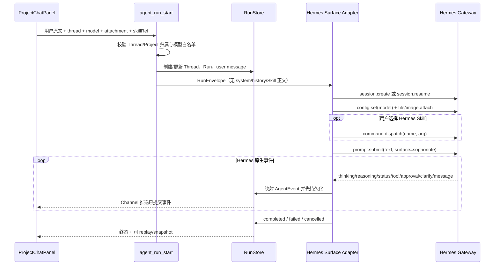

关键规则（迁移后仍成立）：

1. 正式事件 **RunStore-first**：相邻同类 delta 可在 Adapter 内无损合并，但形成的正式事件必须由复用的 RunStore 连接持久化成功后才推 Channel；不得先显示后补库。
2. 窗口重挂载从 RunStore 恢复；无终态不得猜测 completed。
3. Agent/Skill/MCP 不能直接改 `.md`；只能 propose Patch，用户决定后 DocumentService 落盘。
4. 重挂载恢复期间同一 Thread 不得启动下一轮；Channel 已绑定旧 WebView 时，由前端持续 replay/Snapshot 至终态，状态层门禁不可只靠按钮 disabled。

#### 23.1.3 Skill、MCP 与文档写入

- Agent Skill 目录来自 Hermes `commands.catalog`；选择后调用 `command.dispatch`，SophoNote 不读取或注入 Skill 正文。
- SophoNote 自有 Skill 源码位于 `skills/hermes/<category>/<name>/`，是版本化产品资源，不是每轮提示词。开发启动前 `scripts/sync-hermes-skills.sh` 将它原子安装到当前 Hermes Home；Runtime 启动/`skills.reload` 后成为唯一执行副本。旧固定端口/读取 Bearer Token 的 `sophonote` Bridge Skill 只在精确匹配旧内容时归档到 Hermes Home 的备份目录，不覆盖用户同名自定义 Skill。
- `sophonote-markdown-writing` 是笔记本/工作室共用的已有文档编辑 Skill，只负责当前选区/文档内的格式、校对、结构、提纲、改写、续写、模板、待办与标题；`sophonote-note-persistence` 负责把本 Session 已形成的成果保存到当前文档或显式项目。两者都是随包安装的 Hermes Skill，不由 React 拼提示词。目标唯一且用户已明确“保存/写入/需要”时直接执行；目标不唯一时只发起一次短澄清，不给“先新建—再附加—再发消息”的操作教程。详细用户入口见 [Markdown 写作指南](./sophonote-markdown-writing.md)。
- 用户通过编辑器浮动条或 `⌘L` 明确加入的选区，Host 使用 Gateway `file.attach(data_url)` 上传为 Session 内 `sophonote-selection.md`，再把返回的 `@file:` 引用随用户原文提交。附件只包含选中 Markdown 与审计元数据，不包含未选择正文；它不是 system prompt，也不会静默扩大作用域。若用户没有手选其他 Skill，Surface 只选择原生命令名 `sophonote-markdown-writing`，正文仍由 Hermes Runtime 加载。
- `sophonote-selection.md` / `sophonote-document.md` / `sophonote-project.md` 是 **Session 工作副本**，不是第二份 Markdown 真相源。前两者承载选区或当前文档；项目工作副本只含 Host 从 SQLite 重新解析的项目名、描述、文档 id/title/parentId 清单，不含成员正文，并提供初始为 `[]` 的受限 project-actions JSON 边界。左侧项目/文档的“加入会话”只切换下一轮可见 chip，不改变在途 Run。Skill 只能编辑对应边界并保留元数据。只要本轮带有有效工作副本和 Run 绑定，Host 就登记终态回收上下文，不能以“是否显式选择某个 Skill”作为写回开关。终态时正文变化生成 DocumentService dry-run Diff，标题变化生成改名确认卡，project-actions 仅接受 `create_document` / `set_document_parent`，最多 64 项，并校验项目、幂等、重名、父子关系与循环；项目工作副本不能修改任何既有正文。边界丢失、身份不匹配、JSON 无效或越权时均 fail-closed。
- 左侧编辑器是变更交付面：工作室和笔记本均从统一 Change Session 接收 diff，在原文位置逐 hunk 显示 ✓/×；接受后仍由 `document_apply_patch` 做 CAS、结构复检、原子落盘与 revision checkpoint，拒绝零写入，撤销按 operation 精确恢复。右侧 Chat 只显示简短执行说明和过程事件，不承担复制完整 Markdown 回左侧的流程。当前文档整篇格式化属于用户对可见 document chip 的显式目标，但仍只生成可部分接受的 Host Patch；该能力不作为通用模型工具暴露。
- Hermes 自有 Tool/MCP 状态机、Memory 与工具审批均留在 Runtime，SophoNote 只渲染并回传原生事件。
- 用户图片与 Hermes Desktop 使用同一原生附件链：SophoNote 读取本地/粘贴图片字节，调用 `image.attach_bytes(content_base64, filename)`，确认 `attached=true` 后仅提交用户原文。图片进入 Session `attached_images`，由 Hermes 的 image routing 随当前模型处理；Surface 不拼 `[User attached image]` 文案，也不承诺不存在的 `vision_analyze`。上传格式/大小失败或 Provider 不支持多模态时显示真实错误并要求切换模型。
- MCP 的浏览、新增、启停、认证、探测、移除与重载只调用 Hermes Dashboard/Gateway API；旧 `mcp_server_*` Tauri IPC 与本地 `McpManager` 不注册到产品应用。
- SophoNote 项目/文档能力属于产品领域。只有 Hermes 协议能提供 Host 可验证的 Session-bound capability identity 时才挂载；当前 fail-closed，绝不把 Lease、MCP Token 或权限说明塞进提示词。
- 未来开放 `propose_document_patch` 时仍恒为 dry-run；用户批准后的唯一写入口是 DocumentService。

#### 23.1.4 当前完成度与缺口

**历史测试资产**：`RigAgentEngine`、Adapter、循环与双跑 fixture 尚在仓库，但未注册产品 IPC，也不是故障回退。

**已完成（Hermes Surface）**：产品路径连接真实 `hermes serve` Gateway；Thread↔stored Session 1:1；创建/恢复、原生历史与 Memory、模型切换、图片/文件、Skill dispatch、取消、审批、澄清及完整过程事件已接入；SophoNote 不再传 system、历史副本、Skill 正文、Memory key、工作区 XML 或模型可见 Lease。Hermes 未配置时明确失败，不回退 Rig。

**未完成**：Developer ID 公证/独立干净 VM 发布证据；WebSocket 中断后的 Run 续接/对账整场；H9 物理删除 Rig；Host 可验证的 SophoNote Session-bound capability channel；笔记本 document scope/可写 Patch；Hermes Desktop 独立续写后的消息增量导入；附件与审批的真实宿主整场验收。

**相对 Hermes Desktop 的基础会话缺口（DEC-048，不复制完整 Desktop）**：

| Desktop 基础能力 | SophoNote 现状 | 开源前是否必须 |
|---|---|---|
| 流式回答 + Thought/Explored/Used | 已接 Gateway 事件并对照验收 | 已有 |
| `/` 命令、Skill、`@` 引用、能力面 | NEXT-041 代码完成，宿主视觉待对照 | 必须能用，不能只是协议接上 |
| 审批 / 澄清卡片 | Composer 已渲染 Gateway 请求 | 必须；宿主整场仍待走查 |
| 图片/文件/文件夹/URL 附件 | 契约已接入；会话 chat tab 用 Tauri `onDragDropEvent` 拿本机路径并按面板命中检测，不抢编辑器拖放；HTML5 仅作无路径图片兜底；真实 Run 待宿主 | 必须 |
| 模型选择（composer） | 已有；占用条读取 Gateway `session.info`/`session.usage` 的 `context_percent`。effort/fast 预设未做 | 占用条为开源前基础 |
| Composer 上一条历史、队列编辑 | 上一条/下一条历史已做；队列编辑仍受单 Run 门禁，不并行发下一轮 | 历史上一条为开源前基础 |
| 会话内查找（⌘F） | Composer 聚焦时 ⌘F 查找时间线 | 开源前基础 |
| 本轮 YOLO/审批开关 | Composer YOLO 透传 `config.set(key=yolo, scope=session)`；工作区询问/自动编辑/计划仍是宿主权限 | 开源前基础 |
| `/undo` | 不建 Run：`slash.exec undo` 撤回 Hermes 对话，裁掉对应 UI 审计 Run，并把原文预填回 Composer | 开源前基础 |
| 会话搜索/置顶/项目筛选 | 部分；SES-01/03 未齐 | 可与 IA 后续一起 |
| Bot Mode、HUD、语音、Memory Graph、worktree、消息通道、插件 | 明确不做克隆 | 否 |

公开开源另受 NEXT-068 约束：MIT/NOTICE、独立 GitHub remote 与密钥/路径扫描脚本已有；发布前仍须证明 Git 树不含 API Key、数据库、会话、工作室、笔记或 Hermes 私有 Home 等个人运行数据，并通过可复现构建与打包门禁。

#### 23.1.5 当前协议与安全边界的精确口径

| 对象 | 当前已实现 | 尚未实现/不得宣称 |
|---|---|---|
| Hermes Gateway | loopback WebSocket + Session Token；`gateway.ready`；Release 从包内 Manifest 启动钉扎 Runtime，随机端口/Token、私有 Home、逐文件 hash、Host/watchdog 双回收；Debug 可显式 Attached | Developer ID 公证/干净 VM 证据与断线续接整场 |
| Agent 执行引擎 | DEC-019：固定 Hermes；Release 只用 Bundled，Debug 显式 env 才 Attached；缺失/不健康失败；无设置项、无 Rig 产品分支 | 物理删除历史 Rig 测试依赖 |
| Composer 模型路由 | Hermes `model.options(include_unconfigured=true)` 是唯一真相源；客户端仅展示 `authenticated != false` 且有模型的 Provider；选择成对透传 provider/model，新 Session 用 `session.create`，已存 Session 用 `config.set(model --provider … --session)`；Surface 偏好只保存 slug/model | Inline Completion 仍有独立 ModelGateway 配置，后续只做设置体验协调，不混用凭据 |
| Hermes Session / Memory | `session.create/resume`；Thread 保存 `stored_session_id`；Hermes 原生历史、压缩与 Memory 持续维护；SophoNote 消息仅作 UI/审计副本 | Hermes Desktop 独立续写后的增量导入；冲突、删除和分支同步 |
| Skill / Tool / MCP / Browser | `commands.catalog` 发现与 `command.dispatch` 执行 Skill；`skills.manage` 浏览/搜索/安装并 `skills.reload`；Dashboard `/api/skills` 与 `/api/learning/node` 提供启停、使用量、编辑和可恢复归档；`tools.list/show/configure` 展示与切换 Toolset，`/api/analytics/usage` 聚合调用次数，Terminal backend 使用 Hermes 健康探测；MCP 新增/启停/移除/OAuth/探测及 Nous Catalog 安装复用 Hermes Dashboard `/api/mcp/*`，保存后调用 Gateway `reload.mcp(confirm=true)`；`browser.manage` 展示/连接/断开 Browser | Skill 升级/Hub 卸载、已有 MCP 原始配置全文编辑、运行日志与逐 MCP Tool include/exclude UI；这些管理动作不得回退到 SophoNote 旧本地清单 |
| 附件 | 图片 `image.attach(_bytes)`；文件 `file.attach`；文件夹/URL 作为用户显式引用 | 文件夹独立 RPC、输出附件下载/预览完整回归 |
| AgentEvent v4 | reasoning/status/tool/message/interim/approval/clarify/terminal；正文不经正则改写；RunStore-first + replay/snapshot | Gateway 重连后继续同一活跃 Run 的事件游标对账；更多 MoA/subagent 专属卡片 |
| SophoNote 领域能力 | 旧 Bridge/Lease 代码仅作迁移资产，产品 Run 不挂载、不向模型泄露凭据 | Host 可验证的 Session-bound capability channel；完成前项目/文档工具 fail-closed |

#### 23.1.5.1 三类会话的当前能力审计（2026-08-12）

“复用同一个 `ProjectChatPanel`”只代表共享 UI 和 RunStore 适配，不代表作用域、工具与双向同步已经等价。当前真实状态如下：

| 链路 | 一级会话 | 工作室会话 | 笔记本会话 |
|---|---|---|---|
| SophoNote Thread ↔ Hermes Session 1:1 | 已有 | 已有 | 已有，但目前复用 `projectId=null` 的全局 Thread 桶 |
| 消息/模型/附件 → Hermes Gateway | 已有 | 已有 | 已有 |
| Thinking/Tool/Answer → RunStore/UI | 已有 | 已有 | 已有 |
| Hermes Session/Memory | 原生 Session | 原生 Session | 原生 Session |
| 文档正文上下文 | 仅显式附件/引用 | 显式选区/当前文档工作副本；不注入项目其它正文 | 显式选区/当前文档工作副本 |
| SophoNote 文档能力 | 通用领域工具 fail-closed | 当前正文 Patch、标题提案、当前项目受限文档树 actions；其它领域工具 fail-closed | 当前正文 Patch、标题提案；其它领域工具 fail-closed |
| Hermes Desktop → SophoNote 的会话增量 | 未实现 | 未实现 | 未实现 |

所以当前可宣称的是：**三类入口都能启动真实 Hermes Session，并共享其模型、Memory、Skill、附件、工具状态机、过程事件和恢复能力。** 笔记本/工作室已开放显式当前文档的正文 Patch 与标题提案；工作室还开放由 Host 绑定当前项目并校验的文档树 actions。读取或修改项目其它内容的通用领域工具仍然 fail-closed，不能用提示词或旧 Lease MCP 补齐。

双向数据契约目标：

1. SophoNote 是产品会话目录与 UI/审计真相源；Hermes 是 Agent 执行与 Session/Memory 真相源。
2. `agent_threads.external_session_id` 永久稳定；在会话、工作室、笔记本之间打开同一 Thread 不创建新 Session。
3. SophoNote→Hermes：发送 Session、用户原文、模型、原生附件和 Skill 引用；不发送产品行为提示词。
4. Hermes→SophoNote：本 Run 通过 Gateway events 回写；其它客户端产生的离线消息后续按 Hermes message ID 增量导入，转换为只读外部消息/事件，不伪造 SophoNote Run。
5. 作用域不存进 Hermes Session 身份；每轮发送由 Rust 重新校验并冻结 `ScopeSnapshot`。同一个 Session 在不同产品视图打开时，权限只影响下一轮，不追溯改变历史 Run。
6. 笔记本必须新增 `scope_type=document, scope_id=<articleId>` 和精确 capability；只能读当前文档/选区，写入只产生 Patch 提案。不得用 `projectId=null` 同时表示“通用会话”和“当前笔记”两种权限。

#### 23.1.6 Hermes 目标：四平面与 AgentEngine

```text
执行平面  Hermes：loop / model / tool schedule / stream
能力控制面 Hermes：Skill / Tool / MCP / Browser 状态与授权
产品控制面 SophoNote：领域权限、文档审批、ScopeSnapshot、审计
数据平面  SophoNote：.md、SQLite、RunStore、operation 审计
产品领域  SophoNote：笔记/发现/证据/选区 Patch/Inline Completion
```

稳定接口（防止业务耦合 Hermes JSON-RPC）：

```text
AgentEngine
  health()
  run_with_events(RunEnvelope)
```

产品 `RunEnvelope` 只携带 SophoNote Run/Thread 绑定、Hermes `stored_session_id`、用户原文、所选模型、用户可见范围对应的原生附件、Skill 引用、取消令牌与事件出口。不得携带 history、system instructions、Skill 正文、Memory key、隐式项目/工作区正文或 allowedTools 文本说明。笔记本/工作室界面已经明确显示的“当前文档”chip 属于用户可见输入范围：Host 在发送时先冲刷当前草稿并读取对应 `baseVersion`，再转换成 `source: sophonote-document` 的有界 Session 工作副本；它不是隐藏 prompt，也不授予真实文档写权限。项目中其它文档仍不得自动注入。

**Session / Memory 所有权（DEC-013）**：新 Thread 首次发送时在同一 WebSocket 调用 `session.create`，立即 `prompt.submit`，并将 `stored_session_id` 写入 `agent_threads.external_session_id`；后续轮次调用 `session.resume(omit_messages=true)`。Hermes Session/AIAgent 自己恢复历史、压缩与长期记忆；SophoNote 的 `agent_messages` 是 UI/审计副本，绝不回灌模型或另做召回。

**能力透传与附件边界（DEC-014）**：Composer 的图片、文件、文件夹、URL、模型选择统一进入 `AgentRunStartArgs`。Rust 只做类型、大小、URL scheme 和符号链接校验；图片调用 `image.attach`/`image.attach_bytes`，文件调用 `file.attach`，URL/文件夹保持为用户显式引用。唯一的 Surface 文档适配是用户可见的选区或当前文档范围：选区上传 `sophonote-selection.md`，无选区时当前文档上传 `sophonote-document.md`，两者都保留原文且选区优先。客户端不得扫描其它文档、造项目上下文包或自动补写附件处理指令。Hermes 新增能力时优先扩展 Gateway capability discovery，不在 React 中复制 Agent 逻辑。

**Composer 命令与引用协议（DEC-021）**：SophoNote 是 Hermes Client Surface，不是另一套 CLI 实现。输入 `/` 时从 Gateway `commands.catalog` 读取原生命令分类与 Skills；普通可执行命令随 Run 调用 `slash.exec`，返回 `send/skill` 时继续进入同一 Session 的 `prompt.submit`，返回 `output/exec` 时按同一 Run 的可见结果收敛。`/undo` 与本轮 YOLO 不创建 Run：前者调用 `slash.exec` 并按 `prefill` 预填 Composer，后者调用 `config.set(key=yolo, scope=session)`。SophoNote 自身窗口动作（新会话、模型与能力面、停止）只在客户端路由，不伪装成 Runtime 命令。输入 `@` 时从 `complete.path` 读取引用入口；文件、文件夹与 URL 必须转成用户显式选择的原生附件，不能因为补全而扩大宿主文件读取权限。Tool 仍由 Hermes Agent 状态机自主调用，Surface 不生成 `/tool-name` 静态别名。

**能力控制面（DEC-021 补充）**：能力面是 Hermes Desktop Capabilities 的 SophoNote Surface，而不是只读清单。Rust 适配层可同时读取 Gateway RPC（会话目录、Toolset、Tool、Browser）与同一 Hermes 实例的 loopback Dashboard API（Skill 启停/使用量、Terminal backend 探测、MCP Catalog、Hub 来源与预览），但前端只接收显示所需的结构化投影。MCP `headers`、Bearer Token 与环境变量值属于只写数据：仅在用户提交时发送给 Hermes，能力快照和安全配置预览只能返回“已配置”标识或变量名。Capabilities 的启停、安装、探测、认证、执行后端选择均写回 Hermes，再刷新同一真相源；SophoNote 不落第二份 Skill、Tool、MCP、Browser 配置。

**发现订阅与计划任务（DEC-022）**：计划任务直接复用包内 Hermes 0.20 的 `cronjob`、`cron/jobs.json`、`cron/executions.db` 与 `/api/cron/*`，Hermes 是任务定义、下次执行、启停状态和运行历史的唯一真相源。Chat 与 SophoNote 的表单管理面都只调用 Hermes Cron 原生创建、更新、暂停/恢复、触发、运行历史和删除接口，固定 `deliver=local`；SophoNote 不复制任务到 `sophonote.db`，也不自建 tick/重试状态机。左侧主导航的“计划任务”与“知识库”平级，列表隐藏内部 ID 与 cron 原文，只投影中文执行规则、可选项目、有效状态和下一次执行；任务详情借鉴 Claude Code Desktop 的本地计划任务层级，优先提供每小时、每天、工作日、每周预设，把按间隔、单次和原生表达式作为进阶选项，并明确使用系统本地时区。模型选择写入 Hermes Cron 原生 `provider/model`，且任务定义、启停状态与运行历史只保存在应用私有 Hermes Home，迁移或升级时原位保留。MindBox → SophoNote 品牌迁移在 Runtime 启动前按相同 Hermes 版本检查：只有新 Home 缺少 `cron/jobs.json` 且旧 Home 存在任务时，才补拷任务定义、空库情况下的执行数据库、缺失的 notepad/审计文件和输出目录；旧目录保留，已有新任务或非空新执行库绝不覆盖。开源任务范例位于版本化 `examples/scheduled-tasks.json`，只保留名称、说明、自然语言 prompt、计划表达式和 SophoNote Skill 引用；不得从私有 Hermes Home 复制任务 ID、历史、模型、时间戳或输出。React 只把用户选中的范例转成 Cron draft，Host 通过 `startPaused` 在创建后立刻暂停；范例不会首启播种或自动重复创建。`provider/model` 必须成对出现并属于“设置配置 ∩ 凭据有效 ∩ Runtime 可执行”；新建/更新未选择模型时允许保存任务，但 Host 必须立即暂停。历史任务缺失模型、使用 `moa/default` 占位或所选模型已失效时，列表对账只原位暂停，不猜测、不补写全局默认模型；恢复和立即触发前再次校验显式模型。暂停任务配置有效模型后允许经原生 `/trigger` 单次执行，只有显式恢复才参与周期调度。可选项目归属复用原生 `workdir` 映射到 SophoNote 私有项目工作目录，不新增平行关系表。本期不模拟 Hermes 未提供的工作树、权限审批、跳过原因或云端执行，也不配置微信、飞书或其他外部 delivery。

**设置页调度收口（DEC-029）**：移除旧 `daily_report_time` 本地提醒轮询及 `sophonote:daily-report-due` WebView 事件，也不再读取或写入 `daily_report_time`、`nightly_insight_time`。这两个遗留 SQLite setting 可保留为无效兼容数据，但不得控制产品行为。日报/解读的时间与状态只能来自 Hermes Cron。正文抓取仍由每源抓取后的新条目预热、失败重试以及启动后的按源配额补抓完成；`content_coverage_stats` 与 `backfill_item_contents` 可保留为 Host 诊断接口，但普通设置页不展示覆盖率或手动补抓入口。

数据源设置不再维护页面级联通汇总展示。每个 `Source` 的最近抓取状态、错误原因与健康指标仍由现有 Host 数据提供，并仅在对应数据源卡片内呈现；删除顶部说明和聚合徽标不改变抓取、重试或健康状态计算。

包内 Hermes 构建必须从同一钉扎 `uv.lock` 显式导出 `mcp` extra，并在生成资源清单前验证 `mcp.client.streamable_http` 可导入；否则 Runtime 虽能展示 `sophonote-bridge` 配置，却无法注册其 HTTP 工具。发现刷新、候选读取、全量评分、证据读取、分析保存、周期报告和模型榜快照不得退化为终端、浏览器或任意 HTTP 绕行；注册工具数量随 Bridge 契约测试同步，不以过期常量作运行结论。

定时信息拉取仍由 SophoNote 数据面执行：Skill/cron 调用 `sophonote-bridge.refresh_discovery_sources`，参数只接受 `github`、`arxiv`、`hackernews`、`producthunt`、`huggingface`、`aihot` 六个产品类别，并映射到已存在且启用的数据源 ID；Rust 复用 `scheduler::fetch_sources` 完成 HTTP、标准化、去重、源健康和事件广播，返回本轮新增 itemId。其中 `aihot` 走官方匿名只读 v1 API（无需 Key，ETag/304 增量），用途限个人非商业（NEXT-051）。所有抓取结果先进入设置收件箱，不因未入选而丢弃原始信息。该工具是环回 Bearer 下的 Host 自动化能力，不接受路径、URL、命令、任意 source id 或文档写入；项目文档工具继续要求逐 Run Lease，不能因计划任务而放宽。

发现筛选由 Hermes `sophonote-ai-radar` Skill 执行而不是 React/ModelGateway：`list_discovery_candidates` 返回近 7 天紧凑候选、来源 Prompt、评分规则和最低分；Skill 同趟完成 score/aspect/受控主题标注，并把 `save_discovery_scores` 作为生成前硬门禁。`items.ai_score/ai_scored_at/aspect/ai_topics/ai_reason` 是五断面数据面；**精选、全部 AI 动态及主题时间线都只读已有关联 `deep-dive` Article 索引的条目**，精选另为 aspect 非空、近 7 日、≥8.5，全部为 ≥7。正文遵循全局不变量：Markdown 文件是真相源，SQLite `articles` 只存索引，查询不得把空的兼容 `content` 列误判为无正文。发现时间线可分页，但条目详情和关联深度解读必须经 Rust 按 `itemId` 精确读取并从 Markdown 回填正文；全局 `items/articles` 的有界列表缓存只用于列表性能，不能作为“条目或解读是否存在”的判断依据。每日 `action=daily` 先以 `missingDeep=true, allTime=true` 批量补齐历史/失败 deep，再刷新、评分和生成本轮 quick/deep/pick；独立 `action=backfill-deep` Cron 退役并由对账器删除，避免无队列空转和双任务争用。AIHOT 无法二次正文抓取时，Bridge 仅以已入库候选描述构造 `[E1]`，不对原链接抓网或推测。`read_discovery_feed` 只读已存数据供日/周/月报告生成，`save_discovery_report` 经 Markdown Article 单一路径保存报告；这些自然语言产物始终由 Skill 生成，Rust 只校验结构并持久化。

模型榜使用独立 `sophonote-openrouter-rankings` Hermes Skill，与 AIHOT 和资讯评分管线解耦。Skill 的 `action=refresh` 只能调用 SophoNote Bridge 的 `refresh_openrouter_rankings`，且该调用必须是首个动作：不得先调用 `skill_view`、`tool_describe`、浏览器、终端或其它工具，把真正的 Host 副作用推迟到第二轮模型请求。Rust 从 provider=`openrouter-rankings` 的 Host 凭据读取 API Key，调用 OpenRouter 官方 `/api/v1/models`、`/api/v1/datasets/rankings-daily`、`/api/v1/classifications/task`、`/api/v1/datasets/session-cost` 与 `/api/v1/benchmarks`，校验成功响应后把一个完整 JSON 快照原子写入 SQLite。该凭据只在「设置 → 数据源」配置，并使用既有数据源卡片视觉格式置于列表末尾：Release 以 Keychain 为唯一真相源；未签名 Debug 宿主若因 Keychain ACL 写入失败，可使用 DEC-012 已定义、仅 Debug 编译可达且明确标识的 `apikey:*` 本机开发回退。Bridge 同时提供只读 `read_openrouter_rankings`；React 只通过 Tauri 读取最新快照并以原生 HTML/SVG/CSS 渲染，不直连 OpenRouter、不读取 Key、不 iframe 嵌入第三方页面。榜单必须展示 OpenRouter 署名与 `as_of`，失败保留上一份成功快照；旧 `save_model_board_snapshot`/AIHOT 共识榜只作迁移读取，不再更新。计划任务运行投影保留 Hermes 原生状态，但首轮超过 2 分钟且模型/工具完成计数仍均为 0 时，应在历史与详情中标注“启动异常”，避免把 Provider 长等待误呈现为正常业务执行。

卡片解读沿用同一 Hermes Skill，但使用独立的受限 Host 工具：`read_discovery_item` 只接受数据库中存在的 `itemId`，返回有上限的 metadata、来源策略、正文摘要和 evidence，并在 `quality_level < 2` 或 unsupported 时拒绝；`save_discovery_analysis` 只接受同一 `itemId` 的 `quick`/`deep` 结果，校验字段、长度、证据引用和目标存在性。`quick` 更新条目的结构化速览；`deep` 通过 `notes::insert_article` 单一写路径创建或替换深度解读。发现 UI 只消费结果，不显示生成或重新生成按钮；用户需要生成时通过 Hermes Cron 或会话自然语言调用 `sophonote-ai-radar`，React 不直接调用 ModelGateway、复制 Skill 正文或从最终自然语言反解析业务字段。

**工作区端状态（能力协议）**：项目清单、当前文档与 SelectionSnapshot 不拼进 system prompt。选区/当前文档仅在界面存在可见范围 chip 时作为原生 Session 工作副本进入当轮；选区优先，且副本不得被持久化成第二份文档真相源。正文、标题与项目树分别使用独立边界：Host 在回合终态校验 Run/Session 本地绑定、发送时快照、baseVersion、当前 projectId 和动作白名单；正文只生成 Patch 提案并由用户逐 hunk 决定，标题只生成改名提案，项目树 actions 只能创建当前项目文档或设置同项目父级。任何工作副本都不提供读取项目其它文档的能力。旧 `leaseId` 模型参数路径不得复活；Agent 也不得为读取已附加正文而调用该旧 MCP。

**DEC-012（模型配置）**：Hermes Agent 的 Provider/模型目录及会话模型状态由 Hermes Runtime 持有，Provider 凭据以 SophoNote 的 macOS Keychain 为唯一持久化真相源；Host 启动 Sidecar 时只把已配置凭据短期注入该子进程环境，不写 Hermes 配置、SQLite、WebView、日志或命令行，也不注入可让空模型 Cron 静默执行的 `HERMES_MODEL`。会话选择器直接读取 `model.options(include_unconfigured=true)` 并按 Runtime 的 `authenticated` 状态过滤，Provider/模型成对传递；新 Session 在 `session.create` 指定，恢复 Session 经 `config.set(... --provider ... --session)` 切换。计划任务必须显式保存 provider/model，否则保持暂停。SophoNote 产品路径不创建 Agent 用的本地 ModelGateway；AIConfig 只继续服务 Inline Completion 等非 Agent 轻量路径。

启动凭据投影不能假设 SQLite 已存在 `ai_config`：若用户尚未修改过默认配置，Host 使用与 ModelGateway 相同的内置 DeepSeek snapshot，并把 Keychain（或仅 Debug 开发回退）中的 `deepseek` 凭据短期注入 Sidecar。设置页的 Key 保存命令先完成凭据落地和进程缓存，再重启包内 Runtime；第二阶段失败只返回 Runtime 警告，不能让前端丢失“已配置”标记。

Transport：产品会话使用 **Gateway JSON-RPC/WebSocket**（`session.create/resume`、`prompt.submit`、`file/image.attach`、`config.set`、`session.interrupt`、`approval/clarify.respond`）；Runs HTTP/SSE 只作迁移兼容和诊断。两者都收敛在 `AgentEngine`/Surface Adapter 内，不污染业务 DTO。

进程约束：仅 `127.0.0.1`、随机端口、随机 Session Token、React 不直连、`HERMES_HOME` 在 App Support 私有目录、随应用签名锁定版本。Hermes 原生工具是否启用由其配置与审批状态机决定；SophoNote 领域目录不会仅因页面打开而自动暴露。

#### 23.1.7 当前 Gateway 时序与断线缺口

**正常路径（Gateway）**

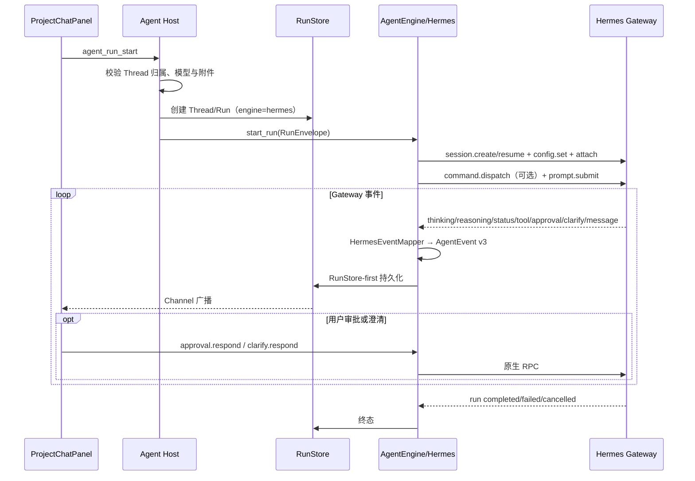

**断线缺口（不得猜完成）**：当前 WebSocket 在 `message.complete` 前断开会明确失败，不伪造 completed。下一阶段需要使用 Hermes Session 状态/消息游标重新连接并对账活跃 Turn；完成前不能宣称支持 Gateway 重启后的无缝续跑。

事件映射原则：Hermes Gateway event → `HermesEventMapper` → SophoNote AgentEvent **v3** → 先 RunStore 再 Channel。`agent_runs` 保存 `engine_transport=jsonrpc+websocket`、`external_session_id` 和协议版本。

| Hermes 侧 | SophoNote AgentEvent v3 |
|---|---|
| `prompt.submit` 已受理 | `run_started`（Surface 本地生命周期） |
| token/message delta | `message_delta` |
| thinking/reasoning delta | `reasoning_delta` / `reasoning_completed` |
| tool started/completed | `tool_started` / `tool_completed` |
| approval request | `approval_required` |
| clarify request | `clarify_required` |
| run completed | `message_completed` + `run_completed` |
| failed / cancelled | `run_failed` / `run_cancelled` |
| 不可恢复中断 | `engine_degraded` + `interrupted` |

#### 23.1.8 现有 `agent/*` 与目标文件映射

| 现有文件 | 迁移后角色 |
|---|---|
| `agent/mod.rs` | 导出 `engine`、`hermes`；保留 commands/store/events |
| `agent/commands.rs` | 对外 `agent_run_start/cancel/…` 协议保留；内部改调 `AgentEngine` |
| `agent/store.rs` | **保留并增强**（engine 元数据列、v2 事件） |
| `agent/events.rs` / `types.rs` | 升 v2 schema；DTO 仍 SophoNote 自有 |
| `agent/run_controller.rs` | 历史 Rig Spike/测试资产；不注册产品 IPC，完成夹具迁移后删除 |
| `agent/adapters.rs` | Rig 专用；生产切 Hermes 后删除或仅测回退 |
| **新增** `agent/engine.rs` | `AgentEngine` trait + 错误类型 |
| **新增** `agent/hermes/{mod,client,supervisor,config,event_mapper,recovery}.rs` | spawn/health/HTTP-SSE/映射/对账 |
| **新增** `sophonote_mcp/{server,lease,policy,tools,external_mcp_proxy}.rs` | Bridge + Lease |
| **新增** `skills/hermes_export.rs` | 只读导出派生 SKILL 缓存 |
| `model/*` | **保留**：Inline Completion 与非 Agent AI |
| `tools/*` | 领域工具实现迁入 Bridge 背后；管理命令仍不对模型开放 |
| `documents/*` | **核心不变量不改** |

#### 23.1.9 Hermes 迭代计划（与台账 NEXT-018～025 对齐）

| 步骤 | 工作包 | 验收门槛 | 依赖 |
|---|---|---|---|
| H0 | 文档 DEC-011 + 原则修订（本轮） | PRD/架构/台账口径一致 | 无 |
| H1 | `AgentEngine` + `RigAgentEngine` 适配现网 | **已完成**：前端/RunStore 零感；`cargo test agent::` 全绿 | H0 |
| H2 | Hermes Supervisor：签名二进制、环回、Token、health | **已完成（协议 stub）**：`health/detailed` 绿；崩溃不伤 Markdown；真实 Hermes 打包不在此结论内 | H1 |
| H3 | API Server 只读 Run（list/read/search/evidence） | **已完成（协议 stub）**：无写文件；事件入 RunStore；Adapter 内只读工具（非 Bridge） | H2 |
| H4 | AgentEvent v2 + SSE 重连/对账 | **已完成（协议 stub）**：断网→重连或 interrupted；无假 completed；只验证“未来仅安装 SophoNote”的协议形态，未验证真实 Runtime 随包 | H3 |
| H5 | MCP Bridge + Lease + Skill 导出 | **已完成（协议/内存）**：越权/过期 Lease 拒绝；Skill 只读缓存；modelRoute 来自 SophoNote settings（DEC-012） | H4、NEXT-011 协同 |
| H6 | `propose_document_patch` 经 Bridge | **已完成（协议）**：`invoke_with_tools` + Lease；dry-run 不改 notes；审批/DocumentService 不变；`hermes_patch_bridge_h6` | H5 |
| H7 | 黄金任务双跑 Rig vs Hermes | **已完成（自动）**：终态类别一致、写工具不旁路、Lease 边界；`hermes_dual_run_h7`（非宿主录像） | H6 |
| H8 | Hermes 设为默认 | **已完成并被 DEC-019 收口**：历史阶段曾提供切换，现产品固定 Hermes | H7 |
| H9A | 移除 Rig 产品回退 | **已完成**：移除 `agent.engine` UI/读取、生产 Run Rig 分支和注册的 Rig Spike 命令；Hermes 不可用明确失败 | H8 |
| H9B | 物理删除 Rig 依赖与历史夹具 | **待清债**：不影响 Hermes-only 产品语义；完成全量 Rust 夹具迁移后删除 `rig-*`、Adapter 与旧循环 | H9A + 回归夹具迁移 |

**优先级纪律**：P0 书写宿主验收优先于 H3+；H 系列不得拖垮输入/切换性能。并发首版 `max_concurrent_runs: 1`。

### 23.2 笔记编辑、保存、预览与 AI 修改

内置功能范例是版本化 Markdown 产品资源，不属于用户笔记真相源。笔记本进入、日期切换与空态渲染不得读取范例后自动落盘；只有用户点击“导入功能范例”时，前端才通过既有 `appStore.saveArticle → Rust notes::insert_article → DocumentService` 链路逐篇创建缺失范例。同名用户笔记不覆盖，重复导入只补缺失项；导入后的文件与普通笔记、模板完全同权，可编辑、改名或删除。开发走查脚本可复用同一批资源，但其直接注入私有数据目录的能力不得成为产品运行路径。

#### 23.2.1 真相源与组件职责

| 层 | 职责 | 不变量 |
|---|---|---|
| `.md` 文件 | 正文长期真相源 | 一篇文档一个 UUID 文件；写入使用唯一临时文件和原子 rename |
| SQLite `articles` | 标题、类型、version、时间、关系元数据 | `version` 是 CAS 闸门，不是用户历史版本 |
| `MarkdownEditor` | Crepe/ProseMirror EditorState、history、selection、Decoration、completion | 正常编辑 transaction 才进入 history；ghost/diff 不写 Markdown |
| `DocWorkspace` / `NoteWorkbench` | 标题、模式、保存、滚动、大纲和编辑器句柄 | 笔记本和 AI 工作室操作同一 Article/Markdown，不复制正文 |
| app/project/change stores | 文档列表、项目关系、变更会话分别管理 | store 不合并；不同生命周期不互相覆盖 |
| DocumentService | AI Patch 预览、应用、拒绝、撤销、补偿和恢复 | baseVersion、TextAnchor、hunk、CAS、幂等和用户决定不可绕过 |

#### 23.2.2 普通编辑与文档切换

当前普通编辑主链为：ProseMirror transaction → 只标记编辑器 dirty → trailing/max-wait 到期后序列化 → `DocumentDraftQueue` 按文档保存 → Tauri 命令 → Rust 文档底层写路径 → 唯一临时文件/原子 rename → SQLite version/索引更新。前端已实现的 `DraftRecord` 等价字段为：

```text
DraftRecord = {
  documentId,
  markdown,
  title,
  dirty,
  generation,
  persistedGeneration,
  savedMarkdown,
  savedTitle,
  inFlight,
  error
}
```

必须遵守：

1. 文档 A 的保存完成回调不能修改文档 B 的 dirty/error/版本状态。
2. 切换文档先同步捕获该文档草稿后立即导航，不等待文件/SQLite；失败必须留在原文档队列并在再次打开时恢复 dirty/error 和重试入口。
3. 外部正文变化不能使用无语义的全量 replace 覆盖活跃 EditorState。同步 transaction 必须明确是否加入 history，并校验目标 documentId/version。
4. 编辑、预览、分屏切换需要保存 selection、scroll、focus 和 editor history；隐藏编辑器必须退出 Tab 顺序并暂停快捷键、补全和扫描。
5. 不允许为了性能绕过原子写、CAS 或保存失败反馈。

第一轮整改已完成 DraftRecord、空闲零轮询、分屏变更快照、关系 idle/输入复用、App/常驻组件 selector、文档非阻塞切换、页面 chunk 预取和编辑后保活。保活不是裸 `display:none`：预览态同时设置 readonly、`inert`、移出交互并暂停补全/选区工具。DEC-047 在页签层对笔记本/工作室最多两个工作区做同样约束，并停泊原生子 WebView。剩余热点为输入停顿时全文序列化、分屏全文渲染、列表插件扫描，以及保活后仍高于 PRD 的暖切换/A/B 数字（见台账 NEXT-004）。

#### 23.2.3 Undo、operation 与 checkpoint

三种机制语义必须分开：

| 机制 | 用户语义 | 生命周期 |
|---|---|---|
| ProseMirror history | `⌘Z/⇧⌘Z` 的连续写作撤销/重做 | 当前编辑会话；AI 应用应尽量合并成一次 transaction |
| `document_operations` | AI 修改提案、决定、冲突、提交和重启恢复的审计 | 按 operation 保留，不形成可浏览版本列表 |
| `document_revisions` | AI 应用前事故恢复 checkpoint | 有界、短期、后续人工写入后失效；不对外包装为版本历史 |

目标约束：每文档最多一个有效 checkpoint，建议 TTL 24 小时；新 checkpoint、后续人工写入、文档删除和 GC 都要清理旧记录。当前此上限和失效清理尚未实现，见台账 ISSUE-007。

#### 23.2.4 AI 局部修改链路

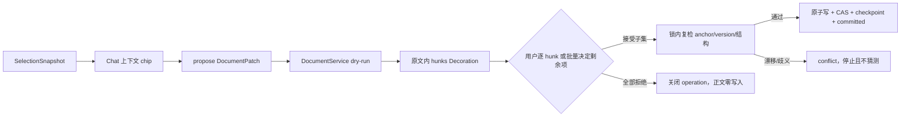

`SelectionSnapshot` 包含文档、版本、ProseMirror 范围、选中文本 hash 和前后文；Rust `TextAnchor` 只接受唯一匹配。零匹配或多匹配都进入冲突。整篇重写属于独立高风险语义，默认不向模型开放。纯拒绝正文零写入，不得依赖草稿保存成功。

多 hunk 审阅条只显示剩余未确认数，并提供逐处导航以及仅图标的“接受全部剩余项 / 拒绝全部剩余项”。批量动作只填充 `pending` 决策，不覆盖用户已经逐处作出的 `accepted/rejected`；仍由 `changeSessionStore` 一次性归约接受子集并走同一草稿 flush、CAS、原子写与冲突路径。已决定区域立即退出待审阅红/绿色样式，拒绝项恢复原文普通态，接受项用正文普通样式展示；在全部 hunk 决定前，这些视觉变化仍是 Decoration，不提前写入 Markdown。

笔记本“今日痕迹”是聚合导航，不属于 Markdown 正文或预览头部。`DocWorkspace` 负责聚合今日笔记、AI 解读与 Top5，并把入口作为 `NoteWorkbench` 顶栏 `⋯` 菜单项；打开后以中央区独立视图覆盖文档工作台，底层编辑器保持挂载但通过 `inert` 冻结，返回后保留原文编辑状态。点击痕迹项先关闭独立视图，再由既有文档/发现导航通道跳转，不复制内容、不写入正文。

笔记本左栏的日期导航采用常驻月视图。活动热度由全量 Article 的本地日期聚合：创建日计一次，若 `updatedAt` 与创建日不同则编辑日再计一次，同一文档同一天去重；这只是已有事实的前端派生，不新增第二份活动数据库。日期筛选只作用于笔记本 `docs`：journal 以合法的 `YYYY-MM-DD` 标题作为所属日，普通笔记以 `createdAt` 本地日作为所属日。切日或“回到今天”只选择该日已有的首篇笔记；没有笔记时保留空列表，不创建历史或今日 journal。文档创建只来自用户点击“新建笔记”或显式模板入口。

### 23.3 Inline Completion

Inline Completion 是写作低延迟旁路，不属于 Agent Run。

#### 23.3.1 组件与状态机

```text
ProseMirror update
  → inlineCompletionSetup（提取 caret/prefix/suffix/title/outline）
  → InlineCompletionController: idle → debouncing(300ms) → requesting → visible
  → Tauri completion_suggest
  → Rust CompletionService → ModelGateway
  → 绑定校验(articleId + documentVersion + anchorHash + prosePos)
  → Decoration ghost
  → Tab 接受为普通文本 transaction / Esc 拒绝
```

- ghost text 仅存在于 Decoration，不进入 Markdown、dirty 或 history；Tab 接受后才作为普通插入进入正文和 undo。
- 任意新输入、选区、光标、文档、version 或 anchor 变化都会取消/丢弃旧结果；服务端取消通过 `CancellationToken` 传播。
- 无 ghost 时 Tab/Esc 完全放行 Crepe 原行为；有 ghost 时捕获阶段拦截。
- frontmatter、代码围栏、表格行、行内代码、链接地址和非折叠选区默认抑制建议。

#### 23.3.2 请求预算、缓存与质量

请求只携带标题、大纲（最多 20 项）、光标前后窗口、语言、项目和绑定信息，不默认发送整篇。前端当前窗口上限为 prefix 400、suffix 200；Rust 使用专用低温、禁思考、`max_tokens=128` 的 Completion 请求。

服务默认超时 3,000ms，可配置并夹紧在 300～5,000ms；内存缓存 TTL 60 秒、最多 64 条，不落盘。建议必须是单一续写、无围栏/结构性列表、与 suffix 不重叠且不超过 120 字；无法自然续写、未配置、超时或错误时返回空建议并静默降级，不弹窗打断写作。

只记录 requests/cacheHits/completes/filtered/timeouts/errors/accepts/rejects/延迟等聚合指标，不记录正文上下文或建议全文。下一阶段以中文自然度、打扰率、接受率和首字延迟判断是否优化，不通过扩大上下文或接入 Agent 来掩盖质量问题。

### 23.4 信息采集、正文证据与沉淀

#### 23.4.1 采集链路

当前支持 GitHub、arXiv、Hacker News、HuggingFace models/papers 和 Product Hunt 等来源。手动刷新与 60 秒调度共用同一抓取入口：

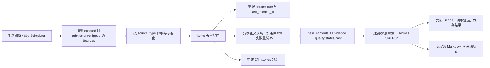

来源状态包含 tier、admission、抓取间隔、成功/失败计数、最后成功和最后错误。`admission=skipped` 的高风险源不进入抓取。每源顺序抓取；正文预热独立后台执行，条目之间节流，失败不阻塞列表入库或写作功能。

#### 23.4.2 数据与质量门禁

| 数据 | 职责 |
|---|---|
| `sources` | 来源配置、分层、准入、间隔和健康状态 |
| `items` | 统一元数据、来源、URL、热度和 AI 摘要标签 |
| `item_contents` | 正文/摘录、Evidence JSON、contentType、qualityLevel、hash、状态和错误 |
| `stories`/关联数据 | 24 小时内跨来源故事聚合与去重视图 |
| Markdown Article | 用户确认后的长期知识沉淀，保留来源链接与 `sophonote:item` 反链 |

AI 速览和深度解读必须使用已抓到的 evidence，并以 `[E1]` 等引用绑定关键判断。`unsupported` 或低质量内容不得伪装成完整证据；失败状态和错误应对用户可见。正文缓存优先复用，backfill 和 coverage 统计用于补齐与诊断，不等同于产品价值指标。

#### 23.4.3 各来源正文与证据策略

| 来源 | 当前证据获取 | 状态/质量要点 |
|---|---|---|
| GitHub Trending | E1 README（最多 18,000 字符）、E2 最新 Release、E3 License/语言/Stars/Forks/更新时间等仓库元数据；token 可选，匿名受限额 | 有 README 为 ready；至少一项证据可达 quality 2，多类证据可达 3 |
| Hacker News | E1 外链 HTML 清洗正文（最多 12,000 字符）或 Ask/Tell HN 自帖；E2 最多 4,000 字符高质量评论，Algolia 优先、Firebase 回退 | 正文少于 400 字符、登录墙或反爬标 partial；非 HTML/超限无其它证据时 unsupported；有评论时可降级为 partial/quality 2+ |
| arXiv / HF Papers | 完整 abstract；arXiv 历史截断摘要按论文 id 回源补齐并回写元数据 | 摘要存在即 ready/quality 2；当前不解析 PDF |
| HuggingFace Models | Model Card（最多 18,000 字符）加模型元数据，官方端点失败时允许受控镜像回退 | 有 Model Card 为 ready；仅元数据为 partial；覆盖率需按源监控 |
| Product Hunt | GraphQL post 详情：description、topics、makers、website、热度等 E1；精选 comments 为 E2 | 无 token、详情不存在时 unsupported；description/comments 均不足时 partial；取得有效详情并过门禁后允许 AI，不再永久排除该来源 |

Evidence 至少保存 `id/kind/title/url/text`，AI 输出中的关键事实必须引用相应 `[Ex]`。来源等级只影响信任权重，不替代内容质量门禁；营销来源拿到充分事实证据后可以使用，官方来源只剩标题时也必须拒绝生成。

#### 23.4.4 网络、缓存与降级

- `ready`、`partial`、`unsupported` 在 24 小时内复用；`failed` 至少间隔 1 小时才重试。内容 hash 未变时不得重复生成 AI 或重建索引。
- HN 外链只允许 HTTP/HTTPS，禁止 `localhost`、`::1`、`.local`、`.internal`、IPv4 10/8、127/8、192.168/16、172.16～31/12、169.254/16 和 0/8；重定向最多 3 次、请求 20 秒、响应体最多 5 MB，只解析 HTML，不执行 JavaScript。
- 安全校验当前基于 URL host/字面 IP；如未来允许更广泛的任意 URL 抓取，需要补 DNS 解析后私网校验和逐跳重定向复检，避免 DNS rebinding/重定向绕过。
- 所有第三方 HTTP 都由 Rust 发起，WKWebView 不直接跨域请求；批量抓取按条目节流并记录来源、HTTP 状态和错误，不得阻塞 Markdown 写作主链路。
- GitHub 匿名 API、HF 镜像、Product Hunt token 或模型不可用时，保留元数据和失败原因；编辑、搜索本地文档和导出继续可用。

#### 23.4.5 演进方向

- 外部来源、模型或镜像不可用时，已有 Markdown 编辑、搜索和导出必须正常；Discover 显示失败/部分内容而不是阻塞应用。
- GitHub 匿名 API、HuggingFace 镜像和 Product Hunt token 都可能受限；批量调用必须限速，错误保留 HTTP 状态和来源维度。
- 下一阶段不以“抓取条数”单独评价成功，需同时观察来源成功率、正文覆盖、重复率、打开率、AI 解读触发率和沉淀率；低价值或高失败来源应降级、暂停或移出默认集合。
- daily-picks 的联网增强保持确定性 workflow + 受控 Agent 步骤，不允许后台 Agent 自建调度器或绕过现有证据/写入链路。

### 23.5 新版产品壳、会话与知识组织

#### 23.5.1 目标页面组件树

```text
AppShell
├─ PrimarySidebar
│  ├─ 发现
│  ├─ 会话
│  ├─ 工作室
│  ├─ 笔记本
│  ├─ 计划任务
│  └─ 工具 / 任务
├─ PageHeader
│  └─ EmbeddedAgentToggle（仅工作室/笔记本）
├─ ActivePage
│  └─ AgentScopeProvider
└─ EmbeddedAgentPanel（仅工作室/笔记本，可折叠）
   ├─ ConversationCore(mode="compact")
   └─ BrowserSurface(threadId)

ConversationPage
├─ ConversationHistoryPane
├─ WorkArea
│  ├─ ConversationCore(mode="full")
│  └─ CodeWorkspace（绑定目录后）
│     ├─ FileTree / CodeEditor / CodeDiffReview
│     └─ TerminalSurface / PreviewSurface
└─ CollaborationPane
   ├─ Chat
   └─ BrowserSurface(threadId)

StudioProjectView
├─ ProjectNavigator
│  └─ Project → existing Sessions（为空则不展示子项）
├─ IDECanvas
│  └─ LocalWorkspace（Files / Changes / Terminal；代码与 Markdown 同源编辑）
├─ MoreMenu
│  └─ BrowserSurface(threadId)
└─ AgentPane
   └─ ConversationCore(mode="project"，权限控制唯一入口)

NotesView
├─ NoteTree / DocumentWorkbench
└─ EmbeddedAgentPanel
   ├─ ConversationCore(mode="note")
   └─ BrowserSurface(threadId)

Discover / Inbox / Tools
└─ ContextHandoffAction
   └─ 选择新建/已有 Thread → ConversationPage

ArtifactsPage（未来，只读投影）
└─ Project / Note / Memory Summary / Outcome → 打开来源对象
```

`ConversationCore` 目标只接收稳定参数：`threadId`、`mode`、`scopeDescriptor`、`selection` 和 UI 回调；消息、Run、过程轨、附件、模型、工具卡、审批状态均从现有 `agentStore` 以精确 selector 获取。`ProjectChatPanel` 的项目列表/文档选区适配层应留在工作室容器，不进入通用内核。

#### 23.5.2 页面入口、作用域与能力矩阵

| 页面 | UI 入口 | ScopeProvider 候选上下文 | 默认能力 | 高影响能力 |
|---|---|---|---|---|
| 发现 | 条目/故事“在会话中解读”，无嵌入面板 | 当前主题/筛选、选中 item/story、Evidence 引用 | 读取、比较、摘要、生成解读建议 | 收藏、沉淀知识、发起正式解读；需明确目标 |
| 会话 | 完整 Agent 任务窗口；会话级 WorkspaceBinding、权限模式与审批都在 Composer/会话头控制 | 显式附件、URL、用户选定知识引用、会话级 WorkspaceBinding | Hermes 通用模型、可见 Browser、授权目录读取、代码提案 | 文件写入、Terminal、Browser 副作用和 Git 操作按会话权限模式审批；无默认全库读取 |
| 工作室 | Cursor 式 IDECanvas + 右侧 AgentPane；左栏为项目及实际会话 | projectId、项目 WorkspaceBinding、当前本地文件/选区、项目 Skill | 本地代码/Markdown 读取编辑、Git Diff、Terminal、Browser、代码提案 | 文件写入经 Workspace/CodeChange 边界；权限只从 AgentPane 调整，Terminal/项目变更强确认 |
| 笔记本 | 右侧 Chat/Browser，首次默认收起 | 当前 article/version/选区、显式相关笔记、当前 Browser 引用 | 阅读、浏览、整理、改写建议、提取待办 | 创建/Patch/重命名/移动经 DocumentService；不提供通用代码写入 |
| 收件箱 | 原始条目处理与检索，无嵌入面板 | 当前筛选、选中条目、关键词/语义搜索结果 | 搜索、阅读、收藏、归档和索引 | 删除仍需确认；未来知识沉淀能力不在本页面提前实现 |
| 工具/任务 | 对象级“让 Agent 处理”，无嵌入面板 | 当前筛选、选中任务、来源会话/文档 | 规划、拆解、排序建议 | 创建/更新/完成/批量操作；预览、幂等、审计 |
| Artifacts（未来） | 只读积累投影，无嵌入 Chat | 选中项目/笔记/记忆摘要/成果的稳定引用 | 浏览、筛选、跳回来源 | 不直接编辑正文、记忆或知识索引；副作用回到来源对象执行 |

`ContextHandoff` 目标 DTO 只表达交接意图，不直接作为 Run 授权：

```text
ContextHandoff {
  sourceSurface,
  entityRefs: [{ type, id, version? }],
  selectionSnapshot?,
  intent: "interpret" | "compare" | "search" | "plan" | "operate",
  returnTarget
}
```

用户选择目标 Thread 后，`ContextHandoff` 转成可见的附件/上下文 chip；Rust 再将合法引用解析为 `ScopeSnapshot`。对象已删除、版本变化或无权限时必须逐项提示，不能静默扩大到当前集合或全库。

能力集合目标：

```text
allowedTools =
  surface capability profile
  ∩ thread/project scope
  ∩ active Skill declaration
  ∩ Hermes reported tool/MCP capabilities
  ∩ user policy
  ∩ SidecarLease.allowedTools
```

未知页面、缺少作用域、实体版本失效或归属不一致时默认降级为无页面上下文的只读会话，不猜测扩大范围。

#### 23.5.3 同一文档域

手工笔记、Journal、发现条目沉淀的深度解读、Agent 记忆引用的 Markdown 资产和工作室项目文档都是同一个 `Article + notes/<id>.md` 文档域；“发现/深度解读”“笔记本”“工作室”是入口和组织视图。Hermes Memory 不复制正文，未来 Artifacts 只引用这些对象。Journal 按日期定位，发现条目通过 `sophonote:item` 来源反链沉淀；note chunks、双链、任务和全文/语义搜索都消费同一 Markdown。

当前知识工作台已覆盖：编辑/预览/分屏、大纲、模板、资产、标题/正文搜索与命中高亮、全局 `⌘K`、双链/反链/未链接提及、别名、标题/块引用和嵌入、悬停预览、任务聚合与 checkbox 回写、Finder 式多选/右键操作、单篇/全库 Markdown 导出、存储统计和孤儿资产清理。性能优化不得拆成第二套正文模型或丢失这些能力。

#### 23.5.4 项目模型、会话归属与调用边界

```text
projects（扁平项目）
  └─ project_documents（article_id 单一项目成员关系 + parent_id 文档树）
       └─ articles → notes/<articleId>.md（与笔记本共用）

ProjectChatPanel
  → Run 只取得当前 projectId、成员文档工具、显式 SelectionSnapshot、激活 Skill
  → 读取工具复核 project_documents
  → 修改工具只生成 Patch
  → 用户在同源 Markdown 编辑器内逐 hunk 决定
```

新版目标补充：

```text
projects
  ├─ project_documents（历史兼容关系；DEC-036 后不再展示/新增，迁移时仅解除）
  ├─ agent_threads.project_id（一个项目多个会话；会话最多归属一个项目）
  ├─ workspace_bindings（目标：项目可持久关联授权目录/仓库）
  ├─ knowledge references（目标：引用关系，不复制资产）
  └─ tasks.project_id（目标：行动关系）
```

DEC-036 将两类入口按任务分工：一级会话使用 Codex/Claude Code/Cursor Agent 式自然任务流，中央只呈现对话、过程、审批和结果；工作室使用 Cursor 式 IDE 布局，本地 `WorkspaceBinding` 文件树与编辑器占据中央，AgentPane 固定在右侧协作。三种权限模式、目录范围和高影响审批只在会话窗口呈现和修改，IDE 工具栏不得产生第二套权限状态。

项目导航只展示真实项目会话；`ProjectChatPanel` 在工作室隐藏自身会话标签/历史，避免同一 Thread 出现两份导航。项目不再展示或新建 SophoNote Article 文档树，本地目录内 `.md` 即项目文档，可与代码文件一起编辑。历史 `project_documents` 在兼容期保留读取迁移能力但不进入当前 UI；删除项目只删除项目元数据/绑定并解除旧关系，不删除 Article/Markdown 正文。

DEC-037 进一步把 IDECanvas 固化为 VS Code Workbench 区域模型：项目/会话轨默认折叠；`LocalWorkspacePanel` 内部由 Activity Bar、Explorer/Search/Source Control 主侧栏、带 Breadcrumb 的多标签 Editor、编辑器下方 Problems/Output/Terminal Panel 与 Status Bar 构成；`ProjectChatPanel` 是右侧 Secondary Side Bar。文件打开、切换、关闭、脏状态、直接编辑、`Cmd/Ctrl+S` 保存、`Cmd/Ctrl+P` 文件筛选与 `Ctrl+\`` 终端切换属于 Host UI 行为，真实读写/命令仍必须经过 WorkspaceService 和权限模式。Browser 从省略号打开为 Editor 标签；会话、工作室和笔记本共用 `NativeBrowserSurface`，按可见标签懒创建、关闭标签即回收 Tauri 原生子 WebView。DEC-047 页签保活隐藏时不销毁仍打开的 Browser，而是把子 WebView 停泊到屏外 1×1，避免 `hidden` 后宿主矩形为 0 却仍覆盖当前页。支持普通网页、localhost、远程 PDF URL 和用户通过系统选择器明确授权的单个本地 PDF。不得使用会被站点 `X-Frame-Options`/CSP 普遍阻断的 HTML iframe 充当浏览器，也不得为浏览本地 PDF 放宽整个目录或任意文件协议访问。Host 内部 PreviewSession 仍可服务 Agent 验证，但不恢复独立 Preview 顶级标签。

DEC-038 将 `ProjectChatPanel` 的 Composer 固化为会话、工作室和笔记本共用的唯一任务控制面。底部 `leftSlot` 依次渲染添加按钮和 `ComposerPermissionControl`；权限值由拥有会话的 Surface 受控传入，未提供回调的笔记本使用面板内会话状态，任何情况下都不得把权限重新放入工作区 Header、IDE 工具栏或范围芯片。`AttachmentPickerPopup` 同时承载附件与 Skill：主层包含文件、文件夹、图片、粘贴图片、URL 和 Skill 入口，Skill 子层在同一浮层内选择 Hermes Skill 或普通对话；独立 Sparkles Skill 按钮和第二套 Skill Popup 已删除。工作范围芯片只表达路径/文档范围与移除动作，不混入权限选择。

现有项目 Chat 迁移为共享会话内核的 project filter。把快捷会话归属项目时，必须校验无非终态 Run、目标项目存在和用户确认；更新 `project_id/scope` 后继续复用 `external_session_id`。项目长期记忆只接收用户允许的摘要/成果引用，不把完整 RunStore 消息镜像成第二套记忆。

DEC-036 覆盖 DEC-010 的项目删除级联语义：项目不再拥有 Article/Markdown 正文，`project_delete` 事务只清理历史 `project_documents` 关系和项目元数据，返回空正文删除列表；笔记正文、版本、索引和 Markdown 文件全部保留。

DEC-036 覆盖旧 DEC-010：**删除项目只移除项目元数据与历史 `project_documents` 关系，不删除任何 Article/Markdown、本地工作树或会话历史**。若未来需要删除正文或会话，必须从对应真相源发起独立高风险操作，不能随项目删除默认勾选。

当前项目工具提供受限读取和 Patch 提议，不等于完整 RAG：跨文档召回、ContextAssembler、token 预算、引用归并和自动 chunk 更新需作为独立 P2 链路实现并验收。

### 23.6 历史故障沉淀的实现不变量

以下规则来自历史实施/回归中已经出现过的故障，现作为当前架构约束保留，不再要求开发者回查旧审计文档：

1. SQLite 可空字段判断使用 `IS NULL/IS NOT NULL` 或应用层 `!= null` 语义，不能把 `NULL` 当普通布尔比较值。
2. 来源 upsert 只能更新来源拥有的字段，必须保留 read/starred/saved、用户标签、笔记和已有 AI 结果；全量覆盖属于数据破坏。
3. 所有第三方 HTTP 经 Rust；批量外部 API 要节流并保存 HTTP/status/error，开发期 WebView 自动 reload 会中断长任务，验收长任务必须使用稳定宿主构建。
4. HuggingFace 官方端点不可达时使用受控镜像回退，但镜像结果必须保留来源并执行同一质量门禁。
5. sqlite-vec 查询显式传入合法 `k`；优先 vec 检索 id，再读取业务行，不能假设普通 SQL JOIN/隐式 limit 与虚表兼容。
6. Markdown 文件与 SQLite 没有共享事务；写入必须采用唯一 tmp、prepared/rename/CAS/补偿和启动恢复，不能把“数据库成功”当作文件必然成功。
7. 文档保存、任务回写、重命名和 Agent Patch 必须汇入受控 repository/service，不得各自发明旁路写文件。
8. 开发期未签名应用访问 Keychain 可能反复授权；现行代码不再把 Provider Key 回传 WebView 或写入 settings，旧 SQLite 明文仅作为一次性迁移源。发布必须在 Developer ID 签名产物中完成 Keychain 迁移、CSP、权限和日志检查。

### 23.7 冻结参考：旧自适应知识库、Git 版本与证据层

DEC-027～029 后，本节只保留为隐藏知识层的技术研究输入，不是 Library UI 实现目标。旧 Library 页面已经废弃，其信息条目能力归并原 Settings/Inbox，且 Inbox 不进入一级导航；知识层只服务项目、笔记、资料、会话与未来 Artifacts 投影的检索/版本/证据/关系，Hermes 独立承担 Agent Memory。不得仅依据本节恢复旧入口、创建独立知识列表或把知识对象复制成记忆。

### 23.8 收件箱 7 天 TTL 与长期记忆边界

- `items.first_fetched_at` 是首次成功写入本地收件箱的 UTC 时刻，一经创建不可修改；`last_seen_at` 记录最近一次被数据源再次观测的时刻；`expires_at = first_fetched_at + 168 hours`。
- 数据源重复返回同一稳定 `item.id` 时，只更新元数据、`fetched_at` 兼容字段和 `last_seen_at`；手动刷新、自动刷新、阅读、收藏、归档均不得修改 `first_fetched_at` 或 `expires_at`。
- 所有收件箱查询必须在 SQLite 层追加 `expires_at > datetime('now')`，不能依赖前端缓存隐藏。列表采用 `limit + offset` 分页，关键词筛选也在 SQLite 执行，取消固定 300 条窗口。
- 应用启动与每轮抓取完成后清理过期条目。清理范围包括 `items`、`item_contents`、`item_chunks`、收藏关系、发现临时引用及条目/分片向量，并在清理后重建故事聚合；已由条目沉淀形成的 Markdown `articles` 只解除 `item_id` 关联，不删除正文。
- 长期保留只允许通过项目文档、笔记、会话成果或受治理的 Hermes Memory 写入完成。收件箱状态不是长期保留策略，收藏也不豁免 TTL；隐藏知识层不建设 Library 展现层，未来 Artifacts 只投影来源对象。

本节吸收《Sophonote 自适应知识库技术设计及需求文档》中“知识对象、版本证据、变更影响和可治理检索”的核心意图，但按 SophoNote 已有架构做如下收敛：

- V1 保持 macOS 本地单用户，不引入 PostgreSQL、OpenSearch、远程 Knowledge Service 或 OpenViking 作为启动依赖。
- `.md` 仍是正文真相源，Git 是语义版本真相源，SQLite 是可重建的元数据/检索/治理投影，Hermes 是 Session/Memory 真相源。
- 知识库只建立 `memory_evidence_links`，不镜像 Hermes Memory 正文；因证据变化而失效时，标记外部引用待复核，不静默改写记忆。
- 默认执行面是 Rust + SQLite 的 Native Lite：Hot 目录层小而常驻，Warm 工作集按字节配额缓存，Cold 原文/版本从 SSD 按需读取。第三方 Context Database 只能是可停用 Adapter。
- memory-entry、PDF 页、chunk、Claim 和会话消息是不同计量对象；任何容量报告必须分开记录，禁止以“页数=记忆数”或“文档数=常驻内存”估算。
- “自适应”首期指可以根据资产类型、查询意图、证据新鲜度和变更风险动态选择检索/复核策略，不是无人监督的自动改知识。

#### 23.7.1 逻辑架构与真相源

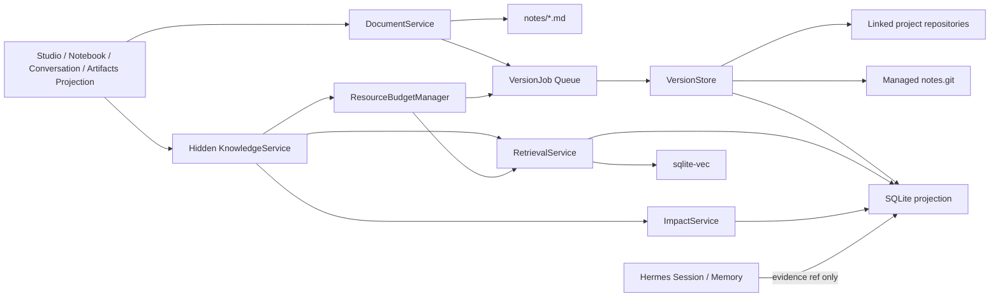

| 数据 | 真相源 | 投影/缓存 | 可否自动重建 |
|---|---|---|---|
| 当前笔记/沉淀文档正文 | `notes/<articleId>.md` | `articles`、`note_chunks` | 是，从 Markdown 重建元数据/索引 |
| 笔记语义版本 | `version/notes.git` 的 commit/tree/blob | `document_versions` | 是，从 commit manifest 重建 |
| 外部项目版本 | 授权本地仓库的 commit OID | `repositories`、`repository_projects`、`document_versions` | 是，只要对象未被清理 |
| Claim/Decision/关系 | SQLite 治理表 | UI/检索派生状态 | 否，必须备份 DB；但引用可对账 |
| EvidenceAnchor | SQLite 锚点 + Git OID/path/range/hash | chunk 命中和当前映射 | 部分；原始证据可读，人工确认的语义不可伪造 |
| Session/Memory 正文 | Hermes Runtime | `memory_evidence_links` 只存外部 ID/证据 | 由 Hermes 负责，SophoNote 不复制 |

#### 23.7.2 仓库模式与授权

**Managed Notes Repository**

- SophoNote 为受控 `notes/` 创建 bare 仓库，用 tree builder 写入稳定快照，不需要把 `notes/` 变成可 checkout working tree。
- tree 内使用稳定路径 `documents/<articleId>.md`，另写 `.sophonote/manifest.json`，记录 schemaVersion、articleId、contentHash、trigger、sourceOperationId、sourceRunId（可空）和当时标题。
- Git 仓库默认只保存 Markdown/小型文本和 manifest。新导入的 PDF/大附件只在 `knowledge/blobs/<sha256>` 保存一份内容寻址原文；已存在于 `notes/assets` 的附件继续原位引用。manifest 存 hash/size/mediaType/sourceRef，避免 assets、Git 和索引三份复制。
- 初次开启只建一个“当前基线”commit，明确标记 `historyBeforeBaseline=unknown`，不根据 `updatedAt` 倒造历史。

**Linked Project Repository**

- 用户可把 SophoNote Project 关联到现有本地 Git 仓库，选择授权的 root、ref 和 include/exclude glob；应用保存 bookmark/security-scoped access，不得扫描其他目录。
- 默认只读 commit 对象，不自动 `add/commit/push/pull/checkout`。当项目中由 SophoNote 管理的成果需写入现有仓库时，另作为显式高影响操作立项，不在 V1 默认开放。
- Working Tree 内容只能作为标记 `uncommitted` 的临时上下文，不能成为正式 Claim/Decision 证据；正式证据必须绑定不可变 commit OID。

仓库状态机：

```text
unlinked -> authorizing -> indexing -> ready
                       \-> denied | failed
ready -> stale(ref drift/path unavailable) -> reauthorizing -> indexing -> ready
ready -> paused -> indexing -> ready
ready -> unlinked       // 只删投影/授权，不删用户仓库或 Git 对象
```

#### 23.7.3 语义版本写入链路

版本触发点限于：

1. 用户显式“保存版本”；
2. Agent Document Patch 已审阅并成功提交；
3. 文档/项目成果发布或标记里程碑；
4. Claim/Decision 的证据需从临时引用升级为正式引用；
5. 系统在空闲期对距上一语义版本有实质变化的 autosave 进行合并快照，且用户可关闭。

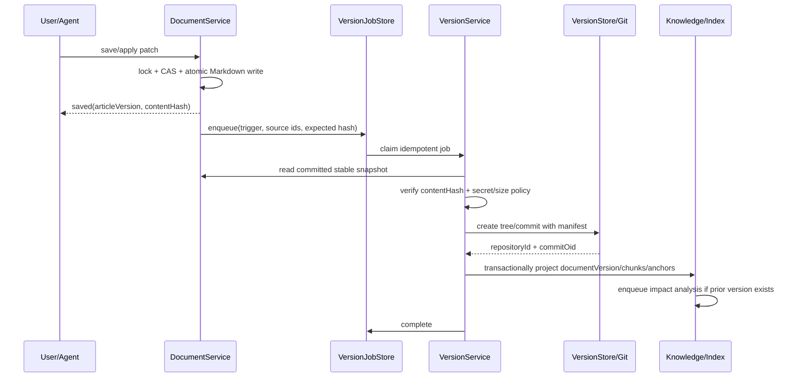

不变量：

- Markdown 保存成功与 Git 建版分属两个可观测状态；版本建立失败不伪装成保存失败。
- `idempotencyKey = repositoryId + entityId + contentHash + triggerGroup`；重试只能返回原 commit 或补齐投影，不能产生第二个等价 commit。
- commit author 是 SophoNote 本地应用身份，actorType/actorId 写入 manifest/SQLite；用户名和邮箱不得从全局 Git config 静默抵充。
- commit message 只是人类摘要，真正的变更依据由 trigger、sourceOperationId、sourceRunId、parentOid、diffStat 和 EvidenceAnchor 共同构成。
- 从旧版恢复不移动 HEAD 或覆盖 `notes/`；先展示版本 diff，再把选定内容转成 DocumentService Patch，用户确认后形成新版本。

#### 23.7.4 核心数据模型

以下是目标逻辑 schema；实际 SQLite DDL 必须通过幂等 migration 落地。时间使用 UTC epoch，JSON 字段需 schemaVersion。

```text
repositories(
  id PK, mode managed_notes|linked_project, display_name, root_locator?,
  default_ref?, head_oid?, include_globs_json, exclude_globs_json,
  authorization_state, index_state, last_indexed_at?, created_at, updated_at
)

repository_projects(
  repository_id, project_id, ref_name?, path_prefix?,
  PRIMARY KEY(repository_id, project_id)
)

document_versions(
  id PK, repository_id, entity_type, entity_id, commit_oid, parent_oid?, path,
  article_version?, content_hash, trigger, summary?, actor_type,
  source_operation_id?, source_run_id?, manifest_json,
  created_at, UNIQUE(repository_id, commit_oid, path)
)

evidence_anchors(
  id PK, repository_id, commit_oid, path, anchor_type,
  start_line?, end_line?, heading_path_json?, quote_hash?, context_hash?,
  chunk_id?, status active|stale|orphaned, created_at, last_verified_at?
)

knowledge_claims(
  id PK, claim_type fact|decision|hypothesis|constraint|artifact,
  title, statement, status draft|active|superseded|conflicted|retracted,
  confidence, valid_from?, valid_to?, owner_scope_type, owner_scope_id?,
  superseded_by?, created_at, updated_at
)

knowledge_evidence(
  claim_id, evidence_anchor_id, role supports|contradicts|context|derived_from,
  weight, note?, created_at, PRIMARY KEY(claim_id, evidence_anchor_id, role)
)

knowledge_relations(
  source_claim_id, relation depends_on|supersedes|conflicts_with|implements|derived_from,
  target_claim_id, created_at, PRIMARY KEY(source_claim_id, relation, target_claim_id)
)

change_impacts(
  id PK, from_version_id, to_version_id, affected_type, affected_id,
  reason_code, severity low|medium|high, status pending|accepted|dismissed|resolved,
  explanation, created_at, resolved_at?
)

memory_evidence_links(
  hermes_memory_id, evidence_anchor_id, relation grounded_by|derived_from,
  status active|stale|reviewed, last_checked_at,
  PRIMARY KEY(hermes_memory_id, evidence_anchor_id, relation)
)

version_jobs(
  id PK, kind commit|index|impact|rebuild, repository_id, entity_id?,
  idempotency_key UNIQUE, payload_json, state queued|running|succeeded|failed|cancelled,
  attempts, available_at, lease_until?, last_error?, created_at, updated_at
)
```

约束：

- `document_versions.commit_oid + path` 必须能读到与 `content_hash` 一致的 blob；不一致视为完整性错误，不进检索。
- active Claim 至少有一个 active EvidenceAnchor，否则只能是 draft/unverified；Decision 另需记录决策时间、备选和选择理由。
- `superseded_by` 不能形成环；`knowledge_relations` 传播有最大深度/节点预算，禁止无界图遍历。
- EvidenceAnchor 必须先按精确 commit/path/line 定位，再用 quote/context hash 校验；映射新版只是派生关系，不改写旧锚点。

#### 23.7.5 Chunk、索引与版本感知检索

Chunking 以 Markdown AST 语义边界优先：`document -> heading path -> paragraph/list/table/code block`；过长节再按 token 窗切分，保留 10%～15% overlap。chunk 稳定 ID 使用 `repositoryId + commitOid + path + headingPath + ordinal + textHash`，不用可变的行号作为唯一标识。

索引内容：

- 当前文档：全文/BM25 投影、标题/标签/项目/类型/时间元数据。embedding 只对当前、固定和近期活跃工作集增量生成，不以“已导入”为理由全量建向量。
- 历史版本：默认只保留最新、里程碑、被证据引用和时间窗内版本的向量；其余仍可由 Git 精确读取，需要时再延迟索引。
- diff 索引：对相邻语义版本保留 changed chunk IDs、文本摘要、触发依据和风险标签，用于回答“什么时候、为什么改了”。

查询规划：

```text
QueryIntent = lookup | explain_change | compare | decision_trace | current_truth | historical_truth
Filters = scope + repository + project + assetType + version/time + claimStatus
Candidates = lexical(title/tag/body) union optional_warm_vector(chunk) union graph(claim/relation)
Rerank = semanticScore + lexicalScore + scopeMatch + evidenceQuality
         + versionFreshness(current_truth only) + explicitPin
Assemble = dedupe by claim/content lineage -> token budget -> citation required
Answer = statements + [source title, repository, commit short OID, path/range]
```

- `current_truth` 只召回当前 active Claim 和目标 ref 可达最新版；`historical_truth/explain_change` 必须保留时间线，不用最新内容覆盖历史。
- `optional_warm_vector` 只在目标 scope 的 Warm 索引 fresh 且资源状态允许时执行；Lite/受限/critical 状态直接 lexical + graph，引用完整性不变。
- 没有证据的模型推断必须明确标“推断”，不能生成虚假 commit/path/行号。引用加载失败时降级为候选列表，不生成无根据结论。
- 导入外部仓库后先做增量 diff 索引；只有索引版本与目标 commit 一致时才对外标记 fresh。

#### 23.7.6 Claim、Decision、影响分析与长期记忆

Claim 是“可被证据支持或否定的知识陈述”，Decision 是 Claim 的专门类型，至少包含 `context / options / decision / rationale / consequences`。Artifact 代表可交付成果。三者都是对 Markdown/Git 证据的结构化索引，不取代原文。

当新语义版本产生时，ImpactService 仅对 changed chunks 与其入边执行有界分析：

1. 标记落在被删除/重写区域的 EvidenceAnchor 为 stale；
2. 找出依赖这些锚点的 active Claim/Decision/Artifact、Hermes Memory 引用和已发布成果；
3. 根据变更类型评估严重度：格式/措辞=low，数值/约束/结论=medium，删除依据/决策反转/冲突=high；
4. 生成待复核项，附 old/new 证据、diff 和受影响对象；
5. 只有用户或明确授权的 Agent 才能接受替代、撤回 Claim 或要求 Hermes 更新 Memory。

长期记忆写入规则：

- 会话中的普通助手文本、用户原话和工具输出不自动升格为知识或 Memory；用户确认“沉淀”后，先产生 Markdown/Artifact 和语义版本，再建立 Claim/Evidence，最后才可生成有界 Memory 候选。
- PDF 页、抽取 chunk、网页正文和 Git blob 永远是 Knowledge Resource，不因可检索就转成 Memory。一个资料可有大量 chunk，但通常只产生 0～少量已确认 Claim/Decision/Memory。
- Hermes Memory 只存稳定用户偏好/约束、项目目标/当前状态、已确认 Decision、未完成事项和最新成果摘要。每次里程碑最多生成少量候选，必须有 scope/evidence/expiry 并由用户确认。
- Memory 引用变 stale 后，SophoNote 只通过 Hermes 正式 Memory API 发起“复核/更新/保留历史”操作；不直接写 Hermes 私有存储。

#### 23.7.7 Tauri 命令与前端交互

目标命令按服务边界暴露，不向 React 暴露任意 Git 参数：

```text
repository_list()
repository_link_project(projectId, authorizedPath, refName, include, exclude)
repository_pause(repositoryId)
repository_unlink(repositoryId)
repository_reindex(repositoryId)

version_create(entityType, entityId, trigger, summary?, expectedArticleVersion?)
version_list(entityType, entityId, cursor?)
version_compare(baseVersionId, targetVersionId)
version_restore_preview(versionId, currentArticleVersion)
version_restore_apply(operationId, acceptedHunks[])

knowledge_search(query, scope, intent, filters, limit)
claim_create_draft(type, statement, evidenceAnchorIds[])
claim_review(claimId, action, replacementClaimId?)
impact_list(scope, status, severity?)
impact_resolve(impactId, resolution, operationId?)
```

- 所有列表都分页，有明确 loading/empty/partial/stale/error 状态；“已保存”与“已建版”使用两个不同状态，避免误导。
- 项目、笔记、会话引用详情显示当前版本、最后变更依据、证据、受影响项和相关 Claim；未来 Artifacts 只汇总这些状态并跳回来源对象。两版比较以语义 chunk 为单位，仍可切换原始 diff。
- 项目仓库连接向导先展示将索引的目录/排除规则/预估文件数，用户确认后才建索引；敏感文件命中时默认排除并可见。
- 高风险变更的影响中心按“依据变了什么 → 可能失效什么 → 建议处理”展示，不只给 AI 分数。

#### 23.7.8 安全、性能、保留与可观测性

- 建版前二进制/大文件/凭据扫描先于 Git object write；规则命中不把可疑内容发送到模型，就地中止并指定路径。
- 自动语义快照默认低频、可关闭；明确版本、被 Claim/Evidence 引用的 commit 和发布里程碑永不被自动 GC。未引用空闲快照可按数量/时间/字节三重配额压缩。
- 首次当前 FTS 索引和选定 Warm 向量作业都可暂停/取消/续传，作业租约超时后可重领；向量 API 不可用时保留全文检索、精确 Git 引用和版本比较。
- 记录 `jobLatency/indexLag/commitCount/objectBytes/anchorStaleRate/impactPending/searchCitationRate`，不记 chunk 原文或搜索原问。诊断导出只包含路径 hash、OID 短值、状态和错误分类。

#### 23.7.9 分期实施、迁移与验收

| 阶段 | 交付 | 准入/退出条件 |
|---|---|---|
| KB-0 契约与基线 | `VersionStore`/DTO/schema/feature flag，当前 notes baseline 预览 | 不改当前保存时延；备份与一键停用可用。2026-08-27 已落 schema、`knowledge.version.enabled` 默认关闭、只读预览与 unlinked 停用；尚未写 Git |
| KB-0L 轻量资源基线 | `ResourceBudgetManager`、Hot/Warm/Cold、1 GiB Memory Envelope、共享 lease、空间预检和压力降级 | 8GB 不启动额外知识/Embedding 进程仍可 FTS/引用/编辑；稳态/P95≤768 MiB、峰值<1 GiB；各进程、预算池与磁盘分区可观测 |
| KB-1 语义版本 | managed notes bare repo、幂等 job、版本列表/比较/恢复 Patch | 100% commit/blob/hash 对账；Git 故障不丢正文；P95 保存不因同步 commit 回归 |
| KB-2 项目溯源 | 链接授权仓库、过滤/敏感扫描、commit-aware chunk | 越界路径不可读；force-push/ref drift 可见；可暂停/重建 |
| KB-3 可信检索 | hybrid retrieval、查询意图、引用展示、黄金问题集 | Top-k/引用准确率达基线；无证据不伪造回答；旧/新版语义不串台 |
| KB-4 知识治理 | Claim/Decision/Artifact、EvidenceAnchor、supersede/conflict | 所有 active Claim 可回溯至不可变 commit；决策链可比较 |
| KB-5 影响与 Memory grounding | change impact queue、Hermes evidence link/review | 删除/改写依据可生成有界待复核；不复制/直写 Hermes Memory |

迁移只增加表、`version/` 和新导入使用的 `knowledge/`，不搬移 `notes/`，不突然复制存量 assets 或全库生成 embedding。任一阶段失败均可通过 feature flag 停用新 UI/后台作业；Markdown、旧索引、编辑、导出和 Hermes 会话继续工作。不得为回滚删除 Git 对象、Claim 或 Evidence，应保留到用户确认清理。

每阶段必须以下列固定黄金任务回归：

1. “这条项目决策的原始依据、当时版本和后续替代是什么？”
2. “某篇笔记从 A 到 B 改了什么，是谁/哪个 Run/哪次审批触发的？”
3. “如果这个接口约束已修改，哪些 Claim、文档、成果和长期记忆可能失效？”
4. “只使用 2026-06-01 时已知的资料回答，并附可打开的 commit/path 证据。”
5. Git 仓库不可读、embedding 不可用、App 中途退出后，验证正文不丢失、作业可恢复、证据不被伪造。

#### 23.7.10 本地轻量执行面与资源治理

**一、本地必须做什么**

SophoNote 原生知识层只承担离线产品闭环不可缺少的能力：

1. 保存用户原始资料、当前 Markdown、语义 Git 版本和可打开 EvidenceAnchor；
2. 保存 Resource/Claim/Decision/Artifact 的轻量元数据、权限、状态和关系；
3. 提供可降级的 FTS5 检索，只对 Warm 工作集增量提供 sqlite-vec；
4. 按需加载冷原文/历史版本，组装有引用的小上下文包给 Hermes；
5. 计量内存、磁盘、队列和索引新鲜度，在资源压力时有序降级。

本地知识层不负责：复制 Hermes Session/Memory 正文、常驻所有 PDF/L2、向量化每条历史消息/每个旧版本、托管本地大模型，或为毫秒级服务端并发将全库预加载内存。

**二、分层数据面**

```text
Hot Catalog（SQLite，小而常驻/分页）
  resource id/title/type/scope/status
  current claim/decision summary
  FTS rowid + evidence/version coordinates
           |
           v on demand
Warm Working Set（SQLite/cache，有界 LRU）
  current document + pinned resources + recent active projects
  extracted text + chunks + selected vectors + short summaries
           |
           v exact hit / user opens
Cold Evidence Store（SSD，不常驻）
  content-addressed PDFs/assets/raw pages
  Git commits/blobs/history
  Hermes session/message references
```

Hot/Warm/Cold 是 SophoNote 产品层级，可以映射到某个 Adapter 的 L0/L1/L2，但不绑定其内部存储实现。原始大文件只在 `knowledge/blobs` 保存一份；提取文本、OCR、thumbnail、embedding 和 rerank cache 全是可重建派生数据。

**三、ResourceBudgetManager**

```text
inputs:
  physicalMemory, memoryPressure, freeDiskBytes, freeDiskRatio,
  hostRss, hermesRss, adapterRss?, embeddingRss?,
  kbSqliteCacheBytes, l0CacheBytes, warmCacheBytes,
  queryWorkspaceBytes, ingestWorkspaceBytes, memoryWorkspaceBytes,
  queuedJobs, activeQueryCount

state:
  normal -> constrained -> critical -> guarded -> recovering -> normal

normal:
  envelope < 768 MiB，可执行前台查询或一个后台重阶段
constrained:
  envelope >= 768 MiB，禁止预取/rerank，并发=1，暂停导入、embedding、impact/compaction
critical:
  envelope >= 896 MiB，清 Warm LRU，停可选 Adapter/本地 embedding，检索切 FTS-only
guarded:
  envelope >= 960 MiB，拒绝新 heavy lease，只允许保存、精确读取、清理和恢复
recovering:
  连续稳定观察窗后逐项恢复，永不同时恢复多个重阶段
```

- `MemoryEnvelope` 是知识/记忆功能给整机增加的统一占用，不是单个 cache 配置：包含知识 SQLite/FTS 页缓存、L0 目录/摘要向量、Warm chunk/vector、查询/上下文组装、导入/OCR/Embedding 批缓冲、Memory 候选/压缩，以及 Adapter、本地 Embedding 和 Hermes 可单独观测的 Memory 专用缓存。WKWebView/UI 与 Hermes 基础 Agent Runtime 单独分账，因此该门禁不代表整 App 低于 1 GiB。
- Hermes 若暂时无法暴露 Memory 专用占用，ResourceBudgetManager 从安全余量中预留保守额度；不能用“不可观测”将其记为 0。所有进程采样使用同一时间窗，并记录稳态、P95 与进程树峰值。
- 预算由三部分组成：固定池≤320 MiB（SQLite/FTS≤128、L0≤96、Memory≤64、控制结构≤32）、共享瞬时池≤512 MiB、安全余量192 MiB。安全余量不得发放为常态 cache。
- 重任务取得 `MemoryBudgetLease(category, reservedBytes, expiresAt)` 后才能分配主要缓冲。前台查询可抢占后台 lease；导入/OCR/Embedding、影响分析与 Memory 压缩不能与一次大查询叠加各自峰值。lease 超时/进程退出必须自动回收。
- Host 内部采用“已配置固定容量 + 已发放 lease”做分配前的保守门禁，运行中再用知识标签分配/缓存统计校正；子进程按完整进程树 resident/physical footprint 计入，不与其内部 cache 统计重复相加。无法可靠拆分的 mmap/共享页按较大值归因，不能按较小值美化结果。
- `memory_budget_snapshot()` 至少返回 `fixedCommitted/sharedLeased/observedAttributed/adapterTreeRss/embeddingTreeRss/hermesMemoryReserved/safetyRemaining/state`；每次 lease 申请、阈值跳转和 worker 终止都落本地诊断事件，但不记录查询或正文。
- 资源归因必须分进程：SophoNote Host/WKWebView、Hermes、Context Adapter、本地 Embedding 模型分别记录 RSS/峰值；Embedding 模型与 Adapter 即使在不同进程，也必须计入同一个 Envelope。
- Context Adapter 与本地 Embedding 模型默认都不启动；只有单独和组合的完整进程树峰值均通过门禁时才能启用，二者默认互斥。
- 所有资源开关只影响检索质量/预取速度；DocumentService、Git 精确读取、SQLite 元数据、导出与用户删除始终可用。

**四、磁盘优先查询、导入与记忆召回**

查询链路必须让库规模主要增加磁盘和延迟，而不是常驻内存：

```text
query + scope/version filters
  -> SQLite FTS/metadata 粗召回（默认 <=200 candidates）
  -> 分片从 SSD 读取候选 L0 摘要/向量，在有界缓冲中评分
  -> 只为最终 <=10 hits 读取 L1 excerpt
  -> 仅回答确需引用时读取对应 L2 byte range / Git blob
  -> ContextAssembler 按 token + byte 双预算交给 Hermes
```

- 不构建全 chunk 常驻 HNSW；当前文档/固定资料/近期项目向量在磁盘按 scope/project/document 分片，查询只映射/读取候选页。SQLite `cache_size` 使用明确字节预算，`mmap_size` 必须受限并计入进程 RSS，不以 OS page cache 规避门禁。
- FTS 是永远可用的第一阶段；向量只重排粗召回候选。语义无关键词时可分页扫描 L0 文档摘要分片，不加载全库 chunk 向量。历史版本精确查询直接走 Git/SSD，允许更慢，不因此把历史索引永久升温。
- PDF/附件导入逐文件、逐页流式解析；OCR 单页串行，Embedding 小批处理且每批缓冲有上限。默认使用远端 Embedding 或纯 FTS，不把本地模型常驻作为基础能力。任务取消或 lease 被抢占后保存页级 checkpoint，可续传而不是保留整份中间结果。
- 长期 Memory 正文仍在 Hermes 磁盘存储；SophoNote 常驻的只是 ID、scope、短摘要、evidence/status。一次召回默认最多加载 32 条候选、64 KiB Memory 文本，再由 ContextAssembler 按 token 预算裁剪。每个里程碑最多生成少量候选，优先合并/supersede 旧记忆，禁止逐消息写入。
- 查询、导入、影响分析、Memory 压缩共用 512 MiB 瞬时池；不通过“后台进程独立”获得额外预算。更大物理内存只允许系统更从容，不提高上述上限或并发。

**五、OpenViking/Context Adapter 的位置**

OpenViking 不是 V1 默认实现，也不是 Memory 真相源。若未来 Native Lite 在黄金问题上不达标，只能通过 `ContextStoreAdapter` 接入：

```text
ContextStoreAdapter:
  open(scope, budget)
  index(resourceRef, versionRef, policy)
  search(query, filters, budget) -> cited candidates
  fetch(candidateRef, byteRange)
  evict(scope|derivedOnly)
  stats() -> rss/disk/cache/index freshness
  pause() / resume() / health()
```

Adapter 不得保存 Claim/Decision 唯一真相、直写 Hermes Memory、越过 SophoNote 权限，或要求启动后才能编辑/打开文档。当前发布规则只允许 Hermes 一个随包 Python sidecar；因此 OpenViking 若仍依赖第二 Python 进程，必须另立打包/签名/生命周期/安全决策，未通过前不随客户端打包。

以当前输入的 OpenViking 客户端测算作为**容量预案，不作为已验证产品指标**：

| Adapter entry | 预估 OV 稳态 RSS | 查询峰值 | 预估磁盘 | 1 GiB 严格模式结论 |
|---:|---:|---:|---:|---|
| 100 | 150～300 MB | <800 MB | 2～4 GB | 仅可实验；还须加上 Native/Memory 开销并证明总峰值<960 MiB |
| 1,000 | 300～700 MB | 1.2～1.8 GB | 8～15 GB | 峰值已越过硬门禁，拒绝启用 |
| 5,000 | 800～1,200 MB | 2.5～3.5 GB | 40～60 GB | 稳态/峰值均不可接受，拒绝启用 |

这些 entry 是 Adapter 检索单元，不是 SophoNote Memory；1,000 entry 可以粗略对应 500～1,000 页资料，但受切分策略和内容密度影响。接入时必须钉住版本，用 SophoNote 真实中/英文 PDF、代码仓库和会话摘要重测以上表格。

客户端 Adapter 配置目标是“只缓存检索必需的 L0/目录元数据，L1/L2 从 SSD 按需读取”。不再把 `in_memory_cache_max_size = "512MB"` 当作产品默认值：该值只是先前客户端估算中的单项 cache 上限，不代表仍有 512 MB 可额外使用。接入器必须从 ResourceBudgetManager 获取当次 lease，再按钉住版本的 schema 生成更小的 cache 配置，并强制关闭 L1 全量预加载；若引擎不支持动态/更小上限，或调整后完整总峰值仍≥960 MiB，Host 不启动它。禁止复制服务端 2GB/4GB 缓存配置。

**六、磁盘与导入门禁**

- 导入预检分别估算 raw blob、extracted text/OCR、current FTS、Warm vectors、Git 文本版本和临时峰值；不用单一倍率遮蔽来源。
- 空间低于 `max(5GB, 10%)` 时停导入/向量化/空闲建版；用户仍可编辑、导出、删除派生缓存或移除原文。
- 存储页必须分区展示“原始资料/当前 Markdown/Git 版本/提取文本/向量/可清理缓存/Hermes 数据”；清理按钮不能把证据和派生数据混在一起。
- 已被 active Claim/Decision/Artifact/Memory evidence link 引用的原文和 Git commit 只能显式删除；删除前列出影响并使相关对象进入 `needs_review`。

### 23.9 Browser、代码工作区与应用 Preview

本节落实 DEC-031。目标不是内置一个完整 IDE，而是让同一 Thread 在会话、工作室与笔记本获得可见 Browser，并让会话/工作室完成与 Claude Code Desktop 同类的最小代码闭环：

```text
选择作用域 → Agent 浏览/读代码 → 提议改动 → 用户审 Diff
           → 运行命令 → 打开 Preview → Agent 复核 → 形成成果/依据
```

#### 23.9.1 组件关系与真相源

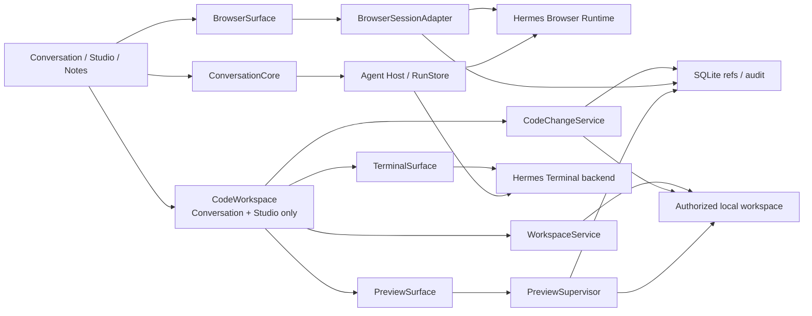

| 对象 | 真相源 | SophoNote 持久化 | 禁止复制 |
|---|---|---|---|
| Browser 页面/历史/DOM/控制权 | Hermes Browser Runtime | `external_browser_session_id`、Thread/Run 关联、权限决定、动作/引用审计 | Cookie、密码、完整 DOM、浏览历史正文 |
| 用户代码当前内容 | 用户授权工作树 | WorkspaceBinding、最近打开文件引用、CodeChangeSession/audit | 源码第二副本、整仓库进 SQLite |
| Git 状态/Commit | 授权仓库 `.git` | 短期状态投影、已引用 Commit/OID | 自建第二 Git 历史、未经确认的 commit/push |
| SophoNote 笔记正文 | `notes/<id>.md` | Article 元数据、Document operation | 通过 WorkspaceService 绕过 DocumentService |
| Terminal 进程 | Hermes Terminal backend / Host-owned child | process ref、cwd、状态、退出码、输出截断摘要 | Secret、无限输出、假完成状态 |
| Preview 服务 | PreviewSupervisor | launch spec hash、端口、所有权、健康/stale 状态 | 把 localhost Preview 冒充通用 Browser Session |

#### 23.9.2 WorkspaceBinding 与路径安全

目标最小模型：

```text
workspace_bindings {
  id,
  owner_type: "thread" | "project",
  owner_id,
  display_name,
  root_locator,
  authorization_ref,
  repo_kind: "none" | "git",
  access_mode: "read" | "read_write",
  created_at,
  last_verified_at,
  revoked_at?
}
```

- `thread` 绑定是会话级临时授权；`project` 绑定是可恢复的持久引用。项目可有多个绑定，但每轮 `ScopeSnapshot` 必须明确本轮允许的 binding 集合，不能因项目拥有多个仓库就全量授权。
- `root_locator` 只用于 Host 重定位，不回传给模型或遥测；macOS 正式实现使用 security-scoped bookmark 或等价可撤销授权。每次使用前重新解析、canonicalize 并确认仍位于授权根。
- 文件列举遵守 `.gitignore`、SophoNote 默认排除和用户排除；`.git/objects`、Keychain、SSH、云凭据、系统目录、设备文件默认不可读。symlink 解析后越界立即拒绝。
- 目录树和搜索分页；文本按范围读取。二进制、超大文件、vendor/build/cache 默认不进入模型上下文，用户显式打开也只展示安全摘要或外部打开。
- 应用私有 `workspace/` 继续作为 Hermes 可直接操作的沙箱，不能与用户授权仓库混称。用户目录只有在 WorkspaceBinding + ScopeSnapshot + Policy 交集内可读写。

#### 23.9.3 BrowserSession 与控制权

```text
browser_session_refs {
  id,
  thread_id,
  external_browser_session_id,
  state,
  control_owner: "agent" | "user" | "none",
  current_origin_hash?,
  created_at,
  last_seen_at,
  closed_at?
}
```

该表只保存引用/投影；Browser Runtime 仍是页面真相源。`BrowserSurface` 通过 Adapter 消费 Hermes 的页面、导航、动作、截图、DOM/可访问树和控制权事件，并把统一 `schemaVersion + seq` 事件先写 RunStore/审计再通知 UI。

控制权协议：

1. Agent 动作开始前校验当前页面版本/导航 generation 与控制权。
2. 用户点击页面或选择“接管”后，Host 发送 `browser.control.takeover`，未完成 Agent 动作取消或停在安全边界。
3. 用户选择“交还”或发送新指令后，Host 发送 `browser.control.release`；Agent 必须重新 snapshot DOM/URL，不复用旧 selector/坐标。
4. Browser 断线时只显示最后截图/URL的静态历史；重连由外部 Session ID 对账，无法恢复则新建并明确提示。

网页访问分两条路径：后台 `Web Search/WebFetch` 只返回结果/证据，不创建可见页面；`Interactive Browser` 创建或绑定 BrowserSession，所有导航和交互可见。两者事件名、工具卡和审计不能混用。

#### 23.9.4 CodeChangeSession 与写入

```text
code_change_sessions {
  id,
  workspace_binding_id,
  thread_id,
  run_id,
  base_tree_oid?,
  base_manifest_hash,
  status,
  reason,
  actor,
  created_at,
  applied_at?
}

code_file_changes {
  session_id,
  relative_path,
  base_blob_oid?,
  base_content_hash,
  proposed_content_hash,
  patch_ref,
  decision,
  applied_content_hash?
}
```

- `patch_ref` 指向受控临时文件/压缩 Diff，不把完整源码放普通业务表；会话结束后只保留审计必需的 hash、统计和仍被版本证据引用的 patch。
- 读取时记录 base blob/hash；应用前重新 stat/read/hash。任一文件改变即把相关 hunk 标为 conflicted，不执行“最接近位置”替换。
- 接受的文件先在同目录唯一 tmp 写入、fsync/权限继承，再原子 rename；多文件应用采用 prepared manifest + 补偿/恢复日志，不能声称跨文件原子事务。
- Git 仓库优先用 blob/tree OID 和 working tree diff；非 Git 目录用 manifest hash。应用只改变工作树，不自动 stage/commit/push。
- DocumentService 与 CodeChangeService 共享的仅是无状态 Diff 视图、Approval DTO 形状和审计规范。`articleId/baseVersion/TextAnchor` 与 `relativePath/baseHash/blobOid` 互不替代。

#### 23.9.5 Terminal 与 Preview

Terminal 命令由 Hermes Toolset 发现可用 backend，Host 再按 WorkspaceBinding、权限模式和风险校验 cwd/命令。前端只提交结构化意图或用户明确命令，不持有 shell 子进程句柄。输出以 Channel 流式传递并使用内存环形缓冲；完整诊断按大小上限落受控日志，Secret pattern 脱敏。

```text
preview_sessions {
  id,
  thread_id,
  workspace_binding_id,
  kind: "static" | "localhost" | "markdown" | "pdf" | "image",
  launch_spec_hash,
  host_owned,
  pid_ref?,
  url_or_file_ref,
  state,
  source_generation,
  verified_generation?,
  created_at,
  stopped_at?
}
```

- 静态文件 Preview 不启动命令；localhost Preview 只能通过获批 launch spec 启动，默认 bind loopback，不向局域网暴露。
- PreviewSupervisor 是 Host-owned 子进程唯一 owner：分配/验证端口、追踪进程组、健康检查、取消与退出回收。不得用随机杀进程解决端口冲突。
- `source_generation != verified_generation` 时显示 stale；Agent 必须在最新 generation 上检查 DOM/控制台/截图/关键交互，才能写入验证结论。
- PreviewSurface 可复用 WKWebView 呈现，但 Cookie/Profile、导航 allowlist、下载和外链打开策略与 BrowserSurface 分开。外部链接默认交给 Browser 或系统浏览器，不扩大 Preview 权限。

#### 23.9.6 权限模式与审批映射

| 动作 | Plan | Ask before changes | Accept edits |
|---|---|---|---|
| 读取绑定内普通文本/Git 状态 | 允许 | 允许 | 允许 |
| Agent 写绑定内普通代码文件 | 拒绝 | 每个 ChangeSession 审批 | 可按当前会话授权自动应用；仍生成 Diff/审计 |
| 修改 SophoNote 笔记 | 仅提案 | DocumentService 审批 | 仍走 DocumentService，不自动放宽 |
| 执行 Terminal 命令/启动服务 | 拒绝 | 按命令/风险审批 | 仍审批；可对明确低风险 launch spec 建短期授权 |
| Browser 只读导航/截图 | 允许或按域策略 | 允许 | 允许 |
| Browser 表单提交/上传/下载/发布/删除 | 拒绝 | 逐次审批 | 逐次审批 |
| 跨绑定路径、Git commit/push/reset/rebase、权限提升 | 拒绝 | 高风险单独审批 | 高风险单独审批，不能持久自动允许 |

审批决定绑定 `threadId + runId + capability + workspace/browser scope + generation`；导航到新 origin、切换 WorkspaceBinding、base hash 改变或重启后旧批准失效。UI 所谓“始终允许”最多形成可撤销的窄规则，不能覆盖凭据、支付、发布、删除、remote push 或权限提升。

#### 23.9.7 前端装载、性能与恢复

- `BrowserSurface`、代码编辑器、Diff、Terminal、Preview 按 Tab 懒加载；不可见时停止截图/DOM 轮询、编辑器 layout、Terminal ANSI 重算和 Preview 帧更新。一个 Thread 默认一个活跃 Browser 页面和一个前台 Preview。
- 代码文件按需读取；最近文件缓存按字节而非条数有界，磁盘 watcher 只覆盖打开文件和 Git 状态必要目录。Terminal 输出使用有界 ring buffer；关闭历史仍可从受控日志分页读取。
- 页面切换/面板折叠不取消 Run。Browser 与 Preview 可后台继续，但进入低频模式；用户返回时通过外部 Session/process ref 对账，不依赖 React 组件内存恢复。
- 应用崩溃重启后：WorkspaceBinding 重新授权/验证；未应用 CodeChangeSession 从 prepared manifest 恢复为 reviewing/conflicted；Host-owned Preview/Terminal 子进程按 watchdog/进程组清理；外部用户进程绝不因 SophoNote 恢复而杀停。

#### 23.9.8 分期与验证门禁

| 阶段 | 交付 | 退出条件 |
|---|---|---|
| BC-0 Scope/Policy | WorkspaceBinding、授权、路径安全、三种权限模式、审计 DTO | symlink/越界/撤权/Secret 夹具全部 fail-closed；无通用写入旁路 |
| BC-1 Browser | 三处 BrowserSurface、控制权、DOM/console/screenshot、引用与审批 | 同一 Thread 跨视图不复制 Session；接管/重连/导航 generation 正确 |
| BC-2 Editor/Diff | 文件树/搜索、代码 Editor、Git 状态、CodeChangeSession、逐 hunk 审查 | 外部改动必冲突；代码与 DocumentService 契约测试证明无混写 |
| BC-3 Terminal/Preview | Terminal Toolset、PreviewSupervisor、静态/localhost/文档预览与验证 | 20 次启动/停止无僵尸/端口泄漏；stale/重新验证正确 |
| BC-4 Claude Code 核心对标 | 目录→读→改→审→跑→预览→验证整场宿主 E2E | 干净 macOS、真实 Hermes、固定 Git/Web 夹具通过；包体/内存/交互指标达标 |

自动测试至少覆盖 DTO/schema、路径 canonicalize/symlink、ignore/大文件、base hash 冲突、多文件 prepared 恢复、权限矩阵、Browser generation/控制权、Terminal 截断/取消、Preview 进程组回收。真实 Tauri 宿主测试必须覆盖 WKWebView 焦点/快捷键、200% 缩放、Chat/Browser/Editor/Diff/Terminal/Preview 切换、用户接管、登录站点不泄漏凭据和 App 完全退出后的子进程清理。

### 23.10 模型配置与用量统计

#### 23.10.1 配置真相源与供应商预设

`settings.ai_config` 继续保存非敏感 provider 配置，Keychain 以 provider ID 保存密钥；Rust `provider_environment` 将产品 ID 映射为 Hermes 0.20 的规范环境变量（例如 `alibaba → DASHSCOPE_*`、`zai → GLM_*`、`kimi → KIMI_*`）。预设目录只存在前端静态元数据，不是第二份用户配置：用户点击添加时复制为普通 `ProviderConfig`，之后由用户配置独立演进，版本升级不覆盖。

首版内置 DeepSeek、Kimi、Alibaba/DashScope、Z.AI/GLM、MiniMax、StepFun 和 Xiaomi MiMo。选择范围以随包 Runtime 的 `providers.py/auth.py/models.py` 为工程门禁；仅在参考产品出现但 Runtime 无可验证路由的厂商，不标记为已支持。OpenAI 兼容配置继续由 `OpenAiCompatGateway` 服务 Inline Completion；Anthropic 原生 provider 可供 Hermes Agent 使用，但设置页必须明确 Inline Completion 仅支持 OpenAI 兼容协议。

前端配置面采用单页主从结构，而不是把所有 provider 表单纵向展开：顶部 `ActiveModelSummary` 只展示当前路由事实；中部 `ProviderList` 以紧凑行展示 provider、协议、默认模型和凭据检查状态；`ProviderCatalogDialog` 只负责从未添加预设中选择并创建普通配置；`ProviderConfigDrawer` 集中编辑一个 provider。Drawer 内凭据必须显式保存，非敏感字段仍通过既有 `updateSettings → ai_config` 持久化；打开 provider 时才惰性检查对应 Keychain 状态，列表不得把“尚未检查”误报为“未配置”。启用操作若凭据未确认，先打开配置面板，不直接改变 `activeProvider`。

向量嵌入与对话模型共用“AI 配置”入口但使用二级分段切换；它继续使用独立 embedding 配置和 Keychain key，不混入 LLM provider 列表。行内补全作为当前路由的能力开关，显示在对话模型总览附近；Anthropic provider 被激活时明确提示该开关不适用。

#### 23.10.2 模型目录同步

WebView 只传 provider ID。Rust 重新从 SQLite 解析 Base URL、从 Keychain 读取 Key，校验 URL 为 `http/https` 后请求 `<base>/models`，必要时回退 `<origin-or-base>/v1/models`；只接受 OpenAI 列表结构中的非空模型 ID，去重、排序并限制条数/响应体/超时。Host 只回传模型 ID 或脱敏错误，不回传 Authorization、响应头或任意凭据。同步成功后由前端写回 `ai_config`；失败不修改现有清单。

#### 23.10.3 用量数据流

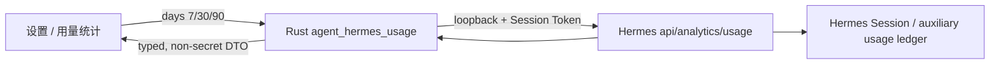

Hermes Dashboard analytics 是 Session、API call、输入/输出/cache-read/reasoning Token 和费用估算的唯一真相源。Rust 将 snake_case Runtime 响应转换为稳定 camelCase DTO，并对缺失/`null` 数值归零；`days` 只允许 7、30、90。Runtime 当前只返回全部模型的 daily 与各模型窗口汇总，因此前端在“全部模型”下按自然日补齐窗口并以柱状图展示每日总 Token，选择单模型时只重算摘要/明细并隐藏趋势，不从总量比例推算逐日模型 Token。

Runtime `estimatedCost` / `actualCost` 是用量费用真相；摘要、逐日提示和模型明细复用同一格式化函数，普通界面只显示 `¥` 数值与“预估费用”，不展开价格来源、汇率或结算免责声明。当前 Hermes analytics DTO 仍以美元字段承载估算值，SophoNote 展示层保留兼容换算；价格目录落地后，DTO 改为携带调用时已固化的展示金额、币种和价格版本，React 不再自行换算。

SophoNote 不新建 usage 表、不从消息正文估算 Token，也不持久化 Dashboard Session Token。统计 API 失败只返回可操作错误；不得影响 Runtime 运行、配置保存或 Agent 会话。未来若需要逐会话账单，优先扩展 Hermes 稳定 API/DTO，而不是旁路读取其内部 SQLite。

#### 23.10.4 价格目录与调价同步

当前 Hermes 已在每次模型调用完成后规范化输入、输出、缓存与推理 Token，并调用 `estimate_usage_cost`。OpenRouter 或兼容端点的 `/models` 明确返回 `pricing` 时会读取动态元数据；其他直连路由主要回退到 Runtime 包内的 `official_docs_snapshot`。以 DeepSeek 为例，随包版本使用 `deepseek-pricing-2026-07` 静态快照。该实现能生成稳定估算，但不能表达请求阶梯、时段规则或官方网页随后发生的价格变化；账本目前也只固化费用、状态和来源，尚未把 `pricing_version` 写入逐调用记录。

目标实现由 Hermes `PricingCatalog` 统一拥有，SophoNote Rust Host 只负责启动同步、网络策略和向 UI 转发健康摘要，React 不访问价格网站、不保存价格表：

```text
ProviderBillingAdapter
  ├─ actual charge / bill detail
  ├─ user contract override
  ├─ official structured pricing endpoint
  └─ verified official-page snapshot
            ↓
Versioned PricingCatalog
            ↓ select(provider, model, occurred_at, mode, token buckets, request tier)
AppliedPricingSnapshot → UsageLedger → Analytics DTO
```

`PricingRule` 至少包含 `provider_id/model_pattern/currency`、输入/输出/cache-read/cache-write/request 单价、计量单位、token/request 阶梯、`billing_mode`、`schedule + time_zone`、`effective_from/effective_to`、`source_type/source_url`、`fetched_at`、`version/hash`。同一供应商可同时存在多条规则，不能用单个 `model → input/output price` Map 覆盖阶梯、批处理、缓存与时段差异。

同步采用“启动后异步检查 + 6 小时后台检查 + 调用时只读本地目录”。有稳定官方接口时使用 ETag/Last-Modified/内容哈希增量更新；只有官方文档页时通过版本化 Adapter 生成候选快照，完成 schema 校验、异常幅度检查和最小模型集校验后原子发布。刷新失败或页面结构变化继续使用 last-known-good，并记录 `fresh/stale/failed`，绝不在推理请求前临时抓网页，也不因同步失败阻断调用。所谓实时是“价格更新确认后，下一次调用立即选用新规则”，不是每次请求同步抓取供应商页面。

费用优先级固定为：供应商返回的实际扣费 > 用户合同覆盖 > 官方结构化价格 > 经校验的官方快照；无规则时为 `unknown`，不得默认零价。每次调用把所用规则的版本、原币种、原始金额、发生时间和必要的汇率快照写入 Hermes 用量记录；新价格只影响其生效时间后的调用，历史分析直接汇总已固化金额，不按当前价格回算。供应商提供本币价格时直接以本币计算；跨币种展示由同一版本化汇率快照完成，禁止 React 使用当前汇率重算历史。

### 23.11 桌面化投影：WidgetKit 小组件与 Tahoe 控制中心控件

产品需求见 [PRD §7.12 DSK](./PRD.md)，决策见台账 DEC-042。本节为工程设计事实。

**拓扑**：单一 Widget Extension（bundle id `com.fei.sophonote.widget`）同时承载两类投影——`Widget`（systemSmall/systemMedium 桌面小组件）与 `ControlWidget`（`ControlWidgetToggle`/`ControlWidgetButton`）。Extension 以 `.appex` 嵌入 `.app/Contents/PlugIns`，挂进现有构建脚本链：xcodebuild 出扩展 → 嵌入 → 随主包统一签名/公证（门禁命令见 §17.6，需为扩展补独立签名步骤）。

**Availability**：小组件交互（`Button(intent:)`、`Text(timerInterval:)`）需 macOS 14+；`ControlWidget*` 首支持 macOS 26.0（Tahoe，Apple 文档实测：iOS 18 已有、macOS 自 26 起）。控件声明全部 `@available(macOS 26.0, *)`；非 Tahoe 降级为仅小组件。

**状态契约**：App Group `group.com.fei.sophonote` 存放快照 + 动作日志：`{status: idle|running|paused, endsAt, pausedRemaining, taskId, taskTitle, todayCount, todayMinutes, updatedAt, actions: [{action, at}]}`。应用（Rust）为唯一仲裁者：存活时写快照并监听动作日志应用迁移；启动时幂等对账（running 且 `endsAt` 过期 → 补记完成会话，统计从日志推导，不重复计数）。应用离线时扩展 Swift 侧仅对四个动作（开始/暂停/继续/放弃）做最小写入、追加动作日志，不复制完整状态机。

**交互与刷新**：

- 小组件：倒计时用 `Text(timerInterval:)` 无进程活秒，`pauseTime` 切静态数字；四动作走 AppIntents `Button(intent:)`；卡身 `widgetURL` 深链回工具整页（Tauri deep-link 事件接住）。
- 控件：无 timeline；刷新时机 = 用户动作、应用主动 reload、APNs push（首期不做 push）。Toggle 映射 running↔paused/ready；Button 为 fire-and-forget（放弃/打开整页）。
- reload 管线：状态迁移后应用侧同时调 `WidgetCenter.shared.reloadAllTimelines()` 与 `WidgetKit.ControlCenter` 的控件 reload；Rust 经 objc FFI 调 WidgetKit 的 Objective-C 兼容 API，备用 = 随包小型 Swift helper CLI。

**前端注册**：`ToolDefinition` 增可选 `desktopWidget` 描述符（widget kind、支持 families、控件清单、引导文案）；画廊/工具整页按其存在渲染「添加到桌面」与投影面板（面板每面「启用同步」+ 一次性引导）。首发实例 = PomodoroTool。

**放置约束**：小组件与控件均不能程序化放置（WidgetKit 平台硬约束），用户手动添加：右键桌面→添加小组件；控制中心→编辑添加控件；菜单栏自控制中心 pin。应用内入口只负责启用同步与引导，UI 文案不得承诺自动放置。

**构建与发布门禁**：扩展独立 bundle id + 双方 App Group capability；公证覆盖嵌入式 .appex（§17.6 命令补充）；Debug 包验收清单增三项：Tahoe 真机小组件活秒、控制中心控件 Toggle 往返、菜单栏 pin 与单击动作。

**实施前 spike 三项**：① Tauri 构建链 .appex 嵌入/签名/公证通路；② Rust 侧 WidgetCenter/ControlCenter reload FFI 可用性；③ Tahoe 控制中心编辑/pin/Toggle 往返真机验证。

**Trade-off**：不采用 Tauri 悬浮置顶卡方案（快但非原生，搁置备用）；首期不做 APNs push 刷新（reload + 启动对账覆盖单用户本机场景）；不为投影复制完整状态机（双份实现必然分叉，对账成本高于最小写入）。

## 24. 架构维护规则

- 产品范围、优先级和验收变化先更新 [PRD](./PRD.md)；组件、协议、存储、专题实现和部署变化更新本文；进展、问题和后续事项只更新[项目台账](./project-ledger.md)。
- 不再创建第二份 TODO、项目状态、逐轮进展或专项长期设计。需要新增细节时扩展本文专题章节，不另立当前真相源。
- 旧方案、审计和图表不写回本仓库：历史草稿不在树内，不要重建 `docs/history/`。
- 现行文档平铺在 `docs/`，不要重建 `docs/current/` 或 `docs/guides/`。
- 社区入口文档成对维护：英文无后缀（`README.md`），中文为 `.zh-CN.md`。本文与 PRD、台账正文以中文为真相源，不另写英文全译本。
- 当前架构图优先维护为本文 Mermaid；需要交付独立图时同时保存可编辑源与渲染产物。
- 代码注释只引用 `docs/` 下的长期文档或直接描述不变量，不以历史文件和开发轮次作为实施基线。
